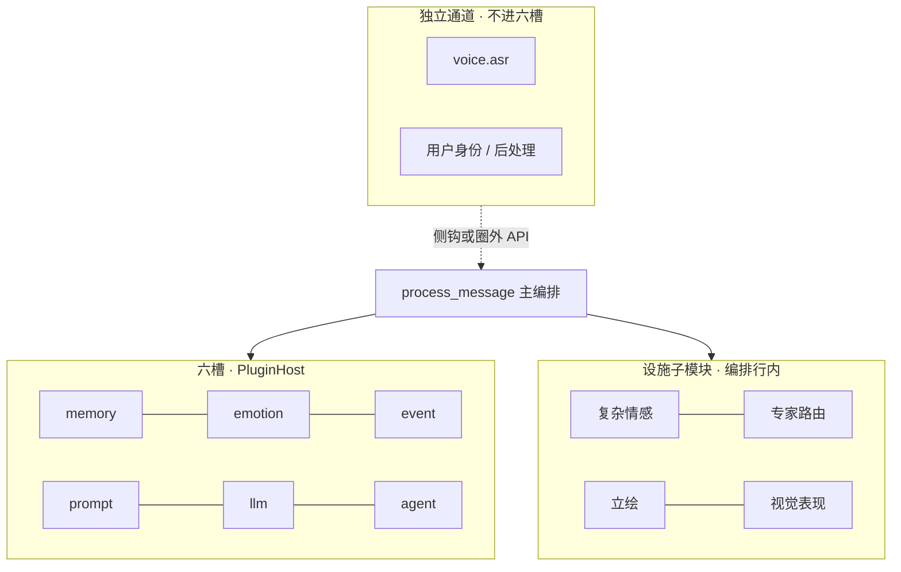
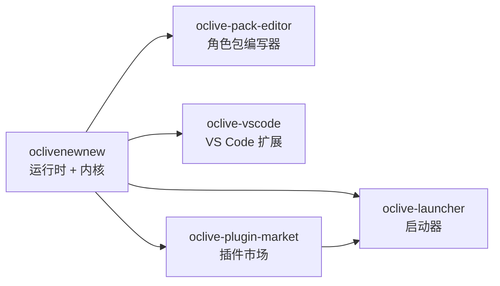

# A.I.Live — 可插拔的角色动脉织机

> 工程仓库 **oclivenewnew**（代号 **oclive**）· 开源 · 本地优先 · **Tauri + Vue 3 + Rust**

[English](README.en.md)

[](https://github.com/linkaiheng2233-cyber/oclivenewnew/actions/workflows/ci.yml)

**发版**：桌面宿主 **0.5.1** · 详见 [CHANGELOG.md](CHANGELOG.md)

## 从哪里开始

| 你的身份 | 入口 | 多久可以开工 |
|----------|------|----------------|
| 角色包创作者 | [创作者黄金路径](creator-docs/getting-started/CREATOR_GOLDEN_PATH.md) | 约 30 分钟 |
| 主仓开发者 | [人类开发者接手包](human-docs/README.md) | 30 分钟跑通，再按模块开工 |
| 插件 / 集成开发者 | [文档索引](creator-docs/getting-started/DOCUMENTATION_INDEX.md) | 30–60 分钟 |
| AI Agent | [AGENTS.md](AGENTS.md) | 按任务读取 SSOT |

---

<!-- ═══════════════════════════════════════════════════════════════════════ -->
<!--  第一部分 · 写给人类                                                    -->
<!-- ═══════════════════════════════════════════════════════════════════════ -->

## 这是什么？

**A.I.Live（OCLive）** 不是「又一个定死的 AI 聊天 App」，而是一套 **AI 角色 / 智能体的组装—契约—打包—分发平台**：

- 用 **六槽可替换模块**（记忆、情感、事件、Prompt、LLM、Agent）拼出你的角色内核
- 用 **角色包**（人设、场景、prompts）独立创作与分发内容
- **本地优先**：对话与记忆默认在你机器上；云端 API 可选、BYOK

内置角色（如 `distros/chat-pro/roles/mumu`）是 **官方示例**，展示平台能力——**社区角色包与模块生态才是上限**。

> **一句话**：OCLive = AI 角色 / 智能体的 **cargo + docker-compose**——开源、本地优先的契约薄核；用可替换、可校验、可打包的模块，在约 30 分钟内组装并分发你自己的角色运行时；**能力上限 = 模块生态上限**（对手做得好的也能接成某一槽的 backend）。
>
> 深度定位：[handoff/OCLIVE_POSITIONING_DIFFERENTIATION.md](handoff/OCLIVE_POSITIONING_DIFFERENTIATION.md)

---

## 四个例子（30 秒看懂能做什么）

### 例子 1 · 创作者：做一个可对话 OC

1. 克隆 [oclive-pack-editor](https://github.com/linkaiheng2233-cyber/oclive-pack-editor)（角色包编写器）
2. 新建角色包：写 `prompts/system.md`、保存到 `distros/chat-pro/roles/你的角色id/`
3. 本仓 `npm run tauri:dev` → 选角色 → 开聊

**不用改** 蓝图 `slot_registry` 或六槽——30 分钟路径见 [创作者黄金路径](creator-docs/getting-started/CREATOR_GOLDEN_PATH.md)。

### 例子 2 · 开发者：只换 LLM，不动人设

在角色蓝图 `pipeline.ocblueprint` 里把 **第 5 模块（llm）** 从 `ollama` 换成 `remote` 或 **目录插件**——人设、记忆、Prompt 公式保持不变。Ollama、llama.cpp 侧车、OpenAI 兼容 API 均可作为 **同一槽的不同插头**。

### 例子 3 · 集成方：同一角色包，多端复用

同一份 `manifest.json` + `pipeline.ocblueprint` 被 **桌面 Tauri**、**无头 HTTP `--api`**、**编写器 WASM 校验**、**oclive-cli** 共用——格式 SSOT 在 `oclive_validation`，不在某个 App 里写死。桌面与 VS Code 可共用 **`OCLIVE_ROLES_DIR`** 与 **`app.db`**（L1 角色包 + L3 陪伴连续），见 [跨宿主记忆](creator-docs/role-pack/CROSS_HOST_MEMORY.md)。

### 例子 4 · 模块作者：只写新能力，其余白送

fork `examples/directory-plugin-minimal` 或 `examples/voice-loop-minimal`，实现 **某一槽** 或 **独立通道**（如 TTS）——人设、UI、对话循环、校验与打包规范由平台提供。第三方目录插件声明 `process:spawn` / `network:*` / `mcp:*` 等能力时，须 **用户显式授权** 后才会执行（未授权则降级，不 silent 越权）。

入门：[PLUGIN_AUTHOR_LEARNING_PATH](creator-docs/plugin-and-architecture/PLUGIN_AUTHOR_LEARNING_PATH.md) · 权限：[PLUGIN_V1.md](creator-docs/plugin-and-architecture/PLUGIN_V1.md)

---

## 和常见方案有什么不同？

| | LangChain / AI SDK | EchoVessel / 垂直角色引擎 | **OCLive** |
|--|-------------------|---------------------------|------------|
| 你得到什么 | 积木 + 胶水，**写代码**搭链 | **一道做好的菜**——定死的记忆/情感实现 | **标准化厨房 + 装盘规范**——**组装并打包**你自己的引擎 |
| 模块可替换 | 有，但无角色领域契约 | 基本不可换实现 | **六槽 + builtin/remote/directory** 统一契约 |
| 角色内容分发 | 你自己搞 | 绑死在产品里 | **角色包 `.ocpak` / zip**，编写器导出、深链安装 |
| 上限在哪 | 你的代码 | 厂商那一套实现 | **整个模块生态的并集**（对手做得好的也能接成模块） |

和 **SillyTavern** 等「前端壳 + 多后端」方案的对照（常问）：

| | SillyTavern 类 | **OCLive** |
|--|----------------|------------|
| 核心交付 | 聊天 UI + 接各种 API/扩展 | **六槽契约 + 蓝图 + 角色包格式 + 跨端校验** |
| 模块语义 | 扩展各自为政 | **builtin / remote / directory** 统一 backend 面 |
| 分发 | 社区卡片/文件 | **`.ocpak` / zip · SHA-256 · `oclive://` 深链** + 市场站 |
| 编排 SSOT | 多由前端/扩展拼装 | Rust **`process_message`** 固定回合语义 |

---

## 三发行版（同一内核 · 不同 HostProfile）

内核编排 **一套**（`process_message`）；差异在 **`distro.oclive.toml` HostProfile** 与宿主 UI，**不是** 另写一套聊天引擎。

| 发行版 | `distro_id` | 形态 | 状态 |
|--------|-------------|------|------|
| **A.I.Live Chat Pro** | `desktop` | 本仓 Tauri 桌面（Release hero） | **0.5.1** 主路径 |
| **VS Code Flash** | `vscode` | 姊妹仓 [oclive-vscode](https://github.com/linkaiheng2233-cyber/oclive-vscode) | 渗透能力 **插件化**；核心只做聊天平台 |
| **AI Theater** | `theater` | `distros/theater/` + theater profile | 打包预埋；模式 2 playtest **已解冻** |
| **dev lab** | `desktop-chat` | 实验场 profile | 日常开发 / 低延迟试验 |

Profile SSOT：[DISTRO_CAPABILITY_PROFILE.md](creator-docs/kernel/DISTRO_CAPABILITY_PROFILE.md)；三发行版结项约束见 [THREE_DISTRO_KERNEL_CLOSURE.md](handoff/THREE_DISTRO_KERNEL_CLOSURE.md)。

---

## 为什么这套东西难被闭源「抄一个 UI」复刻？

不是某个单点功能，而是 **跨端一致的工程层** 叠在一起：

| 资产 | 意义 |
|------|------|
| **`oclive_validation` 同源校验** | 同一契约在运行时、编写器 WASM、CLI 三处一致——改格式不会 silent 漂移 |
| **`process_message` 主编排 + 六槽 `PluginHost`** | 回合语义稳定；换 backend 不换编排公式 |
| **记忆三套存储解耦** | 聊天日志 / 短期 / 长期 职责分离（删聊天记录 ≠ 清空 AI 记忆） |
| **G1–G16 改动边界 + CI 门禁** | OOCP S0–S12、Dimension 5 **15** 项、layering ratchet、doc registry——文档与代码 SSOT 绑定 |
| **角色包 vs 蓝图分责** | 创作者改人设不会误触 `slot_registry`；管理员改编排不会污染内容包 |
| **独立通道（如 voice.asr）** | 语音/TTS 等 **不进六槽**，不污染 `process_message` 主链 |

闭源产品可以做一个好看的聊天窗，但很难同时复制：**可校验的分发包格式 + 可替换模块契约 + 四端共用 loader + 发版级测试矩阵**。详见 [架构总览](creator-docs/getting-started/OCLIVE_ARCHITECTURE_OVERVIEW.md) · [MODULE_MAP](handoff/MODULE_MAP_AND_HANDOFF.md)。

---

## 架构设计（组装而不乱）

OCLive 的优化目标不是「把所有能力塞进一个 App」，而是 **正交分层**：换 LLM 不动人设、加语音不污染主链、冻结实验能力不影响 Stable 发版。

### 模块四大类（先建立地图）

| 大类 | 占六槽 `plugin_backends`？ | 例子 |
|------|---------------------------|------|
| **第 1–6 后端模块（六槽）** | **是** | memory · emotion · event · prompt · llm · agent |
| **第 N 设施子模块** | **否**（编排行内） | 复杂情感 hint · 专家路由 · 立绘 · 视觉舞台 |
| **独立通道能力增强** | **否**（自有 Resolver） | 用户身份 · 回复后处理 · **voice.asr** · 剧场导演 API |
| **后端模块插件** | 挂在某槽的 `backend` | 第 5 槽的 directory 插件、Remote 侧车 |

**纪律**：插件实现 **不** 单独占「第 7 模块号」；设施 **不** 写进六槽键。逐槽定义 → [MODULE_MAP §2–§10](handoff/MODULE_MAP_AND_HANDOFF.md)。



### 六槽解耦：换模块，不改主链

| 层 | 做什么 |
|----|--------|
| **编译期** | 每槽 `trait` + `PluginHost`；`process_message` 顺序 **固定** |
| **配置期** | 蓝图 `slot_registry` 声明多实例 → 折叠为 `PluginBackends`（memory 去重合并 · llm last-wins） |
| **运行期** | 会话级 override 可临时换 backend（**不写盘**） |

同一角色里可以把 **memory=builtin**、**llm=remote 侧车**、**emotion=directory 插件** 自由组合——编排公式仍在 `co_present`，不随厂商而变。

### 蓝图 · 角色包 · 发行版（正交四层）

| 层 | 谁改 | 典型内容 |
|----|------|----------|
| **角色包** | 创作者 | `prompts/`、`core_personality`、场景文案、`voice_profile.json` |
| **蓝图** | 管理员 | `pipeline.ocblueprint` → **`slot_registry`**、后端路由、`includes/` 卫星文件 |
| **发行版** | 宿主 | `distro.oclive.toml` · HostProfile · Turn Thinking 持久化策略 |
| **会话** | 运行时 | DB 临时 override、好感/记忆状态 |

**重要**：蓝图里的 **`steps[]` 不参与首轮调度**——回合顺序由 Rust `turn_pipeline` 保证，避免「JSON DSL 与代码双 SSOT」漂移。  
分责 SSOT：[ROLE_PACK_BOUNDARY.md](handoff/ROLE_PACK_BOUNDARY.md) · 蓝图目录：[BLUEPRINT_FOLDER_LAYOUT.md](handoff/BLUEPRINT_FOLDER_LAYOUT.md)

### 单核双态构建：外核 vs 宏核（Monolith）

**同一套** `process_message` 语义，**两种构建档位**（非运行时热切换）：

| | **外核态（默认）** | **宏核态（Monolith）** |
|--|-------------------|------------------------|
| 耦合 | 低 · 动态 `PluginHost` | 高 · `monolith.toml` **编译期焊接** |
| 适用 | 桌面宿主、插件生态、日常开发 | 嵌入式/无头极致性能、工厂脚手架 |
| 六槽 | `settings` / 蓝图可换 backend | 静态焊死指定实现 |

Monolith 演示 **七焊接键**（六槽 + `complex_emotion` 设施键）——与运行时六宿主槽 **不是同一计数概念**。详见 [RFC_OCLIVE_MONOLITH_MODE.md](creator-docs/rfc/RFC_OCLIVE_MONOLITH_MODE.md)。

### 实验核（dual_core）— 机制在，默认关

| 项 | 状态 |
|----|------|
| **Stable 核** | 当前 Chat Pro 主路径；`co_present` 共景链 |
| **Experimental 核** | 蓝图 `dual_core.enabled` + **`expert_routing.json`** 条件触发子流程 |
| **Cargo feature `dual_core`** | **默认不编译**；opt-in 解冻 |
| **blueprint v3 / 专家路由 UI** | 机制已预埋；产品叙事 **勿暗示「即将默开」** |

冻结登记：[TECHNICAL_DEBT_INVENTORY.md §2](handoff/TECHNICAL_DEBT_INVENTORY.md) · RFC：[RFC_OCLIVE_DUAL_CORE_DUAL_MODE.md](creator-docs/rfc/RFC_OCLIVE_DUAL_CORE_DUAL_MODE.md)

### 其它正交能力（易混 · 一句话）

| 能力 | 与六槽关系 |
|------|------------|
| **Turn Thinking（Fast/Deep）** | 编排行策略 · **不是第七槽** |
| **复杂情感 `narrative_hint`** | 第 1 设施子模块 · 消费 emotion 产出 |
| **voice.asr / TTS 扩展** | 独立通道 · **不进** `process_message` 六槽链 |
| **Kernel 工厂三层** | 配方 / 实现 / 代码 正交 · 双态只动实现层解析 |

人类 45 分钟导读：[human-docs/01_ARCHITECTURE_SIMPLE.md](human-docs/01_ARCHITECTURE_SIMPLE.md)

---

## 分发 · 契约 · 跨宿主

| 机制 | 人类可读 | AI / 集成锚点 |
|------|----------|---------------|
| **OOCP 黑盒** | 换 backend 不换回合语义的可回归测试 | S0–S12 · `examples/oocp-test-suite/` |
| **角色包签名** | 编写器导出 zip / `.ocpak`，可带 SHA-256 侧车 | `api/plugin_pack.rs` |
| **深链安装** | 市场页 → `oclive://` → 宿主安装插件/包 | [oclive-plugin-market](https://github.com/linkaiheng2233-cyber/oclive-plugin-market) |
| **跨宿主记忆** | 同一角色包目录 + 共用 `app.db` → 桌面 ↔ VS Code 陪伴连续 | L1/L2/L3 · [CROSS_HOST_MEMORY.md](creator-docs/role-pack/CROSS_HOST_MEMORY.md) |
| **内核工厂** | `oclive-cli init` 生成可独立 `cargo build` 的内核骨架 | `kernel/crates/oclive-cli` |

---

## 路线图 · 开放实验场

产品主轴：**本地优先、模块可切换、角色包为唯一对接面** 的 **开放实验 harness**——研究者/开发者 **只写新模块**，插进对应槽即可在完整角色里试；人设、存储、UI、回合循环其余部分由平台提供。

| 阶段 | 要点 |
|------|------|
| **已落地** | 六槽 + 目录/Remote 插件 · OOCP · 三发行版 profile · 流式 `/chat/stream` · Turn Thinking Fast/Deep |
| **进行中 / 预埋** | 插件市场 + 启动器联动 · Theater 模式 2 · 立绘/视觉设施 RFC |
| **默认关（勿当即将发布）** | `dual_core` 实验核 · 专家路由 · blueprint v3 |

愿景摘要：[VISION_OPEN_LAB.md](creator-docs/roadmap/VISION_OPEN_LAB.md) · 按月路线：[VISION_ROADMAP_MONTHLY.md](creator-docs/roadmap/VISION_ROADMAP_MONTHLY.md)

---

## 三十秒跑通（贡献者）

```bash
git clone https://github.com/linkaiheng2233-cyber/oclivenewnew.git
cd oclivenewnew
npm install
npm run tauri:dev    # 桌面客户端
npm run check        # 日常门禁（build + fmt + clippy + test --lib）
```

| 前置 | 说明 |
|------|------|
| Node.js 18+、Rust stable | Windows 另需 **VS Build Tools（MSVC）** |
| Ollama | **可选**；未安装也能编译通过，对话需本地 LLM |
| Cargo 产物 | 默认在仓库外 `../oclive-dev-artifacts/oclivenewnew-cargo-target/` |

**安装包说明**：GitHub [Releases](https://github.com/linkaiheng2233-cyber/oclivenewnew/releases) 目前以 **角色包** 等产物为主；桌面客户端需 **克隆本仓后本地构建**（`npm run tauri:dev` / 发版打包流程见 [CONTRIBUTING.md](CONTRIBUTING.md)）。预编译安装器随发行流程补充。

分步说明与验收：[human-docs/02_THIRTY_MINUTE_START.md](human-docs/02_THIRTY_MINUTE_START.md)

---

## 生态（姊妹仓）



| 仓库 | 用途 |
|------|------|
| **本仓** | 桌面运行时、Rust 内核、Chat Pro / Theater 发行版 |
| [oclive-pack-editor](https://github.com/linkaiheng2233-cyber/oclive-pack-editor) | 可视化编辑角色包、导出 zip / `.ocpak` |
| [oclive-vscode](https://github.com/linkaiheng2233-cyber/oclive-vscode) | 编辑器内角色陪伴（渗透能力插件化） |
| [oclive-launcher](https://github.com/linkaiheng2233-cyber/oclive-launcher) | 多发行版入口 · 与市场联动（路线图阶段） |
| [oclive-plugin-market](https://github.com/linkaiheng2233-cyber/oclive-plugin-market) | 插件/包发现 · **`oclive://` 深链** 安装 |

---

## 按角色找文档

| 你是谁 | 从这里开始 |
|--------|------------|
| **普通用户**（安装 → 导入包 → 聊天） | [用户手册](creator-docs/getting-started/USER_MANUAL.md) |
| **人类开发者**（不用 Cursor） | **[human-docs/README.md](human-docs/README.md)** · L0–L2 约 1 小时 |
| **角色包创作者** | [CREATOR_LEARNING_PATH](creator-docs/role-pack/CREATOR_LEARNING_PATH.md) |
| **插件 / 模块作者** | [PLUGIN_AUTHOR_LEARNING_PATH](creator-docs/plugin-and-architecture/PLUGIN_AUTHOR_LEARNING_PATH.md) |
| **内核集成方** | [KERNEL_INTEGRATOR_LEARNING_PATH](creator-docs/getting-started/KERNEL_INTEGRATOR_LEARNING_PATH.md) |
| **贡献代码** | [CONTRIBUTING.md](CONTRIBUTING.md) · [Good first issues](https://github.com/linkaiheng2233-cyber/oclivenewnew/issues?q=is%3Aissue+is%3Aopen+label%3A%22good+first+issue%22) |

完整索引：[DOCUMENTATION_INDEX.md](creator-docs/getting-started/DOCUMENTATION_INDEX.md)

---

## AI / Agent 接手

**GitHub 首页只面向人类读者。** Cursor、Codex 等自动化 Agent 请从专用索引进入，按分类深读 SSOT：

| 文档 | 用途 |
|------|------|
| **[handoff/AI_READING_INDEX.md](handoff/AI_READING_INDEX.md)** | **AI 深读分类目录**（架构 · 契约 · 代码锚点 · 场景路径） |
| [AGENTS.md](AGENTS.md) | 改代码前 **精简门禁**（G1–G16 摘要） |
| [human-docs/ai-package/README.md](human-docs/ai-package/README.md) | AI 包组成与人类文档分工 |

---

## 支持 · 许可

- **Issue**：[GitHub Issues](https://github.com/linkaiheng2233-cyber/oclivenewnew/issues)（`[bug]` / `[feat]` / `[support]` 前缀）
- **许可**：Apache-2.0 · [LICENSE](LICENSE) · [LICENSE_POLICY.md](creator-docs/LICENSE_POLICY.md)
- **行为准则**：[CODE_OF_CONDUCT.md](CODE_OF_CONDUCT.md) · **安全**：[SECURITY.md](SECURITY.md)

---

*人类学习阶梯：[human-docs/README.md](human-docs/README.md)*
