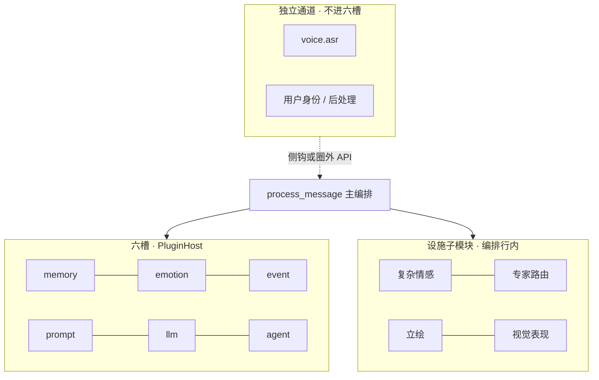
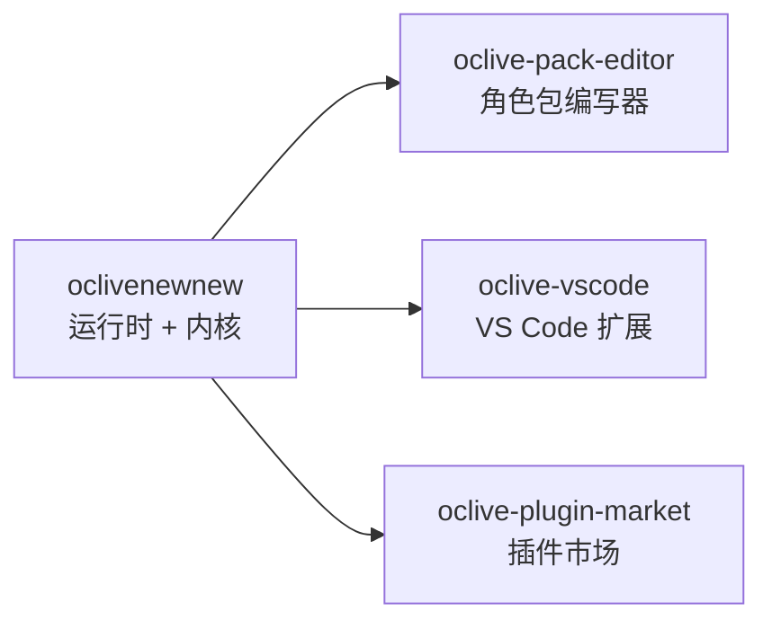

# A.I.Live — 可插拔的角色动脉织机

> 工程仓库 **oclivenewnew**（代号 **oclive**）· 开源 · 本地优先 · **Tauri + Vue 3 + Rust**

[English](README.en.md)

[](https://github.com/linkaiheng2233-cyber/oclivenewnew/actions/workflows/ci.yml)

**发版**：桌面宿主 **0.4.0** · 详见 [CHANGELOG.md](CHANGELOG.md)

---

<!-- ═══════════════════════════════════════════════════════════════════════ -->
<!--  第一部分 · 写给人类                                                    -->
<!-- ═══════════════════════════════════════════════════════════════════════ -->

## 这是什么？

**A.I.Live（OCLive）** 不是「又一个定死的 AI 聊天 App」，而是一套 **AI 角色 / 智能体的组装—契约—打包—分发平台**：

- 用 **六槽可替换模块**（记忆、情感、事件、Prompt、LLM、Agent）拼出你的角色内核
- 用 **角色包**（人设、场景、prompts）独立创作与分发内容
- **本地优先**：对话与记忆默认在你机器上；云端 API 可选、BYOK

内置角色（如 `distros/chat-pro/roles/mumu`）是 **官方示例**，展示平台能力——**社区角色包与模块生态才是上限**。

> 深度定位：[handoff/OCLIVE_POSITIONING_DIFFERENTIATION.md](handoff/OCLIVE_POSITIONING_DIFFERENTIATION.md)

---

## 三个例子（30 秒看懂能做什么）

### 例子 1 · 创作者：做一个可对话 OC

1. 克隆 [oclive-pack-editor](https://github.com/linkaiheng2233-cyber/oclive-pack-editor)（角色包编写器）
2. 新建角色包：写 `prompts/system.md`、保存到 `distros/chat-pro/roles/你的角色id/`
3. 本仓 `npm run tauri:dev` → 选角色 → 开聊

**不用改** 蓝图 `slot_registry` 或六槽——30 分钟路径见 [创作者黄金路径](creator-docs/getting-started/CREATOR_GOLDEN_PATH.md)。

### 例子 2 · 开发者：只换 LLM，不动人设

在角色蓝图 `pipeline.ocblueprint` 里把 **第 5 模块（llm）** 从 `ollama` 换成 `remote` 或 **目录插件**——人设、记忆、Prompt 公式保持不变。Ollama、llama.cpp 侧车、OpenAI 兼容 API 均可作为 **同一槽的不同插头**。

### 例子 3 · 集成方：同一角色包，多端复用

同一份 `manifest.json` + `pipeline.ocblueprint` 被 **桌面 Tauri**、**无头 HTTP `--api`**、**编写器 WASM 校验**、**oclive-cli** 共用——格式 SSOT 在 `oclive_validation`，不在某个 App 里写死。

---

## 和常见方案有什么不同？

| | LangChain / AI SDK | EchoVessel / 垂直角色引擎 | **OCLive** |
|--|-------------------|---------------------------|------------|
| 你得到什么 | 积木 + 胶水，**写代码**搭链 | **一道做好的菜**——定死的记忆/情感实现 | **标准化厨房 + 装盘规范**——**组装并打包**你自己的引擎 |
| 模块可替换 | 有，但无角色领域契约 | 基本不可换实现 | **六槽 + builtin/remote/directory** 统一契约 |
| 角色内容分发 | 你自己搞 | 绑死在产品里 | **角色包 `.ocpak` / zip**，编写器导出、深链安装 |
| 上限在哪 | 你的代码 | 厂商那一套实现 | **整个模块生态的并集**（对手做得好的也能接成模块） |

---

## 为什么这套东西难被闭源「抄一个 UI」复刻？

不是某个单点功能，而是 **跨端一致的工程层** 叠在一起：

| 资产 | 意义 |
|------|------|
| **`oclive_validation` 同源校验** | 同一契约在运行时、编写器 WASM、CLI 三处一致——改格式不会 silent 漂移 |
| **`process_message` 主编排 + 六槽 `PluginHost`** | 回合语义稳定；换 backend 不换编排公式 |
| **记忆三套存储解耦** | 聊天日志 / 短期 / 长期 职责分离（删聊天记录 ≠ 清空 AI 记忆） |
| **G1–G16 改动边界 + CI 门禁** | OOCP S0–S12、Dimension 5 **15** 项、layering ratchet、doc registry——文档与代码 SSOT 绑定 |
| **角色包 vs 蓝图分责** | 创作者改人设不会误触 `slot_registry`；管理员改编排不会污染内容包 |
| **独立通道（如 voice.asr）** | 语音/TTS 等 **不进六槽**，不污染 `process_message` 主链 |

闭源产品可以做一个好看的聊天窗，但很难同时复制：**可校验的分发包格式 + 可替换模块契约 + 四端共用 loader + 发版级测试矩阵**。详见 [架构总览](creator-docs/getting-started/OCLIVE_ARCHITECTURE_OVERVIEW.md) · [MODULE_MAP](handoff/MODULE_MAP_AND_HANDOFF.md)。

---

## 架构设计（组装而不乱）

OCLive 的优化目标不是「把所有能力塞进一个 App」，而是 **正交分层**：换 LLM 不动人设、加语音不污染主链、冻结实验能力不影响 Stable 发版。

### 模块四大类（先建立地图）

| 大类 | 占六槽 `plugin_backends`？ | 例子 |
|------|---------------------------|------|
| **第 1–6 后端模块（六槽）** | **是** | memory · emotion · event · prompt · llm · agent |
| **第 N 设施子模块** | **否**（编排行内） | 复杂情感 hint · 专家路由 · 立绘 · 视觉舞台 |
| **独立通道能力增强** | **否**（自有 Resolver） | 用户身份 · 回复后处理 · **voice.asr** · 剧场导演 API |
| **后端模块插件** | 挂在某槽的 `backend` | 第 5 槽的 directory 插件、Remote 侧车 |

**纪律**：插件实现 **不** 单独占「第 7 模块号」；设施 **不** 写进六槽键。逐槽定义 → [MODULE_MAP §2–§10](handoff/MODULE_MAP_AND_HANDOFF.md)。



### 六槽解耦：换模块，不改主链

| 层 | 做什么 |
|----|--------|
| **编译期** | 每槽 `trait` + `PluginHost`；`process_message` 顺序 **固定** |
| **配置期** | 蓝图 `slot_registry` 声明多实例 → 折叠为 `PluginBackends`（memory 去重合并 · llm last-wins） |
| **运行期** | 会话级 override 可临时换 backend（**不写盘**） |

同一角色里可以把 **memory=builtin**、**llm=remote 侧车**、**emotion=directory 插件** 自由组合——编排公式仍在 `co_present`，不随厂商而变。

### 蓝图 · 角色包 · 发行版（正交四层）

| 层 | 谁改 | 典型内容 |
|----|------|----------|
| **角色包** | 创作者 | `prompts/`、`core_personality`、场景文案、`voice_profile.json` |
| **蓝图** | 管理员 | `pipeline.ocblueprint` → **`slot_registry`**、后端路由、`includes/` 卫星文件 |
| **发行版** | 宿主 | `distro.oclive.toml` · HostProfile · Turn Thinking 持久化策略 |
| **会话** | 运行时 | DB 临时 override、好感/记忆状态 |

**重要**：蓝图里的 **`steps[]` 不参与首轮调度**——回合顺序由 Rust `turn_pipeline` 保证，避免「JSON DSL 与代码双 SSOT」漂移。  
分责 SSOT：[ROLE_PACK_BOUNDARY.md](handoff/ROLE_PACK_BOUNDARY.md) · 蓝图目录：[BLUEPRINT_FOLDER_LAYOUT.md](handoff/BLUEPRINT_FOLDER_LAYOUT.md)

### 单核双态构建：外核 vs 宏核（Monolith）

**同一套** `process_message` 语义，**两种构建档位**（非运行时热切换）：

| | **外核态（默认）** | **宏核态（Monolith）** |
|--|-------------------|------------------------|
| 耦合 | 低 · 动态 `PluginHost` | 高 · `monolith.toml` **编译期焊接** |
| 适用 | 桌面宿主、插件生态、日常开发 | 嵌入式/无头极致性能、工厂脚手架 |
| 六槽 | `settings` / 蓝图可换 backend | 静态焊死指定实现 |

Monolith 演示 **七焊接键**（六槽 + `complex_emotion` 设施键）——与运行时六宿主槽 **不是同一计数概念**。详见 [RFC_OCLIVE_MONOLITH_MODE.md](creator-docs/rfc/RFC_OCLIVE_MONOLITH_MODE.md)。

### 实验核（dual_core）— 机制在，默认关

| 项 | 状态 |
|----|------|
| **Stable 核** | 当前 Chat Pro 主路径；`co_present` 共景链 |
| **Experimental 核** | 蓝图 `dual_core.enabled` + **`expert_routing.json`** 条件触发子流程 |
| **Cargo feature `dual_core`** | **默认不编译**；opt-in 解冻 |
| **blueprint v3 / 专家路由 UI** | 机制已预埋；产品叙事 **勿暗示「即将默开」** |

冻结登记：[TECHNICAL_DEBT_INVENTORY.md §2](handoff/TECHNICAL_DEBT_INVENTORY.md) · RFC：[RFC_OCLIVE_DUAL_CORE_DUAL_MODE.md](creator-docs/rfc/RFC_OCLIVE_DUAL_CORE_DUAL_MODE.md)

### 其它正交能力（易混 · 一句话）

| 能力 | 与六槽关系 |
|------|------------|
| **Turn Thinking（Fast/Deep）** | 编排行策略 · **不是第七槽** |
| **复杂情感 `narrative_hint`** | 第 1 设施子模块 · 消费 emotion 产出 |
| **voice.asr / TTS 扩展** | 独立通道 · **不进** `process_message` 六槽链 |
| **Kernel 工厂三层** | 配方 / 实现 / 代码 正交 · 双态只动实现层解析 |

人类 45 分钟导读：[human-docs/01_ARCHITECTURE_SIMPLE.md](human-docs/01_ARCHITECTURE_SIMPLE.md)

---

## 三十秒跑通（贡献者）

```bash
git clone https://github.com/linkaiheng2233-cyber/oclivenewnew.git
cd oclivenewnew
npm install
npm run tauri:dev    # 桌面客户端
npm run check        # 日常门禁（build + fmt + clippy + test --lib）
```

| 前置 | 说明 |
|------|------|
| Node.js 18+、Rust stable | Windows 另需 **VS Build Tools（MSVC）** |
| Ollama | **可选**；未安装也能编译通过，对话需本地 LLM |
| Cargo 产物 | 默认在仓库外 `../oclive-dev-artifacts/oclivenewnew-cargo-target/` |

分步说明与验收：[human-docs/02_THIRTY_MINUTE_START.md](human-docs/02_THIRTY_MINUTE_START.md)

---

## 生态（姊妹仓）



| 仓库 | 用途 |
|------|------|
| **本仓** | 桌面运行时、Rust 内核、Chat Pro / Theater 发行版 |
| [oclive-pack-editor](https://github.com/linkaiheng2233-cyber/oclive-pack-editor) | 可视化编辑角色包、导出 zip |
| [oclive-vscode](https://github.com/linkaiheng2233-cyber/oclive-vscode) | 编辑器内角色陪伴（渗透能力插件化） |
| [oclive-plugin-market](https://github.com/linkaiheng2233-cyber/oclive-plugin-market) | 插件发现与安装页 |

---

## 按角色找文档

| 你是谁 | 从这里开始 |
|--------|------------|
| **普通用户**（安装 → 导入包 → 聊天） | [用户手册](creator-docs/getting-started/USER_MANUAL.md) |
| **人类开发者**（不用 Cursor） | **[human-docs/README.md](human-docs/README.md)** · L0–L2 约 1 小时 |
| **角色包创作者** | [CREATOR_LEARNING_PATH](creator-docs/role-pack/CREATOR_LEARNING_PATH.md) |
| **插件 / 模块作者** | [PLUGIN_AUTHOR_LEARNING_PATH](creator-docs/plugin-and-architecture/PLUGIN_AUTHOR_LEARNING_PATH.md) |
| **内核集成方** | [KERNEL_INTEGRATOR_LEARNING_PATH](creator-docs/getting-started/KERNEL_INTEGRATOR_LEARNING_PATH.md) |
| **贡献代码** | [CONTRIBUTING.md](CONTRIBUTING.md) · [Good first issues](https://github.com/linkaiheng2233-cyber/oclivenewnew/issues?q=is%3Aissue+is%3Aopen+label%3A%22good+first+issue%22) |

完整索引：[DOCUMENTATION_INDEX.md](creator-docs/getting-started/DOCUMENTATION_INDEX.md)

---

## 支持 · 许可

- **Issue**：[GitHub Issues](https://github.com/linkaiheng2233-cyber/oclivenewnew/issues)（`[bug]` / `[feat]` / `[support]` 前缀）
- **许可**：Apache-2.0 · [LICENSE](LICENSE) · [LICENSE_POLICY.md](creator-docs/LICENSE_POLICY.md)
- **行为准则**：[CODE_OF_CONDUCT.md](CODE_OF_CONDUCT.md) · **安全**：[SECURITY.md](SECURITY.md)

---

<!-- ═══════════════════════════════════════════════════════════════════════ -->
<!--  第二部分 · 写给 AI / Agent（信息密度高 · 改代码前必读）                  -->
<!-- ═══════════════════════════════════════════════════════════════════════ -->

## 🤖 AI / Agent 接手说明

> **人类开发者请勿从本节起步** → 请读 [human-docs/](human-docs/)。  
> **Cursor / Codex / 自动化 Agent**：本节 + [AGENTS.md](AGENTS.md) 为精简索引；细节 **链 SSOT，禁止复制长表**。

### 仓库身份

| 键 | 值 |
|----|-----|
| 产品名 | A.I.Live / OCLive |
| 本仓 | `oclivenewnew`（Tauri 桌面 + 内核 monorepo） |
| 栈 | Rust kernel · Vue 3 · Tauri 2 |
| 回复字段 | **`reply`**（不是 `response`） |
| 默认示例角色 | `distros/chat-pro/roles/mumu`（非产品上限） |

### 发版版本（`main` 基准 · 2026-06-12）

| 产物 | 版本 | 锚点 |
|------|------|------|
| 桌面宿主 | **0.4.0** | 根 `package.json` · `distros/desktop-tauri/Cargo.toml` |
| oclive-pack-editor | **0.4.0** | 姊妹仓 |
| oclive-vscode | **0.3.0** | 姊妹仓 |
| oclive-cli | **0.1.0** | `kernel/crates/oclive-cli/Cargo.toml` |
| oclive_kernel_runtime | **0.2.0** | `kernel/crates/oclive_kernel_runtime/Cargo.toml` |

### 物理布局

```
kernel/crates/          # oclive_kernel_host（编排+DB）· types · contracts · runtime · cli · validation
distros/desktop-tauri/  # Tauri 薄壳；命令只在 src/api/*.rs，lib.rs 仅 generate_handler!
distros/chat-pro/       # Chat Pro 前端 + roles/ + plugins/
distros/shared/         # @oclive/desktop-shared
distros/theater/        # AI Theater 发行版
examples/               # OOCP · remote plugin · voice-loop-minimal · directory-plugin-*
```

Cargo target（仓库外）：`../oclive-dev-artifacts/oclivenewnew-cargo-target/` · 见 `.cargo/config.toml`

### 主编排链（不可绕开）

```
Vue invoke / HTTP --api
  → distros/desktop-tauri/src/api/*.rs
  → oclive_kernel_host::process_message   # SSOT: .../chat_engine/process_message.rs
  → co_present → turn_pipeline (pre → Event → Prompt → LLM → post)
  → PluginHost 六槽
```

- 蓝图 **`steps[]` 不参与首轮调度**（Rust 代码定序）
- Turn Thinking（Fast/Deep）是 **编排行策略**，**不是第七槽**
- Tauri：`snake_case` → 前端 **`camelCase`**（`distros/shared/src/api/`）

### 六槽（`plugin_backends` / `slot_registry`）

| 键 | 职责 |
|----|------|
| `memory` | 检索 STM/LTM 注入 Prompt |
| `emotion` | 用户句情绪 |
| `event` | 回合事件估计 |
| `prompt` | Prompt 组装 |
| `llm` | 生成 **`reply`** |
| `agent` | 工具 / MCP；可短路主链 |

backend 种类：`builtin` · `remote` · `directory` · `none` ·（llm 另有 `ollama`）

**不占六槽**：设施子模块（复杂情感、专家路由、立绘…）· 独立通道（voice.asr、用户身份、回复后处理）

### 记忆三套存储（必背）

| 存储 | 表/组件 | 进 Prompt？ |
|------|---------|------------|
| ① 聊天日志 | `chat_sessions` / `chat_messages` | **否**（UI/导出） |
| ② 短期 STM | `short_term_memory` | **是** |
| ③ 长期 LTM | `long_term_memory` | **是** |

删 ① ≠ 清空 ②③。SSOT：[CHAT_STORAGE_ARCHITECTURE.md](handoff/CHAT_STORAGE_ARCHITECTURE.md)

### 模块归类 · 构建态 · 冻结项

| 机制 | 默认 | AI 勿 |
|------|------|-------|
| Stable 核 / `co_present` | **开** | 改顺序前先读 `turn_pipeline/` |
| `dual_core` Experimental 核 | **关** | 删 wiring 或当未实现移除 |
| `expert_routing` / blueprint v3 | **关** | 文档勿写「即将默开」 |
| 外核 PluginHost | 桌面默认 | 与 Monolith 焊接键 **不是** 同一计数 |
| Monolith 宏核态 | 工厂/嵌入式 | 七焊接键含 `complex_emotion` |
| 蓝图 `steps[]` | **不调度** | 勿用 steps 当 DSL 主路径 |
| Turn Thinking Fast/Deep | 发行版/包级 | **非第七槽** |

四大类 · 六槽三层解耦 · 配置四层：见上文「架构设计」· [MODULE_MAP §0–§3](handoff/MODULE_MAP_AND_HANDOFF.md)

### 改动边界（摘要 G1–G16）

| # | 约束 |
|---|------|
| G1 | 角色包任务 **不改** `slot_registry` / 六槽 |
| G3 | **禁止** 把 `handoff/archive/*` 当 truth |
| G6 | 编排只在 `process_message` / `turn_pipeline`；Tauri API 薄封装 |
| G7 | DTO → `oclive_kernel_types`；字段 **`reply`** |
| G10–G16 | 模块关系只改 MODULE_MAP；无 RFC 不新建顶层 `.md`；链接代替复制 |

全文：[AI_CHANGE_BOUNDARIES.md](handoff/AI_CHANGE_BOUNDARIES.md)

### 改代码前必读（优先级）

| 序 | 文档 | 用途 |
|----|------|------|
| 1 | [AI_CHANGE_BOUNDARIES.md](handoff/AI_CHANGE_BOUNDARIES.md) | G1–G16 |
| 2 | [MODULE_MAP_AND_HANDOFF.md](handoff/MODULE_MAP_AND_HANDOFF.md) | 六槽/设施/独立通道 |
| 3 | [NAMING_CONVENTIONS.md](creator-docs/NAMING_CONVENTIONS.md) §4.2 | canonical import |
| 4 | [BUS_FACTOR_NOTES.md](handoff/BUS_FACTOR_NOTES.md) | process_message · DB · 错误码锚点 |
| 5 | [AI_VERIFICATION_PROTOCOL.md](handoff/AI_VERIFICATION_PROTOCOL.md) | 带数字的汇报须核实 |

### 测试与 CI（数字 SSOT）

| 项 | 数量/命令 |
|----|-----------|
| OOCP 黑盒 | S0–S12（+ 可选 S13/S14）· `examples/oocp-test-suite/` |
| invoke 热路径 | **13** 条 · [INVOKE_HOTPATH_MATRIX.md](handoff/INVOKE_HOTPATH_MATRIX.md) |
| Dimension 5 | **15** 项注册 / **14** 项 CI · `node scripts/dimension5-acceptance.mjs --ci` |
| 日常 Rust | `npm run check:rust`（**不含 doctest**） |
| 发版 | `npm run check:release`（**含 doctest**） |

### Prompt 公式

`PromptBuilder::build_prompt(input: &PromptInput)` → `String`（**不是 Result**）  
位置：`kernel/crates/oclive_kernel_runtime/src/domain/prompt_builder/mod.rs`  
内核 guardrails 常量 **不可被角色包替换**（`reply_quality_anchor` 仅替换 DEFAULT 锚点）

### 常用命令

```bash
npm run tauri:dev          # 桌面开发
npm run check              # 日常门禁
npm run check:release      # 发版门禁（含全量 cargo test）
npm run test:unit          # Vitest
cargo run -p oclive-cli -- dev   # 监听 roles/ 热重载
```

本地 HTTP（与 GUI 同二进制）：`./oclivenewnew --api` → `:8420` · `POST /chat` 返回 **`reply`**

### SSOT 速查

| 主题 | 文档 |
|------|------|
| 架构叙述 | [OCLIVE_ARCHITECTURE_OVERVIEW.md](creator-docs/getting-started/OCLIVE_ARCHITECTURE_OVERVIEW.md) |
| 六槽 DTO/顺序 | [PLUGIN_V1.md](creator-docs/plugin-and-architecture/PLUGIN_V1.md) |
| 角色包 vs 蓝图 | [ROLE_PACK_BOUNDARY.md](handoff/ROLE_PACK_BOUNDARY.md) |
| 角色包格式 | [ROLE_PACK_SPEC.md](creator-docs/role-pack/ROLE_PACK_SPEC.md) |
| 发行版 HostProfile | [DISTRO_CAPABILITY_PROFILE.md](creator-docs/kernel/DISTRO_CAPABILITY_PROFILE.md) |
| 技术债/冻结 | [TECHNICAL_DEBT_INVENTORY.md](handoff/TECHNICAL_DEBT_INVENTORY.md) |
| DB 迁移 | `kernel/crates/oclive_kernel_host/migrations/001_init.sql` |

---

*人类长文 · 学习阶梯 · 模块开工包：[human-docs/README.md](human-docs/README.md) · AI 索引全文：[AGENTS.md](AGENTS.md)*
