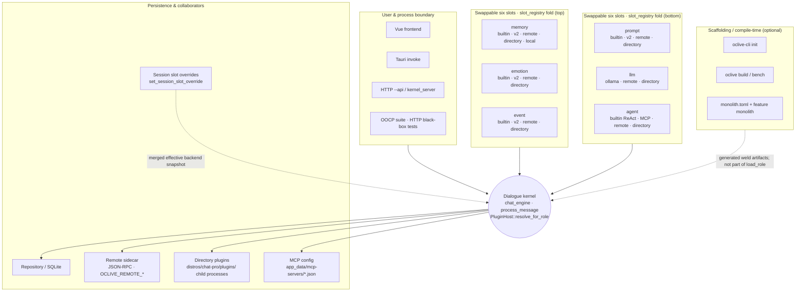
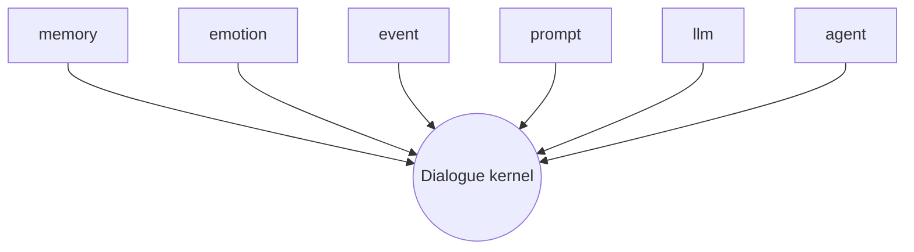

# A.I.Live · Kernel-centric module architecture (overview diagram)

**A.I.Live — Pluggable Role Artery Loom** (engineering codename **oclive**). **Kernel integrator learning path:** [KERNEL_INTEGRATOR_LEARNING_PATH.md](KERNEL_INTEGRATOR_LEARNING_PATH.md)

This page uses a **kernel-in-the-center** diagram. **v2** role packs use **`pipeline.ocblueprint`** (`meta`, **`slot_registry`**, optional **`groups`** for the architecture graph). Authoritative detail: **[PLUGIN_V1.md](../plugin-and-architecture/PLUGIN_V1.md)**, **[ROLE_PACK_SPEC.md](../../creator-docs/role-pack/ROLE_PACK_SPEC.md)**, **[RFC_ROLE_BLUEPRINT_V2.md](../../handoff/RFC_ROLE_BLUEPRINT_V2.md)**.

---

## 1. Overview diagram (Mermaid)

**How to read:** center = **dialogue kernel**; top/bottom rows = **six host slot facades** (folded from v2 **`slot_registry`**); top band = **user & process boundary**; bottom = **persistence & external implementations**; lowest band = **scaffolding / compile-time**. **Legacy v1 (deprecated):** `settings.json` → `plugin_backends` — [V1_TO_V2_MIGRATION.md](../role-pack/V1_TO_V2_MIGRATION.md).

Static asset (same structure as Mermaid, for slides/print):

> **Note:** the desktop HTTP API used by the OOCP suite is **HTTP only** today; a future WebSocket OOCP surface would extend the host before the diagram label “WebSocket” becomes accurate.

---

## 2. Star diagram (six slots → kernel)

Use this with PLUGIN_V1’s **linear `send_message` sequence** (this diagram is **topology**, not per-turn order).

---

## 3. Recently highlighted capabilities

| Capability | Notes |
|------------|------|
| **Sixth slot `agent`** | `slot_registry` instance with `type: agent`; `BuiltinReActAgent`; MCP — see root `AGENTS.md`. |
| **MCP** | Tool discovery / invocation on the agent path; config under app data `mcp-servers`. |
| **`memory = local`** | `_local_plugins` bridge — [LOCAL_PLUGIN_BRIDGE_SPEC.md](../../creator-docs/plugin-and-architecture/LOCAL_PLUGIN_BRIDGE_SPEC.md). |
| **Session overrides** | `set_session_slot_override`; `get_role_info` / `load_role` expose effective backend snapshots. |
| **`oclive-cli` + Monolith** | `init` / `build` / `bench`; `monolith.toml` is compile-time only; orthogonal to role-pack blueprint. |
| **Headless / CI** | `kernel_server`, `--api`, OOCP suite share domain contracts with the desktop build. |

If your fork differs, follow **that branch’s code and migrations**, then update this page.

---

## 4. Related links

- Six-slot pipeline (top-down): [PLUGIN_V1.md § Architecture & send_message order](../plugin-and-architecture/PLUGIN_V1.md)
- **Pure kernel boundary & embedded scope**: [PURE_KERNEL_BOUNDARY.md](PURE_KERNEL_BOUNDARY.md)
- Three extension styles for creators: [CREATOR_PLUGIN_ARCHITECTURE.md](../../creator-docs/plugin-and-architecture/CREATOR_PLUGIN_ARCHITECTURE.md)
- CLI & Monolith: [OCLIVE_CLI_GUIDE.md](../../creator-docs/cli/OCLIVE_CLI_GUIDE.md) · [RFC_OCLIVE_MONOLITH_MODE.md](../../creator-docs/rfc/RFC_OCLIVE_MONOLITH_MODE.md)

---

[中文](../../creator-docs/getting-started/KERNEL_AND_MODULES_ARCHITECTURE.md)
