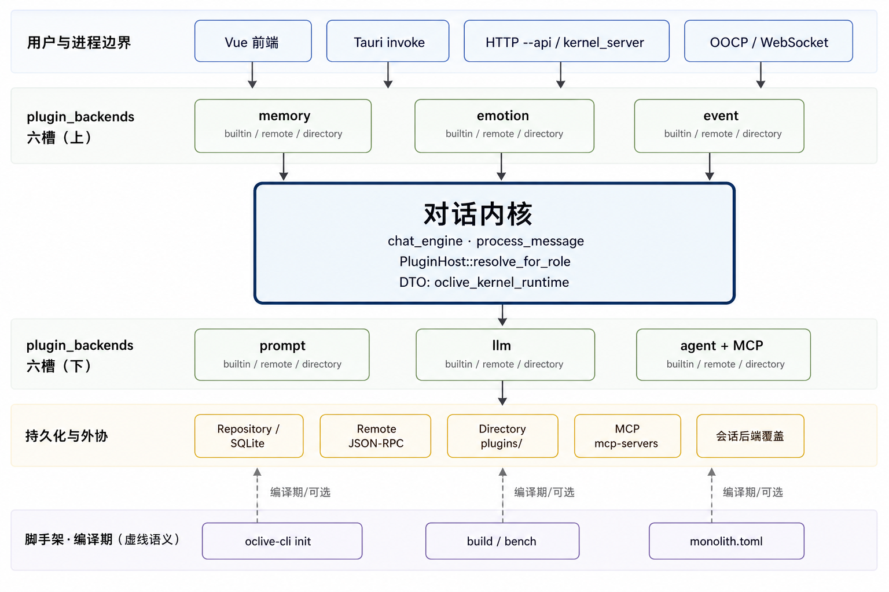
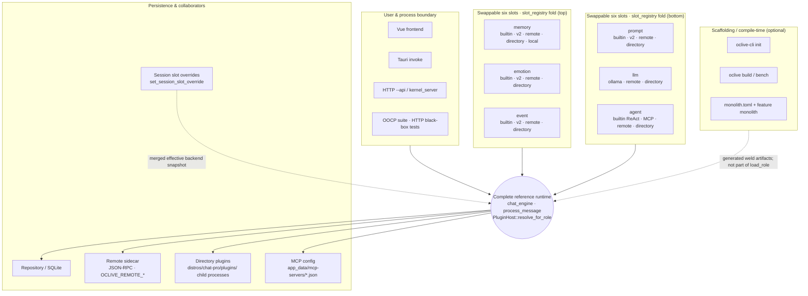
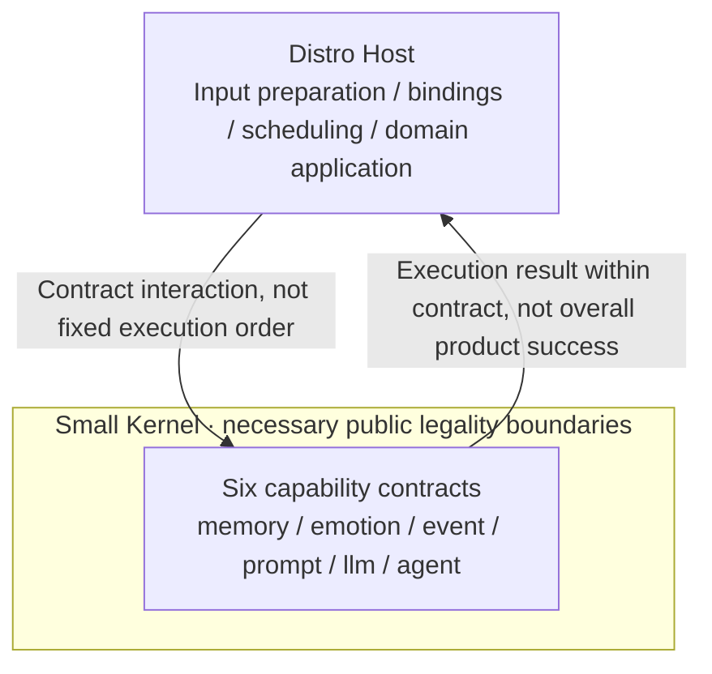

# A.I.Live · Minimal tool kernel and reference-runtime diagrams

**A.I.Live — Pluggable Role Artery Loom** (engineering codename **oclive**). **Kernel integrator learning path:** [KERNEL_INTEGRATOR_LEARNING_PATH.md](KERNEL_INTEGRATOR_LEARNING_PATH.md)

This page separates **logical responsibilities** from **current reference-runtime topology**. [MODULE_MAP](../../handoff/MODULE_MAP_AND_HANDOFF.md#kernel-responsibilities) owns responsibilities. [PLUGIN_V1](../plugin-and-architecture/PLUGIN_V1.md) and [ROLE_PACK_SPEC](../../creator-docs/role-pack/ROLE_PACK_SPEC.md) describe current interfaces and richer formats, not a frozen future minimal API. Blueprint/slot-registry configuration is not a prerequisite for a minimal persona + visual-reference role.

---

## 1. Complete reference-runtime diagram (Mermaid)

**How to read:** this is the full reference-runtime topology, not the physical boundary of a minimal core. The center is orchestration/resolution; top/bottom rows are six slot facades; outer bands are transport, persistence, external implementations, and scaffolding.

**Historical static reference-runtime snapshot:** “kernel” uses the older full-runtime meaning. This asset is not normative for the small Kernel or guaranteed to match the edited Mermaid. Use §2 and MODULE_MAP for current responsibility discussions.

```mermaid
flowchart TB
  subgraph boundary["User & process boundary"]
    direction LR
    UI["Vue frontend"]
    TAURI["Tauri invoke"]
    API["HTTP --api / kernel_server"]
    OOCP["OOCP suite · HTTP black-box tests"]
  end

  subgraph six_top["Swappable six slots · slot_registry fold (top)"]
    direction LR
    M["memory<br/>builtin · v2 · remote · directory · local"]
    EM["emotion<br/>builtin · v2 · remote · directory"]
    EV["event<br/>builtin · v2 · remote · directory"]
  end

  K(("Complete reference runtime<br/>chat_engine · process_message<br/>PluginHost::resolve_for_role"))

  subgraph six_bot["Swappable six slots · slot_registry fold (bottom)"]
    direction LR
    PR["prompt<br/>builtin · v2 · remote · directory"]
    LL["llm<br/>ollama · remote · directory"]
    AG["agent<br/>builtin ReAct · MCP · remote · directory"]
  end

  subgraph infra["Persistence & collaborators"]
    direction LR
    REPO["Repository / SQLite"]
    RMT["Remote sidecar<br/>JSON-RPC · OCLIVE_REMOTE_*"]
    DIR["Directory plugins<br/>distros/chat-pro/plugins/ child processes"]
    MCP["MCP config<br/>app_data/mcp-servers/*.json"]
    SESS["Session slot overrides<br/>set_session_slot_override"]
  end

  subgraph toolchain["Scaffolding / compile-time (optional)"]
    direction LR
    OCLI["oclive-cli init"]
    BUILD["oclive build / bench"]
    MONO["monolith.toml + feature monolith"]
  end

  boundary --> K
  six_top --> K
  six_bot --> K
  K --> REPO
  K --> RMT
  K --> DIR
  K --> MCP
  SESS -.->|merged effective backend snapshot| K
  toolchain -.->|generated weld artifacts; not part of load_role| K
```

> **Note:** the desktop HTTP API used by the OOCP suite is **HTTP only** today; a future WebSocket OOCP surface would extend the host before the diagram label “WebSocket” becomes accurate.

---

## 2. Minimal conceptual core (six ports → kernel)

This diagram explains confirmed responsibilities, not a new API or physical split. Hosts own concrete execution; the small Kernel defines six-slot contracts and necessary legality, not six fixed stages. Slot names denote contracts, not concrete implementations residing in the core. The co-present `prompt + llm` health gate is current reference-Host policy.

```mermaid
flowchart TB
  H["Distro Host<br/>Input preparation / bindings / scheduling / domain application"]
  subgraph K["Small Kernel · necessary public legality boundaries"]
    C["Six capability contracts<br/>memory / emotion / event / prompt / llm / agent"]
  end
  H -->|Contract interaction, not fixed execution order| C
  C -->|Execution result within contract, not overall product success| H
```

Event Ring, concrete slot implementations, Repository/SQLite, resource coordination, HTTP/Tauri, and distros sit outside this minimal diagram. The source has not yet extracted this boundary into a separately compiled crate; see `K-CORE-BOUNDARY-01`.

---

## 3. Recently highlighted capabilities

| Capability | Notes |
|------------|------|
| **Sixth slot `agent`** | `slot_registry` instance with `type: agent`; `BuiltinReActAgent`; MCP — see root `AGENTS.md`. |
| **MCP** | Tool discovery / invocation on the agent path; config under app data `mcp-servers`. |
| **`memory = local`** | `_local_plugins` bridge — [LOCAL_PLUGIN_BRIDGE_SPEC.md](../../creator-docs/plugin-and-architecture/LOCAL_PLUGIN_BRIDGE_SPEC.md). |
| **Session overrides** | `set_session_slot_override`; `get_role_info` / `load_role` expose effective backend snapshots. |
| **`oclive-cli` + Monolith** | `init` / `build` / `bench`; `monolith.toml` is compile-time only; orthogonal to role-pack blueprint. |
| **Headless / CI** | `kernel_server`, `--api`, OOCP suite share domain contracts with the desktop build. |

If your fork differs, follow **that branch’s code and migrations**, then update this page.

---

## 4. Related links

- Six-slot pipeline (top-down): [PLUGIN_V1.md § Architecture & send_message order](../plugin-and-architecture/PLUGIN_V1.md)
- **Minimal-kernel boundary & embedded runtime scope**: [PURE_KERNEL_BOUNDARY.md](PURE_KERNEL_BOUNDARY.md)
- Three extension styles for creators: [CREATOR_PLUGIN_ARCHITECTURE.md](../../creator-docs/plugin-and-architecture/CREATOR_PLUGIN_ARCHITECTURE.md)
- CLI & Monolith: [OCLIVE_CLI_GUIDE.md](../../creator-docs/cli/OCLIVE_CLI_GUIDE.md) · [RFC_OCLIVE_MONOLITH_MODE.md](../../creator-docs/rfc/RFC_OCLIVE_MONOLITH_MODE.md)

---

[中文](../../creator-docs/getting-started/KERNEL_AND_MODULES_ARCHITECTURE.md)
