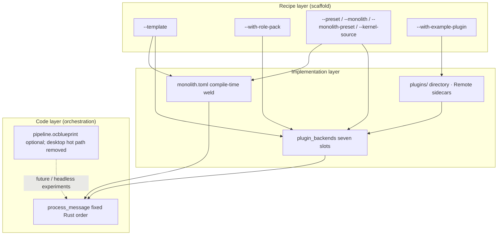

# Kernel factory vision

**oclive-cli** `init` is the **recipe-layer** entry of the kernel factory: ship a buildable custom kernel project with **`--template`** bundles and optional **`--with-role-pack`**, then layer **Monolith** (implementation-layer performance) and the main repo’s **`process_message`** (code-layer orchestration).

[中文](../../creator-docs/getting-started/KERNEL_FACTORY_VISION.md)

---

## Three layers

| Layer | Audience | Tools / artifacts | What changes |
|-------|----------|-------------------|--------------|
| **Recipe** | Platform / hardware devs | `oclive init --template …` | Project type, slot presets, Monolith on/off, sample `roles/` |
| **Implementation** | Integrators + authors | `settings.json`, `monolith.toml`, `plugins/` | Per-slot **builtin / remote / directory / ollama**; which slots to weld |
| **Code** | Kernel maintainers | `chat_engine` in `src-tauri` / `oclive_kernel_runtime` | **Atomic step order** per turn (memory → emotion → event → prompt → LLM → …) |

---

## Factory workflow

1. Pick a **template**: `robot-soul` (toy), `robot-gateway` (smart hub), `dialogue-only` (conversation service), `headless-api` (HTTP), `library-embed` (library).
2. **Override** explicitly if needed: `--preset`, `--monolith`, `--monolith-preset`, `--with-role-pack`, `--with-example-plugin` beat template defaults.
3. **Wire the real kernel**: `--kernel-source <oclivenewnew root>`; `cargo build` / `cargo run -- --api` in the generated tree.
4. **Swap soul**: edit `roles/<id>/` or `oclive pack create`; `oclive dev` watches manifest/settings.
5. **Swap implementations**: `plugin_backends`, `plugins/<id>/`, or Remote sidecars ([PLUGIN_AUTHOR_LEARNING_PATH.md](../plugin-and-architecture/PLUGIN_AUTHOR_LEARNING_PATH.md)).
6. **Need speed**: `robot-soul` / `robot-gateway` enable Monolith by default; edit `monolith.toml` then `oclive build`.

---

## Blueprint (`pipeline.ocblueprint`)

- **Blueprints** describe **runtime** orchestration of atomic steps; **orthogonal** to Monolith (`monolith.toml` only).
- **Desktop host**: entry blueprint **removed** from the hot path; use **`process_message`** ([AGENTS.md](../../AGENTS.md)).
- **Factory (validation)**: `oclive blueprint validate <path>` checks JSON shape, known step types, and `next` references. Does **not** change the desktop host. Generated projects include **`docs/BLUEPRINT_REFERENCE.md`**.
- **Custom orchestration (short term)**: read **`docs/ORCHESTRATION_REFERENCE.md`** (and `.en.md`) + edit `monolith.toml` / fork `process_message`.

---

## Monolith as a performance tier

| Template | Monolith default | Notes |
|----------|------------------|--------|
| `robot-soul` / `robot-gateway` | **on** | Welded slots for latency-sensitive devices |
| `headless-api` / `dialogue-only` | off | pass `--monolith` to enable |
| `library-embed` | off | no `monolith.toml` for `library` |

**`--monolith-preset`** (when Monolith is on): `latency` (all seven slots) | `memory` | `embedded`. You may edit `monolith.toml` afterward.

---

## Templates

| `--template` | Use case | preset | Monolith | project-type | Default role pack |
|--------------|----------|--------|----------|--------------|-------------------|
| `robot-soul` | Smart toy / embedded | minimal | on | kernel_server | `robot-soul-minimal` |
| `robot-gateway` | Smart gateway / home hub | mixed | on | kernel_server | none (OEM `roles/`) |
| `dialogue-only` | Pure conversation service | full | off | kernel_server | `default` |
| `headless-api` | Headless API | full | off | kernel_server | none |
| `library-embed` | Embedded library | minimal | off | library | none |

`--with-role-pack`: `robot-soul-minimal` | `default`; `--skip-role-pack` forces empty `roles/`.

---

## Orchestration reference (generated projects)

`oclive init` writes **`docs/ORCHESTRATION_REFERENCE.md`** describing the six-stage pipeline, safe reorderings, hard constraints (`build_prompt` before `call_llm`), and skipping slots via `monolith.toml`. **Desktop host remains fixed**; for kernel developers only.

---

## Example plugin

`--with-example-plugin` (default off) copies **`examples/directory-plugin-llamacpp/`** to **`plugins/com.oclive.example.llamacpp_llm/`**. See **`plugins/README.md`** in the generated tree.

---

## See also

- [OCLIVE_CLI_GUIDE.md](../cli/OCLIVE_CLI_GUIDE.md)
- [KERNEL_PLATFORM_DEVELOPER_PATH.md](KERNEL_PLATFORM_DEVELOPER_PATH.md)
- [KERNEL_IMPLEMENTATION_PLAN.md](../../creator-docs/getting-started/KERNEL_IMPLEMENTATION_PLAN.md)
- [PLUGIN_V1.md](../plugin-and-architecture/PLUGIN_V1.md)
