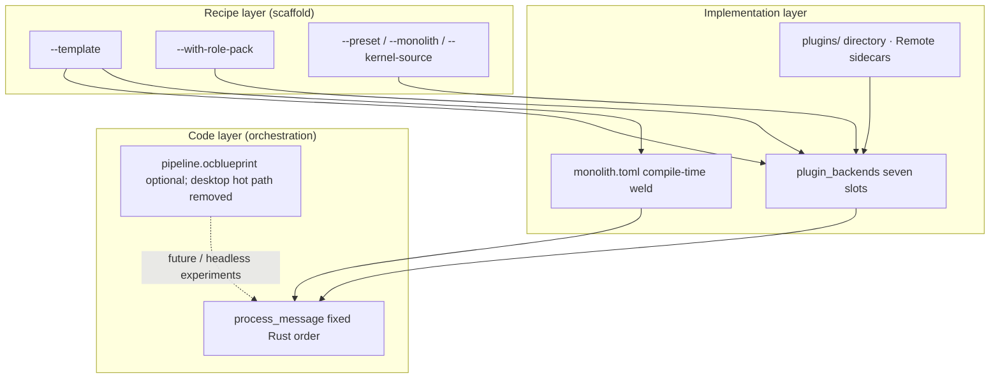

# Kernel factory vision

**oclive-cli** `init` is the **recipe-layer** entry of the kernel factory: ship a buildable custom kernel project with **`--template`** bundles and optional **`--with-role-pack`**, then layer **Monolith** (implementation-layer performance) and the main repo’s **`process_message`** (code-layer orchestration).

[中文](../../creator-docs/getting-started/KERNEL_FACTORY_VISION.md)

---

## Three layers

| Layer | Audience | Tools / artifacts | What changes |
|-------|----------|-------------------|--------------|
| **Recipe** | Platform / hardware devs | `oclive init --template …` | Project type, slot presets, Monolith on/off, sample `roles/` |
| **Implementation** | Integrators + authors | `settings.json`, `monolith.toml`, `plugins/` | Per-slot **builtin / remote / directory / ollama**; which slots to weld |
| **Code** | Kernel maintainers | `chat_engine` in `src-tauri` / `oclive_kernel_runtime` | **Atomic step order** per turn (memory → emotion → event → prompt → LLM → …) |

---

## Factory workflow

1. Pick a **template**: e.g. `robot-soul` (toy/embedded), `headless-api` (HTTP only), `library-embed` (link into your Rust binary).
2. **Override** explicitly if needed: `--preset`, `--monolith`, `--with-role-pack` beat template defaults.
3. **Wire the real kernel**: `--kernel-source <oclivenewnew root>`; `cargo build` / `cargo run -- --api` in the generated tree.
4. **Swap soul**: edit `roles/<id>/` or `oclive pack create`; `oclive dev` watches manifest/settings.
5. **Swap implementations**: `plugin_backends`, `plugins/<id>/`, or Remote sidecars ([PLUGIN_AUTHOR_LEARNING_PATH.md](../plugin-and-architecture/PLUGIN_AUTHOR_LEARNING_PATH.md)).
6. **Need speed**: `robot-soul` enables Monolith by default; edit `monolith.toml` then `oclive build`.

---

## Blueprint (`pipeline.ocblueprint`)

- **Blueprints** describe **runtime** orchestration of atomic steps; **orthogonal** to Monolith (`monolith.toml` only).
- **Desktop host**: entry blueprint **removed** from the hot path; use **`process_message`** ([AGENTS.md](../../AGENTS.md)).
- **Factory today**: optional blueprint file shape may live in role packs; **scaffold does not generate or parse** blueprints yet. Re-enabling blueprints belongs in **runtime** + a revision RFC / `PIPELINE_SCHEMA`.
- **Custom step order (short term)**: extend `process_message` or use Monolith welding; **not** `init` code generation in v1.

---

## Monolith as a performance tier

| Template | Monolith default | Notes |
|----------|------------------|--------|
| `robot-soul` | **on** | Welded slots for toys / latency-sensitive devices |
| `headless-api` | off | pass `--monolith` to enable |
| `library-embed` | off | no `monolith.toml` for `library` |

---

## Templates

| `--template` | Use case | preset | Monolith | project-type | Default role pack |
|--------------|----------|--------|----------|--------------|-------------------|
| `robot-soul` | Smart toy / embedded | minimal | on | kernel_server | `robot-soul-minimal` |
| `headless-api` | Headless API | full | off | kernel_server | none |
| `library-embed` | Embedded library | minimal | off | library | none |

---

## See also

- [OCLIVE_CLI_GUIDE.md](../cli/OCLIVE_CLI_GUIDE.md)
- [KERNEL_PLATFORM_DEVELOPER_PATH.md](KERNEL_PLATFORM_DEVELOPER_PATH.md)
- [KERNEL_IMPLEMENTATION_PLAN.md](../../creator-docs/getting-started/KERNEL_IMPLEMENTATION_PLAN.md)
- [PLUGIN_V1.md](../plugin-and-architecture/PLUGIN_V1.md)
