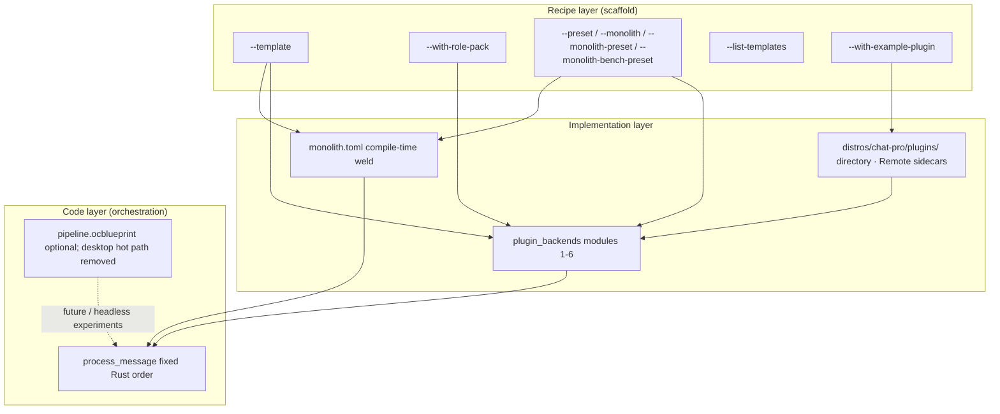

# Kernel factory vision

**oclive-cli** `init` is the **recipe-layer** entry of the kernel factory: ship a buildable custom kernel project with **`--template`** bundles and optional **`--with-role-pack`**, then layer **Monolith** (implementation-layer performance) and the main repo’s **`process_message`** (code-layer orchestration).

**Architecture narrative** (contract-first thin kernel, distribution-style delivery, characteristics): **[OCLIVE_ARCHITECTURE_OVERVIEW.md](OCLIVE_ARCHITECTURE_OVERVIEW.md)** ([中文](../../creator-docs/getting-started/OCLIVE_ARCHITECTURE_OVERVIEW.md)).

[中文](../../creator-docs/getting-started/KERNEL_FACTORY_VISION.md)

---

## Single-kernel, dual-mode build architecture

Above the factory, Oclive uses **single-kernel, dual-mode build architecture**: **single kernel** = one `process_message` + PLUGIN_V1 contract; **dual-mode** = two compile-time tiers—**exo-mode** (low coupling / `PluginHost` / desktop default) and **macro-mode** (`monolith.toml` / Monolith weld / optional weld of all six host slots + `complex_emotion` weld key). Modes are chosen at `oclive init` and `cargo build` (often dual `[[bin]]` outputs), **not** runtime hot-switch.

**Module numbering** (modules 1–6 / facility submodules / backend-module plugins): **[OCLIVE_ARCHITECTURE_OVERVIEW.md](OCLIVE_ARCHITECTURE_OVERVIEW.md)** ([中文](../../creator-docs/getting-started/OCLIVE_ARCHITECTURE_OVERVIEW.md)).

| Umbrella | Exo-mode | Macro-mode |
|----------|----------|------------|
| Single-kernel, dual-mode build | Standard `main.rs`, `plugin_backends` | `main_monolith.rs`, `feature monolith` |
| Existing names | PLUGIN_V1, pure kernel, PluginHost | Monolith RFC, high coupling, `monolith.toml` |
| Full weld | — | `weld_modules = []` and `exclude = []`, or `--monolith-preset latency` |

Full narrative and characteristics: **[OCLIVE_ARCHITECTURE_OVERVIEW.md](OCLIVE_ARCHITECTURE_OVERVIEW.md)**. Exo/macro labels are **engineering analogies**, not OS taxonomy.

---

## Official command surface

Aligned with [OCLIVE_CLI_GUIDE.md](../cli/OCLIVE_CLI_GUIDE.md); **source of truth** is `kernel/crates/oclive-cli/src/main.rs`. Default help focuses on stable entries instead of mixing experiments into the main path.

| Surface | Scope |
|---------|-------|
| **Stable visible** | `init`, `dev`, `pack`, `doctor`, `plugin`, `registry`, `lint`, `profile`, `config`, `ci`, `scaffold`, `kernel`, `explain`, `migrate-app-data`, `completions` |
| **Experimental hidden** | `build`, `bench`, `blueprint`, `compose`, `debug`, `dashboard`, `learn`, `test`, `market`, `collab` (all require global `--experimental`) |
| **Compatibility hidden** | `template`: legacy `.oclive-template.tar.gz` project archives, not Scaffold Packages |

**Planned (not shipped)**: `pack diff`/`update`, `kernel update`, `dev --inject`, `bench history` import/export — [VISION_ROADMAP_MONTHLY.md](../../creator-docs/roadmap/VISION_ROADMAP_MONTHLY.md#oclive-cli-脚手架计划中).

---

## Quality deepening (Z11–Z16 / Z14 / Z19)

| ID | Capability |
|----|------------|
| **Z14** | `init --from-existing` / `--share` — reproduce init command + share file |
| **Z11** | `bench --stress` — concurrent `/chat` load test |
| **Z12** | `test --ci-parity` — run CI workflow steps locally |
| **Z13** | `lint --deps` — `cargo audit` + yanked crates |
| **Z15** | `doctor --watch` — periodic environment alerts |
| **Z16** | All CLI user output in **English** |
| **Z19** | `kernel info` — runtime dependency version matrix |

See [OCLIVE_CLI_GUIDE.md](../cli/OCLIVE_CLI_GUIDE.md) (Chinese guide, quality section).

---

## Hardening (AA1–AA11)

Extends existing subcommands (new top-level: **`explain`**, **`completions`** only): cold-start bench, `test --coverage` / `--miri`, `init --dry-run` / `--check`, `lint --audit-ci`, `doctor --sbom`, and [PERFORMANCE.md](PERFORMANCE.md) §5. See the Chinese [OCLIVE_CLI_GUIDE.md](../../creator-docs/cli/OCLIVE_CLI_GUIDE.md) «巩固强化» section.

---

## Three layers



| Layer | Audience | Tools / artifacts | What changes |
|-------|----------|-------------------|--------------|
| **Recipe** | Platform / hardware devs | `oclive init --template …` | Project type, slot presets, Monolith on/off, sample `distros/chat-pro/roles/` |
| **Implementation** | Integrators + authors | `settings.json`, `monolith.toml`, `distros/chat-pro/plugins/` | Per-slot **builtin / remote / directory / ollama**; which slots to weld |
| **Code** | Kernel maintainers | `chat_engine` in `src-tauri` / `oclive_kernel_runtime` | **Atomic step order** per turn (memory → emotion → event → prompt → LLM → …) |

---

## 5-minute walkthrough (headless scaffold)

From the **oclivenewnew** repo root (with Rust installed):

```bash
cargo run -p oclive-cli -- doctor
cargo run -p oclive-cli -- init --quick --non-interactive -o ./my-chat --project-name my-chat
cd my-chat
cargo build --release
cargo run --release
```

Another terminal:

```bash
curl -X POST http://127.0.0.1:8420/chat \
  -H "Content-Type: application/json" \
  -d '{"message": "Hello, introduce yourself"}'
```

Use **`--kernel-source <repo root>`** on `init` for the real HTTP API and **`OCLIVE_HTTP_API_MOCK_LLM=1`** for mock LLM smoke tests.

---

## U / V / W / X deepening (main)

| Dimension | Focus | Examples |
|-----------|--------|----------|
| **U** | Visibility & onboarding (tier C) | `dashboard`, `bench --live`, `learn` |
| **V** | Quality & matrix bench | `bench --matrix`, `test`, `lint` |
| **W** | Plugin ecosystem | `plugin_dependencies`, `plugin install/test`; discovery via **`market`** |
| **X** | Weld & pipeline | TUI weld picker, `init --pipeline`, `profile` |

See [OCLIVE_CLI_GUIDE.md](../cli/OCLIVE_CLI_GUIDE.md) (Chinese guide includes U–X sections).

---

## Collaboration & distribution (T1 / T2 / T3)

| ID | Capability | CLI |
|----|------------|-----|
| **T3** | Marketplace | `oclive market` |
| **T1** | Cloud registry | `oclive registry login/push/pull/search` |
| **T2** | Role-pack collab | `oclive collab` |

---

## Continuous improvement (Y1–Y6)

| ID | Capability | CLI |
|----|------------|-----|
| **Y3** | Unified config | `oclive config` → `~/.oclive/config.toml` |
| **Y1** | CI scaffold | `oclive ci init` / `ci check` |
| **Y6** | Doctor auto-fix | `oclive doctor --fix` |
| **Y2** | Bench regression gate | `oclive bench --regression` |
| **Y5** | Cross-version bench | `oclive bench --compare-versions <ref>` |
| **Y4** | Template from project | `oclive template create` |

---

## Factory workflow

1. Browse recipes: `oclive init --list-templates` or the interactive template picker; then pick `robot-soul`, `robot-gateway` (MCP scaffold), `dialogue-only`, `headless-api`, or `library-embed`.
2. **Override** explicitly if needed: `--preset`, `--monolith`, `--monolith-preset`, `--with-role-pack`, `--with-example-plugin` beat template defaults.
3. **Wire the real kernel**: `--kernel-source <oclivenewnew root>`; `cargo build` / `cargo run -- --api` in the generated tree.
4. **Swap soul**: edit `distros/chat-pro/roles/<id>/` or `oclive pack create`; `oclive dev` watches manifest/settings.
5. **Swap implementations**: `plugin_backends`, `distros/chat-pro/plugins/<id>/`, or Remote sidecars ([PLUGIN_AUTHOR_LEARNING_PATH.md](../plugin-and-architecture/PLUGIN_AUTHOR_LEARNING_PATH.md)).
6. **Need speed**: `robot-soul` / `robot-gateway` enable Monolith by default; edit `monolith.toml` then `oclive build`.

---

## Blueprint (`pipeline.ocblueprint`)

- **Blueprints** describe **runtime** orchestration of atomic steps; **orthogonal** to Monolith (`monolith.toml` only).
- **Desktop host**: entry blueprint **removed** from the hot path; use **`process_message`** ([AGENTS.md](../../AGENTS.md)).
- **Factory (validation)**: `oclive blueprint validate <path>` checks JSON shape, known step types, and `next` references. Does **not** change the desktop host. Generated projects include **`docs/BLUEPRINT_REFERENCE.md`**.
- **Custom orchestration (short term)**: read **`docs/ORCHESTRATION_REFERENCE.md`** (and `.en.md`) + edit `monolith.toml` / fork `process_message`.

---

## Monolith as a performance tier

| Template | Monolith default | Notes |
|----------|------------------|--------|
| `robot-soul` / `robot-gateway` | **on** | Welded slots for latency-sensitive devices |
| `headless-api` / `dialogue-only` | off | pass `--monolith` to enable |
| `library-embed` | off | no `monolith.toml` for `library` |

**`--monolith-preset`** (when Monolith is on): `latency` (all seven weld keys) | `memory` | `embedded`. You may edit `monolith.toml` afterward.

**`oclive bench --release`** report schema **v2** adds **`binary_size`**, **`peak_memory`**, and **`build_time`** alongside latency stats.

## Environment diagnostics

**`oclive doctor`** / **`--json`**: Rust, Cargo, RAM, disk, Ollama, GitHub reachability, writable workspace.

## Quick mode

**`oclive init --quick`**: `preset=full`, no Monolith, no `distros/chat-pro/roles/`. Interactive mode asks only **project name** and **output directory**. CLI flags already set skip duplicate prompts.

---

## Visual recipes

- **`--list-templates`**: print the five-template matrix and exit (no project directory).
- **Interactive `oclive init`**: choose a scene template before project type; default is manual configuration; selected templates pre-fill preset / Monolith / role pack (CLI flags still win).

---

## Monolith weld comparison

- **`--monolith-bench-preset`**: after generation, auto `cargo build --release` + `bench --runs 5`, print standard vs welded latency, save **`bench_results/report.json`**. Failures warn only; init still succeeds.
- **`docs/WELD_BENCH_REPORT.md`** (and `.en.md`): worksheet for tuning `weld_modules`.

---

## robot-gateway MCP

Generates **`mcp_servers/`** (README + example JSON) and **`distros/chat-pro/roles/gateway/settings.json`** with `agent: builtin` and **`agent_mcp`** placeholders for smart-home sidecars.

---

## Templates

| `--template` | Use case | preset | Monolith | project-type | Default role pack |
|--------------|----------|--------|----------|--------------|-------------------|
| `robot-soul` | Smart toy / embedded | minimal | on | kernel_server | `robot-soul-minimal` |
| `robot-gateway` | Smart gateway / home hub | mixed | on | kernel_server | `gateway` stub + `mcp_servers/` |
| `dialogue-only` | Pure conversation service | full | off | kernel_server | `default` |
| `headless-api` | Headless API | full | off | kernel_server | none |
| `library-embed` | Embedded library | minimal | off | library | none |

`--with-role-pack`: `robot-soul-minimal` | `default`; `--skip-role-pack` forces empty `distros/chat-pro/roles/`.

---

## Orchestration reference (generated projects)

`oclive init` writes **`docs/ORCHESTRATION_REFERENCE.md`** describing the six-stage pipeline, safe reorderings, hard constraints (`build_prompt` before `call_llm`), and skipping slots via `monolith.toml`. **Desktop host remains fixed**; for kernel developers only.

---

## Example plugin

`--with-example-plugin` (default off) copies **`examples/directory-plugin-llamacpp/`** to **`distros/chat-pro/plugins/com.oclive.example.llamacpp_llm/`**. See **`distros/chat-pro/plugins/README.md`** in the generated tree.

---

## Plugin scaffold (`plugin create`)

**`oclive plugin create <name>`** scaffolds directory or remote plugins (manifest + RPC stubs + README). See [PLUGIN_AUTHOR_LEARNING_PATH.md](../plugin-and-architecture/PLUGIN_AUTHOR_LEARNING_PATH.md).

---

## Dev watch (`dev`)

**`oclive dev`** recursively watches **`distros/chat-pro/roles/**/manifest.json`** and **`settings.json`** with **500ms debounce** and prints which role pack `<id>` changed.

---

## Smart build diagnostics

**`oclive build`** / **`bench`** surface human-readable hints for common `cargo build` stderr patterns; otherwise run **`oclive doctor`**.

---

## Bench trends (`bench --history`)

After multiple **`bench --save`** runs, **`bench --history`** prints a terminal trend table (and optional **`--json`**).

---

## Project metadata (`init`)

**`--author`**, **`--license`** (default MIT), **`--description`** populate generated **`Cargo.toml`**.

---

## Local registry (`registry`)

**`~/.oclive/registry.json`** lists local kernel projects (`init` auto-registers). Commands: **`list`**, **`add`**, **`remove`**, **`switch`**; **`--json`** supported.

---

## Multi-kernel compose (`compose`)

**`oclive-compose.yml`** defines services (`path`, `port`, `env`, `depends_on`). **`compose up`** / **`down`** / **`ps`**.

---

## Legacy project archives (`template` / `--template-url`)

Hidden compatibility commands **`oclive template create/pack`** produce **`.oclive-template.tar.gz`** archives; **`oclive init --template-url`** downloads and unpacks them. Top-level **`oclive publish` has been removed**. The separate local Scaffold Package contract is documented in [RFC_SCAFFOLD_PACKAGE_V1.md](../rfc/RFC_SCAFFOLD_PACKAGE_V1.md).

---

## TUI template picker (`init --tui`)

**ratatui** list + preview panel; **`OCLIVE_NO_TUI=1`** disables. Falls back to dialoguer when not a TTY.

---

## Continuous bench (`bench --watch`)

Watches **`src/**/*.rs`** and **`Cargo.toml`** (2s debounce); auto release build + 3-run bench + **`--save`** with **↑/↓/→** deltas.

---

## Kernel debug (`debug`)

**`oclive debug`** with **`OCLIVE_DEBUG_TRACE=1`**; parses **`OCLIVE_DEBUG_TRACE`** JSON lines on stderr. Requires full kernel via **`--kernel-source`**. Generated **`docs/DEBUG_REFERENCE.md`**.

---

## See also

- [OCLIVE_CLI_GUIDE.md](../cli/OCLIVE_CLI_GUIDE.md)
- [KERNEL_PLATFORM_DEVELOPER_PATH.md](KERNEL_PLATFORM_DEVELOPER_PATH.md)
- [KERNEL_IMPLEMENTATION_PLAN.md](../../creator-docs/getting-started/KERNEL_IMPLEMENTATION_PLAN.md)
- [PLUGIN_V1.md](../plugin-and-architecture/PLUGIN_V1.md)
