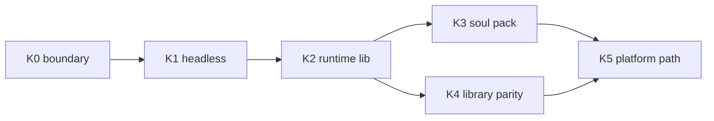

# Pure kernel / platform goals — implementation plan (kernel first)

**Current strategy**: deliver kernel and platform milestones **K0–K5** first; **desktop product-level launch** is deferred — see [handoff/archive/PRODUCT_AND_KERNEL_GAP_CHECKLIST.md](../../handoff/archive/PRODUCT_AND_KERNEL_GAP_CHECKLIST.md) §A.

**Authoritative contracts**: [KERNEL_AND_MODULES_ARCHITECTURE.md](KERNEL_AND_MODULES_ARCHITECTURE.md) · [PURE_KERNEL_BOUNDARY.md](PURE_KERNEL_BOUNDARY.md) · [PLUGIN_V1.md](../plugin-and-architecture/PLUGIN_V1.md)

[中文](../../creator-docs/getting-started/KERNEL_IMPLEMENTATION_PLAN.md)

---

## North-star outcomes

| Goal | Acceptance |
|------|------------|
| **Custom robot “soul”** | Change persona and backend policy by swapping role pack + `settings.plugin_backends` (within `min_runtime_version`) **without editing orchestration code** |
| **Companion collaboration** | Single-turn `process_message` runs memory / emotion / event / prompt / llm / agent in contract order; slots remain swappable |
| **Headless & embedded** | Hardware partners integrate **without Vue**; shapes: `--api`, `kernel_server` bin, `library` embed |
| **AI hardware/software platform** | Third parties follow **one developer path**: scaffold → pack → plugin/sidecar → validate → deploy |

---

## Phase overview



| Phase | Goal | Main deliverables | Checklist |
|-------|------|-------------------|-----------|
| **K0** | Boundary locked | `PURE_KERNEL_BOUNDARY.md`, this plan | B1, B3 |
| **K1** | Headless loop | `examples/headless-kernel-minimal/`, `--api` | B3 transition |
| **K2** | Real runtime wiring | `oclive_kernel_runtime` + `oclive-cli --kernel-source` | B3 |
| **K3** | Soul delivery unit | RobotSoulPack profile + sample pack | B1 |
| **K4** | Embedded symmetry | `library` strategy + sample | B3 |
| **K5** | Single platform path | `KERNEL_PLATFORM_DEVELOPER_PATH.md` | B4, B5 |

---

## K0 — Boundary & narrative ✅

- [x] [PURE_KERNEL_BOUNDARY.md](PURE_KERNEL_BOUNDARY.md)
- [x] Linked from doc index and handoff

---

## K1 — Headless integration loop ✅

**Today**: `oclivenewnew-tauri --api` (default port **8420**), `http_api`, and the OOCP suite exist; the minimal loop is [examples/headless-kernel-minimal/README.md](../../examples/headless-kernel-minimal/README.md). **Integration shapes**: CI and fast bring-up still center on **`--api`**; standalone process: **`oclive-kernel-server`** (K2); in-process embed: **`library` + `oclive_kernel_runtime`** (K4) — see [KERNEL_PLATFORM_DEVELOPER_PATH.md](KERNEL_PLATFORM_DEVELOPER_PATH.md). `oclive-cli init` **without** `--kernel-source` remains a **serde stub** for minimal skeletons; use **`--kernel-source`** to link the real workspace.

**Done when**

- [x] [examples/headless-kernel-minimal/README.md](../../examples/headless-kernel-minimal/README.md) steps work in zh/en
- [x] CI `oocp-test-suite` stays green (same bar as K1; `.github/workflows/ci.yml` + [AGENTS.md](../../AGENTS.md))
- [x] Docs describe `--api` vs **`oclive-kernel-server`** vs **`library` embed** ([PURE_KERNEL_BOUNDARY.md](PURE_KERNEL_BOUNDARY.md) §5, [KERNEL_PLATFORM_DEVELOPER_PATH.md](KERNEL_PLATFORM_DEVELOPER_PATH.md))

**Acceptance commands**

```bash
cargo build -p oclivenewnew-tauri
export OCLIVE_HTTP_API_MOCK_LLM=1
./target/debug/oclivenewnew-tauri --api
curl http://127.0.0.1:8420/health
cd examples/oocp-test-suite && node run.mjs
```

---

## K2 — Scaffold → real kernel (core engineering) ✅

**Goal**: a `path`-linkable **`oclive_kernel_runtime`**; desktop Tauri and headless bin **share the same domain orchestration** (`src-tauri` and `oclive_kernel_server` evolve in-repo).

### K2.1 Crate split (suggested order)

| Step | Work | Acceptance |
|------|------|------------|
| 2.1.1 | Add `kernel/crates/oclive_kernel_runtime` with minimal API (`KernelContext` or `AppState` subset for `process_message`) | `cargo test -p oclive_kernel_runtime` |
| 2.1.2 | Move or re-export **non-Tauri** `domain/`, `models/`, repository traits | `src-tauri` becomes thin glue |
| 2.1.3 | Add `kernel/crates/oclive_kernel_server` bin: HTTP entry reusing runtime | `cargo run -p oclive_kernel_server -- --api` |
| 2.1.4 | `src-tauri` depends on runtime; keep `--api` compatible | existing `http_api` tests pass |

**Closeout (2026-05-15)**: Rows 2.1.1–2.1.4 are implemented; locally `cargo build -p oclivenewnew-tauri`, `cargo test -p oclive_kernel_runtime`, and `cargo test -p oclive-cli` passed. Ongoing bar: CI `oocp-test-suite` + the tests above.

### K2.2 `oclive-cli` wiring

- [x] `init --kernel-source <path-to-oclivenewnew>` writes `path` deps and sample `main.rs`
- [x] Generated README distinguishes **stub** vs **runtime-linked** projects
- [x] `bench` / `build` work on real runtime trees (Monolith still **kernel_server** only)

### K2.3 Out of scope for K2

- Do not move entire `src-tauri` in one PR
- Do not change `process_message` semantics in K2

---

## K3 — RobotSoulPack

**Done when**

- [x] Add **RobotSoulPack** (`--profile robot-soul`) to [ROLE_PACK_SPEC.md](../role-pack/ROLE_PACK_SPEC.md)
- [x] Minimal fields:
  - `manifest.json`: `id`, `name`, `version`, `min_runtime_version`
  - `settings.json`: explicit `plugin_backends` (six slots + optional extensions), `interaction_mode`, optional `remote_presence`
  - `core_personality.txt` or seven-dim `default_personality` (either/or)
- [x] `oclive-cli pack validate --profile robot-soul`
- [x] `examples/robot-soul-minimal/distros/chat-pro/roles/default/`

---

## K4 — `kernel_server` vs `library`

| Shape | Monolith | Use |
|-------|----------|-----|
| `kernel_server` | ✅ | Gateway, standalone process, robot brain |
| `library` | ❌ | In-process embed; link `oclive_kernel_runtime` |

- [x] Keep [PURE_KERNEL_BOUNDARY.md](PURE_KERNEL_BOUNDARY.md) §5 aligned with code
- [x] `oclive-cli init --project-type library --kernel-source` embed sample (`runtime_api_version` / optional `resolve_api_port` in generated `lib.rs`)
- [x] Cross-link **oclive doll core** README

---

## K5 — Single platform developer path

- [x] Write [KERNEL_PLATFORM_DEVELOPER_PATH.md](KERNEL_PLATFORM_DEVELOPER_PATH.md) (zh/en)
- [x] One line: `oclive-cli init` → pack → directory plugin/sidecar → validate → `--api` or server → deploy
- [x] Default LLM sim: `examples/remote_plugin_openai_compat`
- [ ] OTA / remote logs: **P2**, not blocking K1–K4

---

## vs product-level launch

| Kernel phase | Unlocks |
|--------------|---------|
| K0 | Consistent external story |
| K1 | Integration without UI |
| K2–K4 | Shippable process / lib |
| K5 | Third-party onboarding |

**Product P0** is ready to focus on **product checklist §A** now that **K1 is green and K2 is closed** (see [PRODUCT_AND_KERNEL_GAP_CHECKLIST.md](../../handoff/archive/PRODUCT_AND_KERNEL_GAP_CHECKLIST.md) §A).

---

## Verification log (local / 2026-05-15)

| Command | Result |
|---------|--------|
| `cargo build -p oclivenewnew-tauri` | Pass |
| `cargo test -p oclive_kernel_runtime` | Pass |
| `cargo test -p oclive-cli` | Pass (includes e2e, ~40s+) |

**CI**: `oocp-test-suite` job (Ubuntu) per [AGENTS.md](../../AGENTS.md) is the ongoing K1 bar.

---

## Suggested next actions

1. ~~Run K1 acceptance locally~~ (logged above; keep CI green)  
2. ~~K2.1 / K2.2~~ (done)  
3. ~~K3 RobotSoulPack~~ (done)  
4. ~~K4 / K5 + doll core cross-links~~ (see [KERNEL_PLATFORM_DEVELOPER_PATH.md](KERNEL_PLATFORM_DEVELOPER_PATH.md) and doll core `README.md`)  
5. **P2**: OTA / remote logs (non-blocking)
