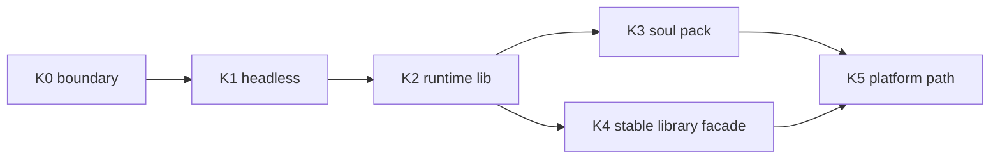

# Pure kernel / platform goals — implementation plan (kernel first)

**Current status (2026-08-31)**: this document preserves the K0–K5 implementation record. The K0–K5 code paths are closed, and K4 now exposes complete in-process orchestration through **`OcliveKernel`**. **V-EMBED-01 remains Partial** because Linux/ARM or real-hardware target proof, resource budgets, and long soak are still missing; current status and scheduling live in [TECHNICAL_DEBT_INVENTORY.md](../../handoff/TECHNICAL_DEBT_INVENTORY.md).

**Authoritative contracts**: [KERNEL_AND_MODULES_ARCHITECTURE.md](KERNEL_AND_MODULES_ARCHITECTURE.md) · [PURE_KERNEL_BOUNDARY.md](PURE_KERNEL_BOUNDARY.md) · [PLUGIN_V1.md](../plugin-and-architecture/PLUGIN_V1.md)

[中文](../../creator-docs/getting-started/KERNEL_IMPLEMENTATION_PLAN.md)

---

## North-star outcomes

| Goal | Acceptance |
|------|------------|
| **Custom robot “soul”** | Change persona and backend policy by swapping role pack + `settings.plugin_backends` (within `min_runtime_version`) **without editing orchestration code** |
| **Companion collaboration** | Single-turn `process_message` runs memory / emotion / event / prompt / llm / agent in contract order; slots remain swappable |
| **Headless & embedded** | Hardware partners integrate **without Vue**. `--api` / `kernel_server` and the `library` **`OcliveKernel`** facade share complete host orchestration; real-hardware proof remains V-EMBED-01 |
| **AI hardware/software platform** | Third parties follow **one developer path**: scaffold → pack → plugin/sidecar → validate → deploy |

---

## Phase overview


```mermaid
flowchart LR
  K0[K0 boundary] --> K1[K1 headless]
  K1 --> K2[K2 runtime lib]
  K2 --> K3[K3 soul pack]
  K2 --> K4[K4 stable library facade]
  K3 --> K5[K5 platform path]
  K4 --> K5
```

| Phase | Goal | Main deliverables | Checklist |
|-------|------|-------------------|-----------|
| **K0** | Boundary locked | `PURE_KERNEL_BOUNDARY.md`, this plan | B1, B3 |
| **K1** | Headless loop | `examples/headless-kernel-minimal/`, `--api` | B3 transition |
| **K2** | Real kernel wiring | `oclive_kernel_runtime` + `oclive_kernel_host` + `oclive-cli --kernel-source` | B3 |
| **K3** | Soul delivery unit | RobotSoulPack profile + sample pack | B1 |
| **K4** | Embedded facade | `OcliveKernel` + complete generated/compiled library sample | B3 |
| **K5** | Single platform path | `KERNEL_PLATFORM_DEVELOPER_PATH.md` | B4, B5 |

---

## K0 — Boundary & narrative ✅

- [x] [PURE_KERNEL_BOUNDARY.md](PURE_KERNEL_BOUNDARY.md)
- [x] Linked from doc index and handoff

---

## K1 — Headless integration loop ✅

**Today**: `oclivenewnew-tauri --api` (default port **8420**), `http_api`, and the OOCP suite exist; the minimal loop is [examples/headless-kernel-minimal/README.md](../../examples/headless-kernel-minimal/README.md). **Integration shapes**: CI and fast bring-up still center on **`--api`**; standalone process: **`oclive-kernel-server`** (K2); in-process embed: **`library` + `oclive_kernel_host::OcliveKernel`** (K4) — see [KERNEL_PLATFORM_DEVELOPER_PATH.md](KERNEL_PLATFORM_DEVELOPER_PATH.md). `oclive-cli init` **without** `--kernel-source` remains a **serde stub**; **with** it, the project links the complete host/contracts/runtime/types workspace set.

**Done when**

- [x] [examples/headless-kernel-minimal/README.md](../../examples/headless-kernel-minimal/README.md) steps work in zh/en
- [x] CI `oocp-test-suite` stays green (same bar as K1; `.github/workflows/ci.yml` + [AGENTS.md](../../AGENTS.md))
- [x] Docs describe `--api` vs **`oclive-kernel-server`** vs **`library` embed** ([PURE_KERNEL_BOUNDARY.md](PURE_KERNEL_BOUNDARY.md) §5, [KERNEL_PLATFORM_DEVELOPER_PATH.md](KERNEL_PLATFORM_DEVELOPER_PATH.md))

**Acceptance commands**

```bash
cargo build -p oclivenewnew-tauri
export OCLIVE_HTTP_API_MOCK_LLM=1
cargo run -p oclivenewnew-tauri -- --api
curl http://127.0.0.1:8420/health
cd examples/oocp-test-suite && node run.mjs
```

---

## K2 — Scaffold → real kernel (core engineering) ✅

**Goal**: provide a path-linkable **`oclive_kernel_runtime`** for DTOs and pure resolution plus **`oclive_kernel_host`** for `process_message`, persistence, and host services. Desktop Tauri and `oclive_kernel_server` share the complete orchestration in `oclive_kernel_host`.

### K2.1 Crate split (suggested order)

| Step | Work | Acceptance |
|------|------|------------|
| 2.1.1 | Add `kernel/crates/oclive_kernel_runtime` for DTOs, API constants, and reusable pure resolution | `cargo test -p oclive_kernel_runtime` |
| 2.1.2 | Move complete domain orchestration, repositories, and host services into `kernel/crates/oclive_kernel_host` | maintain one `process_message` implementation |
| 2.1.3 | Add `kernel/crates/oclive_kernel_server`: start HTTP using host + runtime | `cargo run -p oclive_kernel_server -- --api` |
| 2.1.4 | Make `distros/desktop-tauri` depend on host + runtime; keep Tauri commands thin | existing HTTP/invoke tests pass |

**Closeout (2026-05-15)**: Rows 2.1.1–2.1.4 are implemented; locally `cargo build -p oclivenewnew-tauri`, `cargo test -p oclive_kernel_runtime`, and `cargo test -p oclive-cli` passed. Ongoing bar: CI `oocp-test-suite` + the tests above.

### K2.2 `oclive-cli` wiring

- [x] `init --kernel-source <path-to-oclivenewnew>` writes `path` deps and sample `main.rs`
- [x] Generated README distinguishes **stub** vs **complete-kernel-linked** projects
- [x] `bench` / `build` work on real runtime trees (Monolith still **kernel_server** only)

### K2.3 Out of scope for K2

- Do not empty the desktop host in one PR
- Do not change `process_message` semantics in K2

---

## K3 — RobotSoulPack

**Done when**

- [x] Add **RobotSoulPack** (`--profile robot-soul`) to [ROLE_PACK_SPEC.md](../role-pack/ROLE_PACK_SPEC.md)
- [x] Minimal fields:
  - `manifest.json`: `id`, `name`, `version`, `min_runtime_version`
  - `settings.json`: explicit `plugin_backends` (six slots + optional extensions), `interaction_mode`, optional `remote_presence`
  - `core_personality.txt` or seven-dim `default_personality` (either/or)
- [x] `oclive-cli pack validate --profile robot-soul`
- [x] `examples/robot-soul-minimal/distros/chat-pro/roles/default/`

---

## K4 — `kernel_server` vs `library` (in-process API complete, target proof Partial)

| Shape | Monolith | Use |
|-------|----------|-----|
| `kernel_server` | ✅ | Gateway, standalone process, robot brain |
| `library` | ❌ | In-process host with its own `main`; `OcliveKernel` exposes roles, complete/streaming turns, persistence, plugins, Event Ring, and explicit shutdown |

- [x] Keep [PURE_KERNEL_BOUNDARY.md](PURE_KERNEL_BOUNDARY.md) §5 aligned with code
- [x] `oclive-cli init --project-type library --kernel-source` re-exports `OcliveKernel` and all four kernel crates; a real generated project passes standalone `cargo check`
- [x] Cross-link **oclive doll core** README
- [x] `OcliveKernelConfig / Builder / OcliveKernel` expose `process_message`, persistence, PluginHost, trusted origins, streaming, Event Ring, and lifecycle over the single canonical orchestration path
- [x] Public API integration coverage includes file SQLite, role load/list/info, ordinary/streaming turns, Event registration/proactive permit/diagnostics, shutdown, and reopen
- [ ] Validate packs, persistence, plugins, and resource budget on at least one Linux/ARM or real hardware gateway, then add a long soak; this remains **V-EMBED-01 Full**
- [ ] Slim HTTP implementation/dependencies out of `oclive_kernel_host` where target budgets justify it; this does not block using the current facade without starting HTTP

---

## K5 — Single platform developer path

- [x] Write [KERNEL_PLATFORM_DEVELOPER_PATH.md](KERNEL_PLATFORM_DEVELOPER_PATH.md) (zh/en)
- [x] One line: `oclive-cli init` → pack → directory plugin/sidecar → validate → `--api` or server → deploy
- [x] Default LLM sim: `examples/remote_plugin_openai_compat`
- [ ] OTA / remote logs: **P2**, not blocking K1–K4

---

## vs product-level launch

| Kernel phase | Unlocks |
|--------------|---------|
| K0 | Consistent external story |
| K1 | Integration without UI |
| K2–K4 | Shippable standalone process plus complete in-process Rust facade; V-EMBED-01 Full still needs real-target and resource evidence |
| K5 | Third-party onboarding |

**Product P0** is ready to focus on the hard items in [PRODUCT_LINE_TASK_BUCKETS.md](../../handoff/PRODUCT_LINE_TASK_BUCKETS.md) now that **K1 is green and K2 is closed**.

---

## Verification log (local / 2026-05-15)

| Command | Result |
|---------|--------|
| `cargo build -p oclivenewnew-tauri` | Pass |
| `cargo test -p oclive_kernel_runtime` | Pass |
| `cargo test -p oclive-cli` | Pass (includes e2e, ~40s+) |

**CI**: `oocp-test-suite` job (Ubuntu) per [AGENTS.md](../../AGENTS.md) is the ongoing K1 bar.

### K4 in-process API increment (local / 2026-08-31)

| Command / evidence | Result |
|--------------------|--------|
| `cargo test -p oclive_kernel_host --test role_kernel_public_api -j 1` | Pass; complete role facade, Event Ring, persistence, shutdown/reopen |
| `cargo test -p oclive_kernel_host --lib -j 1` | Pass; **545 / 545** |
| `cargo test -p oclive-cli -j 1` (offline rerun after registry TLS instability) | Pass, including generator, real generated-project builds, and Monolith e2e |
| Standalone `cargo check` in a real temporary linked-library project | Pass; not a template-string-only assertion |
| `cargo test -p oclivenewnew-tauri --test proactive_event_ring --test turn_origin_sensor -j 1` | Pass; **2 / 2**, proactive-turn and trusted-origin semantics unchanged |
| `cargo test --workspace --doc -j 1` | Pass |
| `cargo clippy --workspace --all-targets --all-features -- -D warnings` | Pass |
| `check-doc-mirror` / `check-markdown-links` | Pass |
| `node scripts/dimension5-acceptance.mjs --ci` (explicit Python 3.12 path) | Pass; **28 / 28** |

---

## Suggested next actions

1. ~~Run K1 acceptance locally~~ (logged above; keep CI green)  
2. ~~K2.1 / K2.2~~ (done)  
3. ~~K3 RobotSoulPack~~ (done)  
4. ~~K4 complete library facade and real generated-project compile~~ (done); add Linux/ARM/hardware and resource-budget proof under **V-EMBED-01 Full**
5. **P2**: OTA / remote logs (non-blocking)
