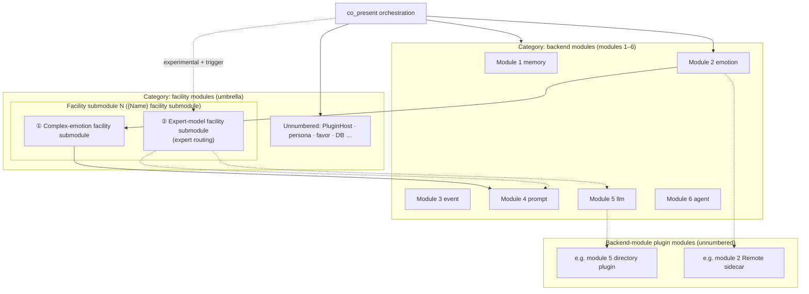

# Oclive architecture overview (single-kernel, dual-mode build)

This page is the **authoritative public narrative** and **module numbering & taxonomy**: single-kernel dual-mode build, **backend modules (modules 1–6)**, **facility modules (umbrella term)**, **`{Name} facility submodule`** entries (**facility submodule 1, 2, …**), plus **backend-module plugin modules** (not in the module-number series). Implementation details remain in [PLUGIN_V1.md](../../creator-docs/plugin-and-architecture/PLUGIN_V1.md), [SETTINGS_REFERENCE.md](../../creator-docs/cli/SETTINGS_REFERENCE.md), [PURE_KERNEL_BOUNDARY.md](../../creator-docs/getting-started/PURE_KERNEL_BOUNDARY.md), [RFC_OCLIVE_MONOLITH_MODE.md](../../creator-docs/rfc/RFC_OCLIVE_MONOLITH_MODE.md), and source.

[中文](../../creator-docs/getting-started/OCLIVE_ARCHITECTURE_OVERVIEW.md)

---

## Architecture in brief

**Oclive** uses a **contract-first thin kernel**: turn orchestration (`process_message`), session state, and cross-host errors; memory, emotion, event, prompt, LLM, and agent attach as **six PLUGIN_V1 host backend modules** (builtin / Remote / directory). The **complex-emotion facility submodule**, **expert-model facility submodule**, and other **in-orchestration facility modules** are **not** a seventh host slot.

**Delivery** follows distribution-style discipline: HTTP / **OOCP**, role packs, and **`oclive-cli` kernel factory** for headless or desktop hosts; `roles/{roleId}/` is the integration surface.

**Build** uses **single-kernel, dual-mode build architecture**: one orchestration contract; **exo-mode** (`PluginHost`) vs **macro-mode** (Monolith weld); dual `[[bin]]` artifacts—**not** two kernel products.

**Open lab** product axis: [VISION_OPEN_LAB.md](../../creator-docs/roadmap/VISION_OPEN_LAB.md).

---

## Facility-module naming (normative)

| Term | Meaning |
|------|---------|
| **Facility module** | **Umbrella term**: in-orchestration kernel capabilities that **do not** use the six `plugin_backends` keys (both unnumbered facilities and registered submodules). There is **no** separate mid-layer such as “expert-model facility module.” |
| **`{Name} facility submodule`** | A **registered** item under facility modules (**facility submodule N**); full name = **`{Name}` + `facility submodule`**; each **Name** is independent—do **not** use “expert-model” as a family prefix on other names. |
| **Expert model** (proper name) | Refers only to the **expert-model facility submodule** and its blueprint / experimental pipeline config—not complex emotion. |
| **Expert routing** | Default implementation of the **expert-model facility submodule**: `blueprint/includes/expert_routing.json`, triggers + `steps`, optional **`slot.expert.invoke`** (v3 + `dual_core`). |

**Extension (facility submodules):** new registered facilities take **facility submodule 3, 4, …** with full name **`{NewName} facility submodule`** (RFC + doc registry). Do **not** reuse the **expert-model** proper name.

---

## Module numbering (normative)

Capabilities inside the **pure kernel** split into **two categories**. Do not confuse with the kernel factory’s **recipe · implementation · code** layers ([KERNEL_FACTORY_VISION.md](../../creator-docs/getting-started/KERNEL_FACTORY_VISION.md)).

| Category | Numbering | In `plugin_backends`? |
|----------|-----------|------------------------|
| **Backend modules** | **Modules 1–6** (fixed table below) | **Yes** (six enum fields) |
| **Facility modules** | **Umbrella**; registered items are **facility submodule N** (separate from modules 1–6) | **No** (orchestration calls) |
| **Backend-module plugin modules** | **No “module N” id** | Only an implementation of **module K** |

**Extension rules**

- New **backend module** (RFC + host): **module 7**, **module 8**, …
- New **`{Name} facility submodule`** (RFC + registry): **facility submodule 3, 4**, …
- New **plugin delivery** (sidecar / directory): **“module K’s xxx plugin implementation”**—does **not** take module 7 or a facility submodule number.

### Modules 1–6 (backend modules, fixed)

| No. | `plugin_backends` key | Role |
|-----|------------------------|------|
| **Module 1** | `memory` | Memory retrieval/ranking |
| **Module 2** | `emotion` | User-message emotion analysis |
| **Module 3** | `event` | Event impact estimation |
| **Module 4** | `prompt` | Prompt assembly |
| **Module 5** | `llm` | Main dialogue LLM |
| **Module 6** | `agent` | Agent / tool orchestration |

### Facility submodules (registered · `{Name} facility submodule`)

| No. | Normative full name | Notes |
|-----|---------------------|-------|
| **Facility submodule 1** | **Complex-emotion facility submodule** | `narrative_hint`; consumes **module 2**; see below |
| **Facility submodule 2** | **Expert-model facility submodule** | Conditional expert sub-pipeline; default impl **expert routing**; see below |

### Unnumbered facility modules

`PluginHost`, `PersonalityEngine`, favor, `Repository`, `knowledge_index`, etc.: **facility modules** without a **facility submodule N** id until a new proper name is registered.

### Backend-module plugin modules (not numbered)

**Definition:** **out-of-process implementation** attached to **module K (1≤K≤6)**—Remote, directory, local. **Not** “module 7.”

---

## Structure diagram

---

## Facility submodule 1 (complex-emotion facility submodule)

| Item | Detail |
|------|--------|
| **Role** | Per-turn `narrative_hint` into Prompt |
| **Orchestration** | `co_present`: after `emotion.analyze` + context load, before `build_prompt` |
| **vs module 2** | module 2 = user affect; this submodule = narrative hint |
| **vs expert-model** | **Sibling** `{Name} facility submodule`; does **not** use expert routing |
| **Today** | `BuiltinKeywordComplexEmotionProvider`; scaffold `complex_emotion` key **ignored** by host |
| **Monolith** | Weld key `complex_emotion` (one of **seven weld keys**), ≠ host slot |

See [NARRATIVE_HINT_CONTRACT.md](../../creator-docs/testing/NARRATIVE_HINT_CONTRACT.md).

---

## Facility submodule 2 (expert-model facility submodule)

| Item | Detail |
|------|--------|
| **Proper name** | **Expert model** (this submodule only) |
| **Default implementation** | **Expert routing**: `blueprint/includes/expert_routing.json` |
| **Execution** | v3 + **`dual_core`**: **`slot.expert.invoke`** in `pipeline.experimental` |
| **Steps** | `slot.<registry_key>.<method>` and facility actions (`slot.personality.adjust`, `slot.prompt_enhance.apply`, …) |
| **vs submodule 1** | **Sibling** under facility modules—not a parent/child tree |
| **Creator UI** | Workbench “expert model facility” wizard / graph gear (product shorthand; normative name **expert-model facility submodule**) |

---

## Single-kernel, dual-mode build architecture

| Term | Meaning |
|------|---------|
| **Single kernel** | One `process_message` + PLUGIN_V1 contract |
| **Dual-mode** | Exo-mode / macro-mode build tiers |
| **Build** | Dual `[[bin]]`; **not** runtime hot-switch |

---

## Co-present main chain (numbered)

1. **Facility module:** `PluginHost` resolves **modules 1–6**
2. **Module 2:** `emotion.analyze`
3. **Facility module:** `PersonalityEngine` (user emotion)
4. **Facility module:** `knowledge_index` (optional)
5. **Facility submodule 1:** **complex-emotion facility submodule** → `narrative_hint`
6. **Module 3:** `event.estimate` → **facility module:** `PersonalityEngine` (event)
7. **Module 1:** `memory.rank_memories`
8. **Facility module:** favor/relation
9. **Module 4:** `prompt.build` → **Module 5:** `llm.generate`
10. **Module 6:** **agent**

**Experimental (optional):** when triggers match, **facility submodule 2** (**expert-model facility submodule** / expert routing) runs via `slot.expert.invoke`.

---

## Characteristics (summary)

- Contract-first thin kernel; **six host slots**; **facility modules** (unnumbered + **`{Name} facility submodule`**)
- **Backend-module plugin modules:** attach to module K without taking module N
- Distribution discipline: OOCP, role packs, kernel factory
- Dual-mode artifacts + `bench`
- Grants for high-risk directory/MCP capabilities

---

## Related docs

| Topic | Doc |
|-------|-----|
| Slot enums & JSON-RPC | [PLUGIN_V1.md](../../creator-docs/plugin-and-architecture/PLUGIN_V1.md) |
| `plugin_backends` & complex_emotion key | [SETTINGS_REFERENCE.md](../../creator-docs/cli/SETTINGS_REFERENCE.md) |
| Expert routing & includes | [ROLE_PACK_SPEC.md](../../creator-docs/role-pack/ROLE_PACK_SPEC.md) · [BLUEPRINT_FOLDER_LAYOUT.md](../../handoff/BLUEPRINT_FOLDER_LAYOUT.md) |
| Diagram | [KERNEL_AND_MODULES_ARCHITECTURE.md](../../creator-docs/getting-started/KERNEL_AND_MODULES_ARCHITECTURE.md) |
