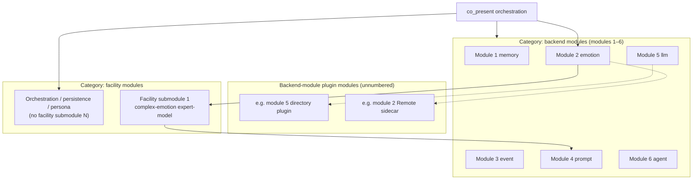

# Oclive architecture overview (single-kernel, dual-mode build)

This page is the **authoritative public narrative** and **module numbering & taxonomy**: single-kernel dual-mode build, **backend modules (modules 1–6)** and **facility modules (facility submodules 1, 2, …)**, plus **backend-module plugin modules** (not in the module-number series). Implementation details remain in [PLUGIN_V1.md](../../creator-docs/plugin-and-architecture/PLUGIN_V1.md), [SETTINGS_REFERENCE.md](../../creator-docs/cli/SETTINGS_REFERENCE.md), [PURE_KERNEL_BOUNDARY.md](../../creator-docs/getting-started/PURE_KERNEL_BOUNDARY.md), [RFC_OCLIVE_MONOLITH_MODE.md](../../creator-docs/rfc/RFC_OCLIVE_MONOLITH_MODE.md), and source.

[中文](../../creator-docs/getting-started/OCLIVE_ARCHITECTURE_OVERVIEW.md)

---

## Architecture in brief

**Oclive** uses a **contract-first thin kernel**: turn orchestration (`process_message`), session state, and cross-host errors; memory, emotion, event, prompt, LLM, and agent attach as **six PLUGIN_V1 host backend modules** (builtin / Remote / directory). The **complex-emotion expert-model facility submodule** and similar facilities sit **inside orchestration**—they are **not** a seventh host slot.

**Delivery** follows distribution-style discipline: HTTP / **OOCP**, role packs, and **`oclive-cli` kernel factory** for headless or desktop hosts; `roles/{roleId}/` is the integration surface.

**Build** uses **single-kernel, dual-mode build architecture**: one orchestration contract; **exo-mode** (`PluginHost`) vs **macro-mode** (Monolith weld); dual `[[bin]]` artifacts—**not** two kernel products.

**Open lab** product axis: [VISION_OPEN_LAB.md](../../creator-docs/roadmap/VISION_OPEN_LAB.md).

---

## Module numbering (normative)

Capabilities inside the **pure kernel** split into **two categories**. Do not confuse with the kernel factory’s **recipe · implementation · code** layers ([KERNEL_FACTORY_VISION.md](../../creator-docs/getting-started/KERNEL_FACTORY_VISION.md)).

| Category | Numbering | In `plugin_backends`? |
|----------|-----------|------------------------|
| **Backend modules** | **Modules 1–6** (fixed table below) | **Yes** (six enum fields) |
| **Facility modules** | **Facility submodule 1, 2, …** (separate from modules 1–6) | **No** (orchestration calls) |
| **Backend-module plugin modules** | **No “module N” id** | Only an implementation of **module K** |

**Extension rules**

- New **backend module** (RFC + host): **module 7**, **module 8**, …
- New **expert-model facility**: **facility submodule 2**, **facility submodule 3**, …
- New **plugin delivery** (sidecar / directory): say **“module K’s xxx plugin implementation”**—does **not** take module 7 or a facility submodule number.

### Modules 1–6 (backend modules, fixed)

| No. | `plugin_backends` key | Role |
|-----|------------------------|------|
| **Module 1** | `memory` | Memory retrieval/ranking |
| **Module 2** | `emotion` | User-message emotion analysis |
| **Module 3** | `event` | Event impact estimation |
| **Module 4** | `prompt` | Prompt assembly |
| **Module 5** | `llm` | Main dialogue LLM |
| **Module 6** | `agent` | Agent / tool orchestration |

Example: **module 2** = emotion backend module. Builtin / ollama plugs are **built-in implementations** of that module, not separate numbers.

### Facility submodules (registered)

**Expert-model facility submodules** use **facility submodule N** as shorthand (full name keeps the **expert-model** prefix).

| No. | Full name | Notes |
|-----|-----------|-------|
| **Facility submodule 1** | **Complex-emotion expert-model facility submodule** | `narrative_hint`; consumes **module 2** output; see below |

Other facilities (`PluginHost`, `PersonalityEngine`, favor, `Repository`, …) are **facility modules** without a **facility submodule N** id unless we add a future registry.

### Backend-module plugin modules (not numbered)

**Definition:** **out-of-process implementation** attached to **module K (1≤K≤6)**—Remote, directory, local. **Not** “module 7.”

| Phrasing | Meaning |
|----------|---------|
| Module 5’s directory plugin | `llm = directory`, `plugins/<id>/` |
| Module 2’s Remote sidecar | `emotion = remote` |
| ✗ Module 7 (directory plugin) | **Wrong**—plugins do not get their own module number |

Optional directory-plugin **shell / ui_slots** UI belongs to the **same plugin package**, not a new “frontend module number.”

---

## Structure diagram

---

## Facility submodule 1 (complex-emotion expert-model facility submodule)

| Item | Detail |
|------|--------|
| **Role** | Per-turn `narrative_hint` into Prompt (“complex emotion narrative hint” section) |
| **Orchestration** | `co_present`: after `emotion.analyze` + context load, before `build_prompt` |
| **vs module 2** | module 2 = measure user affect; this facility = narrative hint for persona |
| **Today** | Hard-wired `BuiltinKeywordComplexEmotionProvider`; `complex_emotion` in `settings.json` **ignored** by host |
| **Roadmap** | Remote `complex_emotion.resolve_turn` (`OCLIVE_COMPLEX_EMOTION_URL`); optional future host-slot pluginization |
| **Monolith** | Weld key `complex_emotion` (one of **seven weld keys**), ≠ sixth/seventh host slot |

See [NARRATIVE_HINT_CONTRACT.md](../../creator-docs/testing/NARRATIVE_HINT_CONTRACT.md).

### Six host slots vs seven Monolith weld keys

| Concept | Count | Use |
|---------|-------|-----|
| **Backend modules (host slots)** | **6** | Runtime `plugin_backends` + `PluginHost` |
| **Monolith `SLOT_IDS` weld keys** | **7** | Compile-time `monolith.toml` / demo pipeline; includes `complex_emotion` |
| **Scaffold example JSON** | 6 + extension key | `complex_emotion` is a **factory/doc extension key**; host Serde **skips** it |

---

## Single-kernel, dual-mode build architecture

| Term | Meaning |
|------|---------|
| **Single kernel** | One `process_message` + PLUGIN_V1 contract |
| **Dual-mode** | Exo-mode / macro-mode build tiers |
| **Build** | Dual `[[bin]]`; **not** runtime hot-switch |

| | **Exo-mode** | **Macro-mode** |
|---|-------------|----------------|
| **Names** | Low coupling, `PluginHost` | Monolith, `monolith.toml` |
| **Six host slots** | `settings.json` backends | Welded slots; empty `weld_modules` + empty `exclude` → all six slots + `complex_emotion` weld key |
| **Desktop default** | **Yes** | Factory scaffold; full `process_message` hot-path weld evolving (RFC §9) |

Orthogonal to kernel factory recipe/implementation/code layers.

---

## Co-present main chain (numbered)

1. **Facility module:** `PluginHost` resolves **modules 1–6**
2. **Module 2:** `emotion.analyze`
3. **Facility module:** `PersonalityEngine` (user emotion)
4. **Facility module:** `knowledge_index` (optional)
5. **Facility submodule 1:** complex-emotion expert-model facility submodule → `narrative_hint`
6. **Module 3:** `event.estimate` → **facility module:** `PersonalityEngine` (event)
7. **Module 1:** `memory.rank_memories`
8. **Facility module:** favor/relation
9. **Module 4:** `prompt.build` → **Module 5:** `llm.generate` (directory ⇒ **module 5 plugin implementation**)
10. **Module 6:** **agent** (MCP = tool dependency for module 6)

---

## Characteristics (summary)

- Contract-first thin kernel; **six host slots**; **facility modules** (incl. expert-model facility submodules)
- **Backend-module plugin modules:** attach to module K without taking module N
- Distribution discipline: OOCP, role packs, kernel factory
- Dual-mode artifacts + `bench`
- Grants for high-risk directory/MCP capabilities
- Three-layer testing: protocol (this repo), components (pack-editor), plugins (editor)

---

## Related docs

| Topic | Doc |
|-------|-----|
| Slot enums & JSON-RPC | [PLUGIN_V1.md](../../creator-docs/plugin-and-architecture/PLUGIN_V1.md) |
| `plugin_backends` & complex_emotion key | [SETTINGS_REFERENCE.md](../../creator-docs/cli/SETTINGS_REFERENCE.md) |
| Plugin extension | [CREATOR_PLUGIN_ARCHITECTURE.md](../../creator-docs/plugin-and-architecture/CREATOR_PLUGIN_ARCHITECTURE.md) |
| Kernel factory | [KERNEL_FACTORY_VISION.md](../../creator-docs/getting-started/KERNEL_FACTORY_VISION.md) |
| Diagram | [KERNEL_AND_MODULES_ARCHITECTURE.md](../../creator-docs/getting-started/KERNEL_AND_MODULES_ARCHITECTURE.md) |
| Pure kernel | [PURE_KERNEL_BOUNDARY.md](../../creator-docs/getting-started/PURE_KERNEL_BOUNDARY.md) |
| Monolith | [RFC_OCLIVE_MONOLITH_MODE.md](../../creator-docs/rfc/RFC_OCLIVE_MONOLITH_MODE.md) |
