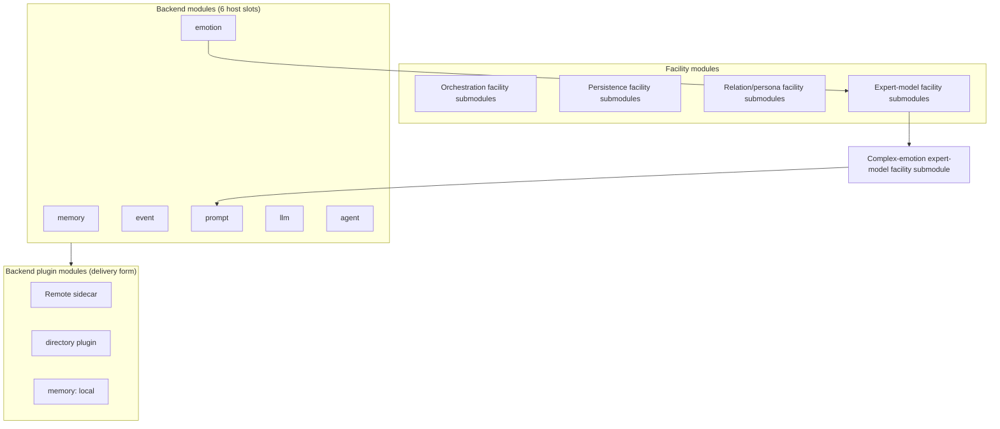

# Oclive architecture overview (single-kernel, dual-mode build)

This page is the **authoritative public narrative** and **module taxonomy**: single-kernel dual-mode build, **backend modules / backend plugin modules / facility modules**, and **expert-model facility submodule** naming. Implementation details remain in [PLUGIN_V1.md](../../creator-docs/plugin-and-architecture/PLUGIN_V1.md), [SETTINGS_REFERENCE.md](../../creator-docs/cli/SETTINGS_REFERENCE.md), [PURE_KERNEL_BOUNDARY.md](../../creator-docs/getting-started/PURE_KERNEL_BOUNDARY.md), [RFC_OCLIVE_MONOLITH_MODE.md](../../creator-docs/rfc/RFC_OCLIVE_MONOLITH_MODE.md), and source.

[中文](../../creator-docs/getting-started/OCLIVE_ARCHITECTURE_OVERVIEW.md)

---

## Architecture in brief

**Oclive** uses a **contract-first thin kernel**: turn orchestration (`process_message`), session state, and cross-host errors; memory, emotion, event, prompt, LLM, and agent attach as **six PLUGIN_V1 host backend modules** (builtin / Remote / directory). The **complex-emotion expert-model facility submodule** and similar facilities sit **inside orchestration**—they are **not** a seventh host slot.

**Delivery** follows distribution-style discipline: HTTP / **OOCP**, role packs, and **`oclive-cli` kernel factory** for headless or desktop hosts; `roles/{roleId}/` is the integration surface.

**Build** uses **single-kernel, dual-mode build architecture**: one orchestration contract; **exo-mode** (`PluginHost`) vs **macro-mode** (Monolith weld); dual `[[bin]]` artifacts—**not** two kernel products.

**Open lab** product axis: [VISION_OPEN_LAB.md](../../creator-docs/roadmap/VISION_OPEN_LAB.md).

---

## Module layers (three layers + facility subtypes)

Capabilities inside the **pure kernel** split by **role**. Do not confuse with the kernel factory’s **recipe · implementation · code** layers ([KERNEL_FACTORY_VISION.md](../../creator-docs/getting-started/KERNEL_FACTORY_VISION.md)).

### 1. Backend modules (six host slots)

**Definition:** six fields in `plugin_backends`; resolved via **`PluginHost::resolve_for_role`**; invoked per [PLUGIN_V1 orchestration order](../../creator-docs/plugin-and-architecture/PLUGIN_V1.md).

| Slot | Role |
|------|------|
| memory | Memory retrieval/ranking |
| emotion | User-message emotion analysis |
| event | Event impact estimation |
| prompt | Prompt assembly |
| llm | Main dialogue LLM |
| agent | Agent / tool orchestration |

Built-in implementations (e.g. `emotion_analyzer`) are **built-in branches of that backend module**, not a separate “plugin module type.”

**“Seventh module”** in [AGENTS.md](../../AGENTS.md) means the product **`agent` slot** (the sixth enum field)—**not** `complex_emotion`.

### 2. Backend plugin modules

**Definition:** when a **backend module** uses **remote / directory / local (memory)**, the **out-of-process packaged implementation**—**no extra host slot**.

| Form | Config | Rebuild desktop app to swap logic? |
|------|--------|-----------------------------------|
| Remote sidecar | slot = `remote` + env URLs | Usually **no** |
| Directory plugin | slot = `directory` + `directory_plugins.*` | Usually **no** |
| Packaged `.oclive-plugin` | install under `plugins/` | Same |
| Fork host Rust | new enum / `PluginHost` | **Yes** |

**Common mistake:** treating “backend plugin modules” as a **seventh business category** parallel to the six slots. Correct: **“directory implementation of the emotion slot.”**

**MCP** (`mcp-servers/*.json`) is a **tool dependency for the agent backend module**, not an eighth slot.

See [CREATOR_PLUGIN_ARCHITECTURE.md](../../creator-docs/plugin-and-architecture/CREATOR_PLUGIN_ARCHITECTURE.md).

### 3. Facility modules

**Definition:** kernel capabilities **without** a `plugin_backends` field; called **directly** from `chat_engine` / `co_present`.

| Facility submodule type | Examples |
|-------------------------|----------|
| **Orchestration facility submodules** | `process_message`, `PluginHost`, `startup_health` |
| **Persistence facility submodules** | `Repository`, SQLite, `role_manager` |
| **Relation/persona facility submodules** | `PersonalityEngine`, favor/relation, `knowledge_index` |
| **Expert-model facility submodules** | Narrow tasks; consume backend DTOs; swappable strategy (roadmap) |

**UI, OOCP HTTP shell, role-pack data, oclive-cli factory** sit outside these three layers.

---

## Naming: expert-model × facility

| Level | Pattern | Meaning |
|-------|---------|---------|
| Type | **facility module** | Layer-3 umbrella |
| Subtype | **expert-model facility submodule** | Narrow orchestration step; **expert-model** is a doc prefix (not necessarily a separate LLM) |
| Instance | **{capability} expert-model facility submodule** | e.g. **complex-emotion expert-model facility submodule** |

**Relation to backend modules:** expert-model facility submodules **consume outputs** (e.g. `EmotionResult`); they are **not** backend modules and **not** resolved by `PluginHost` until a future seventh `plugin_backends` field is designed.

### Complex-emotion expert-model facility submodule

| Item | Detail |
|------|--------|
| **Role** | Per-turn `narrative_hint` into Prompt (“complex emotion narrative hint” section) |
| **Orchestration** | `co_present`: after `emotion.analyze` + context load, before `build_prompt` |
| **vs emotion slot** | emotion = measure user affect; this facility = narrative hint for persona |
| **Today** | Hard-wired `BuiltinKeywordComplexEmotionProvider`; `complex_emotion` in `settings.json` **ignored** by host |
| **Roadmap** | Remote `complex_emotion.resolve_turn` (`OCLIVE_COMPLEX_EMOTION_URL`); optional future host-slot pluginization |
| **Monolith** | Weld key `complex_emotion` (one of **seven weld keys**), ≠ sixth/seventh host slot |

See [NARRATIVE_HINT_CONTRACT.md](../../creator-docs/testing/NARRATIVE_HINT_CONTRACT.md).

### Six host slots vs seven Monolith weld keys

| Concept | Count | Use |
|---------|-------|-----|
| **Backend modules (host slots)** | **6** | Runtime `plugin_backends` + `PluginHost` |
| **Monolith `SLOT_IDS` weld keys** | **7** | Compile-time `monolith.toml` / demo pipeline; includes `complex_emotion` |
| **Scaffold example JSON** | 6 + extension key | `complex_emotion` is a **factory/doc extension key**; host Serde **skips** it |

---

## Single-kernel, dual-mode build architecture

| Term | Meaning |
|------|---------|
| **Single kernel** | One `process_message` + PLUGIN_V1 contract |
| **Dual-mode** | Exo-mode / macro-mode build tiers |
| **Build** | Dual `[[bin]]`; **not** runtime hot-switch |

| | **Exo-mode** | **Macro-mode** |
|---|-------------|----------------|
| **Names** | Low coupling, `PluginHost` | Monolith, `monolith.toml` |
| **Six host slots** | `settings.json` backends | Welded slots; empty `weld_modules` + empty `exclude` → all six slots + `complex_emotion` weld key |
| **Desktop default** | **Yes** | Factory scaffold; full `process_message` hot-path weld evolving (RFC §9) |

Orthogonal to kernel factory recipe/implementation/code layers.

---

## Co-present main chain (layer map)

1. **Facility:** `PluginHost` resolves **six backend modules**
2. **Backend:** `emotion.analyze`
3. **Facility:** `PersonalityEngine` (user emotion)
4. **Facility:** `knowledge_index` (optional)
5. **Expert-model facility:** **complex-emotion expert-model facility submodule** → `narrative_hint`
6. **Backend:** `event.estimate` → **Facility:** `PersonalityEngine` (event)
7. **Backend:** `memory.rank_memories`
8. **Facility:** favor/relation
9. **Backend:** `prompt.build` → **Backend:** `llm.generate`
10. **Backend:** **agent** (scenario-dependent)

---

## Characteristics (summary)

- Contract-first thin kernel; **six host slots**; **facility modules** (incl. expert-model facility submodules)
- **Backend plugin modules:** sidecars / directory plugins / MCP—swap without a ComfyUI-style main UI
- Distribution discipline: OOCP, role packs, kernel factory
- Dual-mode artifacts + `bench`
- Grants for high-risk directory/MCP capabilities
- Three-layer testing: protocol (this repo), components (pack-editor), plugins (editor)

---

## Related docs

| Topic | Doc |
|-------|-----|
| Slot enums & JSON-RPC | [PLUGIN_V1.md](../../creator-docs/plugin-and-architecture/PLUGIN_V1.md) |
| `plugin_backends` & complex_emotion key | [SETTINGS_REFERENCE.md](../../creator-docs/cli/SETTINGS_REFERENCE.md) |
| Plugin extension | [CREATOR_PLUGIN_ARCHITECTURE.md](../../creator-docs/plugin-and-architecture/CREATOR_PLUGIN_ARCHITECTURE.md) |
| Kernel factory | [KERNEL_FACTORY_VISION.md](../../creator-docs/getting-started/KERNEL_FACTORY_VISION.md) |
| Diagram | [KERNEL_AND_MODULES_ARCHITECTURE.md](../../creator-docs/getting-started/KERNEL_AND_MODULES_ARCHITECTURE.md) |
| Pure kernel | [PURE_KERNEL_BOUNDARY.md](../../creator-docs/getting-started/PURE_KERNEL_BOUNDARY.md) |
| Monolith | [RFC_OCLIVE_MONOLITH_MODE.md](../../creator-docs/rfc/RFC_OCLIVE_MONOLITH_MODE.md) |
