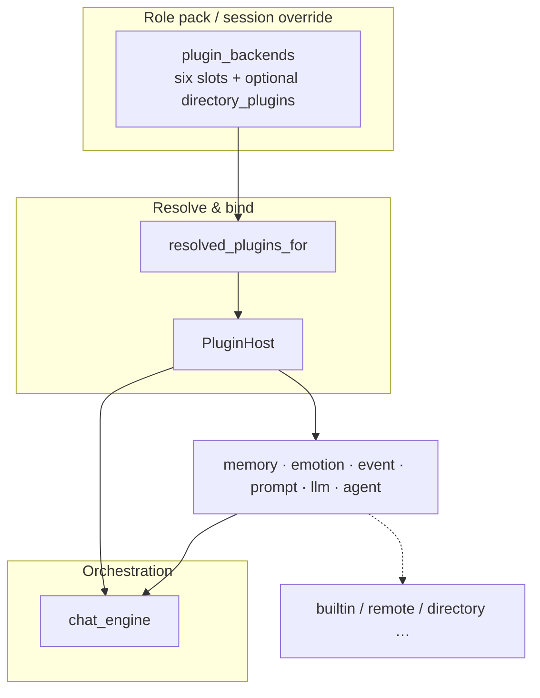

# Creator architecture guide (full)

How **oclive’s swappable subsystems** work for creators: extend **without forking** (or fork when you must); configure **HTTP sidecars**; and what “swap a module” / “hot update online” **really** means in this codebase.

**Documentation hub**: [../getting-started/DOCUMENTATION_INDEX.md](../getting-started/DOCUMENTATION_INDEX.md)  
**JSON‑RPC fields & samples**: [REMOTE_PLUGIN_PROTOCOL.md](REMOTE_PLUGIN_PROTOCOL.md)  
**`plugin_backends` contract**: [PLUGIN_V1.md](PLUGIN_V1.md)  
**Directory plugins** (`plugins/`, `manifest`, whole shell, `directory_plugin_invoke`): [DIRECTORY_PLUGINS.md](DIRECTORY_PLUGINS.md)  
**Rust replacement steps**: [HOW_TO_REPLACE_MODULES.md](HOW_TO_REPLACE_MODULES.md)  
**Local bridge (`memory = local`)**: [LOCAL_PLUGIN_BRIDGE_SPEC.md](LOCAL_PLUGIN_BRIDGE_SPEC.md)

[中文](../../creator-docs/plugin-and-architecture/CREATOR_PLUGIN_ARCHITECTURE.md)

---

## Part 1 — What problem the architecture solves

The chat pipeline is split into swappable blocks: **memory retrieval, user‑sentence emotion, event estimation, prompt assembly, main LLM, Agent (tools / MCP)**. A role pack declares each via `settings.json` → `plugin_backends` using **builtin / remote / directory / local (memory) / ollama**, etc. (`builtin_v2` is a deprecated read alias equivalent to `builtin`; see PLUGIN_V1).

**Mermaid** (same idea as PLUGIN_V1 diagram):



- **builtin**: compiled into the host — stable, offline‑friendly.  
- **remote**: logic in a **separate HTTP service**; host sends JSON‑RPC (`OCLIVE_REMOTE_*` URLs).  
- **directory**: logic in **`plugins/<id>/` child processes**; same wire as remote; slot ids in **`plugin_backends.directory_plugins`** ([DIRECTORY_PLUGINS.md](DIRECTORY_PLUGINS.md)).  
- **llm: ollama**: injected local / compatible **Ollama** client.  
- **llm: remote**: **`OCLIVE_REMOTE_LLM_URL`** JSON‑RPC (`llm.generate` / `llm.generate_tag`).  
- **llm: directory**: URL from **`directory_plugins.llm`** (same JSON‑RPC).

Creators can:  
- ship **only a role pack** (script, scenes, archives); or  
- run a **sidecar** (Python/Node/Go, …) for custom ranking, gateway models, prompt policy; or  
- ship **directory plugin folders** (manifest + optional whole‑shell UI) under `plugins/` or dev extra roots; or  
- **fork** the repo and register new Rust backends in `PluginHost`.

---

## Part 2 — Extension styles (comparison)

| Style | You prepare | When it applies | What “hot update” means here |
|-------|-------------|-----------------|------------------------------|
| **A. Role pack** | `roles/{id}/` manifest, settings, scenes, copy | Saved → **`load_role`** (or your reload hook) | Updating pack content **does not recompile the host**; logic stays **builtin** unless the pack selects remote/directory |
| **B. HTTP sidecar** | Reachable URL + [REMOTE_PLUGIN_PROTOCOL.md](REMOTE_PLUGIN_PROTOCOL.md) methods | Env vars **before** host start; pack sets `plugin_backends.* = remote` | **Redeploy the sidecar** to change logic; **desktop build unchanged**; keep JSON‑RPC **backward compatible** |
| **D. Directory plugin** | `plugins/<manifest.id>/` (+ stdout **`OCLIVE_READY`**) per [DIRECTORY_PLUGINS.md](DIRECTORY_PLUGINS.md); optional whole‑shell HTML | User replaces disk dirs → **restart host** (or lazy spawn on first use) | Same as B for logic swap; **unsigned paths** only via `extra_plugin_roots` in developer mode |
| **C. Fork host (Rust)** | Rust toolchain; register enums in `PluginHost` | `cargo build` / ship **new installer** | **Not** in‑process DLL hot swap; new exe = new host module |

**Pick**

- Scripts + archives only → **A**.  
- Change AI policy / gateway / memory **without shipping a new desktop build** → **B**.  
- Distributable plugin dirs + optional shell UI → **D**.  
- Engine internals / perf / new enum branch → **C**.

---

## Part 3 — HTTP sidecar — what you need

### 3.1 Environment variables (end user machine)

| Variable | Required? | Meaning |
|----------|-----------|---------|
| `OCLIVE_REMOTE_PLUGIN_URL` | **Yes** for **memory/emotion/event/prompt** remote | Single **POST** endpoint; behavior distinguished by `method` |
| `OCLIVE_REMOTE_PLUGIN_TIMEOUT_MS` | no | default `8000` ms |
| `OCLIVE_REMOTE_PLUGIN_TOKEN` | no | `Authorization: Bearer …` |
| `OCLIVE_REMOTE_LLM_URL` | **Yes** when `plugin_backends.llm = remote` | Dedicated LLM endpoint |
| `OCLIVE_REMOTE_LLM_TIMEOUT_MS` | no | default `120000` |
| `OCLIVE_REMOTE_LLM_TOKEN` | no | Bearer |

URLs must be **full** (`http://`/`https://` including path), e.g. `http://127.0.0.1:8765/rpc`.

### 3.2 Pack `settings.json`

Set slots you want on the sidecar to **`remote`**; others can stay `builtin` or `ollama`:

```json
{
  "schema_version": 1,
  "plugin_backends": {
    "memory": "remote",
    "emotion": "remote",
    "event": "remote",
    "prompt": "remote",
    "llm": "remote",
    "agent": "builtin"
  }
}
```

If env URLs are missing, the host **falls back to built‑ins** and may log a warning — it should **not** crash solely because the sidecar is down.

### 3.3 Relation to **directory** (**D**)

- **Same methods / params / results** as [REMOTE_PLUGIN_PROTOCOL.md](REMOTE_PLUGIN_PROTOCOL.md); directory differs only in **URL from child stdout handshake** vs `OCLIVE_REMOTE_*`.  
- **Config**: **`plugin_backends.* = directory`** + **`directory_plugins.<slot> = manifest.id`** — [DIRECTORY_PLUGINS.md](DIRECTORY_PLUGINS.md).  
- Whole shell, `directory_plugin_invoke`, dev mode, **`examples/directory-plugin-minimal/`** — same doc.

### 3.4 JSON‑RPC methods the host calls

| method | Role |
|--------|------|
| `memory.rank` | ordered memory ids |
| `emotion.analyze` | seven‑dim `EmotionResult` |
| `event.estimate` | `EventImpactEstimate` (**`event_type` JSON shape — see protocol §3**) |
| `prompt.build_prompt` | main prompt string |
| `prompt.top_topic_hint` | optional |
| `llm.generate` | main generation |
| `llm.generate_tag` | short tag generation |

**Important**: `event.estimate`’s `event_type` must use Rust **externally tagged** serde JSON, e.g. `Ignore` → `{"Ignore": null}`, **not** a bare string `"Ignore"`. See [REMOTE_PLUGIN_PROTOCOL.md](REMOTE_PLUGIN_PROTOCOL.md) §3.

The host also passes string **`personality_source`** (`vector`|`profile`) on **`event.estimate`** and **`prompt.build_prompt`** `params` (protocol §3.4).

---

## Part 4 — Bring‑up from zero

1. **Reference sidecar**: [examples/remote_plugin_minimal/README.md](../../examples/remote_plugin_minimal/README.md)  
1b. **Minimal directory plugin**: [examples/directory-plugin-minimal/README.md](../../examples/directory-plugin-minimal/README.md)  
2. **Set env vars** then start oclive (path **B**; path **D** skips env, uses `plugin_backends` + disk):

**PowerShell**

```powershell
$env:OCLIVE_REMOTE_PLUGIN_URL = "http://127.0.0.1:8765/rpc"
$env:OCLIVE_REMOTE_LLM_URL = "http://127.0.0.1:8765/rpc"
```

**bash**

```bash
export OCLIVE_REMOTE_PLUGIN_URL="http://127.0.0.1:8765/rpc"
export OCLIVE_REMOTE_LLM_URL="http://127.0.0.1:8765/rpc"
```

3. Set test role `settings.json` remote slots, **load role**, send a message.  
4. Watch sidecar + host logs (`oclive_plugin`).

---

## Part 5 — “Replace a Rust module” locally

| Phrase | Reality |
|--------|---------|
| Replace built‑in Rust | Fork → implement trait → register in `PluginHost` / enums → **rebuild & ship host** |
| Change business logic **without** rebuilding host | HTTP sidecar + env + `plugin_backends` → **roll sidecar only** |

---

## Part 6 — “Online hot update” boundaries

| Goal | Feasible? | How |
|------|-------------|-----|
| Change model routing / prompt / memory in sidecar | yes | Deploy new sidecar; keep JSON‑RPC compatible |
| Change lines, scenes, core archives in pack | yes | Update pack files + **`load_role`** |
| Replace **compiled‑in Rust** logic **without** restarting oclive or swapping installer | **no** (current design) | Put variability in sidecar or pack |

---

## Part 7 — Troubleshooting

| Symptom | Likely cause |
|---------|--------------|
| Still builtin, logs say remote not connected | Missing / wrong `OCLIVE_REMOTE_*` |
| **`directory` falls back** | Empty **`directory_plugins`**, plugin not scanned, no **`OCLIVE_READY`** line (see [DIRECTORY_PLUGINS.md](DIRECTORY_PLUGINS.md) §9) |
| `event.estimate` always builtin | `result.event_type` used a bare string instead of `{"Ignore":null}` style |
| LLM still local Ollama | `llm` still `ollama`, or no `OCLIVE_REMOTE_LLM_URL`, or `directory` without **`directory_plugins.llm`** / RPC failure |
| Requests never reach sidecar | Firewall, TLS, URL not POST‑reachable, sidecar not listening |

More HTTP/JSON detail: [REMOTE_PLUGIN_PROTOCOL.md](REMOTE_PLUGIN_PROTOCOL.md).

---

## Part 8 — Source & doc index

| Topic | Path |
|-------|------|
| Host aggregation | `crates/oclive_kernel_host/src/domain/ports/plugin_host.rs` |
| Remote HTTP client | `src-tauri/src/infrastructure/remote_plugin/` |
| Directory scan / lazy start | `src-tauri/src/infrastructure/directory_plugins/` |
| Runtime resolve | `AppState::resolved_plugins_for` — `src-tauri/src/state/mod.rs` |
| Hub | [../getting-started/DOCUMENTATION_INDEX.md](../getting-started/DOCUMENTATION_INDEX.md) |

---

## Part 9 — Related docs

- **Authoring packs**: [../getting-started/CREATOR_WORKFLOW.md](../getting-started/CREATOR_WORKFLOW.md), [roles/README_MANIFEST.md](../../roles/README_MANIFEST.md)  
- **Enums & defaults**: [PLUGIN_V1.md](PLUGIN_V1.md), [../../creator-docs/role-pack/PACK_VERSIONING.md](../../creator-docs/role-pack/PACK_VERSIONING.md)  
- **Directory plugins**: [DIRECTORY_PLUGINS.md](DIRECTORY_PLUGINS.md), [../../examples/directory-plugin-minimal/README.md](../../examples/directory-plugin-minimal/README.md)  
- **Rust replacement only**: [HOW_TO_REPLACE_MODULES.md](HOW_TO_REPLACE_MODULES.md)
