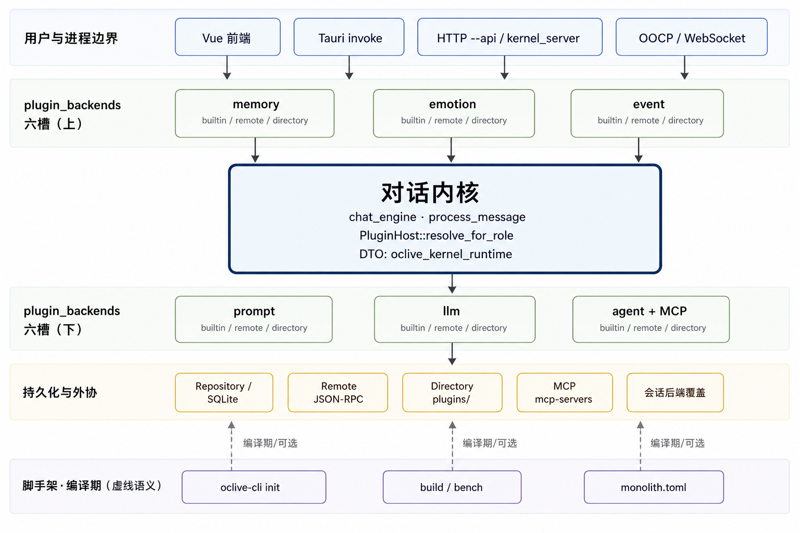
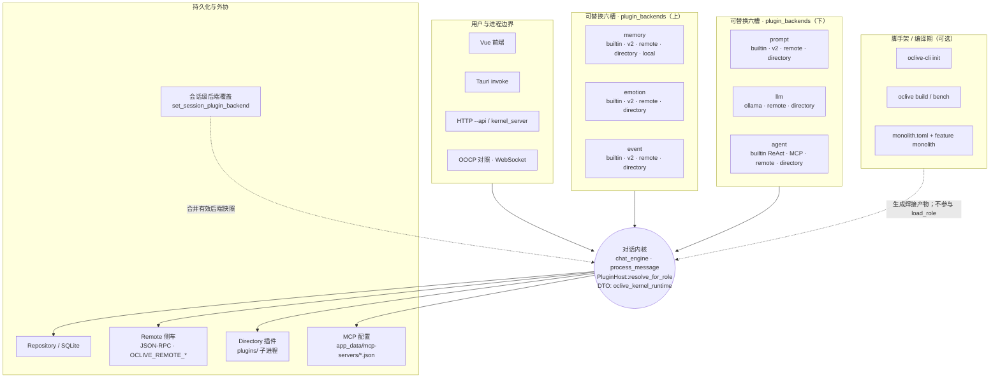
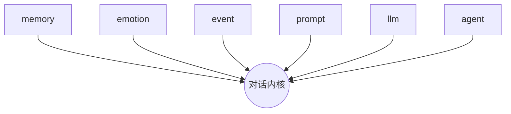

# 以内核为中心的模块架构（总览图）

本文用 **一张「内核居中、模块环绕」的示意图** 对齐当前主仓能力；细节仍以 **[PLUGIN_V1.md](../plugin-and-architecture/PLUGIN_V1.md)**（六槽契约）、**[EXTENSION_POINTS.md](../plugin-and-architecture/EXTENSION_POINTS.md)**（trait 与路径）、**[RFC_OCLIVE_MONOLITH_MODE.md](../rfc/RFC_OCLIVE_MONOLITH_MODE.md)**（编译期 Monolith）为准。

---

## 1. 总览图（Mermaid）

**读图约定**：中间为 **对话内核**（编排 + 解析）；上下两行为 **`plugin_backends` 六宿主槽**（门面 trait）；最上为 **用户与进程边界**；最下为 **持久化与外协实现**；最底为 **脚手架 / 编译期路径**（与角色包运行时正交）。

与下方 Mermaid 同结构的 **静态示意图**（便于打印或放进 PPT）：

---

## 2. 星型简图（仅六槽与内核）

便于和 **PLUGIN_V1** 中的「线性数据流图」对照：下图强调 **六槽均汇入同一内核**，不表示单轮调用时序（时序见 PLUGIN_V1「`send_message` 编排顺序」）。

---

## 3. 图中已标出的「近期更新 / 应对齐」能力

| 能力 | 说明 |
|------|------|
| **第六槽 `agent`** | `plugin_backends.agent`；`BuiltinReActAgent`；MCP 扫描目录见仓库根 `AGENTS.md`。 |
| **MCP** | Agent 路径上工具发现 / 调用；配置在应用数据目录下 `mcp-servers`。 |
| **`memory = local`** | `_local_plugins` 与桥接契约见 [LOCAL_PLUGIN_BRIDGE_SPEC.md](../plugin-and-architecture/LOCAL_PLUGIN_BRIDGE_SPEC.md)。 |
| **会话级后端覆盖** | `set_session_plugin_backend`；`get_role_info` / `load_role` 返回 `plugin_backends_effective*` 快照。 |
| **`oclive-cli` + Monolith** | `init` / `build` / `bench`；`monolith.toml` 仅编译期；与 `settings.json` 正交。 |
| **无头 / CI** | `kernel_server`、`--api`、OOCP 对照套件等与桌面共用 domain 契约。 |

若某能力未出现在你维护的 fork 上，以该分支 **实际代码与迁移** 为准，再回头改本节表格与 Mermaid 标签。

---

## 4. 相关链接

- 六槽数据流（自上而下）：[PLUGIN_V1.md § 架构图与 send_message 顺序](../plugin-and-architecture/PLUGIN_V1.md)
- 创作者向三种扩展方式：[CREATOR_PLUGIN_ARCHITECTURE.md](../plugin-and-architecture/CREATOR_PLUGIN_ARCHITECTURE.md)
- 脚手架与 Monolith：[OCLIVE_CLI_GUIDE.md](../cli/OCLIVE_CLI_GUIDE.md) · [RFC_OCLIVE_MONOLITH_MODE.md](../rfc/RFC_OCLIVE_MONOLITH_MODE.md)
