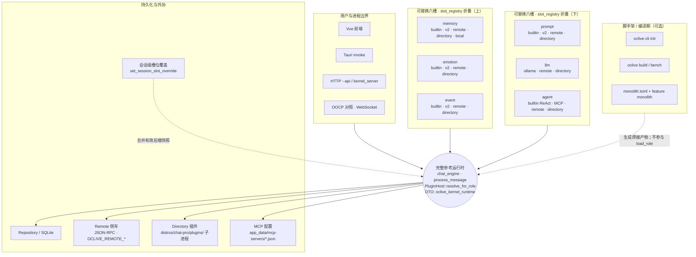
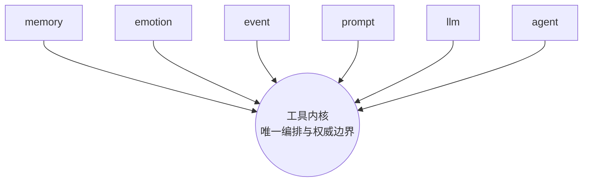

# A.I.Live · 最小工具内核与参考运行时总览图

**A.I.Live — 可插拔的角色动脉织机**（工程代号 **oclive**）。**内核集成方学习路径**：[KERNEL_INTEGRATOR_LEARNING_PATH.md](KERNEL_INTEGRATOR_LEARNING_PATH.md)

**架构叙述与编号**（第 1–6 模块、第 N 设施子模块、后端模块插件模块）：[OCLIVE_ARCHITECTURE_OVERVIEW.md](OCLIVE_ARCHITECTURE_OVERVIEW.md)（[English](../../creator-docs-en/getting-started/OCLIVE_ARCHITECTURE_OVERVIEW.md)）。

本文用两张图分开表达：**最小概念核心**只包含唯一编排/权威边界与六个稳定端口；**当前参考运行时**再装配角色包、插件解析、Event Ring、SQLite、外协实现和宿主入口。角色包以 **`pipeline.ocblueprint`** 为配置中枢（新包 Stable v4，v2 兼容，v3 为冻结双核 Beta）：`slot_registry` 开放多实例，可选 **`groups`** 在架构图归拢同类型实例；`module_relations` 仅运行时派生、禁止落盘。细节仍以 **[PLUGIN_V1.md](../plugin-and-architecture/PLUGIN_V1.md)**（六槽契约）和 **[ROLE_PACK_SPEC.md](../role-pack/ROLE_PACK_SPEC.md)** 为准。

---

## 1. 当前参考运行时总览图（Mermaid）

**读图约定**：这张图展示的是**完整参考运行时拓扑**，不是最小 core 的物理 crate 边界。中间为回合编排与解析；上下两行为六宿主槽门面；最上为用户与进程边界；最下为持久化与外协实现；最底为脚手架 / 编译期路径。**v1（已废弃）** 的 `settings.json` → `plugin_backends` 仅作迁移对照，见 [V1_TO_V2_MIGRATION.md](../role-pack/V1_TO_V2_MIGRATION.md)。

与下方 Mermaid 同结构的 **静态示意图**（便于打印或放进 PPT）：

```mermaid
flowchart TB
  subgraph boundary["用户与进程边界"]
    direction LR
    UI["Vue 前端"]
    TAURI["Tauri invoke"]
    API["HTTP --api / kernel_server"]
    OOCP["OOCP 对照 · WebSocket"]
  end

  subgraph six_top["可替换六槽 · slot_registry 折叠（上）"]
    direction LR
    M["memory<br/>builtin · v2 · remote · directory · local"]
    EM["emotion<br/>builtin · v2 · remote · directory"]
    EV["event<br/>builtin · v2 · remote · directory"]
  end

  K(("完整参考运行时<br/>chat_engine · process_message<br/>PluginHost::resolve_for_role<br/>DTO: oclive_kernel_runtime"))

  subgraph six_bot["可替换六槽 · slot_registry 折叠（下）"]
    direction LR
    PR["prompt<br/>builtin · v2 · remote · directory"]
    LL["llm<br/>ollama · remote · directory"]
    AG["agent<br/>builtin ReAct · MCP · remote · directory"]
  end

  subgraph infra["持久化与外协"]
    direction LR
    REPO["Repository / SQLite"]
    RMT["Remote 侧车<br/>JSON-RPC · OCLIVE_REMOTE_*"]
    DIR["Directory 插件<br/>distros/chat-pro/plugins/ 子进程"]
    MCP["MCP 配置<br/>app_data/mcp-servers/*.json"]
    SESS["会话级槽位覆盖<br/>set_session_slot_override"]
  end

  subgraph toolchain["脚手架 / 编译期（可选）"]
    direction LR
    OCLI["oclive-cli init"]
    BUILD["oclive build / bench"]
    MONO["monolith.toml + feature monolith"]
  end

  boundary --> K
  six_top --> K
  six_bot --> K
  K --> REPO
  K --> RMT
  K --> DIR
  K --> MCP
  SESS -.->|合并有效后端快照| K
  toolchain -.->|生成焊接产物；不参与 load_role| K
```

---

## 2. 最小概念核心（六端口与内核）

下图才是项目本质的最小心智模型：内核掌握生命周期、调用/合并、权威提交、错误和隔离；六槽提供能力。它不表示单轮调用时序，也不表示六槽在当前所有路径上都必须执行（共景健康门槛目前是 `prompt + llm`）。

```mermaid
flowchart TB
  M[memory] --> K((工具内核\n唯一编排与权威边界))
  EM[emotion] --> K
  EV[event] --> K
  PR[prompt] --> K
  LL[llm] --> K
  AG[agent] --> K
```

Event Ring、具体槽位实现、Repository / SQLite、资源协调、HTTP/Tauri 和发行版都在这张最小图之外；它们可以围绕端口与受控 hook 组成完整工具。当前源码尚未把该最小边界独立成一个可单独编译的 crate，见 `K-CORE-BOUNDARY-01`。

---

## 3. 图中已标出的「近期更新 / 应对齐」能力

| 能力 | 说明 |
|------|------|
| **第 6 模块 `agent`** | `slot_registry` 中 `type: agent` 实例；`BuiltinReActAgent`；MCP 见 `AGENTS.md`。 |
| **MCP** | Agent 路径上工具发现 / 调用；配置在应用数据目录下 `mcp-servers`。 |
| **`memory = local`** | `_local_plugins` 与桥接契约见 [LOCAL_PLUGIN_BRIDGE_SPEC.md](../plugin-and-architecture/LOCAL_PLUGIN_BRIDGE_SPEC.md)。 |
| **会话级槽位覆盖** | `set_session_slot_override`；`get_role_info` / `load_role` 返回有效后端快照。 |
| **`oclive-cli` + Monolith** | `init` / `build` / `bench`；`monolith.toml` 仅编译期；与角色包蓝图正交。 |
| **无头 / CI** | `kernel_server`、`--api`、OOCP 对照套件等与桌面共用 domain 契约。 |

若某能力未出现在你维护的 fork 上，以该分支 **实际代码与迁移** 为准，再回头改本节表格与 Mermaid 标签。

---

## 4. 相关链接

- 六槽数据流（自上而下）：[PLUGIN_V1.md § 架构图与 send_message 顺序](../plugin-and-architecture/PLUGIN_V1.md)
- **纯净内核边界与嵌入式范围**：[PURE_KERNEL_BOUNDARY.md](PURE_KERNEL_BOUNDARY.md)
- 创作者向三种扩展方式：[CREATOR_PLUGIN_ARCHITECTURE.md](../plugin-and-architecture/CREATOR_PLUGIN_ARCHITECTURE.md)
- 脚手架与 Monolith：[OCLIVE_CLI_GUIDE.md](../cli/OCLIVE_CLI_GUIDE.md) · [RFC_OCLIVE_MONOLITH_MODE.md](../rfc/RFC_OCLIVE_MONOLITH_MODE.md)

---

[English](../../creator-docs-en/getting-started/KERNEL_AND_MODULES_ARCHITECTURE.md)
