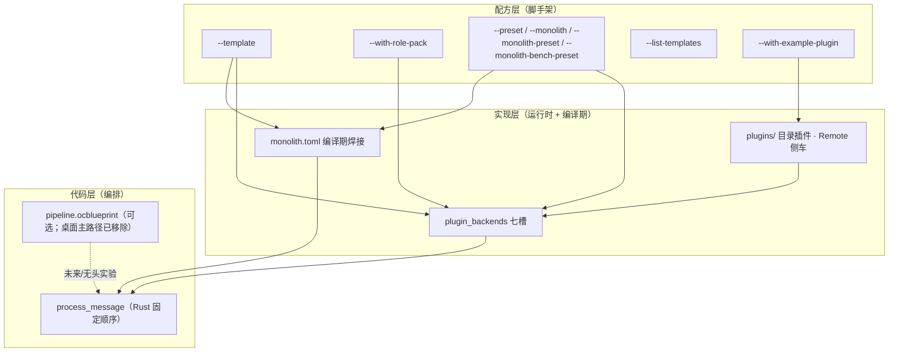

# 内核工厂（Kernel Factory）愿景

**oclive-cli** 的 `init` 子命令是「内核工厂」的**配方层入口**：用套餐（`--template`）与可选示例角色包（`--with-role-pack`）生成**可独立构建**的定制内核工程，再叠加 **Monolith**（实现层性能档）与主仓 **process_message**（代码层编排）。

[English](../../creator-docs-en/getting-started/KERNEL_FACTORY_VISION.md)

---

## 三层架构



| 层 | 谁用 | 工具 / 产物 | 改什么 |
|----|------|-------------|--------|
| **配方层** | 平台 / 硬件开发者 | `oclive init --template …` | 工程类型、预设七槽、是否 Monolith、是否带示例 `roles/` |
| **实现层** | 集成方 + 创作者 | `settings.json`、`monolith.toml`、`plugins/` | 各槽 **builtin / remote / directory / ollama**；编译期焊哪些槽 |
| **代码层** | 内核维护者 | `src-tauri` / `oclive_kernel_runtime` 的 `chat_engine` | **一轮对话的原子步骤顺序**（记忆→情绪→事件→Prompt→LLM→…） |

---

## 5 分钟从零到对话（纯内核脚手架）

在 **oclivenewnew** 仓库根、已安装 Rust 的前提下（可先 `cargo build -p oclive-cli`）：

```bash
# 1. 检查环境（Rust / 磁盘 / Ollama / 网络等）
cargo run -p oclive-cli -- doctor

# 2. 极速创建纯对话内核（full 预设，无 Monolith，无示例 roles/）
cargo run -p oclive-cli -- init --quick --non-interactive -o ./my-chat --project-name my-chat

# 3. 进入项目
cd my-chat

# 4. 编译运行（占位 HTTP 入口；接真内核请 init 时加 --kernel-source <本仓根>）
cargo build --release
cargo run --release
```

另开终端测试（默认端口 **8420**；占位 main 可能仅演示，**接 `--kernel-source` 后**才与主应用 HTTP 一致）：

```bash
curl -X POST http://127.0.0.1:8420/chat \
  -H "Content-Type: application/json" \
  -d "{\"message\": \"你好，请介绍一下你自己\"}"
```

**预期**：`doctor` 至少 Rust/Cargo/磁盘为 ✅；Ollama 未启动时为 ❌（纯 remote LLM 可忽略）。`init --quick` 生成 `Cargo.toml` 且无 `monolith.toml`。HTTP 回复需本机 LLM 或 `--kernel-source` + `OCLIVE_HTTP_API_MOCK_LLM=1` 联调。

---

## 工厂工作流（推荐）

1. **浏览配方**：`oclive init --list-templates` 或交互式「选择场景模板」；再 `oclive init --template robot-soul -o ./my-doll`（玩偶）、`robot-gateway`（网关 + MCP 骨架）、`dialogue-only`、`headless-api`、`library-embed`。
2. **覆盖细节**（可选）：显式 `--preset` / `--monolith` / `--monolith-preset` / `--with-role-pack` / `--with-example-plugin` **优先于**模板默认值。
3. **接真内核**：`--kernel-source` 写入 path 依赖；在生成工程内 `cargo build` / `cargo run -- --api`。
4. **换灵魂**：编辑 `roles/<id>/` 或 `oclive pack create`；`oclive dev` 监听 manifest/settings。
5. **换实现**：改 `plugin_backends`、安装 `plugins/<id>/`、或起 Remote 侧车（见 [PLUGIN_AUTHOR_LEARNING_PATH.md](../plugin-and-architecture/PLUGIN_AUTHOR_LEARNING_PATH.md)）。
6. **要性能**：`robot-soul` 模板默认启用 Monolith；改 `monolith.toml` 后 `oclive build`。

---

## 与蓝图（`pipeline.ocblueprint`）的关系

- **蓝图**：历史上用于描述**运行时**「原子步骤」的编排（DSL）；与 **Monolith 焊接范围正交**，焊接只写在 **`monolith.toml`**（见 [RFC_OCLIVE_MONOLITH_MODE.md](../rfc/RFC_OCLIVE_MONOLITH_MODE.md)）。
- **桌面主应用**：入口蓝图**已从主路径移除**；主编排以 **`process_message`** 为准（见 [AGENTS.md](../../AGENTS.md)）。
- **工厂定位（蓝图校验）**：`oclive blueprint validate <path>` 读取并校验 `pipeline.ocblueprint` JSON（步骤 `id`/`type`、`next` 引用、已知类型枚举）。**不**改变桌面宿主固定 `process_message` 路径；为纯内核「蓝图 → 定制内核」预备工具链。生成工程含 **`docs/BLUEPRINT_REFERENCE.md`**。
- **开发者定制编排**：短期 = 阅读 **`docs/ORCHESTRATION_REFERENCE.md`**（中英）+ 改 `monolith.toml` / fork `process_message`；中期 = 受控蓝图解释器（runtime 侧，非本次 `init` 范围）。

---

## 与 Monolith 的关系

Monolith 是工厂里的 **「性能档位」**：

| 模板 | Monolith 默认 | 说明 |
|------|---------------|------|
| `robot-soul` | **启用** | 七槽可焊，适合玩偶/低延迟设备 |
| `robot-gateway` | **启用** | 网关类设备默认全焊 + mixed 预设 |
| `headless-api` / `dialogue-only` | 关闭 | 可用 `--monolith` 手动开启 |
| `library-embed` | 关闭 | `library` 类型不生成 `monolith.toml` |

**`--monolith-preset`**（仅 Monolith 启用时写入 `weld_modules`）：`latency`（七槽）| `memory`（memory+prompt+llm）| `embedded`（emotion+memory+llm）。可事后手改 `monolith.toml`。

---

## 可视化配方

- **`--list-templates`**：打印五套模板矩阵（场景、preset、Monolith、角色包）后退出，不生成目录。
- **交互式 `oclive init`**：在「项目类型」之前增加「选择场景模板」；默认第一项为**不使用模板、手动配置**；选中模板后自动填充 preset / Monolith / 角色包，并提示可用 CLI 显式覆盖。

---

## Monolith 焊接对比

- **`oclive bench --release`**：`bench_results/report.json`（schema **v2**）除 **p50/P95 延迟**外，含 **`binary_size`**（字节）、**`peak_memory`**（MiB 峰值）、**`build_time`**（秒，分别计时标准 / Monolith 两次 release 构建）。
- **`--monolith-bench-preset`**：init 完成后自动 bench 5 轮；失败不阻塞生成。
- **报告模板**：**`docs/WELD_BENCH_REPORT.md`**（中英）含多维度表格说明。

## 环境诊断

**`oclive doctor`** / **`oclive doctor --json`**：检查 Rust 工具链、Cargo、系统内存、磁盘、Ollama（`GET /api/tags`）、GitHub 连通、工作区可写。init 完成后提示可运行。

## 极速模式

**`oclive init --quick`** / **`-q`**：`preset=full`、无 Monolith、无 `roles/`、不接 `--kernel-source`。交互仅问**项目名**与**输出目录**；CLI 已传 `--preset` / `--monolith` / `--template` 等时，交互流程**不再重复询问**对应项。

---

## robot-gateway 与 MCP

`--template robot-gateway` 额外生成：

- **`mcp_servers/`**：`README.md` + `smart_home.example.json`（HTTP 侧车示例）。
- **`roles/gateway/settings.json`**：`plugin_backends.agent` = **builtin**，含 **`agent_mcp`** 占位（扫描目录与 server id）。

厂商将 MCP manifest 同步到宿主 `{app_data}/mcp-servers/` 后即可接智能家居工具链（见 PLUGIN_V1 / AGENTS.md）。

---

## 模板一览

| `--template` | 场景 | 默认 preset | 默认 Monolith | project-type | 默认角色包 |
|--------------|------|-------------|---------------|--------------|------------|
| `robot-soul` | 智能玩偶 / 嵌入式 | minimal | 启用 | kernel_server | `robot-soul-minimal` |
| `robot-gateway` | 智能网关 / 家庭中枢 | mixed | 启用 | kernel_server | `gateway` 骨架 + `mcp_servers/` |
| `dialogue-only` | 纯对话服务 | full | 关闭 | kernel_server | `default` |
| `headless-api` | 纯 HTTP API | full | 关闭 | kernel_server | 无 |
| `library-embed` | 库嵌入 | minimal | 关闭 | library | 无 |

`--with-role-pack`：`robot-soul-minimal` | `default`；`--skip-role-pack` 强制空 `roles/`。

---

## 编排参考（生成工程）

`oclive init` 在 **`docs/ORCHESTRATION_REFERENCE.md`**（及 `.en.md`）说明与 `process_message` 对齐的六段主流程、可互换步骤（如 `analyze_emotion` / `detect_event`）、硬约束（`build_prompt` 必须在 `call_llm` 之前），以及如何通过 `monolith.toml` 跳过槽位。**桌面宿主不走可变顺序**，文档仅供纯内核开发者。

---

## 示例插件

`--with-example-plugin`（默认关闭）将主仓 **`examples/directory-plugin-llamacpp/`** 复制到生成项目的 **`plugins/com.oclive.example.llamacpp_llm/`**，便于第一次编写目录插件。见生成工程 **`plugins/README.md`**。

---

## 相关文档

- [OCLIVE_CLI_GUIDE.md](../cli/OCLIVE_CLI_GUIDE.md) — 命令与参数
- [KERNEL_PLATFORM_DEVELOPER_PATH.md](KERNEL_PLATFORM_DEVELOPER_PATH.md) — 单线交付
- [KERNEL_IMPLEMENTATION_PLAN.md](KERNEL_IMPLEMENTATION_PLAN.md) — K0–K5 与工厂延伸
- [PLUGIN_V1.md](../plugin-and-architecture/PLUGIN_V1.md) — 七槽契约
