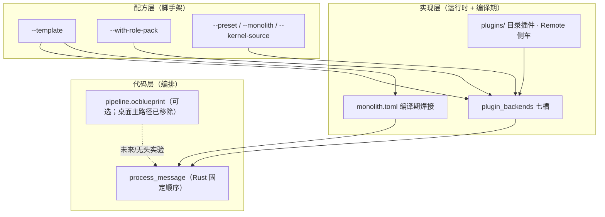

# 内核工厂（Kernel Factory）愿景

**oclive-cli** 的 `init` 子命令是「内核工厂」的**配方层入口**：用套餐（`--template`）与可选示例角色包（`--with-role-pack`）生成**可独立构建**的定制内核工程，再叠加 **Monolith**（实现层性能档）与主仓 **process_message**（代码层编排）。

[English](../../creator-docs-en/getting-started/KERNEL_FACTORY_VISION.md)

---

## 三层架构

| 层 | 谁用 | 工具 / 产物 | 改什么 |
|----|------|-------------|--------|
| **配方层** | 平台 / 硬件开发者 | `oclive init --template …` | 工程类型、预设七槽、是否 Monolith、是否带示例 `roles/` |
| **实现层** | 集成方 + 创作者 | `settings.json`、`monolith.toml`、`plugins/` | 各槽 **builtin / remote / directory / ollama**；编译期焊哪些槽 |
| **代码层** | 内核维护者 | `src-tauri` / `oclive_kernel_runtime` 的 `chat_engine` | **一轮对话的原子步骤顺序**（记忆→情绪→事件→Prompt→LLM→…） |

---

## 工厂工作流（推荐）

1. **选配方**：`oclive init --template robot-soul -o ./my-doll --kernel-source <oclivenewnew根>`（玩偶/嵌入式）；或 `headless-api`（纯 API）；或 `library-embed`（嵌入其它 Rust 进程）。
2. **覆盖细节**（可选）：显式 `--preset` / `--monolith` / `--with-role-pack` **优先于**模板默认值。
3. **接真内核**：`--kernel-source` 写入 path 依赖；在生成工程内 `cargo build` / `cargo run -- --api`。
4. **换灵魂**：编辑 `roles/<id>/` 或 `oclive pack create`；`oclive dev` 监听 manifest/settings。
5. **换实现**：改 `plugin_backends`、安装 `plugins/<id>/`、或起 Remote 侧车（见 [PLUGIN_AUTHOR_LEARNING_PATH.md](../plugin-and-architecture/PLUGIN_AUTHOR_LEARNING_PATH.md)）。
6. **要性能**：`robot-soul` 模板默认启用 Monolith；改 `monolith.toml` 后 `oclive build`。

---

## 与蓝图（`pipeline.ocblueprint`）的关系

- **蓝图**：历史上用于描述**运行时**「原子步骤」的编排（DSL）；与 **Monolith 焊接范围正交**，焊接只写在 **`monolith.toml`**（见 [RFC_OCLIVE_MONOLITH_MODE.md](../rfc/RFC_OCLIVE_MONOLITH_MODE.md)）。
- **桌面主应用**：入口蓝图**已从主路径移除**；主编排以 **`process_message`** 为准（见 [AGENTS.md](../../AGENTS.md)）。
- **工厂定位**：脚手架**预留**角色包内可选 `pipeline.ocblueprint` 文件形态；**当前不生成、不解析**蓝图。无头/定制内核若未来启用蓝图，应在 **runtime** 侧读取，并另开 RFC 与 `PIPELINE_SCHEMA` 同步。
- **开发者定制编排**：短期 = fork/扩展 `process_message` 或 Monolith 焊接；中期 = 受控蓝图解释器（非本次 `init` 范围）。

---

## 与 Monolith 的关系

Monolith 是工厂里的 **「性能档位」**：

| 模板 | Monolith 默认 | 说明 |
|------|---------------|------|
| `robot-soul` | **启用** | 七槽可焊，适合玩偶/低延迟设备 |
| `headless-api` | 关闭 | 可用 `--monolith` 手动开启 |
| `library-embed` | 关闭 | `library` 类型不生成 `monolith.toml` |

---

## 模板一览

| `--template` | 场景 | 默认 preset | 默认 Monolith | project-type | 默认角色包 |
|--------------|------|-------------|---------------|--------------|------------|
| `robot-soul` | 智能玩偶 / 嵌入式 | minimal | 启用 | kernel_server | `robot-soul-minimal` |
| `headless-api` | 纯 HTTP API | full | 关闭 | kernel_server | 无 |
| `library-embed` | 库嵌入 | minimal | 关闭 | library | 无 |

`--with-role-pack`：`robot-soul-minimal` | `default`；`--skip-role-pack` 强制空 `roles/`。

---

## 相关文档

- [OCLIVE_CLI_GUIDE.md](../cli/OCLIVE_CLI_GUIDE.md) — 命令与参数
- [KERNEL_PLATFORM_DEVELOPER_PATH.md](KERNEL_PLATFORM_DEVELOPER_PATH.md) — 单线交付
- [KERNEL_IMPLEMENTATION_PLAN.md](KERNEL_IMPLEMENTATION_PLAN.md) — K0–K5 与工厂延伸
- [PLUGIN_V1.md](../plugin-and-architecture/PLUGIN_V1.md) — 七槽契约
