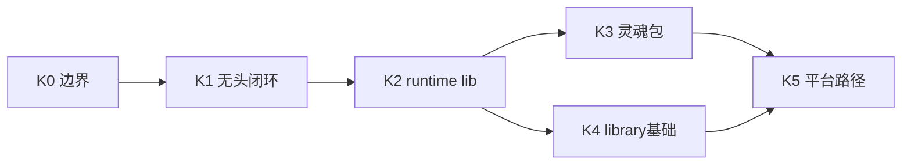

# 纯净内核 / 平台目标 — 实施计划（内核优先）

**当前状态（2026-08-02）**：本文保留 K0–K5 的实施留痕；K0–K3、K5 与 K4 的 library 契约基础已完成，**完整进程内编排对称仍未完成**。当前状态与后续排期只以 [TECHNICAL_DEBT_INVENTORY.md](../../handoff/TECHNICAL_DEBT_INVENTORY.md) 的 **V-EMBED-01** / **V-PORTABLE-01** 为准，不再由本计划重复维护。

**权威契约**：[KERNEL_AND_MODULES_ARCHITECTURE.md](KERNEL_AND_MODULES_ARCHITECTURE.md) · [PURE_KERNEL_BOUNDARY.md](PURE_KERNEL_BOUNDARY.md) · [PLUGIN_V1.md](../plugin-and-architecture/PLUGIN_V1.md)

[English](../../creator-docs-en/getting-started/KERNEL_IMPLEMENTATION_PLAN.md)

---

## 北极星目标（要真正达成什么）

| 目标 | 可验收表述 |
|------|------------|
| **机器人自定义灵魂** | 仅更换角色包 + `settings.plugin_backends`（在 `min_runtime_version` 内）即可改变陪伴人格与后端策略，**无需改编排代码** |
| **情感陪伴协作** | 单轮 `process_message` 内 memory / emotion / event / prompt / llm / agent 按契约顺序执行；可替换槽实现 |
| **嵌入式与无头** | 硬件方可在 **无 Vue** 条件下联调、部署；`--api` / `kernel_server` 已具备完整宿主编排，`library` 当前只具备 runtime/DTO 契约基础，完整进程内编排见 V-EMBED-01 |
| **AI 软硬件平台基座** | 第三方按 **单线文档** 完成：脚手架 → 角色包 → 插件/侧车 → 校验 → 部署 |

---

## 阶段总览



| 阶段 | 目标 | 主要产出 | 清单 |
|------|------|----------|------|
| **K0** | 边界定稿 | `PURE_KERNEL_BOUNDARY.md`、本计划 | B1、B3 |
| **K1** | 无头可联调 | `examples/headless-kernel-minimal/`、`--api` | B3 过渡 |
| **K2** | 真内核接榫 | `oclive_kernel_runtime` + `oclive_kernel_host` + `oclive-cli --kernel-source` | B3 |
| **K3** | 灵魂交付单元 | RobotSoulPack profile + 示例包 | B1 |
| **K4** | 嵌入式基础 | `library` 契约策略 + 示例；完整编排仍 Partial | B3 |
| **K5** | 平台一条路径 | `KERNEL_PLATFORM_DEVELOPER_PATH.md` | B4、B5 |

---

## K0 — 边界与叙事 ✅

- [x] [PURE_KERNEL_BOUNDARY.md](PURE_KERNEL_BOUNDARY.md)
- [x] 文档索引与 handoff 互链

---

## K1 — 无头联调闭环 ✅

**现状**：`oclivenewnew-tauri --api`（默认端口 **8420**）、`http_api`、OOCP 套件已存在；无头最小闭环见 [examples/headless-kernel-minimal/README.md](../../examples/headless-kernel-minimal/README.md)。**量产/集成形态**：过渡期与 CI 仍以 **`--api`** 为主；独立进程见 **`oclive-kernel-server`**（K2）；进程内嵌见 **`library` + oclive_kernel_runtime**（K4），单线见 [KERNEL_PLATFORM_DEVELOPER_PATH.md](KERNEL_PLATFORM_DEVELOPER_PATH.md)。`oclive-cli init` **未带** `--kernel-source` 时仍为 **serde 占位骨架**；**带 `--kernel-source`** 则写入 path 依赖并指向真实工作区。

**完成标准**

- [x] [examples/headless-kernel-minimal/README.md](../../examples/headless-kernel-minimal/README.md) 中英步骤可复现
- [x] CI `oocp-test-suite` job 保持绿灯（与 K1 等价验收；见 `.github/workflows/ci.yml` 与 [AGENTS.md](../../AGENTS.md)）
- [x] 文档写明：`--api` / **`oclive-kernel-server`** / **`library` 嵌入** 的分工（[PURE_KERNEL_BOUNDARY.md](PURE_KERNEL_BOUNDARY.md) §5、[KERNEL_PLATFORM_DEVELOPER_PATH.md](KERNEL_PLATFORM_DEVELOPER_PATH.md)）

**验收命令**

```bash
cargo build -p oclivenewnew-tauri
# PowerShell
$env:OCLIVE_HTTP_API_MOCK_LLM = "1"
cargo run -p oclivenewnew-tauri -- --api
curl http://127.0.0.1:8420/health
cd examples/oocp-test-suite && node run.mjs
```

---

## K2 — 脚手架 → 真内核（核心工程）✅

**目标**：工作区提供可 `path` 依赖的 **`oclive_kernel_runtime`**（DTO / 纯解析基础）与 **`oclive_kernel_host`**（`process_message`、持久化及宿主服务）；桌面 Tauri 与无头 `oclive_kernel_server` 共用 `oclive_kernel_host` 的完整编排。

### K2.1  crate 拆分（建议顺序）

| 步骤 | 内容 | 验收 |
|------|------|------|
| 2.1.1 | 新建 `kernel/crates/oclive_kernel_runtime`，暴露 DTO、API 常量与可复用纯解析基础 | `cargo test -p oclive_kernel_runtime` |
| 2.1.2 | 将完整 domain 编排、Repository 与宿主服务迁入 `kernel/crates/oclive_kernel_host` | `process_message` 只在 host 维护一份 |
| 2.1.3 | 新建 `kernel/crates/oclive_kernel_server`（bin）：`main` 启动 HTTP，复用 host + runtime | `cargo run -p oclive_kernel_server -- --api` |
| 2.1.4 | `distros/desktop-tauri` 依赖 host + runtime；Tauri 命令保持薄适配 | 现有 `http_api` / invoke 测试仍绿 |

**收口说明（2026-05-15）**：上表 2.1.1–2.1.4 已在工作区落地；本地已执行 `cargo build -p oclivenewnew-tauri`、`cargo test -p oclive_kernel_runtime`、`cargo test -p oclive-cli` 均通过。持续回归以 CI `oocp-test-suite` 与上述单测为准。

### K2.2 `oclive-cli` 接榫

- [x] `init --kernel-source <path-to-oclivenewnew>` 写入 `Cargo.toml` path 依赖与示例 `main.rs`
- [x] 生成 README 区分：**占位 init** vs **已接 runtime** 两种模式
- [x] `bench` / `build` 对真实 runtime 工程可跑（Monolith 仍仅 `kernel_server`）
- [x] **内核工厂（配方层）**：`init --template`（`robot-soul` / `headless-api` / `library-embed`）、`--with-role-pack`、`distros/chat-pro/plugins/README.md` — 见 [KERNEL_FACTORY_VISION.md](KERNEL_FACTORY_VISION.md)

### K2.3 不做的（控制范围）

- 不一次性搬空整个桌面宿主
- 不在 K2 改 `process_message` 业务语义

---

## K3 — RobotSoulPack（灵魂交付单元）

**完成标准**

- [x] 在 [ROLE_PACK_SPEC.md](../role-pack/ROLE_PACK_SPEC.md) 增加 **RobotSoulPack**（`--profile robot-soul`）
- [x] 最小字段集（草案）：
  - `manifest.json`：`id`、`name`、`version`、`min_runtime_version`
  - `settings.json`：`plugin_backends`（六槽显式 + 可选扩展键）、`interaction_mode`、`remote_presence`（可选）
  - `core_personality.txt` 或 `default_personality` 七维（二选一）
- [x] `oclive-cli pack validate --profile robot-soul`
- [x] `examples/robot-soul-minimal/distros/chat-pro/roles/default/` 示例目录

---

## K4 — `kernel_server` vs `library`（基础完成，Full Partial）

| 形态 | Monolith | 推荐用法 |
|------|----------|----------|
| `kernel_server` | ✅ | 网关、独立进程、机器人中控 |
| `library` | ❌ | 进程内嵌基础；链接 `oclive_kernel_runtime`，自有 `main`，当前不含完整 `process_message` |

- [x] [PURE_KERNEL_BOUNDARY.md](PURE_KERNEL_BOUNDARY.md) §5 与实现一致
- [x] `oclive-cli init --project-type library --kernel-source` 示例调用 `oclive_kernel_runtime` API（`lib.rs` 模板含 `runtime_api_version` / 可选 `resolve_api_port` 演示）
- [x] 与 **oclive doll core** README 互链
- [ ] 将 `process_message`、持久化与 `PluginHost` 以宿主无关 library API 对称暴露；继续归 **V-EMBED-01 Full**，不得因已有模板而宣称完成

---

## K5 — 平台开发者一条路径

- [x] 撰写 [KERNEL_PLATFORM_DEVELOPER_PATH.md](KERNEL_PLATFORM_DEVELOPER_PATH.md)（中英）
- [x] 撰写 [KERNEL_FACTORY_VISION.md](KERNEL_FACTORY_VISION.md)（中英）：配方 / 实现 / 代码三层与蓝图、Monolith 边界
- [x] 单线：`oclive-cli init`（可选 **`--template`**）→ 角色包 → 目录插件/侧车 → validate → `--api` 或 server bin → 部署
- [x] 默认 LLM 仿真：`examples/remote_plugin_openai_compat`
- [ ] OTA / 远程日志：**P2**，不阻塞 K1–K4

---

## 与产品级关系

| 内核阶段 | 解锁 |
|----------|------|
| K0 | 对外叙事一致 |
| K1 | 无 UI 联调 |
| K2–K4 | 独立进程可 ship；library 已有契约骨架，完整编排仍待 V-EMBED-01 Full |
| K5 | 第三方按单线接入 |

**产品级 P0** 建议在 **K1 绿灯 + K2 收口**（已达成）后，按 [PRODUCT_LINE_TASK_BUCKETS.md](../../handoff/PRODUCT_LINE_TASK_BUCKETS.md) 的硬骨头顺序集中收口。

---

## 验收留痕（本地 / 2026-05-15）

| 命令 | 结果 |
|------|------|
| `cargo build -p oclivenewnew-tauri` | 通过 |
| `cargo test -p oclive_kernel_runtime` | 通过 |
| `cargo test -p oclive-cli` | 通过（含 e2e，约 40s+） |

**CI**：`oocp-test-suite` job（Ubuntu）与 [AGENTS.md](../../AGENTS.md) 描述一致，作为 K1 持续验收。

---

## 近期动作（建议顺序）

1. ~~本地跑通 K1 验收命令~~（已留痕；日常保持 CI 绿）  
2. ~~K2.1 crate 拆分 / K2.2 CLI 接榫~~（已完成）  
3. ~~K3 RobotSoulPack~~（已完成）  
4. K4 的基础文档与 doll core 互链已完成；完整 library 编排继续按 **V-EMBED-01 Full** 验收
5. **P2**：OTA / 远程日志（不阻塞内核里程碑）
