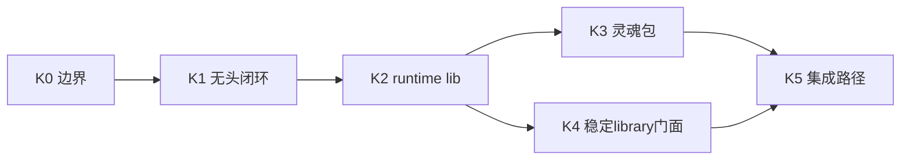

# 可嵌入参考运行时 — 实施留痕（最小内核边界优先）

**当前状态（2026-09-03）**：本文保留 K0–K5 的完整参考运行时实施留痕；K0–K5 的代码路径已收口，K4 已通过 **`OcliveKernel`** 对称暴露完整进程内编排。这不表示最小工具内核已经物理抽成独立 crate；该边界只看 `K-CORE-BOUNDARY-01`。**V-EMBED-01 仍为 Partial**：尚缺 Linux/ARM 或真实硬件靶、资源预算与长时 soak；当前状态与后续排期只以 [TECHNICAL_DEBT_INVENTORY.md](../../handoff/TECHNICAL_DEBT_INVENTORY.md) 为准。

**权威契约**：[KERNEL_AND_MODULES_ARCHITECTURE.md](KERNEL_AND_MODULES_ARCHITECTURE.md) · [PURE_KERNEL_BOUNDARY.md](PURE_KERNEL_BOUNDARY.md) · [PLUGIN_V1.md](../plugin-and-architecture/PLUGIN_V1.md)

[English](../../creator-docs-en/getting-started/KERNEL_IMPLEMENTATION_PLAN.md)

---

## 北极星目标（要真正达成什么）

| 目标 | 可验收表述 |
|------|------------|
| **机器人自定义灵魂** | 仅更换角色包 + `pipeline.ocblueprint.slot_registry`（在运行时版本契约内）即可改变陪伴人格与后端策略，**无需改编排代码**；legacy 双文件只用于兼容 |
| **情感陪伴协作** | 单轮 `process_message` 守住调用、合并、提交、错误与隔离边界；仅执行本路径适用的槽实现。当前共景健康门槛是 `prompt + llm`，其余槽可按契约 Noop |
| **嵌入式与无头** | 硬件方可在 **无 Vue** 条件下联调、部署；`--api` / `kernel_server` 与 `library` 的 **`OcliveKernel`** 共用完整宿主编排；真实硬件证明见 V-EMBED-01 |
| **AI 软硬件集成工具** | 第三方按 **单线文档** 完成：脚手架 → 角色包 → 插件/侧车 → 校验 → 部署；无需接受某一种集中式平台形态 |

---

## 阶段总览


```mermaid
flowchart LR
  K0[K0 边界] --> K1[K1 无头闭环]
  K1 --> K2[K2 runtime lib]
  K2 --> K3[K3 灵魂包]
  K2 --> K4[K4 稳定library门面]
  K3 --> K5[K5 集成路径]
  K4 --> K5
```

| 阶段 | 目标 | 主要产出 | 清单 |
|------|------|----------|------|
| **K0** | 职责边界定稿 | `PURE_KERNEL_BOUNDARY.md`、本计划 | B1、B3 |
| **K1** | 无头可联调 | `examples/headless-kernel-minimal/`、`--api` | B3 过渡 |
| **K2** | 完整参考运行时接榫 | `oclive_kernel_runtime` + `oclive_kernel_host` + `oclive-cli --kernel-source` | B3 |
| **K3** | 灵魂交付单元 | RobotSoulPack profile + 示例包 | B1 |
| **K4** | 嵌入式门面 | `OcliveKernel` + 完整 library 生成/编译示例 | B3 |
| **K5** | 集成者一条路径 | `KERNEL_PLATFORM_DEVELOPER_PATH.md` | B4、B5 |

---

## K0 — 边界与叙事 ✅

- [x] [PURE_KERNEL_BOUNDARY.md](PURE_KERNEL_BOUNDARY.md)
- [x] 文档索引与 handoff 互链

---

## K1 — 无头联调闭环 ✅

**现状**：`oclivenewnew-tauri --api`（默认端口 **8420**）、`http_api`、OOCP 套件已存在；无头最小闭环见 [examples/headless-kernel-minimal/README.md](../../examples/headless-kernel-minimal/README.md)。**量产/集成形态**：过渡期与 CI 仍以 **`--api`** 为主；独立进程见 **`oclive-kernel-server`**（K2）；进程内嵌见 **`library` + `oclive_kernel_host::OcliveKernel`**（K4），单线见 [KERNEL_PLATFORM_DEVELOPER_PATH.md](KERNEL_PLATFORM_DEVELOPER_PATH.md)。`oclive-cli init` **未带** `--kernel-source` 时仍为 **serde 占位骨架**；**带 `--kernel-source`** 则写入完整 host/contracts/runtime/types path 依赖。

**完成标准**

- [x] [examples/headless-kernel-minimal/README.md](../../examples/headless-kernel-minimal/README.md) 中英步骤可复现
- [x] CI `oocp-test-suite` job 保持绿灯（与 K1 等价验收；见 `.github/workflows/ci.yml` 与 [AGENTS.md](../../AGENTS.md)）
- [x] 文档写明：`--api` / **`oclive-kernel-server`** / **`library` 嵌入** 的分工（[PURE_KERNEL_BOUNDARY.md](PURE_KERNEL_BOUNDARY.md) §5、[KERNEL_PLATFORM_DEVELOPER_PATH.md](KERNEL_PLATFORM_DEVELOPER_PATH.md)）

**验收命令**

```bash
cargo build -p oclivenewnew-tauri
# PowerShell
$env:OCLIVE_HTTP_API_MOCK_LLM = "1"
cargo run -p oclivenewnew-tauri -- --api
curl http://127.0.0.1:8420/health
cd examples/oocp-test-suite && node run.mjs
```

---

## K2 — 脚手架 → 完整参考运行时（核心工程）✅

**目标**：工作区提供可 `path` 依赖的 **`oclive_kernel_runtime`**（DTO / 纯解析基础）与 **`oclive_kernel_host`**（`process_message`、持久化及宿主服务）；桌面 Tauri 与无头 `oclive_kernel_server` 共用 `oclive_kernel_host` 的完整编排。

### K2.1  crate 拆分（建议顺序）

| 步骤 | 内容 | 验收 |
|------|------|------|
| 2.1.1 | 新建 `kernel/crates/oclive_kernel_runtime`，暴露 DTO、API 常量与可复用纯解析基础 | `cargo test -p oclive_kernel_runtime` |
| 2.1.2 | 将完整 domain 编排、Repository 与宿主服务迁入 `kernel/crates/oclive_kernel_host` | `process_message` 只在 host 维护一份 |
| 2.1.3 | 新建 `kernel/crates/oclive_kernel_server`（bin）：`main` 启动 HTTP，复用 host + runtime | `cargo run -p oclive_kernel_server -- --api` |
| 2.1.4 | `distros/desktop-tauri` 依赖 host + runtime；Tauri 命令保持薄适配 | 现有 `http_api` / invoke 测试仍绿 |

**收口说明（2026-05-15）**：上表 2.1.1–2.1.4 已在工作区落地；本地已执行 `cargo build -p oclivenewnew-tauri`、`cargo test -p oclive_kernel_runtime`、`cargo test -p oclive-cli` 均通过。持续回归以 CI `oocp-test-suite` 与上述单测为准。

### K2.2 `oclive-cli` 接榫

- [x] `init --kernel-source <path-to-oclivenewnew>` 写入 `Cargo.toml` path 依赖与示例 `main.rs`
- [x] 生成 README 区分：**占位 init** vs **已接完整内核** 两种模式
- [x] `bench` / `build` 对真实 runtime 工程可跑（Monolith 仍仅 `kernel_server`）
- [x] **内核工厂（配方层）**：`init --template`（`robot-soul` / `headless-api` / `library-embed`）、`--with-role-pack`、`distros/chat-pro/plugins/README.md` — 见 [KERNEL_FACTORY_VISION.md](KERNEL_FACTORY_VISION.md)

### K2.3 不做的（控制范围）

- 不一次性搬空整个桌面宿主
- 不在 K2 改 `process_message` 业务语义

---

## K3 — RobotSoulPack（灵魂交付单元）

**完成标准**

- [x] 在 [ROLE_PACK_SPEC.md](../role-pack/ROLE_PACK_SPEC.md) 增加 **RobotSoulPack**（`--profile robot-soul`）
- [x] 当时验收的 legacy 最小字段集（历史草案；当前参考宿主蓝图格式族的 Stable 形状见 ROLE_PACK_SPEC 的 v4；两者都不是新定义的内核最小角色 contract）：
  - `manifest.json`：`id`、`name`、`version`、`min_runtime_version`
  - `settings.json`：`plugin_backends`（六槽显式 + 可选扩展键）、`interaction_mode`、`remote_presence`（可选）
  - `core_personality.txt` 或 `default_personality` 七维（二选一）
- [x] `oclive-cli pack validate --profile robot-soul`
- [x] `examples/robot-soul-minimal/roles/default/` 示例目录

---

## K4 — `kernel_server` vs `library`（进程内接口完成，靶机证明 Partial）

| 形态 | Monolith | 推荐用法 |
|------|----------|----------|
| `kernel_server` | ✅ | 网关、独立进程、机器人中控 |
| `library` | ❌ | 自有 `main` 的进程内嵌；通过 `OcliveKernel` 使用角色、完整/流式回合、持久化、插件、Event Ring 与显式关闭 |

- [x] [PURE_KERNEL_BOUNDARY.md](PURE_KERNEL_BOUNDARY.md) §5 与实现一致
- [x] `oclive-cli init --project-type library --kernel-source` 直接重导出 `OcliveKernel` 与四个内核 crate；真实生成工程独立 `cargo check` 通过
- [x] 与 **oclive doll core** README 互链
- [x] `OcliveKernelConfig / Builder / OcliveKernel` 对称暴露 `process_message`、持久化、PluginHost、可信 origin、流式回复、Event Ring 与生命周期；复用唯一编排
- [x] 公共 API 集成测试覆盖文件 SQLite、角色 load/list/info、普通/流式回合、Event 模块注册/主动 permit/诊断、关闭后重开
- [ ] 在至少一个 Linux/ARM 或真实硬件网关验证角色包、持久化、插件与资源预算，并补长时 soak；继续归 **V-EMBED-01 Full**
- [ ] 视设备预算将 `oclive_kernel_host` 的 HTTP 实现/依赖进一步拆薄；这不阻塞当前无需启动 HTTP 的 Rust 门面

---

## K5 — 内核集成者一条路径

- [x] 撰写 [KERNEL_PLATFORM_DEVELOPER_PATH.md](KERNEL_PLATFORM_DEVELOPER_PATH.md)（中英）
- [x] 撰写 [KERNEL_FACTORY_VISION.md](KERNEL_FACTORY_VISION.md)（中英）：配方 / 实现 / 代码三层与蓝图、Monolith 边界
- [x] 单线：`oclive-cli init`（可选 **`--template`**）→ 角色包 → 目录插件/侧车 → validate → `--api` 或 server bin → 部署
- [x] 默认 LLM 仿真：`examples/remote_plugin_openai_compat`
- [ ] OTA / 远程日志：**P2**，不阻塞 K1–K4

---

## 与产品级关系

| 内核阶段 | 解锁 |
|----------|------|
| K0 | 对外叙事一致 |
| K1 | 无 UI 联调 |
| K2–K4 | 独立进程与完整进程内 Rust 门面可集成；V-EMBED-01 Full 仍需真实靶与资源证据 |
| K5 | 第三方按单线接入 |

**产品级 P0** 建议在 **K1 绿灯 + K2 收口**（已达成）后，按 [PRODUCT_LINE_TASK_BUCKETS.md](../../handoff/PRODUCT_LINE_TASK_BUCKETS.md) 的硬骨头顺序集中收口。

---

## 验收留痕（本地 / 2026-05-15）

| 命令 | 结果 |
|------|------|
| `cargo build -p oclivenewnew-tauri` | 通过 |
| `cargo test -p oclive_kernel_runtime` | 通过 |
| `cargo test -p oclive-cli` | 通过（含 e2e，约 40s+） |

**CI**：`oocp-test-suite` job（Ubuntu）与 [AGENTS.md](../../AGENTS.md) 描述一致，作为 K1 持续验收。

### K4 进程内接口增量（本地 / 2026-08-31）

| 命令 / 证据 | 结果 |
|-------------|------|
| `cargo test -p oclive_kernel_host --test role_kernel_public_api -j 1` | 通过；完整角色门面、Event Ring、持久化与关闭/重开 |
| `cargo test -p oclive_kernel_host --lib -j 1` | 通过；**545 / 545** |
| `cargo test -p oclive-cli -j 1`（registry TLS 波动后离线重跑） | 通过；含生成器、真实生成工程构建与 Monolith e2e |
| 对真实临时生成的 linked-library 工程执行 `cargo check` | 通过；不是只检查模板字符串 |
| `cargo test -p oclivenewnew-tauri --test proactive_event_ring --test turn_origin_sensor -j 1` | 通过；**2 / 2**，主动回合与可信 origin 语义未漂移 |
| `cargo test --workspace --doc -j 1` | 通过 |
| `cargo clippy --workspace --all-targets --all-features -- -D warnings` | 通过 |
| `check-doc-mirror` / `check-markdown-links` | 通过 |
| `node scripts/dimension5-acceptance.mjs --ci`（显式指定 Python 3.12） | 通过；**28 / 28** |

---

## 近期动作（建议顺序）

1. ~~本地跑通 K1 验收命令~~（已留痕；日常保持 CI 绿）  
2. ~~K2.1 crate 拆分 / K2.2 CLI 接榫~~（已完成）  
3. ~~K3 RobotSoulPack~~（已完成）  
4. ~~K4 完整 library 编排门面与真实生成工程编译~~（已完成）；按 **V-EMBED-01 Full** 补 Linux/ARM/硬件与资源预算证据
5. **P2**：OTA / 远程日志（不阻塞内核里程碑）
