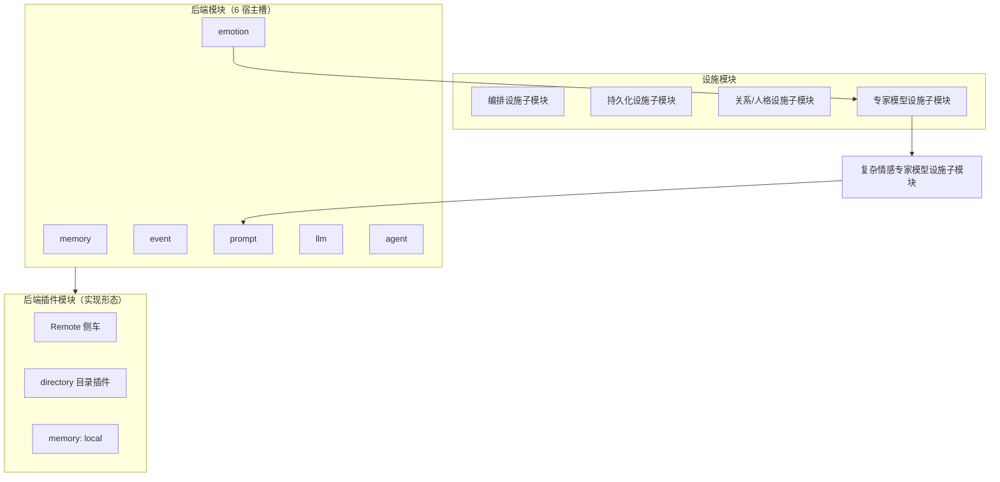

# Oclive 架构总览（单核双态构建架构）

本文是 **对外架构叙述** 与 **模块分层术语** 的权威页：单核双态构建、**后端模块 / 后端插件模块 / 设施模块** 三层，以及 **专家模型设施子模块** 命名规则。实现细节仍以 [PLUGIN_V1.md](../plugin-and-architecture/PLUGIN_V1.md)、[SETTINGS_REFERENCE.md](../cli/SETTINGS_REFERENCE.md)、[PURE_KERNEL_BOUNDARY.md](PURE_KERNEL_BOUNDARY.md)、[RFC_OCLIVE_MONOLITH_MODE.md](../rfc/RFC_OCLIVE_MONOLITH_MODE.md) 与源码为准。

[English](../../creator-docs-en/getting-started/OCLIVE_ARCHITECTURE_OVERVIEW.md)

---

## 架构简述

**Oclive** 采用 **契约型薄核** 架构：内核仅负责回合编排（`process_message`）、会话状态与跨宿主错误语义；记忆、情感、事件、Prompt、LLM、Agent 等能力以 **PLUGIN_V1 六宿主后端模块** 形式接入（内置 / Remote / 目录插件）；**复杂情感专家模型设施子模块** 等编排行内 **设施模块** 消费后端产出并服务 Prompt，**不是** 第七个宿主槽。

在 **交付** 上借鉴 **发行版纪律**：通过稳定 HTTP / **OOCP** 黑盒契约、**角色包** 规范与 **`oclive-cli` 内核工厂**，产出可独立部署的 **无头内核**（`--api` / `kernel_server`）或 **桌面宿主**（Tauri + Vue），角色内容以 `roles/{角色id}/` 为唯一对接面。

在 **构建** 上采用 **单核双态构建架构**：**同一套**编排语义与 DTO 契约（单核），构建期两档——**外核态**（低耦合、`PluginHost`）与 **宏核态**（Monolith 焊接）。二者经 `oclive init` 生成双 `[[bin]]`，**按构建产物选择**，非两套内核产品。

**开放实验场** 为产品主轴（见 [VISION_OPEN_LAB.md](../roadmap/VISION_OPEN_LAB.md)）。

---

## 模块分层（三层 + 设施子类）

纯净内核内的能力按 **职责** 分为三层；**不要** 与「内核工厂配方层·实现层·代码层」混淆（后者见 [KERNEL_FACTORY_VISION.md](KERNEL_FACTORY_VISION.md)）。

### 1. 后端模块（六宿主槽）

**定义**：`settings.json` → `plugin_backends` 中 **6 个枚举字段**；经 **`PluginHost::resolve_for_role`** 绑定 `Arc<dyn Trait>`；由 `chat_engine` 按 [PLUGIN_V1 § 编排顺序](../plugin-and-architecture/PLUGIN_V1.md) 调用。

| 槽 | 职责 |
|----|------|
| memory | 记忆检索排序 |
| emotion | 用户句情绪分析 |
| event | 事件影响估计 |
| prompt | Prompt 组装 |
| llm | 主对话生成 |
| agent | Agent / 工具编排 |

**默认内置实现**（如 `emotion_analyzer`、`memory_retrieval`）仍属 **该后端模块的内置分支**，不是单独的「插件模块类型」。

文档中的 **「第七模块」**（见 [AGENTS.md](../../AGENTS.md)）指产品上的 **`agent` 扩展槽**（六字段中的 `agent`），**不是** `complex_emotion`。

### 2. 后端插件模块

**定义**：**某一后端模块** 在配置为 `remote` / `directory` / `local`（仅 memory）时，**落在宿主进程外**的实现与分发形态。**不新增宿主槽**。

| 形态 | 配置 | 换逻辑是否要重编译桌面端 |
|------|------|--------------------------|
| Remote 侧车 | 槽 = `remote` + `OCLIVE_REMOTE_*` 等 | 通常 **不要**（改侧车） |
| 目录插件 | 槽 = `directory` + `directory_plugins.<槽>` | 通常 **不要**（换 `plugins/<id>/`） |
| 打包插件 | `.oclive-plugin` 安装到目录 | 同上 |
| Fork 宿主 Rust | 新枚举 / `PluginHost` 注册 | **要**（新安装包） |

**常见偏差**：把「后端插件模块」理解成与六槽 **并列的第七类业务** —— 正确理解是 **「emotion 槽的目录插件实现」** 等。

**MCP**（`mcp-servers/*.json`）是 **agent 后端模块** 的工具依赖，不是第八槽。

详见 [CREATOR_PLUGIN_ARCHITECTURE.md](../plugin-and-architecture/CREATOR_PLUGIN_ARCHITECTURE.md)、[DIRECTORY_PLUGINS.md](../plugin-and-architecture/DIRECTORY_PLUGINS.md)。

### 3. 设施模块

**定义**：**不在 `PluginBackends` 六字段内**、由 `chat_engine` / `co_present` **直接调用** 的内核能力。

| 设施子模块（类型） | 说明 | 示例 |
|--------------------|------|------|
| **编排设施子模块** | 入口、解析、自检 | `process_message`、`PluginHost`、`startup_health` |
| **持久化设施子模块** | 仓储与加载 | `Repository`、SQLite、`role_manager` |
| **关系/人格设施子模块** | 规则域、非窄模型 | `PersonalityEngine`、好感/关系、`knowledge_index` |
| **专家模型设施子模块** | 窄任务；消费后端 DTO；可换策略（路线图） | 见下节 |

**UI（Vue/Tauri）、OOCP HTTP 壳、角色包数据、oclive-cli 工厂** 不在上述三层内（边界外或工具链）。

---

## 命名规则：专家模型 × 设施

| 层级 | 句式 | 含义 |
|------|------|------|
| 类型 | **设施模块** | 上表第 3 层总称 |
| 子类 | **专家模型设施子模块** | 设施模块中的一类：窄域、主编排调用、策略可替换（**专家模型** 为文档前缀，**不强制**独立大模型） |
| 实例全名 | **{能力}专家模型设施子模块** | 如 **复杂情感专家模型设施子模块** |

**与后端模块关系**：专家模型设施子模块 **引用后端模块的输出**（如 `EmotionResult`），**自身不是** 后端模块，**不经** `PluginHost` 解析（在升格为第七 `plugin_backends` 字段之前）。

### 复杂情感专家模型设施子模块

| 项 | 说明 |
|----|------|
| **职责** | 共景回合内产出 `narrative_hint`，经 `PromptInput` 进入 Prompt（「复杂情感叙事提示」） |
| **编排位置** | `co_present`：`emotion.analyze` 与上下文加载之后，`build_prompt` 之前 |
| **与 emotion 槽** | emotion = 测用户情绪；本设施 = 叙事级 hint（关键词规则 / 将来 Remote） |
| **现状** | 主路径 **写死** `BuiltinKeywordComplexEmotionProvider`；`settings.json` 的 `complex_emotion` 键 **宿主忽略** |
| **路线图** | Remote：`complex_emotion.resolve_turn`（`OCLIVE_COMPLEX_EMOTION_URL`）；可选将来与六槽同级插件化 |
| **Monolith** | 编译焊接键名 `complex_emotion`（**七焊接键**之一），≠ 宿主第六/第七槽 |

集成说明：[NARRATIVE_HINT_CONTRACT.md](../testing/NARRATIVE_HINT_CONTRACT.md)、[AGENTS.md](../../AGENTS.md)「复杂情感 `narrative_hint`」。

### 六宿主槽 vs Monolith 七焊接键

| 概念 | 个数 | 用途 |
|------|------|------|
| **后端模块（宿主槽）** | **6** | 运行时 `plugin_backends` + `PluginHost` |
| **Monolith `SLOT_IDS` 焊接键** | **7** | 编译期 `monolith.toml` / 演示管线；含 `complex_emotion` |
| **脚手架 `plugin_backends` 示例 JSON** | 6 + 扩展键 | `complex_emotion` 为 **文档/工厂用扩展键**，宿主 Serde **忽略** |

---

## 单核双态构建架构

| 词 | 含义 |
|----|------|
| **单核** | 一套 `process_message` + PLUGIN_V1 契约；非 CPU 单核、非两套对话引擎 |
| **双态** | 外核态 / 宏核态 两档构建，长期并存 |
| **构建** | `oclive init` + `monolith.toml` + `cargo build`；双 `[[bin]]`；**非** 运行时热切换 |

| | **外核态** | **宏核态** |
|---|-----------|-----------|
| **实现名** | 低耦合、`PluginHost` | Monolith、`monolith.toml` |
| **六宿主槽** | `settings.json` 可换 backend | 已焊槽静态调用；`weld_modules=[]` 且 `exclude=[]` → 六槽 + `complex_emotion` 焊接键全焊 |
| **桌面宿主默认** | **是** | 工厂脚手架；真 `process_message` 同构全焊热路径演进中（RFC §9） |

与内核工厂 **配方·实现·代码** 三层正交：双态只改变 **实现层解析方式**（动态 trait vs 静态焊），**代码层语义**不变。

---

## 共景主链（三层对照）

1. **设施**：`PluginHost` 解析 **六后端模块**
2. **后端模块**：`emotion.analyze`
3. **设施**：`PersonalityEngine`（用户情绪）
4. **设施**：`knowledge_index`（可选）
5. **专家模型设施子模块**：**复杂情感专家模型设施子模块** → `narrative_hint`
6. **后端模块**：`event.estimate` → **设施**：`PersonalityEngine`（事件）
7. **后端模块**：`memory.rank_memories`（+ 持久化设施）
8. **设施**：好感/关系
9. **后端模块**：`prompt.build` → **后端模块**：`llm.generate`
10. **后端模块**：**agent**（按场景，非每轮必调）

---

## 特点（摘要）

- **契约型薄核** + **六宿主槽** + **设施模块**（含专家模型设施子模块）
- **后端插件模块**：侧车 / 目录插件 / MCP（agent）实现可替换，无需 ComfyUI 式主界面
- **发行版式交付**：OOCP、角色包、`oclive-cli` 工厂、Breaking 流程
- **单核双态**：标准二进制 + 可选 Monolith；`bench` 对比
- **权限**：目录插件 / MCP 高风险能力须用户授权
- **测试分层**：协议层（本仓 OOCP）、组件层（pack-editor）、插件层（编写器）

---

## 相关文档

| 主题 | 文档 |
|------|------|
| 六槽枚举与 JSON-RPC | [PLUGIN_V1.md](../plugin-and-architecture/PLUGIN_V1.md) |
| `plugin_backends` 与复杂情感键 | [SETTINGS_REFERENCE.md](../cli/SETTINGS_REFERENCE.md) |
| 插件扩展方式 | [CREATOR_PLUGIN_ARCHITECTURE.md](../plugin-and-architecture/CREATOR_PLUGIN_ARCHITECTURE.md) |
| 内核工厂与配方三层 | [KERNEL_FACTORY_VISION.md](KERNEL_FACTORY_VISION.md) |
| 总览图 | [KERNEL_AND_MODULES_ARCHITECTURE.md](KERNEL_AND_MODULES_ARCHITECTURE.md) |
| 纯净内核边界 | [PURE_KERNEL_BOUNDARY.md](PURE_KERNEL_BOUNDARY.md) |
| Monolith | [RFC_OCLIVE_MONOLITH_MODE.md](../rfc/RFC_OCLIVE_MONOLITH_MODE.md) |
