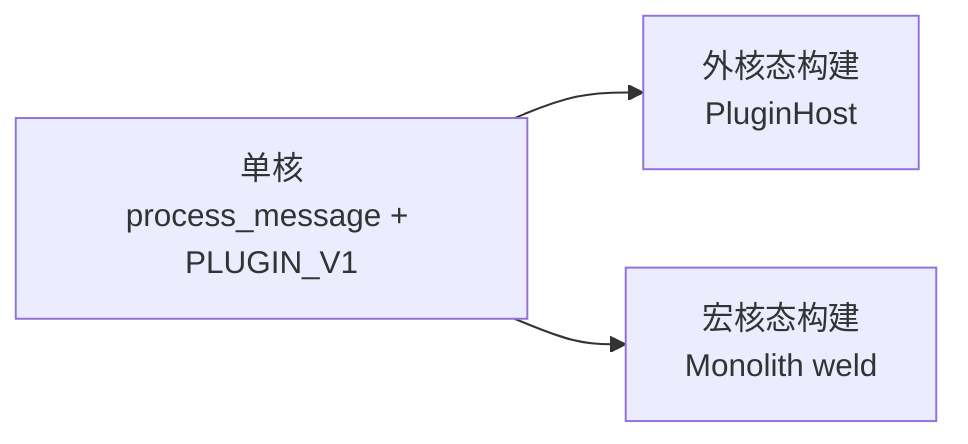

# Oclive 架构总览（单核双态构建架构）

本文给出 **对外可用的架构描述**、**单核双态构建架构** 术语定义，以及 Oclive 的 **特点清单**。实现细节仍以 [PLUGIN_V1.md](../plugin-and-architecture/PLUGIN_V1.md)、[PURE_KERNEL_BOUNDARY.md](PURE_KERNEL_BOUNDARY.md)、[RFC_OCLIVE_MONOLITH_MODE.md](../rfc/RFC_OCLIVE_MONOLITH_MODE.md) 与源码为准。

[English](../../creator-docs-en/getting-started/OCLIVE_ARCHITECTURE_OVERVIEW.md)

---

## 架构简述

**Oclive** 采用 **契约型薄核** 架构：内核仅负责回合编排（`process_message`）、会话状态与跨宿主错误语义；记忆、情感、事件、Prompt、LLM、Agent 等能力以 **PLUGIN_V1 七槽后端** 形式接入，支持内置（builtin / v2）、远端（Remote JSON-RPC）与目录式进程插件（directory）。

在 **交付** 上借鉴 **发行版纪律**：通过稳定 HTTP / **OOCP** 黑盒契约、**角色包** 规范与 **`oclive-cli` 内核工厂**，产出可独立部署的 **无头内核**（`--api` / `kernel_server`）或 **桌面宿主**（Tauri + Vue），角色内容以 `roles/{角色id}/` 为唯一对接面，与编写器、启动器解耦。

在 **构建** 上采用 **单核双态构建架构**：**同一套**编排语义与 DTO 契约（单核），在构建期提供两种档位——**外核态**（低耦合，`PluginHost` 动态解析槽位）与 **宏核态**（Monolith 编译期焊接，可选七槽全焊）。二者经 `oclive init` 生成双 `[[bin]]` 工程，由 `oclive bench` 与 OOCP 等保证可对照，**按产品选构建产物**，而非维护两套内核产品。外核态侧重可替换与生态实验；宏核态侧重延迟敏感设备上的静态链与二进制一体化（工程类比，非操作系统分类学）。

**开放实验场** 为产品主轴：本地优先、契约与 CI 守住兼容边界，创作者可在不 fork 主编排的前提下替换实现层（见 [VISION_OPEN_LAB.md](../roadmap/VISION_OPEN_LAB.md)）。

---

## 单核双态构建架构

| 词 | 含义 |
|----|------|
| **单核** | 一套对话编排核：`process_message`（及 `co_present` 等）顺序与 `reply` / `KernelErrorBody` 契约唯一；**不是** CPU 单核，**也不是** 两套对话逻辑。 |
| **双态** | 两种 **构建档位**，长期并存（见 [RFC_OCLIVE_MONOLITH_MODE.md](../rfc/RFC_OCLIVE_MONOLITH_MODE.md)）。 |
| **构建** | 态在 **`oclive init` + `monolith.toml` + `cargo build`** 选定；常见产物为 **标准二进制** 与 **`-monolith` 二进制**，**非** 同一进程运行时热切换。 |

### 两态对照

| | **外核态** | **宏核态** |
|---|-----------|-----------|
| **工程类比** | 薄核 + 库/OS 式可替换实现（**类比**） | 编译期把选定后端编入镜像（**类比**） |
| **文档 / 实现名** | 低耦合、PLUGIN_V1、`PluginHost` | Monolith、高耦合、`monolith.toml` |
| **典型入口** | `src/main.rs` | `src/main_monolith.rs` + `feature monolith` |
| **七槽** | `settings.json` → builtin / remote / directory / ollama 等 | `weld_modules` 列表；`weld_modules = []` 且 `exclude = []` → **七槽全焊** |
| **主仓桌面宿主** | **是**（`oclivenewnew-tauri` 默认路径） | 工厂脚手架已闭环；与真 `process_message` 同构的全焊热路径仍在演进（见 RFC §9） |

### 与「三层架构」的关系

[KERNEL_FACTORY_VISION.md](KERNEL_FACTORY_VISION.md) 中的 **配方层 · 实现层 · 代码层** 对 **两种构建态均适用**：

- **配方层**：是否启用 Monolith、模板与 `--monolith-preset`；
- **实现层**：`plugin_backends` / `plugins/` / Remote，或 `monolith.toml` 焊接表；
- **代码层**：始终是同一套 `process_message` **语义**（宏核态下已焊槽为生成静态调用链）。

---

## 特点

### 运行时与契约

- **契约型薄核**：编排固定在 `chat_engine`；扩展走槽位与 trait，不散落业务公式到 API 层。
- **七槽可替换**：memory、emotion、event、prompt、llm、agent（+ 会话级覆盖与来源快照）；统一 `PluginHost::resolve_for_role`。
- **跨宿主错误语义**：`KernelErrorBody` + 错误码约定；HTTP、`invoke`、目录插件 JSON 对齐。
- **复杂情感叙事**：`narrative_hint` 回合间进入 Prompt（见 [NARRATIVE_HINT_CONTRACT.md](../testing/NARRATIVE_HINT_CONTRACT.md)）。
- **权限与降级**：目录插件与 MCP 高风险能力须用户授权；未授权则降级并可见提示。

### 交付与生态

- **角色包为对接面**：`manifest.json` / `settings.json`；编写器、启动器、运行时通过磁盘包交换，无复杂 IPC。
- **发行版式交付**：OOCP S0–S12 + 核心 API 重启烟测；`oclive pack` 校验与签名；Breaking 变更流程与 `oclive_validation` 同步。
- **内核工厂**：`oclive init` / `build` / `bench` / `doctor`；模板（玩偶、网关、无头 API 等）与 `--kernel-source` 接主仓运行时。
- **单核双态产物**：标准构建 + 可选 Monolith 第二二进制；`bench` 对比延迟、体积与构建时间。
- **多宿主形态**：桌面 Tauri、HTTP `--api`、脚手架 `kernel_server`；同一编排语义。

### 扩展形态

- **Remote 侧车**：JSON-RPC；BYOK / 本机闭源 API 路径。
- **目录插件**：`plugins/<id>/` 整壳 `invoke`；与插件管理面板、拖拽排序、本地 zip 更新。
- **Agent / MCP**：第七模块 `agent`；`mcp-servers/*.json` 与 Function Calling 解析。
- **开放实验场**：鼓励第二实现验证 trait 链，而非绑定单一模型或供应商。

### 质量与工程

- **本地优先**：默认 Ollama；数据落盘 SQLite + `{app_data}` 可配置路径。
- **三层测试归属**：协议层（本仓 OOCP + `cargo test`）、组件层（pack-editor）、插件层（编写器范式）。
- **启动健康检查**：首轮对话前槽位、角色包、DB、可选 LLM 探测。
- **安全可见性**：`cargo-audit`、已知漏洞清单与审查范围文档化（不宣称零漏洞）。

---

## 相关文档

| 主题 | 文档 |
|------|------|
| 内核工厂与三层 | [KERNEL_FACTORY_VISION.md](KERNEL_FACTORY_VISION.md) |
| 总览图（内核居中） | [KERNEL_AND_MODULES_ARCHITECTURE.md](KERNEL_AND_MODULES_ARCHITECTURE.md) |
| 纯净内核边界 | [PURE_KERNEL_BOUNDARY.md](PURE_KERNEL_BOUNDARY.md) |
| Monolith RFC | [RFC_OCLIVE_MONOLITH_MODE.md](../rfc/RFC_OCLIVE_MONOLITH_MODE.md) |
| 插件契约 | [PLUGIN_V1.md](../plugin-and-architecture/PLUGIN_V1.md) |
| CLI | [OCLIVE_CLI_GUIDE.md](../cli/OCLIVE_CLI_GUIDE.md) |
