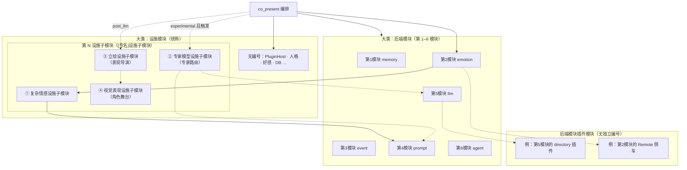
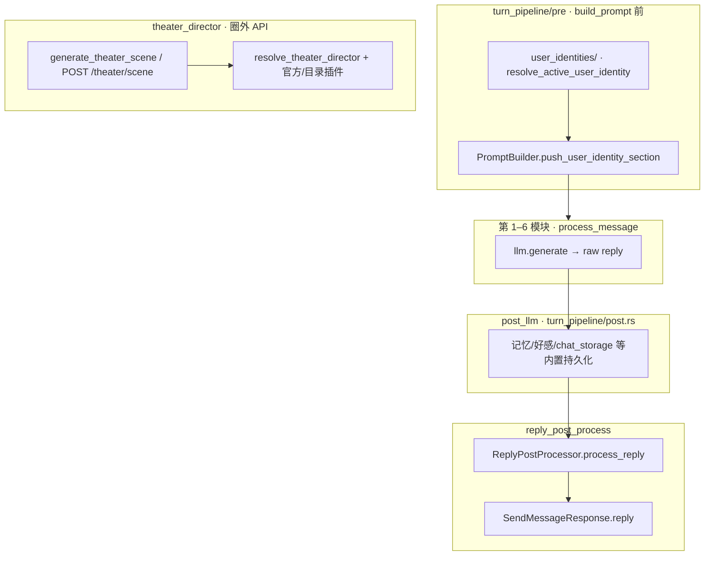

# Oclive 架构总览（单核双态构建架构）

本文是 **对外架构叙述** 与 **模块编号与分层术语** 的权威页：单核双态构建、**后端模块（第 1–6 模块）**、**设施模块（统称）** 与 **第 N 设施子模块（`{专名}设施子模块`）**、**独立通道能力增强模块**，以及 **后端模块插件模块**（不归入第几模块序列）。

**模块定义 · 六槽/设施关系 · 改动约束（维护 SSOT）**：[`handoff/MODULE_MAP_AND_HANDOFF.md`](../../handoff/MODULE_MAP_AND_HANDOFF.md) — 本文侧重对外叙述与编号脚注，**不**与注册表双写长表。实现细节仍以 [PLUGIN_V1.md](../plugin-and-architecture/PLUGIN_V1.md)、[SETTINGS_REFERENCE.md](../cli/SETTINGS_REFERENCE.md)、[PURE_KERNEL_BOUNDARY.md](PURE_KERNEL_BOUNDARY.md)、[RFC_OCLIVE_MONOLITH_MODE.md](../rfc/RFC_OCLIVE_MONOLITH_MODE.md)、[RFC_SIDE_CHANNEL_CAPABILITY_ENHANCEMENTS.md](../rfc/RFC_SIDE_CHANNEL_CAPABILITY_ENHANCEMENTS.md) 与源码为准。

[English](../../creator-docs-en/getting-started/OCLIVE_ARCHITECTURE_OVERVIEW.md)

---

## 架构简述

**Oclive** 采用 **契约型薄核** 架构：内核仅负责回合编排（`process_message`）、会话状态与跨宿主错误语义；记忆、情感、事件、Prompt、LLM、Agent 等能力以 **PLUGIN_V1 六宿主后端模块** 形式接入（内置 / Remote / 目录插件）；**复杂情感设施子模块**、**专家模型设施子模块** 等 **编排行内设施模块** 消费后端产出并服务 Prompt，**不是** 第七个宿主槽。

在 **交付** 上借鉴 **发行版纪律**：通过稳定 HTTP / **OOCP** 黑盒契约、**角色包** 规范与 **`oclive-cli` 内核工厂**，产出可独立部署的 **无头内核**（`--api` / `kernel_server`）或 **桌面宿主**（Tauri + Vue），角色内容以 `distros/chat-pro/roles/{角色id}/` 为唯一对接面。

在 **构建** 上采用 **单核双态构建架构**：**同一套**编排语义与 DTO 契约（单核），构建期两档——**外核态**（低耦合、`PluginHost`）与 **宏核态**（Monolith 焊接）。二者经 `oclive init` 生成双 `[[bin]]`，**按构建产物选择**，非两套内核产品。

**运行时双核双态（Opt-in · 默认关）**：在**同一蓝图**内划分 **Stable 核**（固定六槽编排）与 **Experimental 核**（自定义 `pipeline.experimental`）。**机制已预埋，默认关闭**（`dual_core` Cargo feature；`dual_pipeline*` 默认不参与编译）。解冻条件见 [TECHNICAL_DEBT_INVENTORY.md](../../handoff/TECHNICAL_DEBT_INVENTORY.md) §冻结决定。RFC：[RFC_OCLIVE_DUAL_CORE_DUAL_MODE.md](../rfc/RFC_OCLIVE_DUAL_CORE_DUAL_MODE.md) · [DUAL_CORE_ALIGNMENT.md](../../handoff/DUAL_CORE_ALIGNMENT.md)。

**开放实验场** 为产品主轴（见 [VISION_OPEN_LAB.md](../roadmap/VISION_OPEN_LAB.md)）。

**蓝图扩展与资源协调（分阶段实现）**：蓝图只保存最小、命名空间化的能力声明；宿主已实现 Capability Registry、只读 `ExecutionPlan`，以及统一 Resource Coordinator（GPU/RAM/CPU、有限调度意图、公平准入、可逆自动抢占、真实 llama-server 档位与 owner-scoped 第三方注册入口）。通用契约已覆盖 `render` / `compute`，但具体 Live2D/3D runtime 仍由相应 Provider/发行版交付。扩展外壳不是第五类模块，资源协调也不是第七槽。详见 [RFC_BLUEPRINT_EXTENSION_AND_RESOURCE_COORDINATION.md](../rfc/RFC_BLUEPRINT_EXTENSION_AND_RESOURCE_COORDINATION.md)。

---

## 设施模块命名规范（规定）

| 术语 | 含义 |
|------|------|
| **设施模块** | **统称**：编排行内、**不**占用 `plugin_backends` 六键的内核延伸能力（含无编号设施与已登记子模块）。**不存在**「专家模型设施模块」等中间大类。 |
| **`{专名}设施子模块`** | 在设施模块中**登记编号**（**第 N 设施子模块**）的项；全名 = **`{专名}` + `设施子模块`**；各专名**独立**，不得把「专家模型」当作整族前缀套在其它专名上。 |
| **专家模型**（专名） | 仅指 **专家模型设施子模块** 及其蓝图/实验核配置（条件触发子流程）；**不**包含复杂情感。 |
| **专家路由** | **专家模型设施子模块** 的默认实现：`blueprint/includes/expert_routing.json`（**与 `dual_core` 同 feature，默认不编译**）。 |

**扩展规则（设施子模块）**：新增已登记设施时，依次占用 **第 3、第 4… 设施子模块**，全名遵循 **`{新专名}设施子模块`**（须 RFC + 文档登记），**不**复用「专家模型」专名。

---

## 模块编号约定（规定）

纯净内核能力划分为 **四大类**；**不要** 与「内核工厂配方层·实现层·代码层」混淆（后者见 [KERNEL_FACTORY_VISION.md](KERNEL_FACTORY_VISION.md)）。

| 大类 | 编号系列 | 是否写入 `plugin_backends` |
|------|----------|---------------------------|
| **后端模块** | **第 1–6 模块**（固定，见下表） | **是**（六枚举字段） |
| **设施模块** | **统称**；其中已登记项为 **第 N 设施子模块**（与 1–6 **独立序号**） | **否**（编排行内调用） |
| **独立通道能力增强模块** | **无模块号、无设施子模块号**；注册表 `id` 见 [RFC §2](../rfc/RFC_SIDE_CHANNEL_CAPABILITY_ENHANCEMENTS.md#2-注册表-v1) | **否**（自有 Resolver + 锚点 / 独立 API） |
| **后端模块插件模块** | **不使用「第 N 模块」编号** | 仅表示某 **第 K 后端模块** 的外挂实现 |

**扩展规则**

- 新增 **后端模块**（须 RFC + 宿主）：依次为 **第 7 模块**、**第 8 模块**…
- 新增 **`{专名}设施子模块`**（须 RFC + 文档登记）：第 3–4 已登记（立绘 · 视觉表现）；其后依次为 **第 5、第 6…**
- 新增 **独立通道能力增强模块**（须 RFC + 注册表）：登记 `id`、锚点或独立 API、可选 `provides`；**不** 占六槽、**不** 领设施子模块号（见 [RFC_SIDE_CHANNEL_CAPABILITY_ENHANCEMENTS.md](../rfc/RFC_SIDE_CHANNEL_CAPABILITY_ENHANCEMENTS.md)）
- 新增 **后端模块插件**（侧车 / 目录包）：写作 **「第 K 模块的 xxx 插件实现」**，**不** 占用第 7、第 8 模块号，也 **不** 占用设施子模块号或独立通道注册表位。

### 第 1–6 模块（后端模块，固定）

| 编号 | `plugin_backends` 键 | 职责 |
|------|------------------------|------|
| **第 1 模块** | `memory` | 记忆检索排序 |
| **第 2 模块** | `emotion` | 用户句情绪分析 |
| **第 3 模块** | `event` | 事件影响估计 |
| **第 4 模块** | `prompt` | Prompt 组装 |
| **第 5 模块** | `llm` | 主对话生成 |
| **第 6 模块** | `agent` | Agent / 工具编排 |

简称示例：**第 2 模块** = emotion 后端模块。内置 / ollama 实现仍属该模块的 **内置插头**，不是独立编号。

### 第 N 设施子模块（已登记 · 命名：`{专名}设施子模块`）

| 编号 | 规范全名 | 说明 |
|------|----------|------|
| **第 1 设施子模块** | **复杂情感设施子模块** | `narrative_hint`；消费 **第 2 模块** 产出；详见 [§ 第 1 设施子模块](#第-1-设施子模块复杂情感设施子模块) |
| **第 2 设施子模块** | **专家模型设施子模块** | 条件触发专家子流程；默认实现为 **专家路由**；详见 [§ 第 2 设施子模块](#第-2-设施子模块专家模型设施子模块) |
| **第 3 设施子模块** | **立绘设施子模块** | `portrait_catalog` · **表现导演** AI 选 `visual_state_id`；详见 [§ 第 3 设施子模块](#第-3-设施子模块立绘设施子模块) |
| **第 4 设施子模块** | **视觉表现设施子模块** | `visual_state_id` → `performance_directive` · Live2D / 3D / 演算舞台；**无 AI 选图**；详见 [§ 第 4 设施子模块](#第-4-设施子模块视觉表现设施子模块) |

### 无编号设施模块（仍属设施模块统称）

`PluginHost`、`PersonalityEngine`、好感、`Repository`、`knowledge_index` 等：**设施模块**，**不**占用「第 N 设施子模块」序号；若未来需要可为编排/持久化类另立专名并登记编号。

### 后端模块插件模块（不编入第 N 模块）

**定义**：挂在 **某一第 K 模块（1≤K≤6）** 插座上的 **外挂实现**（Remote、directory、local 等）。**不与第 1–6 模块并列**，也 **不是** 第 7 模块。

| 说法示例 | 含义 |
|----------|------|
| 第 5 模块的目录插件实现 | `llm = directory`，`distros/chat-pro/plugins/<id>/` 子进程 |
| 第 2 模块的 Remote 侧车 | `emotion = remote`，共用 `OCLIVE_REMOTE_PLUGIN_URL` |
| ✗ 第 7 模块（目录插件） | **错误**——插件不单独占模块号 |

目录插件可选 **整壳 / ui_slots** UI，仍属 **该插件包**，不是新的「前端模块号」。

---

## 结构总图

---

## 第 1 设施子模块（复杂情感设施子模块）

| 项 | 说明 |
|----|------|
| **职责** | 共景回合内产出 `narrative_hint`，经 `PromptInput` 进入 Prompt（「复杂情感叙事提示」） |
| **编排位置** | `co_present`：`emotion.analyze` 与上下文加载之后，`build_prompt` 之前 |
| **与第 2 模块** | 第 2 模块 = 测用户情绪；本子模块 = 叙事级 hint（关键词规则 / remote / directory） |
| **与专家模型** | **并列**的另一 `{专名}设施子模块`；**不**使用「专家模型」专名，**不**走 `expert_routing.json` |
| **现状** | 主路径默认 `BuiltinKeywordComplexEmotionProvider`；蓝图 `slot_registry` 可声明 `complex_emotion` 实例，经 `SlotRunner` last-wins 解析 |
| **路线图** | **`slot_registry` remote/directory 已可用**（`complex_emotion.resolve_turn`）；可选将来与六槽同级 `plugin_backends` 键 |
| **Monolith** | 编译焊接键名 `complex_emotion`（**七焊接键**之一），≠ 宿主第六/第七槽 |

集成说明：[NARRATIVE_HINT_CONTRACT.md](../testing/NARRATIVE_HINT_CONTRACT.md)、[AGENTS.md](../../AGENTS.md)「复杂情感 `narrative_hint`」。

### 六宿主槽 vs Monolith 七焊接键

| 概念 | 个数 | 用途 |
|------|------|------|
| **后端模块（宿主槽）** | **6** | 运行时 `plugin_backends` + `PluginHost` |
| **Monolith `SLOT_IDS` 焊接键** | **7** | 编译期 `monolith.toml` / 演示管线；含 `complex_emotion` |
| **脚手架 `plugin_backends` 示例 JSON** | 6 + 扩展键 | `complex_emotion` 为 **文档/工厂用扩展键**，宿主 Serde **忽略** |

---

## 第 2 设施子模块（专家模型设施子模块）

| 项 | 说明 |
|----|------|
| **专名** | **专家模型**（仅指本子模块，见 [命名规范](#设施模块命名规范规定)） |
| **默认实现** | **专家路由**：`blueprint/includes/expert_routing.json`（`routes` · 触发条件 · `steps`） |
| **执行入口** | v3 蓝图 + **`dual_core`**：`pipeline.experimental` 中的 **`slot.expert.invoke`** → `execute_expert_route` |
| **步骤形态** | `slot.<registry_key>.<method>`（如 `slot.<llm>.generate`）及设施 action（`slot.personality.adjust`、`slot.prompt_enhance.apply`、`slot.memory.inject`、`slot.lora.apply` 等） |
| **与第 1 号** | 与 **复杂情感设施子模块** 同属 **设施模块** 下的并列子模块，**非** 包含关系 |
| **创作者 UI** | 插件工作台「专家模型设施」向导 / 架构图齿轮（产品简称；架构全名为 **专家模型设施子模块**） |

详见 [ROLE_PACK_SPEC.md](../role-pack/ROLE_PACK_SPEC.md) §2.6、[BLUEPRINT_FOLDER_LAYOUT.md](../../handoff/BLUEPRINT_FOLDER_LAYOUT.md)、[CREATOR_LEARNING_PATH.md](../role-pack/CREATOR_LEARNING_PATH.md) 高级配置。

---

## 第 3 设施子模块（立绘设施子模块）

| 项 | 说明 |
|----|------|
| **职责** | 从角色包 **`portrait_catalog`** 封闭列表选出 **`visual_state_id`**；默认 **表现导演**（AI + 复杂情感 hint） |
| **编排位置** | **post_llm**：合并/替换今日 `pick_portrait_emotion` 的「选状态」；**共景**可规则映射 `bot_emotion` |
| **与第 1 设施** | **消费** `narrative_hint`；**不**生成 hint |
| **与第 4 设施** | 输出 `visual_state_id`；**唯一**允许 LLM 选表现状态的设施 |
| **legacy** | 保留 `portrait_emotion` 七 tag；未启用 catalog 时行为与 v0.3 一致 |
| **RFC** | [RFC_PORTRAIT_FACILITY.md](../rfc/RFC_PORTRAIT_FACILITY.md) · [RFC_VISUAL_PRESENTATION_FACILITY.md](../rfc/RFC_VISUAL_PRESENTATION_FACILITY.md) |

---

## 第 4 设施子模块（视觉表现设施子模块）

| 项 | 说明 |
|----|------|
| **职责** | 将 **`visual_state_id`** 转为 **`performance_directive`**，供宿主渲染 adapter（PNG / Live2D / 3D /  procedural） |
| **编排位置** | post_llm 轻量 materialize；**帧循环 / GPU 在 UI**，不在 `process_message` |
| **AI** | **禁止**二次 LLM 选图 |
| **默认** | `config.json` → `visual_presentation.enabled: false` |
| **发行版** | `distro.oclive.toml` `[visual_presentation].mode` 草案：VS Code off · Theater stage_full |
| **RFC** | [RFC_VISUAL_PRESENTATION_FACILITY.md](../rfc/RFC_VISUAL_PRESENTATION_FACILITY.md) |

---

## 单核双态构建架构

| 词 | 含义 |
|----|------|
| **单核** | 一套 `process_message` + PLUGIN_V1 契约；非 CPU 单核、非两套对话引擎 |
| **双态** | 外核态 / 宏核态 两档构建，长期并存 |
| **构建** | `oclive init` + `monolith.toml` + `cargo build`；双 `[[bin]]`；**非** 运行时热切换 |

| | **外核态** | **宏核态** |
|---|-----------|-----------|
| **实现名** | 低耦合、`PluginHost` | Monolith、`monolith.toml` |
| **六宿主槽** | `settings.json` 可换 backend | 已焊槽静态调用；`weld_modules=[]` 且 `exclude=[]` → 六槽 + `complex_emotion` 焊接键全焊 |
| **桌面宿主默认** | **是** | 工厂脚手架；真 `process_message` 同构全焊热路径演进中（RFC §9） |

与内核工厂 **配方·实现·代码** 三层正交：双态只改变 **实现层解析方式**（动态 trait vs 静态焊），**代码层语义**不变。

---

## 共景主链（编号对照 · Stable 主路径）

Stable 主路径以 `process_message` → `turn_prefetch` → `pre_llm` → `co_present` 为准；**不是**按模块编号线性排列。编号仍对照 **第 1–6 模块** 与 **设施子模块**。

| 阶段 | 代码锚点 | 顺序 |
|------|----------|------|
| **预取** | `turn_prefetch.rs` | 用户身份、近期上下文 |
| **0 · Agent 短路**（可选） | `process_message.rs` | **LLM 之前** 可选短路（第 6 模块） |
| **pre_llm** | `turn_pipeline/pre.rs` | 第 2 模块 `emotion.analyze` → 设施 `PersonalityEngine`（用户情绪）→ **第 1 模块** memory 加载/衰减/`rank_memories` → 设施 好感/关系 |
| **co_present** | `turn_pipeline/co_present.rs` | 第 1 设施子模块 **复杂情感** → `narrative_hint` → 设施 `knowledge_index`（可选）→ 第 3 模块 `event.estimate` → 设施 `PersonalityEngine`（事件）→ 第 4 模块 `prompt.build` → 第 5 模块 `llm.generate` |
| **post_llm** | `turn_pipeline/post.rs` | 内置持久化、记忆抽取等 |

**复杂情感锚点**：在 **pre_llm 情绪分析之后**、**`build_prompt` 之前**（`co_present` 内）；上一轮 `narrative_hint` 经 `SessionCache` / DB 注入 `PromptInput.previous_complex_emotion_narrative_hint`。

**实验核（可选）**：匹配触发条件时，**第 2 设施子模块**（**专家模型设施子模块** / 专家路由）经 `slot.expert.invoke` 插入子步骤链，再汇合 Prompt / LLM 等（见 `dual_core` 文档）。Experimental 核 preview **尚未** 接线 relation transition / 复杂情感 hint。

---

## 独立通道能力增强模块（非六槽 · 非设施子模块编号）

与 [NAMING_CONVENTIONS.md](../NAMING_CONVENTIONS.md) §1.2、[RFC_SIDE_CHANNEL_CAPABILITY_ENHANCEMENTS.md](../rfc/RFC_SIDE_CHANNEL_CAPABILITY_ENHANCEMENTS.md) 对齐：**不占** `plugin_backends` 六键，**不**登记为「第 N 设施子模块」；经 **自有 Resolver** 接入 Stable 主链固定锚点，或经 **独立 API** 在 `process_message` 圈外运行。

**两类锚点**

| 模式 | 说明 | 注册表项 |
|------|------|----------|
| **主链侧钩（pre / post）** | 仍属对话回合，但不走六槽解析 | `user_identity`、`reply_post_process` |
| **圈外独立 API** | 单独 HTTP/Tauri 入口；消费 LLM 等设施，**不**插入 Stable 工序表 | `theater_director` |
| **输入侧宿主通道** | `send_message` **之前**；不进 `process_message` 钩子 | **`voice.asr`**（Windows 已交付 · Linux/macOS profile 占位） |

### 注册表 v1（摘要）

| `id` | 规范名 | 配置落点 | 锚点 | 插件 `provides` |
|------|--------|----------|------|-----------------|
| **`user_identity`** | 用户身份 Prompt 模板 | 角色包 `user_identities/`；发行版 `[user_identity]` | pre → `build_prompt` | 无（角色包内容） |
| **`reply_post_process`** | 回复后处理 | 角色包 `config.json` → `reply_post_processor`；发行版 `[post_process].chain` | post_llm → `process_reply` | `reply_post_process` |
| **`theater_director`** | 剧场场景导演 | `[theater].director_plugin`；fallback 内置 | `generate_theater_scene` | `theater_director`（**已交付**） |
| **`voice.asr`** | 语音识别输入 + 可选 TTS | 插件 `models/` + 设置；官方 `com.oclive.voice.asr` | 宿主 UI → `send_message` / `voice.speak` | `voice.asr`（**Windows 已交付**） |

**消歧**

- **用户身份** ≠ **角色身份**（`prompts/`、`core_personality.txt`）。
- **Reply Post-Processor** ≠ post-process chain profile 本身；≠ 第 4 模块 Prompt 槽；≠ Experimental 核 step。
- **Theater Scene Director** ≠ 第 4 模块 Prompt（`TheaterSceneRequest` ≠ `PromptInput`）；≠ 第 5 模块 LLM 插件（仅消费 `AppState::llm`）；默认 **不** 升格「第 5 设施子模块」。
- **Experimental 核**（`dual_core`）改的是 Stable **整圈工序**；独立通道是 Stable **固定钩子** 或 **圈外 API**。

**附录（宿主工具，非本注册表主表）**：编写器 `test_runner` 等见 RFC §2.1。

RFC 与验收：[RFC_SIDE_CHANNEL_CAPABILITY_ENHANCEMENTS.md](../rfc/RFC_SIDE_CHANNEL_CAPABILITY_ENHANCEMENTS.md) · 身份/后处理细节：[RFC_USER_IDENTITY_AND_REPLY_POST_PROCESSOR.md](../rfc/RFC_USER_IDENTITY_AND_REPLY_POST_PROCESSOR.md) · 剧场：[handoff/theater/DEVELOPMENT_ROADMAP.md](../../handoff/theater/DEVELOPMENT_ROADMAP.md)。

---

## 特点（摘要）

- **契约型薄核** + **六宿主槽** + **设施模块**（无编号设施 + **`{专名}设施子模块`**）
- **后端模块插件模块**：按第 K 模块挂 Remote / 目录插件，**不占第 N 模块号**
- **发行版式交付**：OOCP、角色包、`oclive-cli` 工厂、Breaking 流程
- **单核双态**：标准二进制 + 可选 Monolith；`bench` 对比
- **权限**：目录插件 / MCP 高风险能力须用户授权
- **测试分层**：协议层（本仓 OOCP）、组件层（pack-editor）、插件层（编写器）

---

## 相关文档

| 主题 | 文档 |
|------|------|
| 六槽枚举与 JSON-RPC | [PLUGIN_V1.md](../plugin-and-architecture/PLUGIN_V1.md) |
| `plugin_backends` 与复杂情感键 | [SETTINGS_REFERENCE.md](../cli/SETTINGS_REFERENCE.md) |
| 专家路由文件与 includes | [ROLE_PACK_SPEC.md](../role-pack/ROLE_PACK_SPEC.md) · [BLUEPRINT_FOLDER_LAYOUT.md](../../handoff/BLUEPRINT_FOLDER_LAYOUT.md) |
| 插件扩展方式 | [CREATOR_PLUGIN_ARCHITECTURE.md](../plugin-and-architecture/CREATOR_PLUGIN_ARCHITECTURE.md) |
| 蓝图扩展外壳 / Resource Coordinator | [RFC_BLUEPRINT_EXTENSION_AND_RESOURCE_COORDINATION.md](../rfc/RFC_BLUEPRINT_EXTENSION_AND_RESOURCE_COORDINATION.md) |
| 内核工厂与配方三层 | [KERNEL_FACTORY_VISION.md](KERNEL_FACTORY_VISION.md) |
| 总览图 | [KERNEL_AND_MODULES_ARCHITECTURE.md](KERNEL_AND_MODULES_ARCHITECTURE.md) |
| 纯净内核边界 | [PURE_KERNEL_BOUNDARY.md](PURE_KERNEL_BOUNDARY.md) |
| Monolith | [RFC_OCLIVE_MONOLITH_MODE.md](../rfc/RFC_OCLIVE_MONOLITH_MODE.md) |
| User Identity & Reply Post-Processor | [RFC_USER_IDENTITY_AND_REPLY_POST_PROCESSOR.md](../rfc/RFC_USER_IDENTITY_AND_REPLY_POST_PROCESSOR.md) · [ROLE_PACK_SPEC §1.1 / §9.7](../role-pack/ROLE_PACK_SPEC.md) |
