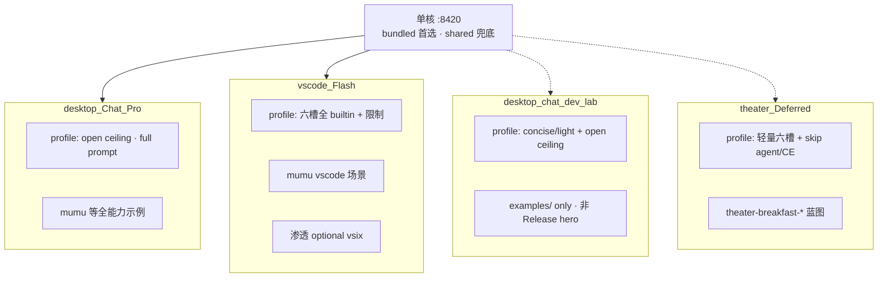

# 发行版默认插件矩阵（Distro Default Plugins）

**状态**：P1 契约（设计 + 示例 profile 对齐）  
**受众**：发行版集成方、Cursor / Agent  
**前置**：[`DISTRO_CAPABILITY_PROFILE.md`](DISTRO_CAPABILITY_PROFILE.md) · [`ROLE_PACK_BOUNDARY.md`](../../handoff/ROLE_PACK_BOUNDARY.md)

---

## 1. 定位：定制插件，不定制内核二进制

| 层级 | 是否逐发行版定制 | 说明 |
|------|------------------|------|
| **内核二进制** | **否（Deferred 裁剪）** | 各发行版 **自带 bundled 全量核**（spawn 首选）；**shared 兜底** 在 bundled 故障时接管。**不**默认「一颗全能核打天下」；`promote` / per-distro 裁剪 binary 等产品化见 [KERNEL_SCHEDULER_RESCOPE.md](../../handoff/KERNEL_SCHEDULER_RESCOPE.md) |
| **`distro.oclive.toml`（HostProfile）** | **是** | 宿主策略：prompt / memory / post_process / `host_flags` / 可选 **`[plugin_backends]`** |
| **默认角色包 + 蓝图 `slot_registry`** | **是** | 各发行版 bundled / 推荐的 `roles/*` 蓝图 tuned for 场景 |
| **目录插件 / 正交能力** | **按需** | VS Code 渗透插件、未来 Theater 导演插件等 |

**一句话**：**单进程** `:8420`；发行版差异来自 **`distro.oclive.toml`（含可选六槽整表替换）** + **默认角色蓝图** + **目录插件** — **不是**为每个发行版维护不同裁剪内核二进制（Deferred）。

---

## 2. 合并语义（实现对照 · 必读）

文档 [`DISTRO_CAPABILITY_PROFILE.md`](DISTRO_CAPABILITY_PROFILE.md) §4 中的「上限合并」在代码里的实际行为是：

1. 从角色 **`slot_registry`**（或 legacy `plugin_backends`）解析六槽；
2. 应用用户 LLM 设置 / 环境变量 override；
3. 若发行版声明 **`[plugin_backends]`**，则 **`profile_override`（实现名 `apply_host_ceiling`）用 profile 值整表替换六槽**（`directory_plugins` 仍取自角色包）；
4. `host_flags.skip_agent = true` 强制 `agent = none`。

见 [`host_backends.rs`](../../crates/oclive_kernel_host/src/state/host_backends.rs) 与单测 `apply_ceiling_replaces_role_backends`。

**设计含义**：

- **Chat Pro**（`desktop`）：**省略** `[plugin_backends]` → 角色蓝图 + 目录插件 **open ceiling**。
- **VS Code Flash**（`vscode`）：**显式** `[plugin_backends]` → 无论角色包怎么写，运行时固定为发行版矩阵。
- **dev lab**（`desktop-chat`）：**省略** `[plugin_backends]` → 与 Pro 相同 open ceiling，但 prompt/memory 更轻；**不进 Release 包**。
- **Theater**（Deferred）：**显式** 轻量矩阵；见 §3.4。

---

## 3. 三主打产品 + dev lab

### 3.1 `desktop` — Chat Pro（Release hero · 开发基座）

| 维度 | 策略 |
|------|------|
| **产品** | **OCLive Chat Pro** — 独立桌面 · 最强插件面 · Tauri 默认 spawn profile |
| **`[plugin_backends]`** | **省略**（open ceiling；角色蓝图 + directory 插件说了算） |
| **`host_flags`** | agent / complex_emotion **开启** |
| **`prompt.profile`** | `full` |
| **`memory.retrieval`** | `default`（8 条） |
| **`post_process.chain`** | `standard` |
| **默认角色** | `mumu` + 仓库完整示例包 |
| **bundled profile** | [`src-tauri/resources/distro-profiles/desktop.oclive.toml`](../../src-tauri/resources/distro-profiles/desktop.oclive.toml) · 示例镜像 [`examples/distro-profiles/desktop.oclive.toml`](../../examples/distro-profiles/desktop.oclive.toml) |

### 3.2 `vscode` — VS Code Flash（Pro 简洁版）

| 维度 | 策略 |
|------|------|
| **产品** | **VS Code Flash** — Pro 的简洁侧栏版；同构建全量 `oclive-kernel-server` + 显式六槽矩阵 |
| **`[plugin_backends]`** | **显式** 全 `builtin` + `llm = ollama`（见 [`vscode.oclive.toml`](../../examples/distro-profiles/vscode.oclive.toml)） |
| **`host_flags`** | `skip_agent = true` · `skip_complex_emotion = true` |
| **`prompt.profile`** | `concise` |
| **`memory.retrieval`** | `light`（4 条） |
| **`post_process.chain`** | `minimal` |
| **`user_identity`** | `default_id = classmate` |
| **高级变体** | [`vscode-agent.oclive.toml`](../../examples/distro-profiles/vscode-agent.oclive.toml)（`skip_agent = false`） |
| **渗透** | **非六槽** · 独立 vsix + [`vscode-penetration.oclive.toml`](../../examples/distro-profiles/vscode-penetration.oclive.toml) |

**Pro vs Flash 对照**：

| 维度 | Chat Pro (`desktop`) | VS Code Flash (`vscode`) |
|------|----------------------|---------------------------|
| 内核 binary | 全量 bundled | **同构建** |
| `[plugin_backends]` | 省略 | 全 builtin 整表替换 |
| Agent / CE | 开 | 关 |
| interaction | 可切沉浸 | 永久 `pure_chat` |
| bundled 路径 | Tauri `resources/` | VSIX `bin/` |

### 3.3 `desktop-chat` — dev lab only

| 维度 | 策略 |
|------|------|
| **目标** | Monorepo / `examples/` 轻量 profile；**非** Release hero |
| **`[plugin_backends]`** | **省略**（与 Pro 相同 open ceiling） |
| **`prompt.profile`** | `concise` · **`memory.retrieval`** `light` |
| **何时用** | 本地对比 Pro/Flash；`OCLIVE_DISTRO_PROFILE` 指向 examples 路径 |
| **profile** | [`examples/distro-profiles/desktop-chat.oclive.toml`](../../examples/distro-profiles/desktop-chat.oclive.toml) |

### 3.4 `theater` — AI 剧场（Deferred · Pro/Flash smoke 通过后再开）

| 维度 | 策略 |
|------|------|
| **目标** | 15s 双 OC 互动；Mode 1 以 **前端 skeleton + Ollama patch** 为主；Mode 3 可选 `send_message` |
| **`[plugin_backends]`** | **显式轻量矩阵**（见下表） |
| **`host_flags`** | `skip_agent` · `skip_complex_emotion` |
| **`prompt.profile`** | `concise` + 包级 `reply_quality_anchor` 锁场景 |
| **默认角色** | `theater-breakfast-a` / `theater-breakfast-b` |
| **前端热路径** | [`useTheaterBeatPatch.ts`](../../src/theater/useTheaterBeatPatch.ts) **不经过**六槽；内核矩阵主要服务 Mode 3 / Tauri `send_message` |

**Theater 有效六槽（profile + 蓝图对齐）**：

| 槽 | 值 | 理由 |
|----|-----|------|
| memory | `none` | 剧场 transcript 在前端；不拉长期记忆 |
| emotion | `builtin` | 保留句级情绪，利于口吻 |
| event | `none` | 单场景短剧；不跑关系/event 漂移 |
| prompt | `builtin` | 标准 PromptBuilder + 锚点 / guardrails |
| llm | `ollama` | 本地 `qwen2.5:7b`（与 patch 默认一致） |
| agent | `none` | 无工具链；`skip_agent` 双保险 |

**蓝图改动**：官方剧场角色 [`roles/theater-breakfast-*/pipeline.ocblueprint`](../../roles/theater-breakfast-a/pipeline.ocblueprint) 的 `slot_registry` 与上表一致；`meta.ollama_model` / `reply_quality_anchor` 保留场景约束。

**未来（Deferred）**：目录插件「导演 RPC」不占新六槽键；通过 `directory` + `directory_plugins` 或正交 `reply_post_processor` 加强规则。

---

## 4. 配置落点对照

| 想控制什么 | 写在哪里 | 谁改 |
|------------|----------|------|
| 发行版六槽 **固定矩阵** | `distro.oclive.toml` → `[plugin_backends]` | 发行版作者 |
| 发行版 **允许/禁止** Agent / CE | `[host_flags]` / `[slots]` | 发行版作者 |
| Prompt 简洁度 / 记忆条数 / 后处理链 | `[prompt]` / `[memory]` / `[post_process]` | 发行版作者 |
| 单角色 LLM 模型名 | 蓝图 `slot_registry.llm.model` | 蓝图（theater 官方包） |
| 场景锚点 / 禁 OOC | `meta.reply_quality_anchor` + `core_personality.txt` | 角色包 |
| 回复后处理 / 场景校验 | `config.json` → `reply_post_processor` | 角色包（正交） |
| 渗透 / IDE 能力 | 独立 vsix + penetration profile | VS Code 插件 |

**不要**把发行版策略写进蓝图 `runtime_config` 的 distro 字段 — profile 与蓝图分责见 [`ROLE_PACK_BOUNDARY.md`](../../handoff/ROLE_PACK_BOUNDARY.md)。

---

## 5. 默认角色包清单（推荐）

| 发行版 | bundled / 推荐 `roles/` | 说明 |
|--------|-------------------------|------|
| `desktop`（**Chat Pro**） | `mumu`、其它官方示例 | Tauri 默认 spawn · open ceiling |
| `desktop-chat`（**dev lab**） | 同上 | examples/ only · 非 Release hero |
| `vscode`（**Flash**） | `mumu`（`scenes/vscode/`） | vscode-lite 契约 |
| `theater`（**Deferred**） | `theater-breakfast-a`、`theater-breakfast-b` | Pro/Flash smoke 通过后再 ship |

按发行版过滤 `roles/` 目录（安装包只带子集）— **T4 打包项**，当前 dev 树仍加载全 `roles/`。

---

## 6. 实施 Wave（不含内核二进制）

| Wave | 内容 |
|------|------|
| **P0** | 本文档 + profile / 剧场蓝图对齐（本 PR） |
| **P1** | [`THEATER_DISTRO_ROADMAP.md`](../../handoff/THEATER_DISTRO_ROADMAP.md) T1–T4 Mode 1 15s 惊喜 |
| **P2** | VS Code profile 与姊妹仓 `distro.oclive.toml` 镜像 diff 自动化 |
| **P3** | 安装包 `roles/` 子集 + 默认角色 manifest |
| **Deferred** | 内核 promote / 裁剪 binary · `binary_upgrade` 产品化 · 赌场 director 插件 — 见 [KERNEL_SCHEDULER_RESCOPE.md](../../handoff/KERNEL_SCHEDULER_RESCOPE.md) |

---

## Related

- [`DISTRO_CAPABILITY_PROFILE.md`](DISTRO_CAPABILITY_PROFILE.md)
- [`MODULE_NONE_SEMANTICS.md`](MODULE_NONE_SEMANTICS.md)
- [`THEATER_MODES.md`](../../handoff/THEATER_MODES.md)
- [`VSCODE_DISTRIBUTION.md`](../role-pack/VSCODE_DISTRIBUTION.md)
- [`KERNEL_SCHEDULER_RESCOPE.md`](../../handoff/KERNEL_SCHEDULER_RESCOPE.md)
