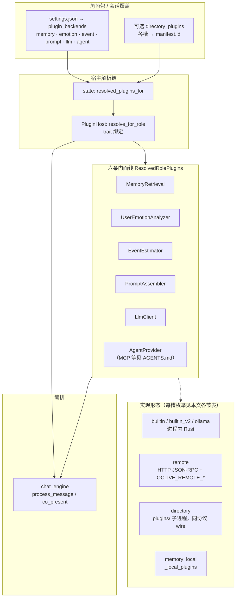

# PLUGIN_V1 — 编排层契约与后端枚举

**插件作者学习路径**：[PLUGIN_AUTHOR_LEARNING_PATH.md](PLUGIN_AUTHOR_LEARNING_PATH.md)

本文档描述宿主（Tauri / `chat_engine`）与可替换子系统之间的 **v1 契约**：类型命名、DTO 形状、`settings.json` 中的后端枚举。实现以源码为准：`src-tauri/src/domain/*_*.rs`、`src-tauri/src/models/plugin_backends.rs`。

**全库文档索引**：[../getting-started/DOCUMENTATION_INDEX.md](../getting-started/DOCUMENTATION_INDEX.md)。**架构总览（单核双态 · 后端/插件/设施三层 · 专家模型设施子模块）**：[../getting-started/OCLIVE_ARCHITECTURE_OVERVIEW.md](../getting-started/OCLIVE_ARCHITECTURE_OVERVIEW.md)。**以内核为中心、模块环绕的总览（图 + Mermaid）**：[../getting-started/KERNEL_AND_MODULES_ARCHITECTURE.md](../getting-started/KERNEL_AND_MODULES_ARCHITECTURE.md)。包版本与 `schema_version` 见 **[../role-pack/PACK_VERSIONING.md](../role-pack/PACK_VERSIONING.md)**。HTTP 侧车 JSON-RPC 全文见 **[REMOTE_PLUGIN_PROTOCOL.md](REMOTE_PLUGIN_PROTOCOL.md)**；创作者总览见 **[CREATOR_PLUGIN_ARCHITECTURE.md](CREATOR_PLUGIN_ARCHITECTURE.md)**。**目录式进程插件**（`plugin_backends.* = directory`、整壳、`directory_plugin_invoke` 等）见 **[DIRECTORY_PLUGINS.md](DIRECTORY_PLUGINS.md)**。

## 蓝图 v2 角色包（`pipeline.ocblueprint`）

自 **schema_version: 2** 起，角色包 **SSOT** 为 [`pipeline.ocblueprint`](../role-pack/ROLE_PACK_SPEC.md) 的 **`slot_registry`**（开放多实例键），不再使用 `settings.json` → `plugin_backends` 六键固定形状。宿主经 **`SlotResolver` / `SlotRunner`** 按实例解析；同 `type` 折叠为 `PluginBackends` 时 **last-wins**（`position` 最大者优先）。

| v1（legacy） | v2 蓝图 |
|--------------|---------|
| `plugin_backends.memory` … `agent` | `slot_registry.{实例键}.type` + `backend` |
| `directory_plugins.{module}` | 各 directory 槽的 `plugin` / `plugins` |
| 复杂情感（设施子模块，无六槽键） | `slot_registry` 中 `type: complex_emotion` 实例 |

架构图 **写盘**：`save_role_slot_registry`（Tauri）更新包内 `slot_registry`；写盘后宿主 **`invalidate_role_cache`** 并重新 **`load_role`**。工具栏可 **添加/删除** 槽位实例；**至少保留一个 `type: llm`**，**最后一个 llm 不可删除**（与 `oclive_validation` 一致）。会话覆盖仍为 `set_session_slot_override`（内存，不写盘）。

---

## 设计约束

- **v1 插件 = 编译期枚举**：legacy 通过 `settings.json` 选择实现；v2 通过 **`slot_registry`**。无动态 `cdylib`。
- **默认实现**即当前内置逻辑；换后端时 **API 字段名不变**（尤其 `SendMessageResponse.reply`）。
- **Remote**：宿主已实现 **HTTP JSON-RPC**（见 [REMOTE_PLUGIN_PROTOCOL.md](REMOTE_PLUGIN_PROTOCOL.md)）；未配置 `OCLIVE_REMOTE_*` URL 时回退 **builtin**（或进程内 LLM）并写日志。
- **Directory**：`plugins/*/manifest.json` 子进程 + 与 Remote 相同的 JSON-RPC wire；槽位见 `plugin_backends.directory_plugins`（[DIRECTORY_PLUGINS.md](DIRECTORY_PLUGINS.md)）。

## 架构图（以 `plugin_backends` 宿主槽为准）

运行时结构体 **`PluginBackends`**（[`plugin_backends.rs`](../../src-tauri/src/models/plugin_backends.rs)）含 **六** 个枚举字段；**`directory_plugins`** 与之并列，仅在对应槽为 **`directory`** 时解析 manifest **`id`**。编排层通过 **`PluginHost::resolve_for_role`** 将每槽绑定到具体 **`Arc<dyn …>`** 实现，再由 **`chat_engine`** 按 **`send_message` 编排顺序**（见同文档下一节）调用。**`complex_emotion`** 等脚手架专用键可被 Serde 忽略，**不是**宿主六槽之一；运行时对应 **第 1 设施子模块**（复杂情感专家模型设施子模块，见 [OCLIVE_ARCHITECTURE_OVERVIEW.md](../getting-started/OCLIVE_ARCHITECTURE_OVERVIEW.md)、[SETTINGS_REFERENCE.md](../cli/SETTINGS_REFERENCE.md) §二）。

### 模块编号对照（与架构总览一致）

| 编号 | `plugin_backends` 键 | 类型 |
|------|------------------------|------|
| 第 1 模块 | `memory` | 后端模块 |
| 第 2 模块 | `emotion` | 后端模块 |
| 第 3 模块 | `event` | 后端模块 |
| 第 4 模块 | `prompt` | 后端模块 |
| 第 5 模块 | `llm` | 后端模块 |
| 第 6 模块 | `agent` | 后端模块 |
| 第 1 设施子模块 | （无此键；编排行内） | 复杂情感专家模型设施子模块 |

**后端模块插件模块**（Remote / directory 等）挂在 **第 K 模块** 上，**不**占用第 7 模块号。完整规定见 [OCLIVE_ARCHITECTURE_OVERVIEW.md](../getting-started/OCLIVE_ARCHITECTURE_OVERVIEW.md)。



---

## `send_message` 编排顺序（与 `chat_engine`）

共景主路径见源码 [`chat_engine/co_present.rs`](../../src-tauri/src/domain/chat_engine/co_present.rs) 的 `process_co_present`。入口为 [`chat_engine::process_message`](../../src-tauri/src/domain/chat_engine/mod.rs)（异地分支为 `process_remote_stub` / `process_remote_life`，事件链有简化）。与 **PLUGIN_V1** 子系统相关的顺序如下（与 DTO 流一致）：

1. **`PluginHost`**：[`state::resolved_plugins_for`](../../src-tauri/src/state/mod.rs) → [`PluginHost::resolve_for_role`](../../src-tauri/src/domain/plugin_host.rs)，按 `role.plugin_backends` 绑定 **`memory` / `emotion` / `event` / `prompt` / `llm` / `agent`** 六条**后端模块**线。宿主构造 [`PluginHost::new`](../../src-tauri/src/domain/plugin_host.rs) 需传入 **应用数据根目录**（`PathBuf`），用于扫描 **`{app_data}/mcp-servers/*.json`** 等；集成烟测见 [`src-tauri/tests/plugin_backends_v2_resolve.rs`](../../src-tauri/tests/plugin_backends_v2_resolve.rs)。
2. **用户情绪（后端模块）**：`pl.emotion.analyze` → `EmotionResult`，对外为响应中的 `emotion`（`EmotionDto`）。
3. **人格微调（设施）**：`PersonalityEngine::adjust_by_user_emotion`（消费用户情绪，非后端模块）。
4. **复杂情感专家模型设施子模块**：`co_present` 内 `BuiltinKeywordComplexEmotionProvider`（或将来 Remote）；产出 `narrative_hint` 供后续 Prompt（**不经** `PluginHost`；见 [OCLIVE_ARCHITECTURE_OVERVIEW.md](../getting-started/OCLIVE_ARCHITECTURE_OVERVIEW.md)）。
5. **知识块**（可选 · 设施）：包内 `knowledge_index` 检索；可与事件估计的 augment 合并。
6. **事件影响（后端模块）**：`pl.event.estimate` → `EventImpactEstimate`；随后 `PersonalityEngine::evolve_by_event`（设施）。
7. **记忆检索（后端模块）**：仓储读出候选 → 场景加权 → `pl.memory.rank_memories`（`MemoryRetrievalInput`）。
8. **好感与关系阶段**（设施）：`compute_favor_and_relation`（输入含事件类型与影响因子等）。
9. **Prompt（后端模块）**：`pl.prompt.top_topic_hint` + `pl.prompt.build_prompt`（`PromptInput`，含 `previous_complex_emotion_narrative_hint`）。
10. **主 LLM（后端模块）**：`pl.llm.generate` 等；后续含 bot 侧情绪、立绘、短期记忆写入、位移意图等（见同文件后半段）。

门面与枚举的单一事实来源：`plugin_host.rs`、`models/plugin_backends.rs`、本文各节表格。

---

## 记忆检索 `MemoryRetrieval`

### 输入：`MemoryRetrievalInput`

| 字段 | 类型 | 说明 |
|------|------|------|
| `memories` | `&[Memory]` | 已由仓储读出并经场景权重等处理后的候选集 |
| `user_query` | `&str` | 当前用户句（用于 builtin_v2 等关键词加权） |
| `scene_id` | `Option<&str>` | 当前场景 id；可选参与未来检索策略 |
| `limit` | `usize` | 注入主 prompt 的最大条数 |

### 输出

- **排序后的** `Vec<Memory>`，长度不超过 `limit`。
- 结构化上下文 `MemoryContext`（`build_context`）与 `models::MemoryContext` 一致：`memories` + `total_tokens` 估计。

### 后端枚举 `memory`（`settings.json` → `plugin_backends.memory`）

| 值 | 含义 |
|----|------|
| `builtin` | 按 `importance * weight` 排序取 Top-K（与历史 `MemoryEngine::get_relevant_memories` 一致） |
| `builtin_v2` | 在 builtin 思路上增加 **用户查询与正文** 的轻量重合加权（第二套内置） |
| `remote` | HTTP `memory.rank`（需 `OCLIVE_REMOTE_PLUGIN_URL`；失败回退 `builtin`） |
| `directory` | HTTP `memory.rank` 指向 **`directory_plugins.memory`** 对应 manifest 子进程 URL（失败回退 `builtin`；见 [DIRECTORY_PLUGINS.md](DIRECTORY_PLUGINS.md)） |
| `local` | 使用已注册的本地 memory provider（`roles/_local_plugins/*.json`）；**当前阶段**排序仍委托 `builtin_v2` 逻辑，多 provider 时按 `provider_id` 字典序取第一个并打警告（见 [LOCAL_PLUGIN_BRIDGE_SPEC.md](LOCAL_PLUGIN_BRIDGE_SPEC.md)） |

与 `plugin_backends.memory` **同级**可选字段：

| 字段 | 类型 | 说明 |
|------|------|------|
| `local_memory_provider_id` | `string`（可选） | 仅 `memory = local` 时有意义：指定已注册的 `provider_id`；省略且仅一个 memory provider 时自动选中；多 provider 时建议必填以避免歧义 |
| `directory_plugins` | `object`（可选） | 槽位 `memory` / `emotion` / `event` / `prompt` / `llm` / **`agent`**：值为对应目录插件的 **`manifest.id`**（字符串）。任一模块为 `directory` 时对应槽位应非空，否则宿主记警告并回退（见 [DIRECTORY_PLUGINS.md](DIRECTORY_PLUGINS.md)）。 |

---

## 用户情绪 `UserEmotionAnalyzer`

### 输出

与 `EmotionResult` / `EmotionDto` 对齐：

- 七维分数：`joy`, `sadness`, `anger`, `fear`, `surprise`, `disgust`, `neutral`（`f32` / `f64` 在各自层约定）。
- 主导情绪通过既有 `Emotion` 枚举映射；**不得**引入未在 `models/emotion.rs` 定义的变体名对外暴露。

### 后端枚举 `emotion`

| 值 | 含义 |
|----|------|
| `builtin` | 关键词启发式（现有 `EmotionAnalyzer`） |
| `builtin_v2` | 第二套内置：强中性输出（`BuiltinUserEmotionAnalyzerV2`；用于验证枚举可切换） |
| `remote` | HTTP `emotion.analyze`（需 `OCLIVE_REMOTE_PLUGIN_URL`；失败回退 builtin） |
| `directory` | HTTP `emotion.analyze` 指向 **`directory_plugins.emotion`** 插件 URL（失败回退 builtin） |

---

## 事件影响 `EventEstimator`

### 输入（概念）

与 `estimate_event_impact` 一致：`LlmClient`、`ollama_model`、用户句、`Emotion`、`PersonalityVector`、**`personality_source`（`vector` | `profile`，与包内 `evolution.personality_source` 一致）**、近期轮次与事件列表。Remote 的 `event.estimate` 在 JSON-RPC `params` 中与 `personality` 并列携带该字段（见 [REMOTE_PLUGIN_PROTOCOL.md](REMOTE_PLUGIN_PROTOCOL.md) §4.3）。

### 输出：`EventImpactEstimate`

- `event_type: EventType`
- `impact_factor: f64`
- `confidence: f32`

### 后端枚举 `event`

| 值 | 含义 |
|----|------|
| `builtin` | 现有 `event_impact_ai::estimate_event_impact` 链（含环境开关与规则回退） |
| `builtin_v2` | 第二套内置：在 builtin 结果上将 `impact_factor` ×0.5（`BuiltinEventEstimatorV2`） |
| `remote` | HTTP `event.estimate`（需 `OCLIVE_REMOTE_PLUGIN_URL`；失败回退 builtin） |
| `directory` | HTTP `event.estimate` 指向 **`directory_plugins.event`** 插件 URL（失败回退 builtin） |

---

## Prompt 组装 `PromptAssembler`

### 输入 / 输出

- 输入：`PromptInput`（与 `PromptBuilder` 一致，**五个参数级字段**在 `PromptInput` 结构体上；`build_prompt` 最后一参在实现内部为 `&PromptInput`）。
- 输出：`String`（主对话 system/user 拼装结果）。

附加：`top_topic_hint(role, scene_id) -> Option<String>` 与现 `PromptBuilder::top_topic_hint` 对齐。

### 后端枚举 `prompt`

| 值 | 含义 |
|----|------|
| `builtin` | 现有 `PromptBuilder` |
| `builtin_v2` | 第二套内置：在 builtin 正文前追加 `[oclive:prompt:builtin_v2]` + 换行前缀（`BuiltinPromptAssemblerV2`） |
| `remote` | HTTP `prompt.build_prompt` / `prompt.top_topic_hint`（需 `OCLIVE_REMOTE_PLUGIN_URL`；失败回退 builtin） |
| `directory` | 同上，指向 **`directory_plugins.prompt`** 插件 URL（失败回退 builtin） |

---

## 主对话 LLM `LlmClient`

### 职责

- `generate`：主回复、异地模式、独白等所有「生成型」调用。
- `generate_tag`：短输出分类（位移意图、立绘标签等）。

### 后端枚举 `llm`

| 值 | 含义 |
|----|------|
| `ollama` | 应用启动时注入的默认客户端（通常为 `OllamaClient` 包装） |
| `remote` | HTTP `llm.generate` / `llm.generate_tag`（需 `OCLIVE_REMOTE_LLM_URL`；未配置则委托进程内默认 LLM 并记日志）。环境变量 **`OCLIVE_LLM_BACKEND=remote|ollama|directory`** 可在加载角色时覆盖本字段（例如由 **oclive-launcher** 注入）。 |
| `directory` | HTTP `llm.generate` / `llm.generate_tag` 指向 **`directory_plugins.llm`** 插件 URL（失败回退 **ollama**） |

---

## Agent 编排 `AgentProvider`

工具调度 / ReAct 等任务编排；与主对话 LLM 分离，由 `plugin_backends.agent` 选择实现。详见仓库根 [`AGENTS.md`](../../AGENTS.md) 中 **Agent / Skill** 小节。

### 后端枚举 `agent`

| 值 | 含义 |
|----|------|
| `builtin` | 进程内 [`BuiltinReActAgent`](../../src-tauri/src/domain/agent.rs)；可配合 MCP 工具（配置目录见上节 `PluginHost::new` 的 app data 根） |
| `remote` | HTTP JSON-RPC 侧车（与其它 `remote` 子系统同一套 wire 约定；需环境变量与侧车可用，否则回退/降级行为以源码为准） |
| `directory` | 子进程 JSON-RPC，槽位 **`directory_plugins.agent`**（失败回退 builtin；见 [DIRECTORY_PLUGINS.md](DIRECTORY_PLUGINS.md)） |

---

## `settings.json` 片段示例

```json
{
  "schema_version": 1,
  "plugin_backends": {
    "memory": "builtin",
    "emotion": "builtin",
    "event": "builtin",
    "prompt": "builtin",
    "llm": "ollama",
    "agent": "builtin"
  }
}
```

省略 `plugin_backends` 时：记忆 / 情绪 / 事件 / Prompt / **Agent** 为 **builtin**，**`llm` 为 `ollama`**。未知枚举值会导致角色包解析失败（须修正拼写）；未来可对字符串值做宽松别名时再文档化。

---

## 会话级 `plugin_backends` 覆盖（Tauri）

宿主命令 **`set_session_plugin_backend`**（实现见 [`src-tauri/src/api/role/mod.rs`](../../src-tauri/src/api/role/mod.rs)），请求体 **`SetSessionPluginBackendRequest`**（[`src-tauri/src/models/dto.rs`](../../src-tauri/src/models/dto.rs)）。覆盖按 **`role_id` + 可选 `session_id`** 对应的会话命名空间持久化，**不写回角色包**；`load_role` / **`get_role_info`**（请求体 **`GetRoleInfoRequest`**，可选 **`session_id`**，与 `send_message` 同命名空间）返回中的 **`plugin_backends_effective`**、**`plugin_backends_effective_sources`** 等为包默认与会话覆盖合并后的快照。

### 请求字段（摘要）

| 字段 | 说明 |
|------|------|
| `role_id` | 角色 id |
| `module` | `memory` \| `emotion` \| `event` \| `prompt` \| `llm` \| `agent` |
| `backend` | 见下表 **三态**（与 Serde `Option<Option<String>>` 对齐：缺键 / `null` / 字符串） |
| `session_id` | 可选；缺省为默认会话 |
| `local_memory_provider_id` | **仅当 `module = memory` 时允许**：省略表示不修改本会话对该字段的覆盖；**空串**（trim 后为空）表示移除本会话覆盖、回退包内 `local_memory_provider_id`；否则为 trim 后的 `provider_id`。其它 `module` 携带本字段会返回参数错误。 |

### `backend` 三态（各 `module` 通用）

| 请求中的 `backend` | 行为 |
|--------------------|------|
| JSON **省略**该键 | **不修改**该模块在会话覆盖里的枚举字段 |
| `null` | **移除**该模块的会话枚举覆盖，回退角色包 `plugin_backends` 对应字段 |
| `"snake_case"` | 设为指定后端；非法值报错 |

前端封装见 **`setSessionPluginBackend`**、**`getRoleInfo`**（[`src/utils/tauri-api.ts`](../../src/utils/tauri-api.ts)）：前者仅在传入时序列化 `backend` / `local_memory_provider_id`；后者可选第二参 **`sessionId`** 与 `send_message` 对齐。

### `directory` 与 `directory_plugins`

- **`set_session_plugin_backend`** 只改 **`memory` / `emotion` / `event` / `prompt` / `llm` / `agent`** 的枚举值（及 **`local_memory_provider_id`**），**不包含** **`directory_plugins` 各槽**。若某模块设为 **`directory`**，槽位 id 仍来自角色包 **`plugin_backends.directory_plugins`**（见 [DIRECTORY_PLUGINS.md](DIRECTORY_PLUGINS.md)）。
- 运行时结构体 **`PluginBackendsOverride`** 已预留会话级 **`directory_plugins`** 合并逻辑；待产品化 API 暴露后再与 `set_session_plugin_backend` 或专用命令对齐即可。

---

## 前端对齐

TypeScript 侧 `SendMessageResponse`（`src/utils/tauri-api.ts`）必须与 `models/dto.rs` 一致：**回复字段名为 `reply`**；`presence_mode`、`reply_is_fallback`、`schema`、`api_version` 用于展示策略（见 `src/utils/replyPresentation.ts`）。

---

## 前端 UI 模板配置（Plugin Manager V2）

为降低创作者接入成本，V2 面板支持通过 manifest 声明 UI 模板并按 schema 渲染。后端新增插件时，优先复用同类型模板。

### `ui_template` 可选值

| 值 | 适用场景 |
|---|---|
| `endpoint-config` | 需要填写服务地址（如远程 HTTP 侧车） |
| `provider-selector` | 从多个后端实现中选择一个（如 builtin / remote / directory） |
| `slot-selector` | 以“槽位”语义选择后端（面向非技术用户） |
| `switch-toggle` | 布尔开关（如启用远程模式） |

### `ui_schema` 字段定义（示例）

`ui_schema.fields` 建议使用数组，每个字段建议包含以下键：

| 键 | 类型 | 说明 |
|---|---|---|
| `key` | `string` | 配置字段唯一键 |
| `label` | `string` | 展示给用户的标题 |
| `type` | `string` | 字段类型（如 `text` / `select` / `switch`） |
| `required` | `boolean` | 是否必填 |
| `default` | `any` | 默认值 |

示例：

```json
{
  "ui_schema": {
    "fields": [
      {
        "key": "endpoint_url",
        "label": "服务地址",
        "type": "text",
        "required": true,
        "default": "http://127.0.0.1:8000"
      },
      {
        "key": "backend",
        "label": "后端方案",
        "type": "select",
        "required": true,
        "default": "builtin_v2"
      }
    ]
  }
}
```

### `provides` 与 `category`

目录插件 **`manifest.json` → `provides`**：声明本插件可挂载的槽位类型（字符串数组）。宿主与 `oclive-cli plugin create --provides` 支持的合法值包括：

| `provides` 值 | 说明 |
|---------------|------|
| `memory` | 记忆检索 |
| `emotion` | 用户情绪分析 |
| `event` | 事件影响估计 |
| `prompt` | Prompt 组装 |
| `llm` | 主 LLM |
| `agent` | Agent / MCP 工具链 |
| **`complex_emotion`** | **复杂情感**（共景 `narrative_hint`）；蓝图 v2 中对应 `slot_registry` 的 `type: complex_emotion`，`backend: directory` 时须在 `provides` 中含此项 |

解析时 [`SlotResolver`](../../src-tauri/src/domain/slot_resolver.rs) 会校验 directory 插件是否声明 `provides` 含目标能力（含 `complex_emotion`）。

**`category`**（单值，可选）：供插件工作台左栏分类，建议与 `provides` 主槽一致，例如 `llm`、`complex_emotion`。

### `description_zh` 字段

用于卡片大白话展示，面向创作者与普通用户，建议一句话说明“这项配置会影响什么”。

示例：

```json
{
  "description_zh": "决定回复由本地模型还是远程服务生成。"
}
```

### 完整 manifest 示例（节选）

```json
{
  "id": "example.llm.remote.bridge",
  "name": "示例 LLM 远程桥",
  "version": "0.1.0",
  "category": "llm",
  "description_zh": "用于把回复生成切换到远程 HTTP 服务。",
  "ui_template": "endpoint-config",
  "ui_schema": {
    "fields": [
      {
        "key": "endpoint_url",
        "label": "服务地址",
        "type": "text",
        "required": true,
        "default": "http://127.0.0.1:8000"
      }
    ]
  },
  "plugin_backends": {
    "llm": "remote"
  }
}
```

### `RoleInfo` / `RoleData` 与本地 HTTP `POST /chat`

- Tauri **`get_role_info`**（`GetRoleInfoRequest`，可选 **`session_id`**）、**`load_role`** 返回体含 **`personality_source`**：JSON 字符串 **`vector`** | **`profile`**，与角色包 **`evolution.personality_source`** 一致（见 `src-tauri/src/models/dto.rs`）。
- 启动参数 **`--api`** 时，**`POST /chat`** 成功响应在扁平化的 `SendMessageResponse` 字段之外另含 **`personality_source`**（同上），便于编写器试聊等工具区分人格模式；实现见 `src-tauri/src/http_api.rs`。
- Remote **`prompt.build_prompt`**：`params` 中含完整 **`role`**（其 `evolution_config.personality_source` 亦可读），并另含顶层 **`personality_source`** 与 `personality` 并列，侧车无需仅从嵌套 `role` 解析（`src-tauri/src/infrastructure/remote_plugin/prompt_http.rs`）。

---

## 权限规范（目录插件 · A4.2）

目录插件 **`manifest.json`** 可选字段 **`permissions`** 声明宿主侧需启用的高危能力。校验 crate **`oclive_validation::plugin_permissions`** 与运行时 **`high_risk_grants.json`** 使用**同一套权限标识**；运行时实际检查的标识为权威来源。

| 权限标识 | 说明 | 是否需要用户授权 | 默认值 |
|----------|------|------------------|--------|
| `process:spawn` | 允许宿主为该插件 spawn 子进程（`process` 块） | 是 | 未授权 |
| `network:*` | 允许 Remote 后端或插件侧出站 HTTP（见下） | 是 | 未授权 |
| `mcp:http` | 允许 MCP server `transport=http` 出站 | 是（按 server `id`） | 未授权 |
| `mcp:stdio` | 允许 MCP server `transport=stdio` 子进程 | 是（按 server `id`） | 未授权 |

### `manifest.json` 格式

```json
{
  "schema_version": 1,
  "id": "com.example.myplugin",
  "version": "1.0.0",
  "permissions": ["process:spawn", "network:*"],
  "process": {
    "command": "node",
    "args": ["rpc_server.mjs"]
  }
}
```

- **`permissions` 省略**：视为 **`[]`**，校验**不报错**（无显式高危声明）。
- **旧版兼容**：若省略 `permissions` 且存在 **`process`** 块，宿主仍按 **`process:spawn`** 路径要求用户在 **`high_risk_grants.json`** 中授权该插件 `id`（与 A4.1 行为一致）；**新插件应显式声明** `process:spawn`。
- **Remote 侧车**：`plugin_backends.* = remote` 且配置了 `OCLIVE_REMOTE_*` 时，出站 JSON-RPC 前检查 **`network:*`**；grant **`id`** 为 **`remote:plugin`**（共用 plugin 端点）或 **`remote:llm`**（LLM 端点）。
- **MCP**：与目录插件 manifest 无关；按 `{app_data}/mcp-servers/*.json` 的 server **`id`** 检查 **`mcp:http`** / **`mcp:stdio`**。
- **持久化**：`{app_data}/high_risk_grants.json` 顶层键与权限标识一致（如 `"process:spawn": ["com.example.myplugin"]`）。Tauri **`grant_high_risk_capability`** 的 `kind` 接受规范标识；旧键名 `mcp_http` 等仍可读。

### `plugin_dependencies`（可选）

目录插件 `manifest.json` 可增加 **`plugin_dependencies`**：字符串数组，列出须先安装的其它插件 **`id`**。CLI **`oclive plugin install <id>`** 会拓扑排序后按序复制安装；**循环依赖**报错；**`plugin uninstall`** 若仍有其它插件声明依赖该 id 会给出警告。

```json
{
  "id": "com.example.aggregator",
  "plugin_dependencies": ["com.oclive.example.llamacpp_llm"]
}
```

校验：`crates/oclive_validation/src/plugin_dependencies.rs`。

实现与测试：`crates/oclive_validation/src/plugin_permissions.rs`、`src-tauri/src/infrastructure/high_risk_grants.rs`、集成测 `src-tauri/tests/permission_three_way_consistency.rs`。

---

[English](../../creator-docs-en/plugin-and-architecture/PLUGIN_V1.md)
