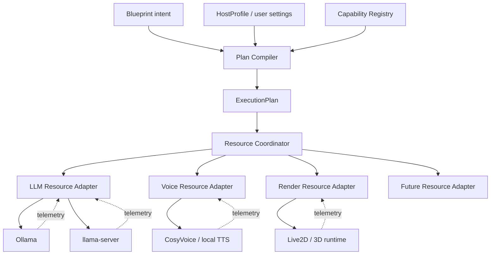

# RFC：蓝图扩展外壳与统一资源协调

| 元数据 | 值 |
|--------|-----|
| 状态 | **边界已确认 · v4 蓝图外壳已实现 · 资源诊断 v5 与通用协调控制面已实现** |
| 最后更新 | 2026-07-31 |
| 受众 | 内核、编写器、发行版、目录插件与商业扩展开发者 |
| 维护范围 | 蓝图扩展最小外壳、能力解析、`ExecutionPlan`、资源协调器与适配器分责 |
| 非维护范围 | 第三方扩展载荷内部格式、具体 GPU 分配算法、现有 v3 双核 DSL |

[English](../../creator-docs-en/rfc/RFC_BLUEPRINT_EXTENSION_AND_RESOURCE_COORDINATION.md)

---

## 1. 决策摘要

1. OCLive 只维护稳定、严格、可迁移的**蓝图扩展外壳**；扩展载荷格式、实现、UI、迁移和支持由扩展作者维护。
2. 蓝图是**设计图纸**：只声明能力意图、依赖、是否必需和配置引用，不直接发出进程、显存或卸载命令。
3. 宿主将蓝图、`HostProfile`、用户设置、能力注册表与设备状态编译为进程内 **`ExecutionPlan`**；该计划不是磁盘格式，也不允许第三方直接写入。
4. GPU 首期纳入统一 **Resource Coordinator**；契约同时预留系统内存、CPU、多设备和受管进程，避免以后再造第二套调度。
5. 资源协调采用**集中决策、适配器执行**：协调器拥有预算、租约、优先级和降级决策；LLM、语音、Live2D 等适配器只负责本领域探测与执行。
6. 资源总线只传控制面消息；模型 token、PCM、渲染参数等业务数据继续走各自的数据通道。
7. 新能力必须实现 Capability Provider；只有消耗或控制共享资源时才需要 Resource Adapter。

这套外壳借鉴 Chat Pro `adult_extension.json` 的分层原则，但二者不是同一种扩展：

| 类型 | 内容 | 归属 |
|------|------|------|
| 角色内容扩展 | 成人人设、对话、场景走向等发行版可选内容 | 角色包 / 对应发行版 |
| 蓝图能力扩展 | Live2D、专用推理、硬件或新侧通道等系统能力声明 | 蓝图 / Provider / 宿主 |

共同原则是“通用底座保持可运行，扩展载荷由其所有者维护”。

---

## 2. 核心边界

| 层 | OCLive 核心负责 | 扩展作者负责 |
|----|----------------|--------------|
| 扩展外壳 | 命名、必需/可选语义、安全相对路径、版本字段、诊断与 round-trip | 外置配置文件的字段和 schema |
| 能力注册 | Capability ID、Provider 发现、Host 兼容与权限边界 | Provider 实现、版本适配、行为测试 |
| 计划编译 | 依赖检查、Provider 选择、降级结果、稳定主链约束 | 声明真实依赖和可接受配置 |
| 资源协调 | 全局预算、租约、优先级、公平性、抢占/降级决策 | 资源估算、探测、启动/暂停/卸载/降级动作 |
| UI | 通用扩展卡、缺失/降级诊断、权限确认入口 | 专用配置 UI 与业务交互 |
| 发布 | 外壳兼容契约与安全门禁 | 许可证、分发、文档、售后与载荷迁移 |

技术架构允许第三方独立开源、闭源或商业分发；是否允许某种商业组合仍取决于核心与扩展各自许可证、商店政策和适用法律。OCLive 不替第三方扩展背书，也不能因“第三方维护”而放弃宿主权限、路径和进程安全边界。

---

## 3. 蓝图扩展最小外壳

### 3.1 Stable v4 磁盘形状

以下外壳已进入 **`schema_version: 4`**。v4 是 v2 的 Stable 后继；v3 继续冻结为双核 Beta，不从 v3 继承 `pipeline`、`zone` 或 `dual_core`。

```json
{
  "extensions": {
    "com.example.live2d.main": {
      "capability": "render.live2d",
      "provider": "com.example.live2d",
      "required": false,
      "config_schema_version": 1,
      "config_ref": "blueprint/extensions/com.example.live2d.main/config.json"
    }
  }
}
```

| 字段 | 所有者 | 语义 |
|------|--------|------|
| map key | 核心外壳 | 扩展实例 ID；须稳定且在本蓝图内唯一，推荐反向域名 |
| `capability` | 核心外壳 | 所需语义能力，如 `render.live2d`、`voice.synth` |
| `provider` | 核心外壳 | 可选 Provider ID；省略时由宿主按能力与策略解析 |
| `required` | 核心外壳 | 默认 `false`；控制缺失能力时拒绝激活还是可见降级 |
| `config_schema_version` | 扩展所有者 | 外置载荷格式版本；核心只校验为正整数 |
| `config_ref` | 核心外壳 | 包根内安全相对路径；不得逃逸、不得指向脚本执行入口 |

首版外壳不接受任意内联 `config` 大对象，也不接受第三方在 `extensions.*` 下增加未登记的核心控制字段。扩展作者要增加内部字段，应修改 `config_ref` 指向的载荷和自己的 schema，而不是扩大 OCLive 根 schema。

### 3.2 目录

```text
role/
├── pipeline.ocblueprint
└── blueprint/
    └── extensions/
        └── com.example.live2d.main/
            ├── config.json
            └── README.md
```

扩展载荷可以随角色包分发，也可以由发行版或插件安装器提供；无论来源如何，最终 Provider、权限和版本必须在计划编译阶段解析，不能仅凭文件存在就执行。

### 3.3 必需与可选

| 情况 | 行为 |
|------|------|
| 未知或缺失的 `required: false` | 保留外壳与载荷；从有效计划移除；显示原因和可安装 Provider |
| 未知或缺失的 `required: true` | 角色元数据仍可打开用于修复；该蓝图不得激活或开始聊天 |
| Provider 存在但权限未授予 | 不绕过授权；按 required 语义拒绝激活或降级 |
| Provider 运行时失败 | 走结构化 fallback / degraded；不得静默假装扩展已运行 |

编写器、CLI 和宿主保存蓝图时必须原样保留自己不认识的可选扩展及其文件。只有用户明确删除扩展时才能移除。

**当前实现边界（2026-07-31）**：

- Rust/JSON Schema、CLI/doctor、Host 与角色包编写器已支持 v4 外壳、路径安全和未知载荷 round-trip。
- 宿主已实现目录 Provider 的 Capability Registry、确定性 Provider 选择、权限/依赖/启停检查、required/optional 激活门禁，以及 Tauri/CLI 只读结构化诊断；同一角色包可按 `HostProfile` 得到不同计划。
- 计划只有在宿主已登记真实消费者时才将 capability 标为 active。首个登记项为 Chat Pro `voice.asr`；任意 manifest `provides` 不能自行扩张内核。
- `ExecutionPlan` 仍只解析能力与有效六槽，不启动 Provider、不写回角色包；纯编译与 CLI doctor 明确保留 `resource_coordination: not_evaluated` 且不生成设备计划。桌面 Tauri 诊断会刷新宿主 Resource Coordinator，把同一份只读 `candidate_plan` 接入 `ExecutionPlan.resource_plan`。
- 宿主已提供 NVIDIA 多设备、系统 RAM 与 CPU 快照，以及原子准入、租约、优先级、压力和资源诊断 v5；`HostProfile` 提供各资源安全余量、租约 TTL、排队/老化、自动抢占和有限调度意图。Resource Adapter Registry 登记控制模式、注册来源、adapter-local 档位、驻留能力、生命周期动作和当前租约，并只读校验调度意图；注册表本身不调度。
- 首个资源适配闭环覆盖宿主管理的 llama-server 冷启动、只能观测的 Ollama/LLM 前台活动，以及官方 bundled CosyVoice2 的 `voice.warm` / `voice.speak`。租约携带 `profile_id`，已登记适配器的未知档位会被拒绝；云 TTS、用户自建 HTTP TTS 与社区插件不被误认为宿主可控资源。
- 候选计划编译器会把有效意图、当前档位/租约、最新 GPU/RAM/CPU 容量和控制器可用性编译为确定性的档位选择、建议转换、回滚动作与稳定原因码；输出携带 `compiled_from_revision`，只读查看不会执行任何 lifecycle。
- 通用执行基础已登记单写者 `ResourceAdapterController`、所有者命名空间约束的第三方 `ResourceAdapterRegistrar`、精确的“请求方 → 目标 → 动作”授权、适配器串行锁、过期计划拒绝和逆序回滚。进程内注册入口不加载插件、不解释未信任 manifest，也不自动授予跨适配器控制权；目录 manifest 资源声明仍未实现。
- Performance llama 已提供 `gpu_full` / `gpu_balanced` / `cpu_compatibility` 三个真实运行档，实际改变 `llama-server --n-gpu-layers` 并在准入拒绝时向低档回退。统一准入队列支持优先级、公平老化、超时和取消清理；自动抢占仅作用于低优先级、可逆且精确授权的 managed 适配器，并在失败或使用结束后逆序恢复。
- 通用契约已支持 `render` / `compute` / `hybrid`，并通过第三方 Render 适配器容量与抢占恢复测试验证没有把协调器写死为 LLM/Voice。Chat Pro 尚未捆绑 Live2D runtime，现有 `Live2DStageAdapter` 继续明确回退 PNG。适配器直连共享显存短压测和内核内并发/故障/10,000 次转换 soak 已完成；长时间真实进程/硬件 soak 与远端 CI 留在最终里程碑。

---

## 4. Capability Provider

Capability Provider 是业务能力的实现边界，不等于 Resource Adapter。

| 能力例子 | Provider 需要做什么 | 必须接资源协调器？ |
|----------|--------------------|--------------------|
| 纯文本格式化 | 输入/输出契约与实现 | 否 |
| R18 内容注入 | 发行版门控、Prompt/状态消费 | 通常否 |
| Live2D 渲染 | 角色状态 → 渲染指令/运行时 | 使用共享 GPU 时是 |
| LLM 推理 | prompt → token/reply | 本地模型是；云 API 通常只需网络配额 |
| TTS | 文本/指令 → 音频 | 本地模型是；云 TTS 通常否 |

Provider manifest 的职责：

- **当前 `schema_version: 1`**：`provides`、Provider `version`、目录 `process`、插件依赖与 `permissions` 已进入 Registry 诊断；字段和权限语义以 [`PLUGIN_V1`](../plugin-and-architecture/PLUGIN_V1.md) 为准。
- **已实现的代码入口**：第三方宿主扩展可通过进程内 `ResourceAdapterRegistrar`，以自己的 canonical owner namespace 登记资源描述和可选的单写者控制器；重复同一登记幂等，跨 owner、冒用 `builtin.*` 或不具备可逆性的自动抢占声明会被拒绝。
- **尚未实现的磁盘/加载入口**：宿主/API semver range、目录 manifest 资源声明与从 manifest 自动装配 Resource Adapter。当前内置 LLM/Voice 适配不扩大目录插件 schema；显示 Provider 版本仍不代表 API 兼容性已协商。

本 RFC 不提前把尚未实现的字段写成现行插件契约。

---

## 5. `ExecutionPlan`

`ExecutionPlan` 是宿主内部的规范化执行计划：

```text
角色内容 + 蓝图意图
        + HostProfile
        + 用户设置/会话覆盖
        + Capability Registry
        + 设备与资源快照
                  ↓
           Plan Compiler
                  ↓
           ExecutionPlan
```

它至少要解析：

- 稳定核心节点与允许的有限流程模板。
- 已选择的 Provider、版本和权限状态。
- 必需/可选依赖及降级结果。
- 资源声明、生命周期与优先级类别。
- 用户可见诊断和不能激活的原因。

`ExecutionPlan` 不落盘、不放进角色包、不成为第三方 schema。蓝图只表达意图；计划编译器拥有依赖闭包与实际选择。

当前 `co_present_stable` 计划已包含六槽有效后端、扩展 Provider/版本、候选、权限/依赖原因与是否可激活。设备与租约仍由宿主 Resource Coordinator 单独评估，不写回蓝图；只读诊断不执行 Provider。纯 Plan Compiler / CLI doctor 不探测设备，桌面诊断才刷新设备状态。

当前 Stable 顺序继续由 `process_message` / `turn_pipeline` 维护。未来“快速反应”“情感优先”等有限自由应通过宿主登记的模板或受约束偏序实现，不能恢复任意 `steps[]`。本 RFC 不复用或解冻 v3 `pipeline.stable` / `pipeline.experimental`。

---

## 6. Resource Coordinator

### 6.1 定位

统一资源协调器是进程内控制面，不是：

- `resolve_kernel_action` 的进程 attach/replace 调度。
- 蓝图执行器。
- LLM 输出融合器。
- 业务数据消息总线。
- 每个扩展都必须实现的接口。

首期解决本地 LLM 与语音模型的共享显存；契约同时覆盖后续 Live2D/3D、视觉模型、ASR 与其它硬件能力。

### 6.2 集中决策、适配器执行



协调器负责：

- 全局设备快照与预算。
- 显存/内存租约和释放。
- 前台交互、后台预热、常驻渲染等优先级。
- 公平排队、超时、取消、抢占和恢复。
- 选择 GPU 分层、精度、帧率、CPU/云端或关闭等降级。
- 将最终决策和原因暴露给诊断/UI。

适配器负责：

- 探测本领域运行时、模型与实际占用。
- 给出最小/推荐/峰值和启动成本估算。
- 声明是否可暂停、可卸载、可降级、可迁移设备。
- 执行 `start`、`resume`、`suspend`、`unload`、`degrade`、`release`。
- 报告真实结果；不能把“已请求卸载”冒充“已释放显存”。

外部 Ollama、外部 llama-server 或第三方渲染进程可能只可观察、不可控制。适配器必须显式报告 `managed` / `observe_only`，协调器不得假设自己拥有所有 GPU 进程。

### 6.2.1 有限调度意图

调度自由度使用小型、可组合、可静态校验的词汇表，不接受任意 DAG、脚本或显存数值命令。发行版当前可在 `HostProfile` 的 `[resource_coordination]` 中声明：

| 类型 | 值 / 命令 | 语义 |
|------|-----------|------|
| 策略 | `compatibility_first` | 默认；优先维持现有可运行路径 |
| 策略 | `primary_first` | 保护 `primary_adapter_id` 指定的主适配器 |
| 策略 | `latency_first` | 表达低首响偏好；实际档位仍由协调器决定 |
| 策略 | `custom` | 要求至少提供一条有限命令 |
| 命令 | `require(adapter)` | 该适配器必须已注册 |
| 命令 | `residency(adapter, resident/on_demand)` | 声明常驻或按需驻留偏好 |
| 命令 | `coexist(adapters)` | 允许一组适配器并存 |
| 命令 | `exclusive(adapters)` | 要求一组受管适配器不并存 |
| 命令 | `yield_then_run(yielding, target)` | 声明先让出资源、再运行目标的偏序 |
| 命令 | `fallback(adapter, profiles)` | 给出同一适配器内部的档位回退顺序 |

这些“命令”是**声明式约束与偏好**，不是直接下发给进程的 lifecycle 操作。物理安全与已确认的设备状态 > 适配器 `managed` / `observe_only` 控制边界 > HostProfile/用户策略 > 蓝图意图；任何下层意图都不能越过上层事实。

资源诊断 v5 分成两层：`scheduling.state = ready | degraded | blocked` 只回答“声明是否能被当前注册表接受”；`candidate_plan.state` 再把声明与当前租约、GPU/RAM/CPU 容量、真实可选档位、控制器和回滚能力合并，给出只读候选计划。`candidate_plan.executable=true` 只表示当前计划完成了所需档位选择，且每个转换都有已登记控制器和回滚动作，仍不表示计划已经运行。执行时必须再次核对 `compiled_from_revision`，并由最终适配器准入复核物理容量。

蓝图未来只引用宿主登记的有限模板或表达同等级约束，不直接写入 `HostProfile`、显存数值、`start` / `unload` 等动作。当前没有为角色包新增资源调度字段，避免在执行器尚未完成时固化又一套磁盘 schema。

### 6.2.2 当前首期实现边界

- `NvidiaSmiResourceSnapshotSource` 最佳努力读取 GPU 快照，不可用时显式返回 unavailable；同一快照通过 `sysinfo` 补充系统可用/总 RAM 与逻辑/物理 CPU 数，不把 GPU 探测失败伪造成整机 0 容量。
- 冷启动准入在一个公平队列后按目标 GPU、系统 RAM、CPU、安全余量和并发 pending reservation 原子判断。队列按优先级排序并通过等待老化避免饥饿，支持超时与取消安全清理；`OCLIVE_GPU_DEVICE_INDEX` / `CUDA_VISIBLE_DEVICES` 可指定目标设备。
- managed llama-server 启动前从 HostProfile/环境选取 `gpu_full`、`gpu_balanced` 或 `cpu_compatibility`，并在容量拒绝时向后续档位回退；每档实际改变 `--n-gpu-layers`。模型切换、启动失败、超时、降级或停用时释放租约；外部 Ollama 只登记前台活动且不在 token 热路径启动 `nvidia-smi`。
- 官方 `com.oclive.voice.asr` 的 bundled CosyVoice2 才接宿主准入。宿主租约只替代 mixed-fp16 的旧固定冷启动门槛；FP32 扩张继续走侧车更严格的二次门禁。
- 取消/调用失败通过 RAII 释放 pending lease；关闭 TTS 或切换到非 bundled provider 时，宿主下发带 adapter/runtime profile 的 `unload`，侧车等待当前合成结束、校验目标模型并释放模型，宿主仅在收到匹配成功确认后撤销语音租约；未确认时保守保留租约并写入 `resource_release_unconfirmed`。同一适配器的冷启动 RPC 与配置转换共用串行锁，避免卸载确认、租约复用及连续配置保存之间的竞态。
- 当前不会为了加载语音强杀正在进行的 LLM 请求，也不会声称能卸载任意外部 Ollama。自动抢占只在 GPU/RAM/CPU 容量不足时考虑低优先级 active managed 租约，目标适配器必须显式声明 `automatic_preemption` 可逆动作、登记对应恢复动作，并拥有精确 requester → target 授权；同级/高优先级和 observe-only 资源不动。执行失败时逆序回滚，成功完成后由调用链逆序恢复。批量执行器仍不对角色包、插件或 HTTP 客户端开放。适配器直连共享显存短压测结果见 [`handoff/TTFT_BENCHMARK.md`](../../handoff/TTFT_BENCHMARK.md)。
- Performance LLM 已提供统一请求门禁：资源转换先拒绝新的生成/探针请求，等待已经进入的 primary 或 Ollama fallback 请求自然排空，再停止宿主管理的 llama-server 并卸载仅由本 OCLive 运行时追踪的 Ollama 模型；普通 primary 故障与云 provider 切换仍保留原有降级语义。`generate`、标签生成、opts、流式生成和启动探针共用同一门禁；并发到达的显式预热/模型应用只登记为 supersede，排空与卸载完成前不会提前开门，恢复预热也会等待门禁真正开放。
- 官方 bundled CosyVoice 的 `voice.warm` 不抢占 LLM；`voice.speak` 仅在本地 provider、显存余量拒绝、没有活动 Performance 请求且存在可控驻留资源时尝试抢占。文本仍在生成时，Chat Pro 延后本轮语音；最终文本完成后强制走宿主 RPC。RPC 合成返回完整音频前，插件完成匹配的 CosyVoice `unload`；宿主仅在确认后撤销 Voice 租约并恢复 Performance LLM。卸载未确认或调用被取消时保留/提升 Voice 租约与暂停状态并记录稳定原因，避免双模型同时重新占用显存；后续语音或配置退出确认可完成恢复，模型恢复也会拒绝越过尚未释放的 Voice 驻留。bundled 直连流式端点只在宿主准入的 `voice.warm` 成功后暴露，高显存设备继续保留原低延迟流式路径。
- 宿主 Resource Adapter Registry 已登记 llama-server、Ollama、performance 活动观察器和 bundled CosyVoice2 的真实控制边界、档位、驻留与生命周期能力；observe-only 条目只能声明 `observe`。只有带真实宿主控制器的三个 llama 档位声明为 `coordinator_selectable=true`，不把外部 Ollama 或桌面侧 CosyVoice 冒充为内核可控。
- `ResourceAdapterRegistrar` 允许 HostExtension / 目录插件桥接层按 owner namespace 登记第三方 adapter facts 与控制器；当前入口是进程内契约，不代表目录 manifest 已新增资源字段或能自动加载任意插件。`render` / `compute` / `hybrid` 资源域和第三方 Render 适配器测试已经存在，但 bundled Live2D Provider/runtime 尚未实现。

### 6.3 资源描述不是角色包硬编码

蓝图不得写固定“分配 2048 MiB”作为执行命令。资源需求来自：

1. Provider/Adapter 的静态范围和降级档。
2. 当前模型、精度、上下文、设备与实测 telemetry。
3. `HostProfile` 和用户设置的预算/偏好。

角色或蓝图可以声明质量意图，例如“允许关闭口型”“TTS 可 CPU 降级”，但最终租约由协调器批准。

---

## 7. 共通控制消息

公共 DTO 已在 `oclive_kernel_types::resource_coordination` 收敛 GPU/RAM/CPU snapshot、adapter descriptor/profile/registration、有限 scheduling intent、candidate plan、admission queue、lease、priority、pressure、preemption、带乐观版本的 transition 与 diagnostics；`oclive_kernel_contracts` 提供 `ResourceSnapshotSource`、宿主单写者 `ResourceAdapterController` 和所有者约束的 `ResourceAdapterRegistrar`。批量候选计划执行保持宿主内部能力，未成为插件或角色包协议。

| 消息语义 | 用途 |
|----------|------|
| Resource snapshot | 设备、空闲/占用、可观测来源 |
| Admission request/result | 请求预算与批准/拒绝原因 |
| Lease granted/released | 资源所有权和生命周期 |
| Pressure event | 显存或内存压力 |
| Degrade/suspend/resume request | 协调器向适配器下发策略 |
| Runtime state changed | 适配器报告冷/热/暂停/失败 |

禁止让 token、音频 PCM、图像帧或 Live2D 参数经过该总线。这些数据保持在 LLM、语音和渲染自己的高吞吐通道中。

---

## 8. 新扩展接入闭环

新增能力须按 G17 完成：

1. **生产者**：Provider 与扩展载荷 schema。
2. **核心外壳**：命名空间、required/optional、`config_ref`。
3. **能力解析**：Capability Registry 与兼容版本。
4. **权限**：manifest、用户授权和高危能力提示。
5. **计划消费**：Plan Compiler 将能力放入 `ExecutionPlan`。
6. **资源适配**：仅资源敏感能力实现 Resource Adapter。
7. **消费者**：内核锚点、侧通道或发行版 UI。
8. **状态与回退**：缺失、拒绝、压力、崩溃和卸载后的行为。
9. **测试**：schema、round-trip、能力缺失、资源竞争、取消与跨发行版降级。

以 Live2D 为例，开发者需要蓝图声明、`render.live2d` Provider、渲染消费者；若使用共享 GPU，再增加 Render Resource Adapter。仅在蓝图写一个节点而没有 Provider/消费者，不构成已实现能力。

---

## 9. 兼容与版本治理

- v4 已登记 `extensions`；v2/v3 仍严格拒绝该字段。
- v3 已冻结；v4 不继承或解冻 v3 的任意 `steps[]` / `zone` 语义。
- 核心蓝图结构使用严格未知字段策略；扩展载荷通过外置文件隔离。
- Core envelope breaking change 走 OCLive 版本与迁移流程；扩展载荷 breaking change 由扩展作者按 `config_schema_version` 负责。
- 宿主至少保留一个明确的旧格式读取/迁移窗口；编写器只写一个当前 canonical 格式。
- 角色包不得触发内核或插件自升级；只可声明最低版本/能力，安装与升级由宿主在用户确认后完成。

当前 schema/解析器漂移、include 口径和插件自动挂载差异，是启用新外壳前的前置债，状态只在 [`TECHNICAL_DEBT_INVENTORY.md`](../../handoff/TECHNICAL_DEBT_INVENTORY.md) 维护。

---

## 10. 实施顺序

1. 收敛当前 JSON Schema、Rust serde 校验、include 与插件挂载口径。
2. ~~实现最小 extension envelope、路径安全、required/optional 与编写器 round-trip。~~ **已完成（v4）**
3. 建立 Capability Registry 和只读 Plan Compiler 诊断。
4. 以 llama-server / Ollama / CosyVoice 建立 Resource Coordinator 最小闭环。
5. 加入压力、租约、取消、崩溃恢复和不可控外部进程测试。
6. 再接 Live2D/3D 等第三类适配器，验证接口没有为 LLM/语音写死。

每一阶段的 OPEN / Partial / Done 只在技术债台账记录，本 RFC 不维护进度。

---

## 相关文档

- [角色包与蓝图边界](../../handoff/ROLE_PACK_BOUNDARY.md)
- [蓝图目录布局](../../handoff/BLUEPRINT_FOLDER_LAYOUT.md)
- [模块注册表](../../handoff/MODULE_MAP_AND_HANDOFF.md)
- [内核调度范围重划](../../handoff/KERNEL_SCHEDULER_RESCOPE.md)
- [发行版能力配置](../kernel/DISTRO_CAPABILITY_PROFILE.md)
- [独立通道能力增强模块](RFC_SIDE_CHANNEL_CAPABILITY_ENHANCEMENTS.md)
