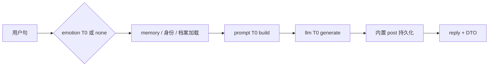

# RFC：模块最小闭环（MVL）与情感 / 展示架构

| 元数据 | 值 |
|--------|-----|
| 状态 | **Draft**（`display_metrics` 与 domain port 分层已落地；定稿前以源码与 [MODULE_MAP_AND_HANDOFF.md](../../handoff/MODULE_MAP_AND_HANDOFF.md) 为准） |
| 受众 | 内核 / 插件作者 / 角色包创作者 / 发行版 / 课程 fork |
| 前置 | [PLUGIN_V1.md](../plugin-and-architecture/PLUGIN_V1.md) · [MODULE_NONE_SEMANTICS.md](../kernel/MODULE_NONE_SEMANTICS.md) · [OCLIVE_ARCHITECTURE_OVERVIEW.md](../getting-started/OCLIVE_ARCHITECTURE_OVERVIEW.md) · [personality-archive-notes.md](../../docs/personality-archive-notes.md) |
| Breaking | 是（见 §8）：数值好感力学、`vector` 默认路径、DTO 语义 |

[English summary in §0](#0-english-summary)

---

## 0. English summary

**MVL (Minimum Viable Loop)** defines the **smallest capability per module** that keeps OCLive’s co-present path runnable. **T0 = MVL** (stable contract); **T1+ = optional enhancements** (official defaults allowed; authors may replace or omit).

**Affect split (target architecture)**:

- **Simulation** (drives reply): `core_personality.txt` + `mutable_personality` (profile SSOT) + **emotion engine T2** character-affect text in Prompt — **not** numeric favor / trait scores.
- **Display** (user understanding only): `display_metrics` JSON (`favor`, `traits[7]`, `relation_summary`) for UI — **must not** be read by `PromptBuilder` mechanics.

Legacy kernel favor formulas and `PersonalityEngine` numeric evolution in Prompt are **deprecated**, not the long-term platform ceiling.

---

## 1. 设计目标

1. **跑起来**：各槽只实现 T0（或 `none`）时，共景 `send_message` 仍能返回合法 `reply`。
2. **可替换**：插件作者满足 T0 trait 即可接入；T1+ 通过可选 capability 扩展，不抬高上架门槛。
3. **不锁死未来**：展示指标与 Prompt 力学分通道；数值好感/七维 **永不** 成为 T0 硬依赖。
4. **开发者自由**：在最小契约内探索 remote / directory / 更强 LLM / 自定义 UI。

---

## 2. 术语

| 术语 | 含义 |
|------|------|
| **MVL** | Minimum Viable Loop；模块在最简配置下的最低能力 |
| **T0** | MVL；契约稳定；官方 builtin + `none` 必须满足 |
| **T1+** | 增强层；可关、可换、可缺省 |
| **整机硬门槛** | 共景路径 **必须** 有 `prompt` + `llm`（见 `startup_health`） |
| **仿真层** | 影响 `reply` 的文本状态（档案 + 情绪模拟叙述） |
| **展示层** | 仅 UI / 调试的指标（`display_metrics`） |

与 [MODULE_NONE_SEMANTICS.md](../kernel/MODULE_NONE_SEMANTICS.md) 的关系：

- `plugin_backends.<slot> = none` → 该槽 **整槽不参与**（Noop）。
- `builtin` **T0** → 槽参与，但只做本 RFC 定义的最小事。

---

## 3. 整机最小路径（共景一轮）



| 槽 | 整机是否必需 | `none` 时 |
|----|--------------|-----------|
| **prompt** | **是** | 启动健康检查失败 |
| **llm** | **是** | 启动健康检查失败 |
| **memory** | 否 | 空列表 |
| **emotion** | 否 | 中性 `EmotionResult` |
| **event** | 否 | `Ignore` / `impact = 0` |
| **agent** | 否 | 不短路 |

**robot-soul / 无头最小包**：至少 `prompt` + `llm`；推荐默认开启 **emotion T0**，但不作为健康检查硬门槛。

---

## 4. 六槽 · T0 / T1+ 边界

### 4.1 第 1 模块 · `memory`

| 层级 | 能力 | 契约 / 行为 |
|------|------|-------------|
| **T0** | 检索 | `load` / `rank` 可返回 **空列表**；不 panic |
| T1 | 长期记忆写入、衰减、scene 权重 | `MemoryEngine` 全功能 |
| T1 | 跨会话合并、replay | 见 CHAT_STORAGE 架构 |
| T2 | remote / directory 排序 | `MemoryBackendPort` |

### 4.2 第 2 模块 · `emotion`（情绪引擎）

| 层级 | 能力 | 契约 / 行为 |
|------|------|-------------|
| **T0** | **用户情绪识别** | `UserEmotionAnalyzer::analyze(text) -> EmotionResult`；`none` → 全 neutral |
| T1 | 用户语气进 Prompt | `format_for_prompt` 或等价一行；角色包 `affect.user_emotion_in_prompt` |
| T2 | **角色情绪模拟** | `CharacterAffectSimulator::simulate(ctx) -> String`（**自然语言**，无 favor/traits 数值） |
| T3 | **展示快照** | `DisplayMetrics { favor, traits[7], relation_summary }`；**禁止** PromptBuilder 读取 |
| T3 push | **被动刷新** | 桌面 Tauri：`affect:metricsChanged`；HTTP 发行版：`GET /display_metrics` 轮询（无 SSE） |

### WS4 落地（2026-06）

| 项 | 行为 |
|----|------|
| **档案原子写** | `apply_profile_evolution_atomic`：mutable + core/delta 单事务；LLM 仍在事务外 |
| **深度更新门** | `should_run_deep_profile_update`：强持久化事件 OR `turn_index % N`（默认 N=3，host `[turn_thinking]` / 包 `turn_thinking.deep_profile_update_every_n_turns`）OR `radar_deep_pending` |
| **GET 快照** | `get_display_metrics` / `GET /display_metrics`：只读 DB；打开雷达时拉取并置 `radar_deep_pending` |
| **推送** | 内核 `AppState` 可选 `affect_metrics_sink`；桌面 `.setup` → `emit_all("affect:metricsChanged")` |

| T4 | 插件扩展 | remote/directory；`SlotExtension`；多实例 last-wins |

**T0 官方实现**：`EmotionAnalyzer`（关键词）；作者可替换为任意满足 `analyze` 的实现。

**T2 实现阶段**（实现顺序，trait 按终局设计）：

1. **过渡**：post-turn 与 mutable `## 社交关系` 同写（轻量）。
2. **终局**：主 LLM **之前** 调用 `simulate`，段落标题如「角色此刻感受」。

### 4.3 第 3 模块 · `event`

| 层级 | 能力 | 契约 / 行为 |
|------|------|-------------|
| **T0** | 无事件 | `EventType::Ignore`，`impact_factor = 0` |
| T1 | 规则检测 | `EventDetector` / `estimate_event_impact_rules_only` |
| T2 | LLM 影响估计 | `HostProfile.event_impact_llm`；**不**驱动数值 favor 公式（新架构） |
| T2 | 触发 post-turn | 强事件（Quarrel / Apology / Confession / Praise）刷新档案 + display |

### 4.4 第 4 模块 · `prompt`

| 层级 | 能力 | 契约 / 行为 |
|------|------|-------------|
| **T0** | 组装 | Tier0 `core_personality.txt` + 用户句 + `KERNEL_DIALOGUE_GUARDRAILS` + 默认锚点 |
| T1 | 设施段落 | 复杂情感 hint、专家路由、关系过渡（**文本**，非数值力学） |
| T1 | HostProfile overlay | concise profile 等 |
| T2 | Deep capsule / persona_override | Wave D |

**新架构 T0 禁止**：注入「好感约 X/100」、数值七维力学段落（见 §6）。

### 4.5 第 5 模块 · `llm`

| 层级 | 能力 | 契约 / 行为 |
|------|------|-------------|
| **T0** | 生成 | `generate` 返回非空文本；HTTP mock 模式可占位 |
| T1 | 流式 `generate_stream` | Chat Pro SSE |
| T2 | prefix cache / keep_alive | Wave D-T3 |

### 4.6 第 6 模块 · `agent`

| 层级 | 能力 | 契约 / 行为 |
|------|------|-------------|
| **T0** | 不短路 | `process` → `handled: false` |
| T1+ | ReAct / MCP / remote / directory | 见 AGENT_REMOTE_PROTOCOL |

---

## 5. 设施子模块 · T0 / T1+（编排行内）

| 设施 | T0 | T1+ |
|------|-----|-----|
| **① 复杂情感** | off 或空 `narrative_hint` | builtin 关键词 / remote / directory |
| **② 专家路由** | 不触发 | `slot.expert.invoke` |
| **③ 立绘** | catalog 关或 static fallback | 表现导演、`visual_state_id` |
| **④ 视觉表现** | 不渲染 | `performance_directive` → 舞台 |

**编排行 · 人格 / 关系（非六槽）**

| 能力 | T0 | T1+ |
|------|-----|-----|
| **核心档案** | `core_personality.txt` 非空（或 robot-soul 豁免） | — |
| **可变档案** | 空字符串 | `profile` 模式 LLM 维护；`## 社交关系` 等结构化小节 |
| **展示指标** | 可缺省 | `display_metrics` 定期更新 |

---

## 6. 仿真层 vs 展示层（目标真源）

### 6.1 仿真层（影响 `reply`）

| 来源 | 内容 | 进入 Prompt |
|------|------|-------------|
| `core_personality.txt` | 角色是谁 | 是 |
| `mutable_personality` | 关系、相处、事件沉淀 | 是 |
| emotion **T2** | 角色此刻感受（短文） | 是 |
| emotion **T1** | 用户语气线索 | 可选 |
| 复杂情感设施 | 跨轮 `narrative_hint` | 可选 |

### 6.2 展示层（仅用户理解）

```json
{
  "favor": 72,
  "traits": [0.45, 0.55, 0.5, 0.45, 0.55, 0.65, 0.72],
  "relation_summary": "父女同住，嘴硬心软",
  "updated_at": "2026-06-29T12:00:00Z"
}
```

| 规则 | 说明 |
|------|------|
| **存储** | `role_runtime.display_metrics`（JSON）或等价；与 mutable 同轮 post-turn 写入（推荐） |
| **读取** | `load_role`、`SendMessageResponse`；前端仪表 |
| **禁止** | `PromptBuilder`、favor 公式、`PersonalityEngine` 数值演化进 Prompt |
| **不一致** | 语气以 **mutable + T2 文本** 为准；展示下轮对齐 |

### 6.3 UI 命名（减认知负担）

| 展示块 | 标签建议 | 数据源 |
|--------|----------|--------|
| 好感条 | 好感（理解用） | `display_metrics.favor` |
| 七维 | **性格读数**（理解用） | `display_metrics.traits` |
| 用户情绪 | **你的情绪（分析）** | `SendMessageResponse.emotion`（可选展示） |

---

## 7. 角色包 · `meta.affect`（草案）

```json
{
  "evolution": {
    "personality_source": "profile"
  },
  "affect": {
    "mode": "simulation_display_split",
    "user_emotion_in_prompt": true,
    "simulation": "builtin",
    "display_interval_turns": 3,
    "display_seed_favor": 72
  }
}
```

| 键 | 说明 |
|----|------|
| `mode` | `simulation_display_split`（新默认）\| `legacy_vector`（废弃别名） |
| `user_emotion_in_prompt` | emotion T1 |
| `simulation` | `off` \| `builtin` \| `directory:<id>` — emotion T2 |
| `display_interval_turns` | emotion T3 更新频率；强事件可强制刷新 |
| `display_seed_favor` | **仅首屏展示种子**；非 Prompt 力学 |

`meta.relations.*.initial_favorability`：**废弃为力学**；迁移为 `display_seed_favor` 或删除（Breaking 见 §8）。

**mutable 模板（创作者 / post-turn SSOT）**：

```markdown
## 社交关系
- 当前相处：（自然语言，模型维护）
- 对用户态度：
```

---

## 8. Breaking 变更与废弃

| 项 | 处理 |
|----|------|
| `favor.rs` 驱动 Prompt | 删除或 `legacy_vector` 开关下保留一版后删 |
| `PersonalityEngine` 数值进 Prompt | 同上 |
| `personality_source: vector` 默认 | 改为 `profile`；`vector` deprecated |
| `favorability_delta` 力学语义 | 改为可选展示差分或移除 |
| `relation_state` 五段枚举力学 | UI 可保留映射或改为 `relation_summary` 自由文本 |
| 沉浸疏远公式压 Prompt | 改为 mutable / T2 注入「许久未见」叙述 |

**迁移**：官方 `mumu` 随本 RFC 一小步 bump 角色包 `affect` 块；`oclive pack validate` 增加可选校验。

---

## 9. 插件作者 · capability 声明（草案）

目录 / remote 插件 `manifest.json` 可选：

```json
{
  "capabilities": {
    "emotion": ["analyze", "simulate", "display_metrics"]
  }
}
```

| 声明 | 宿主行为 |
|------|----------|
| 仅 `analyze` | 只接 T0；足够上架 emotion 插件 |
| `+ simulate` | T2 开关打开时调用 |
| `+ display_metrics` | T3 post-turn 可委托插件 |

未声明的能力宿主使用官方 builtin 或跳过。

---

## 10. 测试与验收

| 场景 | 验收 |
|------|------|
| **全槽 T0 + none** | `prompt`+`llm` 必填；`emotion=none` 仍能 `/chat` |
| **emotion 插件仅 T0** | 替换 `analyze` 后 OOCP 烟测通过 |
| **simulation_display_split** | Prompt 无 `好感约 X/100`；`display_metrics` 存在（T3 开启时） |
| **legacy_vector** | 一版内旧包仍可通过显式 `mode` 运行（若保留） |

---

## 11. 实现顺序（建议）

1. **RFC 定稿** + MODULE_MAP 同步 §T0/T1+ 表  
2. **DTO** `display_metrics`；DB 字段；Prompt 删除数值好感段落（`affect.mode` 默认新）  
3. **emotion T2** trait 草案 + 过渡实现（post-turn 合并）  
4. **mumu** 包格式 + mutable 模板  
5. **前端** 仪表（理解用文案）  
6. **删除 legacy** 数值路径  

---

## 12. 相关文档（实现后须同步）

- [MODULE_MAP_AND_HANDOFF.md](../../handoff/MODULE_MAP_AND_HANDOFF.md) §5 emotion、§12 编排行  
- [ROLE_PACK_SPEC.md](../role-pack/ROLE_PACK_SPEC.md) · `meta.affect`  
- [MODULE_NONE_SEMANTICS.md](../kernel/MODULE_NONE_SEMANTICS.md)  
- [personality-archive-notes.md](../../docs/personality-archive-notes.md)  
- [BREAKING_CHANGE_PROCESS.md](../../handoff/BREAKING_CHANGE_PROCESS.md)  

---

## 13. 开放问题

| # | 问题 | 建议默认 |
|---|------|----------|
| 1 | T2 首版 post 合并 vs 独立 pre `simulate` | trait 按 pre；首版可 post 过渡 |
| 2 | Fast 轮是否跳过 T3 更新 | 是（对齐 Turn Thinking 省成本） |
| 3 | `display_metrics.traits` 与 profile 归纳七维是否冗余 | 是；traits 仅展示，profile 归纳可不暴露 |
