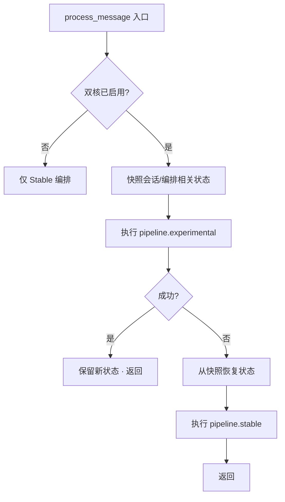

# RFC：运行时双核双态（Stable 核 · Experimental 核）

| 元数据 | 值 |
|--------|-----|
| 状态 | **Opt-in Beta（默认关闭）** — P2–P5 主链路已入库，仍以 Stable 为默认交付面 |
| 入口 | **`oclive init --dual-core`**（显式开启；**默认关闭**） |
| 与 Monolith | **正交**：Monolith 是**编译期**焊接；双核是**运行时**双编排 + 降级 |
| 与 v2 蓝图 | **扩展**同一 `pipeline.ocblueprint`；新增 `zone` + `pipeline` 段（见 §4） |
| 受众 | 创作者 / 集成方 / 内核开发者；**普通终端用户无感**（未开启 `--dual-core` 时行为与今日一致） |

**相关文档**：[RFC_OCLIVE_MONOLITH_MODE.md](RFC_OCLIVE_MONOLITH_MODE.md)（构建宏核态）、[RFC_ROLE_BLUEPRINT_V2.md](../../handoff/RFC_ROLE_BLUEPRINT_V2.md)（已落地的 v2 蓝图）、[OCLIVE_ARCHITECTURE_OVERVIEW.md](../getting-started/OCLIVE_ARCHITECTURE_OVERVIEW.md)、[handoff/DUAL_CORE_CURSOR_HANDOFF.md](../../handoff/DUAL_CORE_CURSOR_HANDOFF.md)（**给 Cursor：设计总结与对齐进度**）、[handoff/DUAL_CORE_ALIGNMENT.md](../../handoff/DUAL_CORE_ALIGNMENT.md)（术语速查）。

[English](../../creator-docs-en/rfc/RFC_OCLIVE_DUAL_CORE_DUAL_MODE.md)

---

## 0. 术语：避免与「单核双态构建」混淆

本仓库 **已在使用** 的「单核双态」多指 **构建架构**（同一编排契约，两种**编译产物**）：

| 名称 | 层次 | 含义（今日已实现 / 规划中） |
|------|------|---------------------------|
| **单核双态构建** | 编译期 | **外核态**：`PluginHost` + trait，可替换；**宏核态**：`monolith.toml` + `--features monolith`，焊接热路径（[RFC_OCLIVE_MONOLITH_MODE.md](RFC_OCLIVE_MONOLITH_MODE.md)） |
| **双核双态（本 RFC）** | **运行时** | **Stable 核** + **Experimental 核**，同一角色包、同一实现池，**两套编排顺序**，实验失败则快照回滚并走 Stable |

下文 **「双核」** 均指 **运行时 Stable / Experimental**，除非特别说明。

---

## 1. 核心构想

在 **内核编排契约稳定** 的前提下，为创新提供 **可降级** 的试验场：

| 核 | 角色 | 编排 | 心智模型 |
|----|------|------|----------|
| **Stable 核（稳定核）** | 保证基础对话能力可交付 | **`type` 仅限六种**：`memory` / `emotion` / `event` / `prompt` / `llm` / `agent`；编排顺序 **固定**（与现网共景阶段表一致；可省略 `pipeline.stable` 时由宿主注入默认表） | 「坚如磐石」 |
| **Experimental 核（实验核）** | 安全尝试新链路 | **不预设 `type`**（如 `intent_recognition`、`knowledge_graph`）；仅约束 **后端模块接口**（`kernel_contracts` / trait）；顺序由 **`pipeline.experimental`** + **`depends_on` DAG** 定义 | 「爱干嘛干嘛」的试验场 |

两核 **共享同一套后端实现池**（builtin / remote / directory / ollama 等）。**不存在**「Stable 专属后端」或「Experimental 专属后端」。开发者：实现 trait → 注册 `slot_registry` → **同一实例可同时被两核引用**（见 §3、`zone`）。

---

## 2. 入口控制：默认关闭

- **默认**：与今日相同 — 仅 **Stable 路径**（等价于当前 v2 单编排，`SlotResolver` → `PluginHost` → `process_message`）。
- **显式开启**：脚手架 **`oclive init --dual-core`** 在 **蓝图** 写入 **`runtime_config.dual_core.enabled: true`**（v3 目标形；与 [ROLE_PACK_BOUNDARY.md](../../handoff/ROLE_PACK_BOUNDARY.md) 一致）。
- **非角色包字段**：初级创作者角色包 **不得** 单独开启双核；开关仅蓝图 / 宿主管理员。
- **legacy `settings.json`**：**不**承载 `dual_core`。
- **不**在桌面应用设置中暴露双核开关；**不**增加普通玩家心智负担。

---

## 3. 设计原则（已确认决策）

1. **蓝图统一管理**：一个 `pipeline.ocblueprint` 管理两核；`slot_registry` 为 **总表**（**不**拆成 stable / experimental 两张表）。
2. **`zone` 标归属**：`"stable"` | `"experimental"`，类型为 **字符串或字符串数组**；**同一实例可同时属于两个 zone**（如 `["stable", "experimental"]`）；缺省视为 `stable`。
3. **编排分列**：顶层 **`pipeline`**：`stable` / `experimental` 各为步骤对象数组；每步含 **`action`** 与 **`depends_on`**（依赖 action id 列表）；编排器 **加载时校验 DAG**（无环、引用存在）。
4. **调度与降级**：**`DualPipelineRunner`** 优先 Experimental；执行前对 **`SessionState`**（及可回滚中间态）**快照**；成功提交，失败则 **恢复快照** 并跑 `pipeline.stable`；降级 **复用** Remote→builtin 等既有回退思路，**不**新建错误处理框架。
5. **实现平等**：trait + `slot_registry` 注册；两核共用实现池，无核专属后端。
6. **与 Monolith 正交**（见 §6）。

---

## 4. 目标蓝图形状（草案）

> **现状**：`schema_version: 2` 仅有 `meta` + `slot_registry`（+ 可选 `groups`）；**无** `zone`、**无** `pipeline`。以下为目标态，落地时需 bump schema 或 `schema_version: 3` 并经 [BREAKING_CHANGE_PROCESS.md](../../handoff/BREAKING_CHANGE_PROCESS.md)。

```json
{
  "schema_version": 3,
  "meta": { "oclive_version": "0.4.0" },
  "slot_registry": {
    "memory": {
      "type": "memory",
      "label": "记忆",
      "backend": "builtin",
      "position": 1,
      "zone": "stable"
    },
    "memory_experimental": {
      "type": "memory",
      "label": "实验记忆",
      "backend": "directory",
      "plugin": "com.example.exp-memory",
      "position": 2,
      "zone": "experimental"
    },
    "llm": {
      "type": "llm",
      "label": "主 LLM",
      "backend": "ollama",
      "position": 6,
      "zone": "stable"
    }
  },
  "pipeline": {
    "stable": [
      { "action": "slot.emotion.analyze", "depends_on": [] },
      { "action": "slot.llm.generate", "depends_on": ["slot.emotion.analyze"] }
    ],
    "experimental": [
      { "action": "slot.memory_experimental.retrieve", "depends_on": [] },
      { "action": "slot.emotion.analyze", "depends_on": ["slot.memory_experimental.retrieve"] },
      { "action": "slot.llm.generate", "depends_on": ["slot.emotion.analyze"] }
    ]
  }
}
```

### 4.1 字段约定（草案）

| 字段 | 说明 |
|------|------|
| `slot_registry.*.zone` | `stable` \| `experimental` 或 **二者数组**；缺省 `stable`；**可双属** |
| `pipeline.stable[]` | Stable 步骤；`type` 仅六槽；`depends_on` 构成 DAG |
| `pipeline.experimental[]` | Experimental 步骤；**任意 `type`**；`depends_on` 构成 DAG |
| `depends_on` | 本步依赖的 `action` id 列表；加载时 **校验无环** 且引用存在 |
| `action` | **`slot.<registry_key>.<method>`**（已决）；registry 键须存在于 `slot_registry`；Experimental **不**校验 `type` |

**Stable 核** 的默认 `pipeline.stable` 可与现网 **共景阶段表** 等价（见 `chat_engine/turn_pipeline.rs` 与 [PLUGIN_V1.md](../plugin-and-architecture/PLUGIN_V1.md) §编排顺序）；包内可省略 `pipeline.stable` 时由宿主注入 **内置默认表**。

**Experimental 核** 无 `pipeline.experimental` 或为空时：不执行实验路径，等价仅 Stable。

---

## 5. DualPipelineRunner 与降级



| 要求 | 说明 |
|------|------|
| 快照范围 | **仅内存态**（已决）：`SessionState` + 编排中间态 + `narrative_hint`；**不含** DB 已提交写入 |
| 失败定义 | 子步骤 `Err`、超时、panic（边界捕获）、契约校验失败 |
| 降级模型 | **复用** Remote 降级（`remote_fallback_to_builtin` / `OCLIVE_REMOTE_FALLBACK_TO_BUILTIN`）：实验路径不可用 → 稳定路径，**无**新错误框架 |
| 可观测性 | 结构化日志可带 `degraded_from=experimental`（**仅日志**） |
| 用户可见 | **完全静默**（已决，与 Remote 降级一致）；**不得**破坏 `reply` 契约 |

实现落点（规划）：`src-tauri/src/domain/chat_engine/dual_pipeline.rs`（新模块）、`SlotResolver` 扩展按 `zone` 过滤视图。

---

## 6. 与 Monolith（`--monolith`）的关系

| 组合 | 行为（目标） |
|------|----------------|
| 标准构建、**无** `--dual-core` | 与 **今日** 一致：单 Stable 编排 + `PluginHost` |
| `--monolith`、**无** `--dual-core` | 编译期移除 `DualPipelineRunner` 与实验链路 → **零开销**单一 Stable；**最终交付极致精简** |
| 标准构建 + `--dual-core` | 保留 `DualPipelineRunner`；实验失败 → 快照恢复 → Stable + `PluginHost` |
| `--monolith` + `--dual-core` | 两核 **pipeline** 焊接；**仍保留**调度器与快照降级 → **开发者高性能实验环境** |

Monolith **不** 替代双核；双核 **不** 替代 Monolith。二者正交。

---

## 7. 与当前已落地能力对照

| 能力 | 当前（v2 已闭环） | 双核 RFC 之后 |
|------|-------------------|---------------|
| 配置 SSOT | `pipeline.ocblueprint` · `slot_registry` | 同文件 + `zone` + `pipeline` |
| 编排入口 | `process_message` 固定阶段表 | Stable 表可显式化；Experimental 可配置 |
| 多实例 | `slot_registry` 开放键名；同 `type` last-wins 折叠六槽 | 按 `zone` 分区；Experimental 可不折叠进六槽 |
| 插件管理 UI | 极简列表 + CLI `plugin manage` | 不变；双核不进入默认 UI |
| 目录插件 | `manifest` + `provides` / `slot_attachment` | 不变；实例 `zone` 由蓝图或 CLI 写入 |
| CI / OOCP | 黑盒测 Stable 路径 | 增量：双核开启时的降级用例 |

详见 [handoff/DUAL_CORE_CURSOR_HANDOFF.md](../../handoff/DUAL_CORE_CURSOR_HANDOFF.md)（对齐进度）与 [handoff/DUAL_CORE_ALIGNMENT.md](../../handoff/DUAL_CORE_ALIGNMENT.md)。

---

## 8. 非目标（本 RFC 不做）

- 运行时动态加载 `cdylib` 模块（仍为契约型可替换，非 OS 级插件）。
- 在桌面应用默认暴露 Experimental 编排编辑器（归 CLI / 工作室高级模式）。
- 替换或废除 v2 `slot_registry` / `groups`（`groups` 仍可仅作 Stable 架构图示意）。
- 与「单核双态构建」合并为同一开关（**禁止**；见 §0）。

---

## 9. 推进计划（建议）

| 阶段 | 交付物 | 依赖 |
|------|--------|------|
| **P0 对齐** | 本 RFC + `DUAL_CORE_CURSOR_HANDOFF.md` + `DUAL_CORE_ALIGNMENT.md` + 文档索引 | 无 |
| **P1 契约** | `schema_version` 或 v3 校验、`action` 枚举表、`zone` 默认值 | `oclive_validation` |
| **P2 调度器** | `DualPipelineRunner` + 快照 MVP + 单测 | P1 |
| **P3 脚手架** | `oclive init --dual-core` 模板蓝图 | P1 |
| **P4 集成** | `process_message` 接线、OOCP 降级场景 | P2 |
| **P5 Monolith** | `--monolith --dual-core` 焊接双 pipeline | Monolith RFC + P2 |

**当前发布**：**P0 已完成**（Q1–Q14 已决）；产品仍以 v2 Stable 单路径交付；**P1 起**见 [handoff/DUAL_CORE_CURSOR_HANDOFF.md](../../handoff/DUAL_CORE_CURSOR_HANDOFF.md) §十。

---

## 10. 已决事项（2026-05）

| ID | 决议 |
|----|------|
| Q1 | `complex_emotion` = 第七设施，不进 `pipeline.stable`，宿主硬编码 |
| Q2 | `action` = `slot.<registry_key>.<method>` |
| Q3 | 一步一 action；`depends_on` 引用 action 字符串 |
| Q4–Q6 | zone 不强制被 pipeline 引用；Stable 禁引 experimental-only 键；未开双核 **忽略** zone/pipeline |
| Q7 | 降级 **完全静默** |
| Q8–Q9 | 快照仅内存；失败 = Err/超时/panic/契约失败 |
| Q10 | `schema_version: 3`，v2 须工具迁移 |
| Q11 | `oclive init --dual-core`，角色包级 |
| Q12 | Experimental `type` **完全开放** |
| Q13 | 两 pipeline 可共用同一 registry 键 |
| Q14 | P4 标准构建；P5 Monolith 另里程碑 |
| Q15 | `runtime_config.dual_core.enabled`（蓝图）；创作者不得单独开启 |
| Q16 | **schema_version 分流**：2 → v2 逻辑；3 → v3/双核校验 |
| Q17 | P1 **只校验 registry 键**；不校验 `method` |
| Q18 | P4 前手写 v3 示例；迁移工具延后 |
| Q19 | 省略 `pipeline.stable` → **`co_present` 硬编码** |
| Q20 | P4 运行时仅 **PluginHost 七种 type** |

**P1 校验**：`oclive_validation::validate_blueprint_v3_json`。角色包边界：[ROLE_PACK_BOUNDARY.md](../../handoff/ROLE_PACK_BOUNDARY.md)。

---

**状态**：本文档为 **架构设计依据**；实现 PR 须引用本 RFC 并更新 [DOCUMENTATION_INDEX.md](../getting-started/DOCUMENTATION_INDEX.md)。
