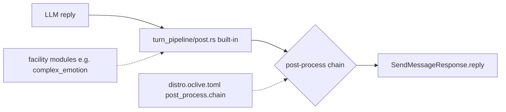

# RFC：后处理链（Post-Process Chain）— 已部分落地 / 通用链草案

| 元数据 | 值 |
|--------|-----|
| 状态 | **部分落地**：发行版 `standard`/`minimal` 策略与 `reply_post_process` 钩子已交付；任意多步骤链仍为 Draft |
| 关联 | [DISTRO_CAPABILITY_PROFILE.md](../kernel/DISTRO_CAPABILITY_PROFILE.md) `[post_process]` · [NAMING_CONVENTIONS.md](../NAMING_CONVENTIONS.md) §1.2 |
| 受众 | 内核 / 发行版集成方 |

---

## 1. 问题陈述

LLM 生成 **`reply`** 之后、返回用户之前，角色包可以通过 `reply_post_processor` 使用 builtin / remote / directory 后处理；发行版 `post_process.chain` 当前只提供 `standard` / `minimal` 策略。格式化、安全过滤、TTS 分段等任意多步骤编排仍缺少统一 step schema。

**本 RFC 继续约束通用多步骤链的命名与边界**；已交付的 RPP 接线不等于任意 step 链已经开放。

---

## 2. 术语（SSOT）

| 权威名 | English | 说明 |
|--------|---------|------|
| **后处理链** | **post-process chain** | LLM 输出 → 用户可见回复之间的有序步骤序列 |
| **内置后处理** | **built-in post-process** | 宿主 `turn_pipeline/post.rs` 中不可关闭的核心逻辑 |
| **发行版后处理 profile** | **distro post-process profile** | `distro.oclive.toml` → `[post_process].chain`；当前值为 `standard` / `minimal` |

**消歧**：

- **不是**蓝图文件 `pipeline.ocblueprint` 的 `steps[]` DSL（已废弃，不作主路径调度）。
- **不是** `dual_pipeline` 实验核编排（见 [RFC_OCLIVE_DUAL_CORE_DUAL_MODE.md](RFC_OCLIVE_DUAL_CORE_DUAL_MODE.md)）。
- **不是** 六宿主槽 `plugin_backends` / `slot_registry` 的后端替换。

---

## 3. 边界（草案）

| 层 | 职责 | 配置来源 |
|----|------|----------|
| `turn_pipeline/post.rs` | 会话写入、DTO 回填、与记忆/好感等已有副作用 | 代码 |
| **`reply_post_process` 钩子**（已实现） | `ReplyPostProcessor`：输入 `reply` + 上下文 → 显示回复；失败回退 raw | 角色包 `reply_post_processor` + HostProfile 策略 |
| **通用多步骤链**（未实现） | 任意 step 的 schema、排序、逐步降级 | 未来 RFC / 只读配置 |
| 设施模块 | 回合内叙事提示等，**在** Prompt 构建或 pre-LLM 阶段 | 蓝图 / 代码 |
| Experimental 核 | 双核降级前的实验步骤 | `pipeline.experimental` JSON |

---

## 4. 非目标（通用多步骤链交付前）

- 不把任意多步骤链误称为新的六槽；现有 `ReplyPostProcessor` 仍是独立通道。
- 不扩展 blueprint v3 `runtime_config` 承载链定义。
- 不改变 `SendMessageResponse` 字段形状。

---

## 5. 落地前置条件（未来 PR）

1. 为未来多步骤链定义 step schema，并与 [DISTRO_CAPABILITY_PROFILE.md](../kernel/DISTRO_CAPABILITY_PROFILE.md) §3 `[post_process]` 对齐。
2. 明确与 `HostProfile`（P4）的合并优先级：发行版 > 角色包 > 会话。
3. OOCP 场景：至少一条「链 step 失败 → 降级为 built-in」黑盒用例。
4. Breaking 流程见 [BREAKING_CHANGE_PROCESS.md](../../handoff/BREAKING_CHANGE_PROCESS.md)。

---

## 6. 参考实现锚点（只读）

- 今日内置逻辑：`kernel/crates/oclive_kernel_host/src/domain/chat_engine/turn_pipeline/post.rs`
- 今日 RPP wiring：`kernel/crates/oclive_kernel_host/src/domain/reply_post_processor.rs` 与 `infrastructure/reply_post_processor_wiring.rs`
- 命名 SSOT：[NAMING_CONVENTIONS.md](../NAMING_CONVENTIONS.md) §1.2「后处理链」
