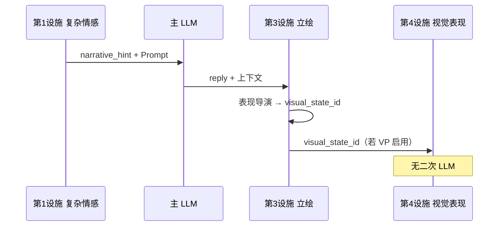

# RFC：立绘设施子模块（Portrait Facility · 表现导演）

| 元数据 | 值 |
|--------|-----|
| 状态 | **Phase 1–4 delivered**（catalog、表现导演、`visual_state_id` DTO）；编写器 Phase A–B 在 pack-editor |
| 受众 | Cursor / 内核 / 编写器 / 发行版集成方 |
| 前置 | [OCLIVE_ARCHITECTURE_OVERVIEW.md](../getting-started/OCLIVE_ARCHITECTURE_OVERVIEW.md) · [NAMING_CONVENTIONS.md](../NAMING_CONVENTIONS.md) · 第 1 设施 [NARRATIVE_HINT_CONTRACT.md](../testing/NARRATIVE_HINT_CONTRACT.md) |
| 关联 | [RFC_VISUAL_PRESENTATION_FACILITY.md](RFC_VISUAL_PRESENTATION_FACILITY.md)（第 4 设施 · 渲染舞台） |
| 命名 | **Portrait Facility Submodule** · 默认实现口语 **表现导演**（Portrait Director） |

[English summary in §0](#0-english-summary)

---

## 0. English summary

**Facility submodule #3 — Portrait Facility**: per-turn **semantic visual state selection** from a closed **`portrait_catalog`** in the role pack. The **Portrait Director** (builtin AI via `generate_tag` or structured pick) chooses a catalog **`id`** using dialogue context and **complex emotion `narrative_hint`** — **not** filename conventions.

**Stable baseline**: legacy **`portrait_emotion`** (7 tags) and `{tag}.png` fallback remain when the facility is disabled or resolution fails.

**AI lives only here** — the Visual Presentation facility (#4) must **not** run a second LLM to pick images.

---

## 1. 定位与分类

| 能力 | 权威英文名 | 层次 | 六槽 | 设施编号 |
|------|-----------|------|------|----------|
| 立绘设施 | **Portrait Facility Submodule** | post-LLM 状态决策 | **否** | **第 3 设施子模块** |
| 默认实现 | **Portrait Director** | AI / 规则从 catalog 选 `id` | — | 实现昵称，非专名 |

**消歧**：

- **立绘设施** ≠ **第 2 模块 emotion**（用户句七维 / `Emotion` 枚举）
- **立绘设施** ≠ **第 1 设施复杂情感**（生成 `narrative_hint` 进 Prompt；本子模块**消费** hint）
- **立绘设施** ≠ **第 4 设施视觉表现**（把 `visual_state_id` 落成 Live2D / 3D / 演算；**无 AI 选图**）
- **立绘设施** ≠ 今日 `pick_portrait_emotion` 的 **长期并列** — 目标为 **合并/替换** 其「选状态」职责，保留 7 tag 作 legacy 字段

---

## 2. 管线位置



| 顺序 | 阶段 | 锚点 | 立绘设施 |
|------|------|------|----------|
| 1 | co_present | `complex_emotion.resolve_turn` | — |
| 2 | post_llm | `turn_pipeline/persistence.rs` | **替换/合并** `pick_portrait_emotion` |
| 3 | assemble response | `SendMessageResponse` | 输出 `visual_state_id` + legacy `portrait_emotion` |

**CoPresent 特例**：今日跳过 portrait LLM，用 `bot_emotion_str` → 映射 catalog 默认项；不强制额外 LLM 调用。

---

## 3. 角色包契约：`portrait_catalog`（A2 + B1 · 已定稿）

**磁盘 SSOT（A2）**：

```
roles/{role_id}/
├── config.json                 # portrait_catalog: { "enabled": true | false }
├── portrait_catalog.json       # assets[] 全集
└── assets/images/…
```

**`config.json` 最小节**（B1 简单导出默认 `enabled: true`）：

```json
"portrait_catalog": { "enabled": true }
```

**`portrait_catalog.json`**（全部 `assets[]`）：

```json
{
  "schema_version": 1,
  "assets": [
    {
      "id": "happy_default",
      "path": "assets/images/微笑.webp",
      "desc": "轻松、自然的开心",
      "tags": ["happy"],
      "kind": "image",
      "cluster": "baseline"
    }
  ]
}
```

**7 槽固定 id SSOT（简单创作）**：`happy_default` · `sad_default` · `angry_default` · `neutral_default` · `excited_default` · `confused_default` · `shy_default`

**禁止**写入 `slot_registry` / 六槽 `plugin_backends`。

| 字段 | 必填 | 说明 |
|------|------|------|
| `enabled` | 否 | 默认 `false`；`false` 时走 legacy 7 tag + 文件名 |
| `assets[]` | 启用时 | 封闭集合；AI **只能**输出其中某 `id` |
| `id` | 是 | 稳定键；与文件名无关 |
| `path` | 是 | 相对角色包根；须在 `assets/images/` 或 RFC 允许子目录 |
| `desc` | 推荐 | 供表现导演 prompt；编写器可帮填 |
| `tags` | 否 | 粗粒度 7 类映射，供 legacy `portrait_emotion` 回退 |
| `kind` | 否 | `image` \| `live2d` \| `rig3d` \| `procedural`；供第 4 设施路由 |
| `cluster` | 否 | 创作者分组（如 `baseline` / `pain`）；**非**运行时枚举 |

### 3.2 简单创作 vs 高级创作（编写器）

| 模式 | catalog 形状 |
|------|----------------|
| **简单** | 固定 7 槽 → 自动生成 7 条 `assets`（`tags` 对应 7 类）；**无**自由追加 |
| **高级** | 可追加簇、多图、`desc`；文件名任意 |

---

## 4. 表现导演（Portrait Director · builtin）

**输入**：`narrative_hint`（本回合 + 可选上一轮）、用户句、bot reply、七维性格、好感、近期事件、`portrait_catalog.assets`（id + desc 列表）。

**输出**：单个 `visual_state_id`（catalog `id`）。

**实现**：

- 主路径：`LlmClient::generate_tag` 或低温 structured 输出；prompt 列出 **允许 id 全集**
- 失败 / 非法 id：`tags` 匹配 → 默认项 → legacy `portrait_emotion` + `{tag}.png`
- **共景**：可用规则映射 `bot_emotion` → 同 tag 的第一条 asset，免 LLM

**环境变量（草案）**：

- 沿用 `OCLIVE_PORTRAIT_EMOTION_LLM=0` 时，表现导演降级为规则（与今日立绘 LLM 开关对齐）

---

## 5. DTO 与兼容

| 字段 | 说明 |
|------|------|
| `portrait_emotion` | **保留**；7 类小写；老 UI / 统计 |
| `visual_state_id` | **新增**；catalog `id`；新 UI 优先 |
| `performance_directive` | **第 4 设施**；可选；见关联 RFC |

未启用 catalog 时：**不**发送 `visual_state_id`，行为与 v0.3 一致。

---

## 6. 校验与 Breaking

- **Additive**：新 `config.json` 节；`oclive_validation` 创作者 profile 校验 `id` 唯一、`path` 安全
- **非 Breaking**：旧包无 `portrait_catalog` 照常加载
- 扩展 `Emotion` 枚举：**不在本 RFC**；新簇仅通过 catalog + AI 选 id

---

## 7. 验收（实现 PR）

- [ ] 无 catalog：OOCP / invoke 热路径无回归
- [ ] 7 槽简单包：AI 或规则仅在 7 id 内选择
- [ ] 高级多簇：非法 LLM 输出回退
- [ ] CoPresent：`bot_emotion` 映射默认 asset
- [ ] 复杂情感 hint 改变时，选中 id 与仅 tag 路径可区分（集成测一条）

---

## 8. 相关链接

- 实施分阶段：[../../handoff/PORTRAIT_VISUAL_PRESENTATION_IMPLEMENTATION_PLAN.md](../../handoff/PORTRAIT_VISUAL_PRESENTATION_IMPLEMENTATION_PLAN.md)
- 编写器：[../../handoff/pack-editor/PACK_EDITOR_ROADMAP.md](../../handoff/pack-editor/PACK_EDITOR_ROADMAP.md)
- 角色包 §9.9：[../role-pack/ROLE_PACK_SPEC.md](../role-pack/ROLE_PACK_SPEC.md)
