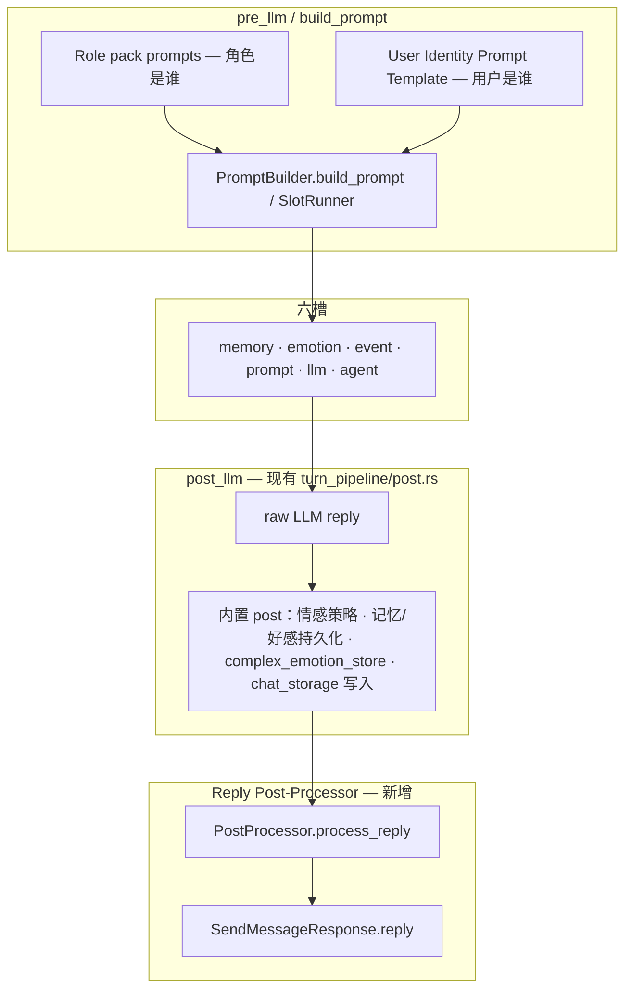

# RFC：用户身份 Prompt 模板 & 回复后处理插件 — 架构设计对齐

| 元数据 | 值 |
|--------|-----|
| 状态 | **Phase 2 delivered**（v0.3.0 · builtin/remote/directory 后处理 · HTTP 身份 API · 桌面/VS Code UI） |
| 受众 | Cursor / 内核 / 编写器 / 发行版集成方 |
| 前置 | P1–P4 内核自举与 `HostProfile` · [NAMING_CONVENTIONS.md](../NAMING_CONVENTIONS.md) · [RFC_OCLIVE_POST_PROCESS_CHAIN.md](RFC_OCLIVE_POST_PROCESS_CHAIN.md) |
| 命名 | **User Identity Prompt Template** · **Reply Post-Processor Plugin** |

[English summary in §0](#0-english-summary)

---

## 0. English summary

Two **orthogonal capability units** (not six host slots, not numbered facility submodules):

1. **User Identity Prompt Template** — switchable prompt fragments defining **who the user is**, merged at **`build_prompt`** (pre-LLM). Stored in the **role pack**; separate from role persona `prompts/`.
2. **Reply Post-Processor Plugin** — trait + `builtin` / `remote` / `directory` backends, invoked **after** built-in `post_llm` side effects, **before** `SendMessageResponse.reply` is returned. Config in role pack **`config.json`** (parallel to `memory`), not under `slot_registry`.

**Pipeline**: pre-LLM identity injection → six slots generate reply → built-in post (persist, chat log) → post-processor → user-visible `reply`.

---

## 1. 定位与分类（与已有架构）

| 能力 | 权威英文名 | 层次 | 是否六槽 | 是否设施子模块 | 类比 |
|------|-----------|------|----------|----------------|------|
| 用户自定义身份 | **User Identity Prompt Template** | pre-LLM Prompt 注入 | **否** | **否** | 扩展今日 `user_relations.prompt_hint`，独立模板文件 + 切换 |
| 回复后处理插件 | **Reply Post-Processor Plugin** | post-LLM 文本修饰 | **否** | **否** | 记忆系统 **trait + 多后端 + config.json 段**（非 slot 本身） |

**消歧**（写入 NAMING_CONVENTIONS 下一版 §1.2）：

- **用户身份** ≠ **角色身份**（`prompts/`、`core_personality.txt` = 角色是谁）
- **Reply Post-Processor** ≠ **post-process chain profile**（`distro.oclive.toml` `[post_process].chain` 是发行版策略枚举；插件是具体实现单元）
- **Reply Post-Processor** ≠ **`dual_pipeline`** / Experimental 核
- **Reply Post-Processor** ≠ 第 4 模块 Prompt 槽（槽负责「如何拼 Prompt」；后处理负责「LLM 输出后改字」）

---

## 2. 对话管线：调用时机与顺序

### 2.1 总览



### 2.2 与 `execute_turn` 的阶段对齐

今日锚点：`crates/oclive_kernel_host/src/domain/chat_engine/turn_pipeline/mod.rs`

| 顺序 | 阶段 | 用户身份 | 回复后处理 |
|------|------|----------|------------|
| 1 | `pre::pre_llm` | 解析「当前用户身份 id」→ 加载模板正文 | — |
| 2 | `co_present::run_middle` / `build_prompt` | 注入 `PromptInput` 新字段（见 §3） | — |
| 3 | `post::run_main_llm` | — | — |
| 4 | `post::post_llm` 内置块 | — | **不**在此之前 |
| 4a | 现有：`analyze_bot_emotion_and_policy`、`persist_*`、`append_turn_to_chat_storage` | 使用 **raw reply** | — |
| 4b | **新增**：`ReplyPostProcessorPort::process_reply` | — | 输入 raw + 上下文 → **display reply** |
| 5 | `assemble_send_message_response` | — | **`reply` 字段 = display reply** |

### 2.3 设计决策：raw vs display reply

产品要求：内置 post 先跑，后处理再修饰，**用户只见修饰后文本**。

| 数据 | 建议 |
|------|------|
| 记忆提取 / 好感 / 机器人情感分析 | 继续基于 **raw reply**（与 LLM 真实输出一致，避免后处理「洗稿」污染状态机） |
| `chat_messages` / 前端气泡 | 存 **display reply**（与 UI 一致；在 `append_turn_to_chat_storage` **之后**追加 update，或把 append 挪到 post-processor 之后 — **实现 PR 二选一，默认推荐后者**） |
| `SendMessageResponse.reply` | **display reply** |
| 可选 v2 | DTO 增加 `raw_reply`（调试/审计，默认不暴露给 UI） |

---

## 3. 功能一：User Identity Prompt Template

### 3.1 与现状的关系

今日已有：

- 角色包 `meta.user_relations`：`prompt_hint` + `user_relation_id` → `PromptInput.relation_hint` / `user_relation_id`
- `PromptBuilder::push_user_identity_section`（`oclive_kernel_runtime` · `prompt_builder/mod.rs`）

**缺口**：模板短、与角色 Prompt 混在 manifest 字段里、不可独立版本化/切换多文件、发行版无法默认不同身份集。

**演进策略**：**兼容层** — 未配置 `user_identities/` 目录时，行为与今日 `prompt_hint` 完全一致。

### 3.2 磁盘格式（角色包）

```
roles/{role_id}/
├── prompts/                    # 角色是谁（已有）
├── user_identities/            # 用户是谁（新增，可选）
│   ├── index.json              # 身份目录 + 默认 id
│   ├── friend.md               # 模板正文（Markdown 纯文本）
│   ├── parent.md
│   └── custom_player.md
├── meta …                      # 仍保留 user_relations（UI 元数据 + 倍率）
└── config.json                 # 可选 user_identity 段（见 §5）
```

**`user_identities/index.json`（草案）**

```json
{
  "schema_version": 1,
  "default_identity_id": "friend",
  "identities": {
    "friend": {
      "display_name": "朋友",
      "template_file": "friend.md",
      "maps_to_relation_id": "friend"
    },
    "parent": {
      "display_name": "家长",
      "template_file": "parent.md",
      "maps_to_relation_id": "parent"
    }
  }
}
```

| 字段 | 说明 |
|------|------|
| `template_file` | 相对 `user_identities/` 的路径；正文注入 Prompt，**不**进蓝图 |
| `maps_to_relation_id` | 可选；绑定现有 `user_relations` 键以继承 `favor_multiplier` / `initial_favorability` |
| `display_name` | UI 切换列表；可与 `user_relations.display_name` 对齐或覆盖 |

**模板文件内容约定**：Markdown 纯文本，建议结构：

```markdown
【用户身份说明】
你是用户的……（第二人称描述用户是谁、关系边界、禁止事项）

【语气与称呼】
……
```

引擎包装时仍加统一标题「【用户身份】（本轮必须遵守）」；模板内勿重复引擎级 guardrail。

### 3.3 加载与切换机制

| 层级 | 来源 | 优先级（高 → 低） |
|------|------|-------------------|
| 会话 | DB / 会话覆盖 `active_user_identity_id` | 1 |
| 发行版 | `distro.oclive.toml` → `[user_identity].default_id` | 2 |
| 角色包 | `user_identities/index.json` → `default_identity_id` | 3 |
| 回退 | `meta.default_relation` + 该 relation 的 `prompt_hint` | 4 |

**切换 API（Tauri / HTTP）**：`set_user_identity { role_id, identity_id }` / `POST /user_identity/set` — 写入会话态，**不**改角色包磁盘。

**与 `identity_binding`**：现有 `global` / `per_scene` 语义不变；身份 id 按 scene 缓存策略沿用 `SessionCache` 模式。

### 3.4 与 `build_prompt` 的集成

**契约层**（`oclive_kernel_types::PromptInput` 增量）：

```rust
// 草案 — 仅设计，未实现
pub struct PromptInput<'a> {
    // …现有字段…
    /// 完整用户身份模板正文（已由 host 加载合并）；空则跳过独立段落
    pub user_identity_template: &'a str,
    /// 当前 User Identity Prompt Template id（审计 / 调试）
    pub user_identity_id: &'a str,
}
```

**编排层**：

1. `turn_pipeline/pre.rs`：在构造 `PromptInput` 前调用 `UserIdentityLoader::resolve(session, role, host_profile) -> UserIdentityResolved`
2. `PromptBuilder::push_user_identity_section`：
   - 若 `user_identity_template` 非空 → **以模板为主体** 写入「【用户身份】」段
   - 否则 → 现有 `relation_hint` + `user_relation_id` 逻辑（兼容）
3. 第 4 模块 **Prompt 槽**（`PromptAssembler` / remote `prompt.build_prompt`）仍接收**已含用户身份段**的 `PromptInput` 快照；Remote 插件无需感知文件路径。

**HostProfile 叠加**（`distro.oclive.toml` 草案）：

```toml
[user_identity]
default_id = "concise_player"   # 发行版默认身份
allowed_ids = ["friend", "concise_player"]  # 可选白名单
```

---

## 4. 功能二：Reply Post-Processor Plugin

### 4.1 与 [RFC_OCLIVE_POST_PROCESS_CHAIN.md](RFC_OCLIVE_POST_PROCESS_CHAIN.md) 的关系

| 概念 | 关系 |
|------|------|
| **post-process chain** | 抽象：LLM 后 → 用户前 的有序步骤 |
| **Reply Post-Processor Plugin** | **第一个落地单元**；builtin / remote / directory 三后端 |
| **`[post_process].chain` in distro** | 发行版 profile：`standard` 启用完整插件链，`minimal` 跳过 optional 步骤（与 P4 表一致） |

本 RFC 将预留 RFC 的「链」具体化为 **可配置、可插拔的单 trait 多后端**；未来可扩展为多 step 链（filter → format → TTS marker）。

### 4.2 Trait 定义（`oclive_kernel_contracts` 草案）

```rust
/// Reply Post-Processor — 修饰 LLM 原始回复，不负责持久化。
pub struct PostProcessInput<'a> {
    pub raw_reply: &'a str,
    pub user_message: &'a str,
    pub role_id: &'a str,
    pub scene_id: &'a str,
    pub srid: &'a str,
    /// 可选：供 directory / remote 审计
    pub locale: &'a str,
}

pub struct PostProcessOutput {
    pub display_reply: String,
    /// 插件可选诊断（debug_trace / plugin logs）
    pub diagnostic: Option<String>,
}

pub trait ReplyPostProcessor: Send + Sync {
    fn process_reply(&self, input: PostProcessInput<'_>) -> Result<PostProcessOutput>;
}
```

**命名**：trait 用 `ReplyPostProcessor`；实现体称 **Reply Post-Processor Plugin**；禁止别名 `PostProcessor` 单独出现（易与 HTTP post-processor 混淆）。

### 4.3 后端模式（对齐记忆系统）

| `backend` | 实现 | 说明 |
|-----------|------|------|
| `builtin` | `BuiltinReplyPostProcessor` | 规则链：空白规范化、禁词替换、长度上限等；可配置 rule profile |
| `remote` | HTTP JSON-RPC `reply_post_process.process` | 复用 `remote_plugin` 客户端；失败降级 builtin |
| `directory` | Directory 插件 `provides: ["reply_post_process"]` | 经 RPC；需 `network:*` 或进程授权 |

**解析**：新增 `ReplyPostProcessorPort`（host `domain/ports/`），由 `PluginHost` 同级工厂解析 — **不**占用 `slot_registry.type`。

**Remote 方法草案**：

```json
{
  "method": "reply_post_process.process",
  "params": {
    "raw_reply": "……",
    "user_message": "……",
    "role_id": "mumu",
    "scene_id": "default"
  }
}
```

### 4.4 配置段格式（角色包 `config.json`）

与 `memory` **并列**（非从属）：

```json
{
  "memory": { "...": "..." },
  "reply_post_processor": {
    "enabled": true,
    "backend": "builtin",
    "builtin": {
      "profile": "standard",
      "max_chars": 4000,
      "strip_leading_quote": true
    },
    "remote": {
      "url": "",
      "timeout_ms": 8000
    },
    "directory": {
      "plugin_id": "my-reply-polish"
    }
  }
}
```

| 字段 | 说明 |
|------|------|
| `enabled` | `false` 时直通 raw → display |
| `backend` | `builtin` \| `remote` \| `directory` |
| `builtin.profile` | `standard` \| `minimal` — 与 distro `[post_process].chain` 对齐 |

**校验**：`oclive_validation` 新 schema；**不**写入蓝图文件 `pipeline.ocblueprint`（创作者 config 面，见 [ROLE_PACK_BOUNDARY.md](../../handoff/ROLE_PACK_BOUNDARY.md)）。

### 4.5 编排挂载点

```text
post_llm(
  …
  // 现有内置逻辑（raw reply）
  let display_reply = reply_post_processor_port
      .process_reply(PostProcessInput { raw_reply: &reply, … })?
      .display_reply;
  // 聊天存储 + assemble 使用 display_reply
)
```

**降级**：remote/directory 失败 → log + fallback `builtin`；builtin 失败 → **display_reply = raw_reply**（与 memory remote 降级一致）。

---

## 5. 配置体系合并规则

| 配置 | 角色包 | 蓝图 | 会话 | HostProfile / distro |
|------|--------|------|------|----------------------|
| User Identity 模板文件 | `user_identities/**` | **不写** | `active_user_identity_id` | `[user_identity].default_id` / `allowed_ids` |
| `user_relations` 元数据 | `meta` | **不写** | 关系/好感态 | — |
| Reply Post-Processor | `config.json` → `reply_post_processor` | **不写** | 可选会话覆盖（高级） | `[post_process].chain` 映射 profile |
| 六槽 LLM / memory | 蓝图 `slot_registry` | ✓ | 会话覆盖 | `plugin_backends` 上限 |

**优先级**（与 P4 `HostProfile` 一致）：

1. 发行版 `distro.oclive.toml` 上限与白名单  
2. 会话覆盖（若启用）  
3. 角色包 `config.json` / `user_identities`  
4. 内核默认  

---

## 6. Crate 与 canonical import（实现期）

| 变更 | Crate |
|------|-------|
| `PromptInput` 新字段 | `oclive_kernel_types` |
| `ReplyPostProcessor` trait | `oclive_kernel_contracts` |
| `UserIdentityLoader`、port impl、`post_llm` 挂钩 | `oclive_kernel_host` |
| 默认规则公式 | `oclive_kernel_runtime`（可选纯函数） |
| manifest / config 校验 | `oclive_validation` |
| Tauri / HTTP 命令 | `src-tauri/src/api/` + `oclive_kernel_host` service |

---

## 7. 非目标（本 RFC）

- 不新增六槽类型 `post_process`
- 不扩展 blueprint v3 `runtime_config` 承载完整插件配置
- 不改变 `SendMessageResponse` 必填字段（`raw_reply` 可选后续）
- 不在 Experimental 核注册 post-processor step
- v0.2.x **不实现**；设计对齐后可拆两个 PR：`user_identity` · `reply_post_processor`

---

## 8. 验收清单（实现阶段）

- [x] 切换 `user_identities` 模板后，`build_prompt` 输出含对应「【用户身份】」且与角色 `prompts/` 独立编辑
- [x] 无 `user_identities/` 时 golden 包行为与当前 `prompt_hint` 一致
- [x] `reply_post_processor.enabled=false` 时 OOCP 黑盒无回归
- [x] directory 插件 post-process 走权限弹窗 + 降级路径
- [x] `distro [post_process].chain=minimal` 跳过 optional 规则
- [x] NAMING_CONVENTIONS §1.2 登记两能力英文名
- [x] HTTP `/user_identity/*` 与 Tauri 身份命令同 impl（attach / VS Code）
- [x] `RoleInfo` / `GET /role_info` 暴露后处理只读状态（`reply_post_processor_*`）

---

## 9. 参考锚点（当前代码）

| 主题 | 路径 |
|------|------|
| 回合编排 | `oclive_kernel_host/.../turn_pipeline/mod.rs` |
| 内置 post | `.../turn_pipeline/post.rs` · `post_llm` |
| 用户身份 Prompt 段 | `oclive_kernel_runtime/.../prompt_builder/mod.rs` · `push_user_identity_section` |
| `PromptInput` | `oclive_kernel_types/src/prompt.rs` |
| 记忆 trait 范式 | `oclive_kernel_contracts/src/memory_retrieval.rs` |
| HostProfile | `oclive_kernel_host/.../host_profile.rs` |
| 角色包边界 | `handoff/ROLE_PACK_BOUNDARY.md` |
