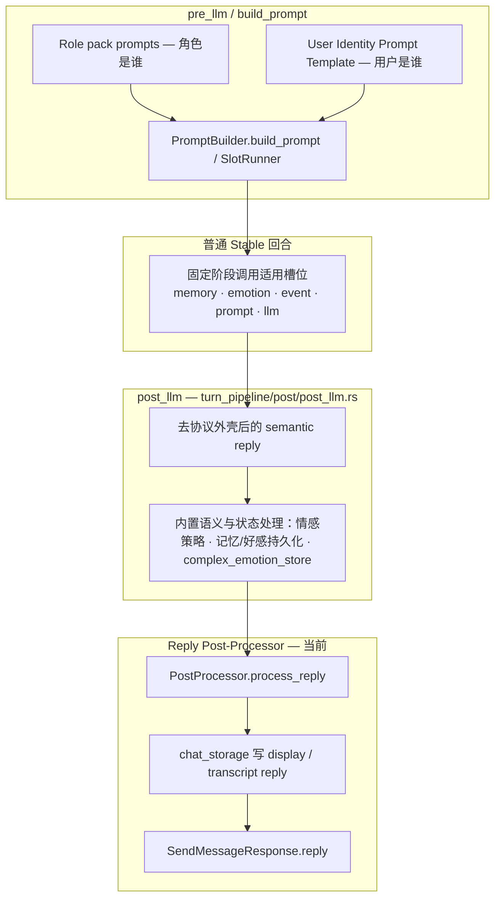

# RFC：用户身份 Prompt 模板 & 回复后处理插件 — 架构设计对齐

| 元数据 | 值 |
|--------|-----|
| 状态 | **Phase 2 delivered**（v0.3.0 · builtin/remote/directory 后处理 · HTTP 身份 API · 桌面/VS Code UI） |
| 受众 | Cursor / 内核 / 编写器 / 发行版集成方 |
| 前置 | P1–P4 内核自举与 `HostProfile` · [NAMING_CONVENTIONS.md](../NAMING_CONVENTIONS.md) · [RFC_OCLIVE_POST_PROCESS_CHAIN.md](RFC_OCLIVE_POST_PROCESS_CHAIN.md) |
| 命名 | **User Identity Prompt Template** · **Reply Post-Processor Plugin** · 统称见 [RFC_SIDE_CHANNEL_CAPABILITY_ENHANCEMENTS.md](RFC_SIDE_CHANNEL_CAPABILITY_ENHANCEMENTS.md)（**独立通道能力增强模块**） |

[English summary in §0](#0-english-summary)

---

## 0. English summary

Two **side-channel capability enhancement modules** (registry: [RFC_SIDE_CHANNEL_CAPABILITY_ENHANCEMENTS.md](RFC_SIDE_CHANNEL_CAPABILITY_ENHANCEMENTS.md); not six host slots, not numbered facility submodules):

1. **User Identity Prompt Template** — switchable prompt fragments defining **who the user is**, merged at **`build_prompt`** (pre-LLM). Stored in the **role pack**; separate from role persona `prompts/`.
2. **Reply Post-Processor Plugin** — trait + `builtin` / `remote` / `directory` backends, invoked after protocol stripping and authoritative state consumers, before display-form chat persistence and `SendMessageResponse.reply`. Config in role pack **`config.json`** (parallel to `memory`), not under `slot_registry`.

**Pipeline (ordinary Stable path)**: pre-LLM identity injection → fixed stages invoke the applicable slots and generate a reply → built-in semantic/state processing → reply post-processor → Reply Mode presentation → display-form chat log + user-visible `reply`. Agent short-circuit uses `minimal_response` and does not enter this post-processing chain.

---

## 1. 定位与分类（与已有架构）

| 能力 | 权威英文名 | 层次 | 是否六槽 | 是否设施子模块 | 类比 |
|------|-----------|------|----------|----------------|------|
| 用户自定义身份 | **User Identity Prompt Template** | pre-LLM Prompt 注入 | **否** | **否** | 扩展今日 `user_relations.prompt_hint`，独立模板文件 + 切换 |
| 回复后处理插件 | **Reply Post-Processor Plugin** | post-LLM 文本修饰 | **否** | **否** | 记忆系统 **trait + 多后端 + config.json 段**（非 slot 本身） |

**消歧**（写入 NAMING_CONVENTIONS 下一版 §1.2）：

- **用户身份** ≠ **角色身份**（`prompts/`、`core_personality.txt` = 角色是谁）
- **Reply Post-Processor** ≠ **post-process chain profile**（`distro.oclive.toml` `[post_process].chain` 是发行版策略枚举；插件是具体实现单元）
- **Reply Post-Processor** ≠ **`dual_pipeline`** / Experimental 核
- **Reply Post-Processor** ≠ 第 4 模块 Prompt 槽（槽负责「如何拼 Prompt」；后处理负责「LLM 输出后改字」）

---

## 2. 对话管线：调用时机与顺序

### 2.1 总览


```mermaid
flowchart TB
  subgraph pre_llm [pre_llm / build_prompt]
    RP[Role pack prompts — 角色是谁]
    UI[User Identity Prompt Template — 用户是谁]
    MERGE[PromptBuilder.build_prompt / SlotRunner]
    RP --> MERGE
    UI --> MERGE
  end

  subgraph stable [普通 Stable 回合]
    SLOTS[固定阶段调用适用槽位<br/>memory · emotion · event · prompt · llm]
  end

  subgraph post [post_llm — turn_pipeline/post/post_llm.rs]
    RAW[去协议外壳后的 semantic reply]
    BUILTIN[内置语义与状态处理：情感策略 · 记忆/好感持久化 · complex_emotion_store]
    RAW --> BUILTIN
  end

  subgraph postproc [Reply Post-Processor — 当前]
    PP[PostProcessor.process_reply]
    LOG[chat_storage 写 display / transcript reply]
    FINAL[SendMessageResponse.reply]
    PP --> LOG
    LOG --> FINAL
  end

  MERGE --> SLOTS
  SLOTS --> RAW
  BUILTIN --> PP
```

### 2.2 与 `execute_turn` 的阶段对齐

今日锚点：`kernel/crates/oclive_kernel_host/src/domain/chat_engine/turn_pipeline/mod.rs`

| 顺序 | 阶段 | 用户身份 | 回复后处理 |
|------|------|----------|------------|
| 1 | `pre::pre_llm` | 解析「当前用户身份 id」→ 加载模板正文 | — |
| 2 | `co_present::run_middle` / `build_prompt` | 注入 `PromptInput` 新字段（见 §3） | — |
| 3 | `post::run_main_llm` | — | — |
| 4 | `post::post_llm` 内置块 | — | **不**在此之前 |
| 4a | `analyze_bot_emotion_and_policy`、`persist_*` | 使用已去协议标记的 **semantic reply** | — |
| 4b | `ReplyPostProcessor::process_reply` | — | 输入 clean/raw + 上下文 → **display reply**；失败回退未修饰文本 |
| 4c | `append_turn_to_chat_storage` | — | 写入 **display / transcript reply** |
| 5 | `assemble_send_message_response` | — | **`reply` 字段 = display reply**；仅请求且文本变化时可带 `raw_reply` |

### 2.3 设计决策：raw vs display reply

产品要求：内置 post 先跑，后处理再修饰，**用户只见修饰后文本**。

| 数据 | 当前实现 |
|------|----------|
| 记忆 / 好感 / 机器人情感等状态消费者 | 基于去除 `[EMO]` 等协议外壳后的 **semantic reply**，在 Reply Post-Processor 前完成，避免文本修饰反向改写权威状态 |
| `chat_messages` / 前端气泡 | 保存 **display / transcript reply**，与用户实际看到的内容一致 |
| `SendMessageResponse.reply` | **display reply** |
| `SendMessageResponse.raw_reply` | 仅 `include_raw_reply=true` 且后处理改变文本时返回；默认不暴露 |

---

## 3. 功能一：User Identity Prompt Template

### 3.1 实施前基线与当前兼容层

实施前已有的兼容基础：

- 角色包蓝图 `meta.relations`（legacy 名为 `manifest.user_relations`）：`prompt_hint` + `user_relation_id` → `PromptInput.relation_hint` / `user_relation_id`
- `PromptBuilder::push_user_identity_section`（`oclive_kernel_runtime` · `prompt_builder/mod.rs`）

当时缺少独立模板文件、目录索引与切换 API；这些能力现已由 `user_identities/`、SQLite 运行态与 Tauri/HTTP API 交付。

**当前兼容层**：未配置 `user_identities/` 目录时，继续使用关系 `prompt_hint`。

### 3.2 磁盘格式（角色包）

```
distros/chat-pro/roles/{role_id}/
├── core_personality.txt        # 角色是谁的 Tier0 真源
├── prompts/                    # 可选创作辅助
├── user_identities/            # 用户是谁（可选）
│   ├── index.json              # 身份目录 + 默认 id
│   ├── friend.md               # 模板正文（Markdown 纯文本）
│   ├── parent.md
│   └── custom_player.md
├── pipeline.ocblueprint        # meta.relations（UI 元数据 + 倍率）
└── config.json                 # 可选 user_identity 段（见 §5）
```

**`user_identities/index.json`（当前契约）**

```json
{
  "schema_version": 1,
  "default_identity_id": "friend",
  "identities": {
    "friend": {
      "display_name": "朋友",
      "template_file": "friend.md",
      "maps_to_relation_id": "friend"
    },
    "parent": {
      "display_name": "家长",
      "template_file": "parent.md",
      "maps_to_relation_id": "parent"
    }
  }
}
```

| 字段 | 说明 |
|------|------|
| `template_file` | 相对 `user_identities/` 的路径；正文注入 Prompt，**不**进蓝图 |
| `maps_to_relation_id` | 可选；绑定现有 `meta.relations` 键以继承 `favor_multiplier` / `initial_favorability` |
| `display_name` | UI 切换列表；可与 `meta.relations.*.display_name` 对齐或覆盖 |

**模板文件内容约定**：Markdown 纯文本，建议结构：

```markdown
【用户身份说明】
你是用户的……（第二人称描述用户是谁、关系边界、禁止事项）

【语气与称呼】
……
```

引擎包装时仍加统一标题「【用户身份】（本轮必须遵守）」；模板内勿重复引擎级 guardrail。

### 3.3 加载与切换机制

当前身份选择是**可持久化角色运行时状态**，不是六槽的进程内 SessionCache 覆盖：

| `identity_binding` | 显式选择的存储 | 当前解析顺序 |
|--------------------|----------------|--------------|
| `global` | SQLite `role_runtime.active_user_identity_id` + `use_manifest_default_identity` | DB 显式 id → 仅在“禁用 manifest 默认但 DB id 缺失”的兼容状态下尝试 `HostProfile.user_identity.default_id` → catalog `default_identity_id` → legacy relation hint |
| `per_scene` | SQLite `role_scene_identity.user_identity_id` | 当前 scene 的 DB id → catalog `default_identity_id` → legacy relation hint |

`HostProfile.user_identity.allowed_ids` 会限制 API 可选择的 id。`default_id` 当前只是上述窄兼容回退，**不是正常空状态下高于 catalog 的发行版默认值**；契约与配置名的偏差登记为 `K-UID-DEFAULT-02`。

**切换 API（Tauri / HTTP）**：`set_user_identity { role_id, identity_id }` / `POST /user_identity/set` — 写入 SQLite 角色运行态，**不**改角色包磁盘。`per_scene` 使用对应 scene API/表。选择“跟随角色包默认”会恢复 catalog 默认语义。

### 3.4 与 `build_prompt` 的集成

**契约层**（当前 `oclive_kernel_types::PromptInput`）：

```rust
pub struct PromptInput<'a> {
    // …现有字段…
    /// 完整用户身份模板正文（已由 host 加载合并）；空则跳过独立段落
    pub user_identity_template: &'a str,
    /// 当前 User Identity Prompt Template id（审计 / 调试）
    pub user_identity_id: &'a str,
}
```

**编排层**：

1. `turn_prefetch.rs` 调用 `resolve_active_user_identity(state, role, srid, scene_id)`，结果由 `pre.rs` 复用，避免 Agent 与主链重复解析
2. `PromptBuilder::push_user_identity_section`：
   - 若 `user_identity_template` 非空 → **以模板为主体** 写入「【用户身份】」段
   - 否则 → 现有 `relation_hint` + `user_relation_id` 逻辑（兼容）
3. 第 4 模块 **Prompt 槽**（`PromptAssembler` / remote `prompt.build_prompt`）仍接收**已含用户身份段**的 `PromptInput` 快照；Remote 插件无需感知文件路径。

**HostProfile 配置**（当前 `distro.oclive.toml`）：

```toml
[user_identity]
default_id = "concise_player"   # 当前仅用于特定 DB 兼容回退；见 §3.3
allowed_ids = ["friend", "concise_player"]  # 可选白名单
```

---

## 4. 功能二：Reply Post-Processor Plugin

### 4.1 与 [RFC_OCLIVE_POST_PROCESS_CHAIN.md](RFC_OCLIVE_POST_PROCESS_CHAIN.md) 的关系

| 概念 | 关系 |
|------|------|
| **post-process chain** | 抽象：LLM 后 → 用户前 的有序步骤 |
| **Reply Post-Processor Plugin** | **第一个落地单元**；builtin / remote / directory 三后端 |
| **`[post_process].chain` in distro** | 发行版 profile：`standard` 启用完整插件链，`minimal` 跳过 optional 步骤（与 P4 表一致） |

本 RFC 将预留 RFC 的「链」具体化为 **可配置、可插拔的单 trait 多后端**；未来可扩展为多 step 链（filter → format → TTS marker）。

### 4.2 Trait 定义（当前 `oclive_kernel_contracts`）

```rust
/// Reply Post-Processor — 修饰 LLM 原始回复，不负责持久化。
pub struct PostProcessInput<'a> {
    pub raw_reply: &'a str,
    pub user_message: &'a str,
    pub role_id: &'a str,
    pub scene_id: &'a str,
    pub srid: &'a str,
    /// 可选：供 directory / remote 审计
    pub locale: &'a str,
}

pub struct PostProcessOutput {
    pub display_reply: String,
    /// 插件可选诊断（debug_trace / plugin logs）
    pub diagnostic: Option<String>,
}

pub trait ReplyPostProcessor: Send + Sync {
    fn process_reply(&self, input: PostProcessInput<'_>) -> Result<PostProcessOutput>;
}
```

**命名**：trait 用 `ReplyPostProcessor`；实现体称 **Reply Post-Processor Plugin**；禁止别名 `PostProcessor` 单独出现（易与 HTTP post-processor 混淆）。

### 4.3 后端模式（对齐记忆系统）

| `backend` | 实现 | 说明 |
|-----------|------|------|
| `builtin` | `BuiltinReplyPostProcessor` | 规则链：空白规范化、禁词替换、长度上限等；可配置 rule profile |
| `remote` | HTTP JSON-RPC `reply_post_process.process` | 复用 `remote_plugin` 客户端；失败降级 builtin |
| `directory` | Directory 插件 `provides: ["reply_post_process"]` | 经 RPC；需 `network:*` 或进程授权 |

**解析**：`ReplyPostProcessorResolver` 由宿主基础设施装配 remote / directory，builtin 在运行时实现；它是独立后处理通道，**不**占用 `slot_registry.type`。

**Remote 方法（当前 wire）**：

```json
{
  "method": "reply_post_process.process",
  "params": {
    "raw_reply": "……",
    "user_message": "……",
    "role_id": "mumu",
    "scene_id": "default"
  }
}
```

### 4.4 配置段格式（角色包 `config.json`）

与 `memory` **并列**（非从属）：

```json
{
  "memory": { "...": "..." },
  "reply_post_processor": {
    "enabled": true,
    "backend": "builtin",
    "builtin": {
      "profile": "standard",
      "max_chars": 4000,
      "strip_leading_quote": true
    },
    "remote": {
      "url": "",
      "timeout_ms": 8000
    },
    "directory": {
      "plugin_id": "my-reply-polish"
    }
  }
}
```

| 字段 | 说明 |
|------|------|
| `enabled` | `false` 时直通 raw → display |
| `backend` | `builtin` \| `remote` \| `directory` |
| `builtin.profile` | `standard` \| `minimal` — 与 distro `[post_process].chain` 对齐 |

**校验**：`oclive_validation` 新 schema；**不**写入蓝图文件 `pipeline.ocblueprint`（创作者 config 面，见 [ROLE_PACK_BOUNDARY.md](../../handoff/ROLE_PACK_BOUNDARY.md)）。

### 4.5 编排挂载点

```text
post_llm(
  …
  // 现有内置逻辑（raw reply）
  let display_reply = reply_post_processor_port
      .process_reply(PostProcessInput { raw_reply: &reply, … })?
      .display_reply;
  // 聊天存储 + assemble 使用 display_reply
)
```

**降级**：remote/directory 失败 → log + fallback `builtin`；builtin 失败 → **display_reply = raw_reply**（与 memory remote 降级一致）。

---

## 5. 配置体系合并规则

| 配置族 | 磁盘真源 | 运行时状态 / 覆盖 | HostProfile / distro |
|--------|----------|-------------------|----------------------|
| User Identity 模板与目录 | 角色包 `user_identities/**` | SQLite：global / per-scene 当前选择 | `allowed_ids` 限制可选项；`default_id` 当前仅为窄兼容回退 |
| 用户关系元数据 | `pipeline.ocblueprint` → `meta.relations`（legacy：`manifest.user_relations`） | SQLite：关系 / 好感状态 | — |
| Reply Post-Processor | 角色包 `config.json` → `reply_post_processor` | 当前无会话覆盖 | `[post_process].chain` 映射 builtin profile |
| 六槽后端选择 | `pipeline.ocblueprint` → `slot_registry`（legacy：`settings.plugin_backends`） | 进程内 `SessionCache` 临时覆盖 | `[plugin_backends]` 若声明则整表替换；再应用 host flags |

这些配置族不共用一条万能优先级：六槽、用户身份和 Reply Post-Processor 分别按各自解析器合并。不得把身份的 SQLite 持久状态写成六槽 SessionCache 覆盖，也不得把 HostProfile `[plugin_backends]` 写成逐字段“上限交集”；当前实现是声明时整表替换。

---

## 6. Crate 与 canonical import（当前实现）

| 变更 | Crate |
|------|-------|
| `PromptInput` 新字段 | `oclive_kernel_types` |
| `ReplyPostProcessor` trait | `oclive_kernel_contracts` |
| `UserIdentityLoader`、port impl、`post_llm` 挂钩 | `oclive_kernel_host` |
| 默认规则公式 | `oclive_kernel_runtime`（可选纯函数） |
| manifest / config 校验 | `oclive_validation` |
| Tauri / HTTP 命令 | `distros/desktop-tauri/src/api/` + `oclive_kernel_host` service |

---

## 7. 非目标（本 RFC）

- 不新增六槽类型 `post_process`
- 不扩展 blueprint v3 `runtime_config` 承载完整插件配置
- `SendMessageResponse.raw_reply` 保持可选，默认不暴露
- 不在 Experimental 核注册 post-processor step
- 不把用户身份持久态迁入六槽 `SessionCache`，也不让后处理反向提交角色权威状态

---

## 8. 验收清单（当前交付）

- [x] 切换 `user_identities` 模板后，`build_prompt` 输出含对应「【用户身份】」且与角色 `prompts/` 独立编辑
- [x] 无 `user_identities/` 时 golden 包行为与当前 `prompt_hint` 一致
- [x] `reply_post_processor.enabled=false` 时 OOCP 黑盒无回归
- [x] directory 插件 post-process 走权限弹窗 + 降级路径
- [x] `distro [post_process].chain=minimal` 跳过 optional 规则
- [x] NAMING_CONVENTIONS §1.2 登记两能力英文名
- [x] HTTP `/user_identity/*` 与 Tauri 身份命令同 impl（attach / VS Code）
- [x] `RoleInfo` / `GET /role_info` 暴露后处理只读状态（`reply_post_processor_*`）

---

## 9. 参考锚点（当前代码）

| 主题 | 路径 |
|------|------|
| 回合编排 | `oclive_kernel_host/.../turn_pipeline/mod.rs` · `turn_prefetch.rs` |
| 内置 post | `.../turn_pipeline/post/post_llm.rs` |
| 用户身份 Prompt 段 | `oclive_kernel_runtime/.../prompt_builder/mod.rs` · `push_user_identity_section` |
| `PromptInput` | `oclive_kernel_types/src/prompt.rs` |
| 后处理 trait | `oclive_kernel_contracts/src/reply_post_processor.rs` |
| HostProfile | `oclive_kernel_host/.../host_profile.rs` |
| 角色包边界 | `handoff/ROLE_PACK_BOUNDARY.md` |
