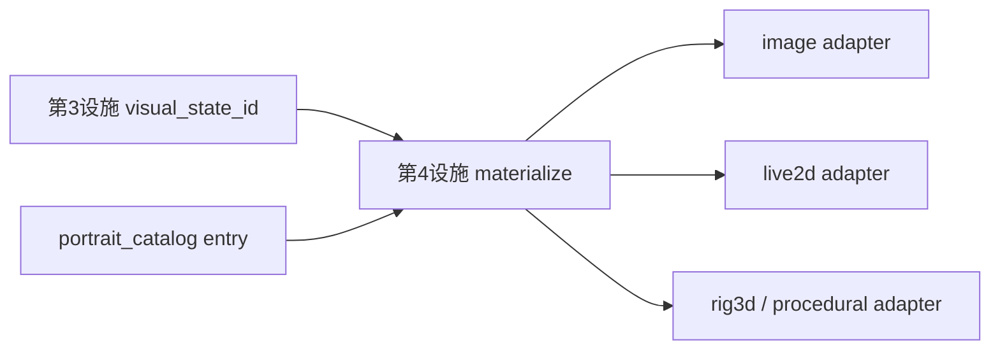

# RFC：视觉表现设施子模块（Visual Presentation · 角色舞台）

| 元数据 | 值 |
|--------|-----|
| 状态 | **Phase 1–4 delivered · Phase 5 partial**（`materialize_directive`、DTO、distro gating；Live2D 未 bundled） |
| 受众 | Cursor / 内核 / 前端渲染 / 发行版（AI Theater） |
| 前置 | [RFC_PORTRAIT_FACILITY.md](RFC_PORTRAIT_FACILITY.md) · [DISTRO_CAPABILITY_PROFILE.md](../kernel/DISTRO_CAPABILITY_PROFILE.md) |
| 命名 | **Visual Presentation Facility Submodule** · 产品口语 **角色舞台** |

[English summary in §0](#0-english-summary)

---

## 0. English summary

**Facility submodule #4 — Visual Presentation**: an **optional render stage** that turns **`visual_state_id`** (from Portrait Facility #3) into **`performance_directive`** for host UI render adapters (PNG hero, Live2D, 3D rig, procedural). **No second LLM** for asset selection. Frame loops and GPU work stay **outside** `process_message`.

---

## 1. 定位与分类

| 能力 | 层次 | 六槽 | 设施编号 |
|------|------|------|----------|
| 视觉表现设施 | 渲染指令 / adapter 路由 | **否** | **第 4 设施子模块** |

**消歧**：

- **不是**立绘选图决策（见第 3 设施）
- **不是** Vue 主题 / 聊天气泡 UI
- **不是** 目录插件 `ui_slots` 本身（插件可作为 **backend adapter**）
- **不是** 六槽 `llm` / `emotion`

**是什么**：给定 `visual_state_id` + catalog entry `kind`，产出宿主可执行的 **directives**；为 Live2D / 3D / 实时演算预留统一出口。

---

## 2. 数据流



| 步骤 | 位置 | 说明 |
|------|------|------|
| 选状态 | 内核 post_llm | 第 3 设施 · **唯一 AI** |
| 生成 directive | 内核轻量 **或** 前端首帧 | 映射 `kind` → 参数模板；**禁止 LLM** |
| 渲染 | Tauri / WebView 帧循环 | adapter 消费 directive |

---

## 3. 角色包：`visual_presentation`

**位置**：`config.json` → `visual_presentation`（与 `portrait_catalog` 并列）。

```json
{
  "visual_presentation": {
    "enabled": false,
    "backend": "none",
    "resources": {
      "live2d_model": "assets/live2d/model.model3.json"
    }
  }
}
```

| 字段 | 默认 | 说明 |
|------|------|------|
| `enabled` | `false` | 简单创作 / VS Code lite 保持关 |
| `backend` | `none` | `none` \| `image` \| `live2d` \| `rig3d` \| `procedural` \| `directory` |
| `resources` | — | backend 所需根路径（模型、rig、shader preset） |

**advanced 创作者**：在编写器「角色舞台」区绑定资源；**不要求**文件名规范，依赖 catalog `id` + `kind`。

---

## 4. `performance_directive`（当前契约形状）

```json
{
  "visual_state_id": "angry_heavy_01",
  "kind": "live2d",
  "expression": "ParamAngleX=…",
  "motion": "idle_angry",
  "fallback_image": "assets/images/xxx.png"
}
```

- 随 `SendMessageResponse` 可选下发，或经 `GET /role_snapshot` 只读暴露
- **`reply` 字段不受影响**

---

## 5. Backend 矩阵（分阶段交付）

| backend | v1 | 说明 |
|---------|-----|------|
| `none` / `image` | ✓ | 等价今日 PNG 立绘位；directive 仅含 path |
| `live2d` | directive 已交付；渲染器 partial | AI Theater / Chat Pro；Cubism 参数映射由宿主适配器负责 |
| `rig3d` | directive 已交付；渲染器 stub | glTF/VRM + clip 由宿主适配器负责 |
| `procedural` | directive 已交付；渲染器 stub | 实时演算参数；帧循环在 UI |
| `directory` | 配置/适配器 stub | 插件 manifest `provides: ["visual_presentation"]`；RPC materialize 尚未开放 |

---

## 6. 发行版 gating（`distro.oclive.toml`）

```toml
[visual_presentation]
mode = "off"   # off | image_only | stage_full
```

| 发行版 | 建议 |
|--------|------|
| VS Code Flash | `off` 或 `image_only` |
| Chat Pro 桌面 | `image_only` → 可选 `live2d` |
| AI Theater | `stage_full` |

与 `[host_flags].skip_complex_emotion` 独立；可关复杂情感但仍显示静态立绘。

---

## 7. 与「进大脑 / 内向视觉」

- catalog 条目可选 `context: social | inner`（Phase C）
- 同一 `visual_state_id` 在不同 UI 模式下降级不同 adapter（内向视图 = 另一 Vue 壳，**仍消费同一 directive 契约**）
- **不**在本设施内实现全屏叙事引擎；必要时未来 **第 5 设施** 单独立项

---

## 8. 验收

- [x] `enabled: false`：零 directive 字段，PNG 路径不变
- [x] `backend: image`：directive.path 与 catalog 一致
- [x] 第 3 设施未产出 id 时，第 4 设施不调用
- [x] Theater profile 打开 live2d 时，post_llm 墙钟不增加帧逻辑

---

## 9. 相关链接

- 立绘决策 RFC：[RFC_PORTRAIT_FACILITY.md](RFC_PORTRAIT_FACILITY.md)
- 历史分阶段计划已归档；现行状态查 [TECHNICAL_DEBT_INVENTORY](../../handoff/TECHNICAL_DEBT_INVENTORY.md)。
