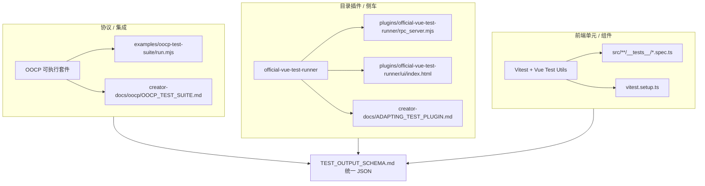

# 测试体系总览

本文档串联 **协议层 → 插件层 → 前端组件层** 的测试入口，便于新贡献者一次看清「在哪写、怎么跑」。

## 分层与工具

| 层级 | 验证什么 | 主要位置 | 统一 JSON |
|------|-----------|-----------|-----------|
| **协议层** | HTTP `/health`、WebSocket OOCP 方法与会话/聊天闭环 | `examples/oocp-test-suite/`、`creator-docs/oocp/OOCP_TEST_SUITE.md` | `run.mjs --json` → `kind: oclive.protocol_conformance_report.v1` |
| **插件层** | 宿主 `directory_plugin_invoke` 调侧车跑 Vitest、历史与结构化结果 | `plugins/official-vue-test-runner/` | `run_test` 返回的 `structured` → `kind: oclive.unit_test_run.v1` |
| **组件层** | Vue 组件、Store、与 Tauri API 的 mock 组合 | `src/**/*.spec.ts`、`src/**/__tests__/` | 一般不产出 schema JSON（Vitest 控制台 / CI 日志即可） |

## 该在哪一层写测试

- **改 OOCP 契约、内核 HTTP/WS 行为、会话状态机**：优先在 **协议层** 增加或调整 `run.mjs` 场景，并更新 `OOCP_TEST_SUITE.md`。
- **改目录插件 RPC、Vitest 调用、统一 `structured` 映射**：在 **插件层** 改 `rpc_server.mjs`，并保证输出仍符合 **`TEST_OUTPUT_SCHEMA.md`**。
- **改 Vue 页面/组件逻辑、Pinia、文案与交互**：在 **组件层** 增加或修改 `*.spec.ts`，对 Tauri 与桥接使用 `vi.mock`（参见现有 spec）。

## 如何运行各层

| 命令 / 动作 | 说明 |
|-------------|------|
| `npm run test:unit`（仓库根） | 前端 Vitest；CI `frontend` job 与此一致。 |
| `cd examples/oocp-test-suite && node run.mjs` | 需已启动带 OOCP 的内核（见该目录 `README.md`）；CI 有独立 `oocp-test-suite` job。 |
| `node run.mjs --json` | 打印符合 **`TEST_OUTPUT_SCHEMA.md`** 的协议一致性报告 JSON（stdout）。 |
| 桌面内打开官方测试插件 UI | `plugins/official-vue-test-runner/ui/index.html`（需授予 `rpc:invoke` 等）；行为见插件 **[README.md](../../plugins/official-vue-test-runner/README.md)**「边界状态说明」。 |

## 延伸阅读

- 统一字段约定：**[TEST_OUTPUT_SCHEMA.md](./TEST_OUTPUT_SCHEMA.md)**
- 适配其他测试运行器：**[../ADAPTING_TEST_PLUGIN.md](../ADAPTING_TEST_PLUGIN.md)**
- OOCP 场景表：**[../oocp/OOCP_TEST_SUITE.md](../oocp/OOCP_TEST_SUITE.md)**
- 仓库根 **AGENTS.md** 中的前端测试与插件说明
