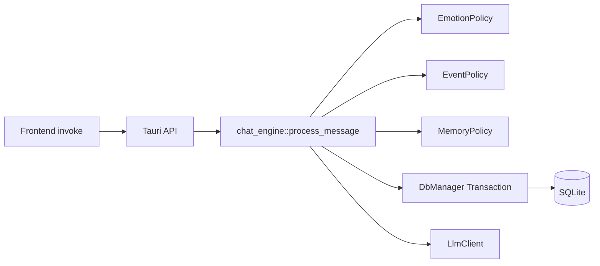
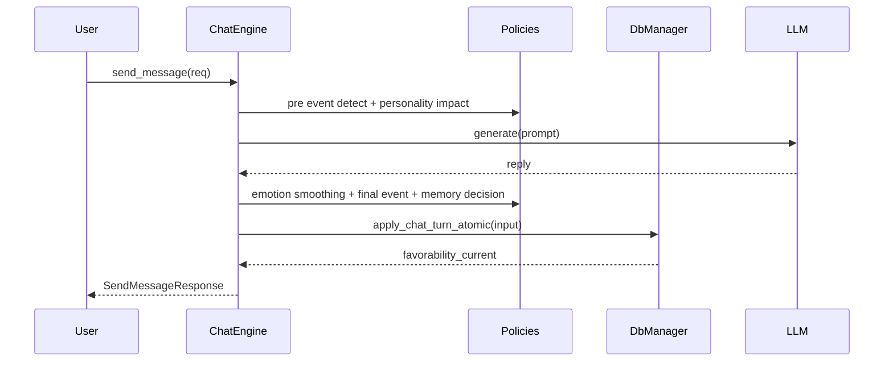

# 策略插件化指南与路线图（面向 4.5 / 4.6）

## 架构图（当前）

## 流程图（单轮消息）

## 阶段验收标准（跨团队对齐）

- Phase 1（已完成）: 策略接口抽象 + 默认实现 + AppState 注入 + `chat_engine` 接口化 + `DbManager` 去策略硬编码。
- Phase 2（已完成）: `config/policy.toml` 主配置 + 环境变量临时覆盖 + 默认行为不变。
- Phase 3（已完成）: 引入 `PolicyContext`，用上下文对象承载策略运行时参数与输入。
- Phase 4（已完成）: 参数化/矩阵测试覆盖（默认/保守/探索），验证策略行为边界。
- Phase 5（已完成，v1）: 策略注册与选择机制（按 scene 绑定 profile）。
- Phase 6（已完成，v1）: 端到端矩阵快照治理（多轮对话输出基线 + 差异审计）。
- Phase 7（进行中）: 动态策略热加载（运行时重载 `policy.toml`，无需重启）。

## 风险点与应对

- 配置漂移风险：不同环境行为不一致。
  - 应对：以 `config/policy.toml` 为主，环境变量只做覆盖；启动日志打印生效配置来源。
- 策略耦合回流风险：业务规则重新写回编排层/DB 层。
  - 应对：code review 检查规则归属；`chat_engine` 仅依赖 policy trait。
- 过度分叉风险：策略实现过多、难维护。
  - 应对：优先“同一策略类 + 多配置实例”，减少重复代码。
- 测试盲区风险：仅测默认配置。
  - 应对：增加参数化测试矩阵（默认/激进/保守）并门禁执行。

## 策略选择决策指南

- `默认策略`：生产基线，追求稳定表达与较少抖动。
- `保守策略`：降低事件敏感度、提高情绪保持阈值，适合高噪声输入场景。
- `激进策略`：提高变化敏感度，适合实验与快速反馈场景。

决策优先级：
- 稳定性优先：默认或保守。
- 可解释性优先：默认（参数可审计）。
- 探索迭代优先：激进（但需灰度和监控）。

## 配置管理规则

- 主配置：`src-tauri/config/policy.toml`。
- 临时覆盖：环境变量 `POLICY_*`。
- 禁止：把阈值硬编码回 `chat_engine` 或 `DbManager`。

## 动态策略热加载（新增）

- 新增命令：`reload_policy_plugins`
- 入口：`src-tauri/src/api/policy.rs`
- 行为：运行时重新读取 `src-tauri/config/policy.toml` 并替换内存策略集。
- 失败策略：
  - 配置不存在/解析失败时返回 `INVALID_PARAMETER`，不覆盖现有运行策略集（保持服务连续性）。

## 端到端矩阵回归（新增）

- 测试文件：`src-tauri/tests/policy_e2e_matrix.rs`
- 快照文件：`src-tauri/tests/snapshots/policy_e2e_matrix.json`
- 覆盖场景：
  - `home -> conservative`
  - `school -> exploratory`
  - `debug_panel -> exploratory`
  - `production -> conservative`
- 回归维度：
  - `memory_count`（探索策略应更多）
  - `avg_memory_importance`（探索策略应更高）
  - `avg_event_confidence`（合法范围校验）
- 运行命令：
  - `cargo test --test policy_e2e_matrix`
  - 或统一门禁 `cargo test --tests`
- 更新快照（仅在确认行为变更合理后）：
  - PowerShell: `$env:UPDATE_POLICY_SNAPSHOTS='1'; cargo test --test policy_e2e_matrix`
  - 若未设置该变量，测试会严格对比快照并在差异时失败。
  - 失败输出会给出逐项 diff（字段、期望值、实际值），便于 CI 快速定位行为漂移。

## 培训与反馈机制

- 内部分享（建议 45 分钟）:
  - 15 分钟：架构与职责边界
  - 15 分钟：配置与策略切换演示
  - 15 分钟：故障案例与排障路径
- 反馈渠道：
  - 日常：在周报中记录“策略问题与配置变更”
  - 紧急：按 `TXN_*` 与策略配置异常日志即时同步

## 中长期规划（摘要）

- 短期（1-2 周）：`PolicyContext` + 参数化测试 + 文档完善。
- 中期（1-2 月）：策略注册中心、策略灰度切换、配置版本化。
- 长期（季度）：插件 ABI 稳定、跨团队策略市场化复用。

