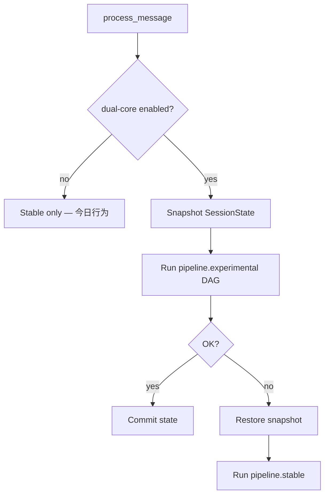

# 给 Cursor：双核双态设计总结 · 对齐进度

**状态**：**P2–P5 已实现**（2026-05）— `DualPipelineRunner`、宿主门控、`init --dual-core`、OOCP S13、Monolith 模板已落地；**默认仍关闭**，不开双核零 diff。  
**权威 RFC**：[creator-docs/rfc/RFC_OCLIVE_DUAL_CORE_DUAL_MODE.md](../creator-docs/rfc/RFC_OCLIVE_DUAL_CORE_DUAL_MODE.md)  
**术语对照**：[DUAL_CORE_ALIGNMENT.md](DUAL_CORE_ALIGNMENT.md)

**与仓库其它计划的关系**：

| 计划 | 关系 |
|------|------|
| [BLUEPRINT_V2_IMPLEMENTATION_PLAN.md](BLUEPRINT_V2_IMPLEMENTATION_PLAN.md) | **已闭环（P0–P8）** — 今日交付基线；双核在其上**扩展**蓝图，不推翻 v2 |
| [RFC_OCLIVE_MONOLITH_MODE.md](../creator-docs/rfc/RFC_OCLIVE_MONOLITH_MODE.md) | **构建态**宏核态；与双核 **正交**（见 §六） |
| 插件极简 UI（`SimplePluginManager` + CLI） | **已落地** — 双核 **不进**默认 GUI |
| `handoff/PERF_PHASES.md` 等性能阶段 | 双核 **P5** 与 Monolith 焊接衔接；**不**替代性能专项 |

---

## 对齐进度总表

| 阶段 | 内容 | 状态 | 说明 |
|------|------|------|------|
| **P0** | 设计对齐文档（本页 + RFC + 索引）+ **已决事项 Q1–Q20** | **已完成** | 见 §九 |
| **P1** | 蓝图契约：`zone`、`pipeline.*`、`depends_on` DAG 校验 | **已完成（校验 crate）** | `blueprint_v3.rs` · `validate_blueprint_v3_json` |
| **边界** | 角色包 / 蓝图 / `runtime_config` 文档 + creator profile | **已完成** | [ROLE_PACK_BOUNDARY.md](ROLE_PACK_BOUNDARY.md) |
| **P1b** | `runtime_config` schema（v2 忽略警告） | **已完成** | `runtime_config.rs` + JSON Schema |
| **P2** | 宿主加载 + `DualPipelineRunner` + `process_message` 门控 | **已完成** | 七槽 experimental method · 快照回滚 |
| **P3** | `oclive init --dual-core` 模板（蓝图 `runtime_config`） | **已完成** | 默认关；非角色包 |
| **P4** | `process_message` 接线 + OOCP 降级用例 | **已完成** | S13 可选 `--include-s13` |
| **P5** | `--monolith --dual-core` 双 pipeline 焊接 | **已完成** | 保留调度器 |
| **深化** | Method 注册表 · 开发者指南 · 架构图双核条 | **已完成** | [METHOD_REGISTRY.md](../creator-docs/dual-core/METHOD_REGISTRY.md) · [DEVELOPER_GUIDE.md](../creator-docs/dual-core/DEVELOPER_GUIDE.md) · `oclive explain DUAL_CORE` |

**当前发布边界**：默认仍是 **Stable 单路径**（v2 兼容或 v4 Stable）；双核仅属于冻结的 v3，须蓝图显式 `enabled` + 非空 `experimental`。本地全量验证含 OOCP S13/S14：`npm run check:release` 或 `node examples/oocp-test-suite/run.mjs --include-dual-core`（须 `--features dual_core` 构建）。

---

## 一、核心构想

双核双态是**运行时**架构：在保持内核稳定的前提下，为创新提供**可降级**的试验场。

| 核 | 职责 | 编排 | 心智 |
|----|------|------|------|
| **稳定核（Stable）** | 保证基础对话能力 | **六槽** `type` + **`complex_emotion` 第七设施**（不进 `pipeline.stable`，宿主硬编码，与今日一致） | 坚如磐石 |
| **实验核（Experimental）** | 安全试错 | **`type` 完全开放**（校验不查 type）；`action` 须能解析到 `slot_registry` 实例；顺序由 `pipeline.experimental` + `depends_on` | 爱干嘛干嘛 |

两核 **共享同一后端实现池**（builtin / remote / directory / ollama …）。**无**「稳定核专属后端」。开发者：实现 trait → 注册 `slot_registry` → **同一实例可同时服务两核**（见 §三 `zone`）。

---

## 二、入口控制：双核默认关闭

- 开关：**`oclive init --dual-core`**（显式开启）；配置归属 **蓝图**，非角色包创作者字段。
- **字段（目标 v3）**：`pipeline.ocblueprint` → **`runtime_config.dual_core.enabled`**（默认 **`false`**）。**创作者分发包不得单独置 `true`**；仅宿主管理员 / 集成方在蓝图或工程模板中开启（见 [ROLE_PACK_BOUNDARY.md](ROLE_PACK_BOUNDARY.md) §5）。
- **legacy**：`settings.json` **不**承载双核开关；旧包保持单 Stable。
- **默认关闭**：未开启时与**当前版本完全一致**，**零影响**。
- **不**进桌面应用设置；**不**增加普通用户心智负担。

---

## 三、蓝图统一管理

**一个** `pipeline.ocblueprint` 管理两核。

### 3.1 关键约定（已确认）

1. **`slot_registry` 是总表** — 不拆成 stable / experimental 两张表。
2. **`zone` 标识归属** — 取值 `stable` / `experimental`；类型为 **字符串或字符串数组**，**同一实例可同时属于两个 zone**（例如 `zone: ["stable", "experimental"]`）。
3. **`pipeline.stable` / `pipeline.experimental`** — 分别定义两核编排；步骤为对象数组。
4. **`depends_on`** — 声明步骤依赖；编排器**加载时校验 DAG**（无环、引用存在）。
5. 未开启双核时：可省略 `pipeline` / `zone`，宿主行为 = 今日 v2。

### 3.2 目标示例（权威形状）

```json
{
  "schema_version": 3,
  "meta": { "oclive_version": "0.4.0" },
  "slot_registry": {
    "memory": { "type": "memory", "zone": "stable", "label": "记忆", "backend": "builtin", "position": 1 },
    "memory_experimental": { "type": "memory", "zone": "experimental", "label": "实验记忆", "backend": "directory", "plugin": "com.example.exp", "position": 2 },
    "emotion": { "type": "emotion", "zone": "stable", "label": "情绪", "backend": "builtin", "position": 3 },
    "llm": { "type": "llm", "zone": "stable", "label": "LLM", "backend": "ollama", "position": 6 }
  },
  "pipeline": {
    "stable": [
      { "action": "slot.emotion.analyze", "depends_on": [] },
      { "action": "slot.llm.generate", "depends_on": ["slot.emotion.analyze"] }
    ],
    "experimental": [
      { "action": "slot.memory_experimental.retrieve", "depends_on": [] },
      { "action": "slot.emotion.analyze", "depends_on": ["slot.memory_experimental.retrieve"] },
      { "action": "slot.llm.generate", "depends_on": ["slot.emotion.analyze"] }
    ]
  }
}
```

> **已决（Q1–Q3）**：`action` 中段为 **`registry_key`**（上例 `emotion`、`llm` 为键名）。`complex_emotion` **不进** `pipeline`（第七设施，宿主硬编码）。`method` 深度见 §十一 Q17。

### 3.3 Stable vs Experimental 对 `type` 的约束

| 核 | `slot_registry.type` | `pipeline` |
|----|----------------------|------------|
| **Stable** | **仅**六槽 + **`complex_emotion` 仅宿主**（不进 pipeline） | 可省略 `pipeline.stable` → 走今日 `co_present`（§十一 Q19） |
| **Experimental** | **任意**（校验不查 type，Q12） | `pipeline.experimental` + `depends_on`；`action` 只要求 registry 键存在 |

---

## 四、调度器与降级机制

**`DualPipelineRunner`**（规划模块：`kernel/crates/oclive_kernel_host/src/domain/dual_pipeline.rs`）：

1. 若未启用双核 → 仅跑 **Stable**（= 今日）。
2. 启用双核 → **优先 Experimental**：
   - 执行前对 **`SessionState`**（及本轮可回滚的编排中间态）做**快照**；
   - 成功 → 保留新状态；
   - 失败（崩溃 / 校验 / 子步骤 `Err`）→ **恢复快照**，无缝执行 **Stable** `pipeline.stable`。

**降级策略**：复用已有 **Remote 降级**思想（`remote_fallback_to_builtin` / `OCLIVE_REMOTE_FALLBACK_TO_BUILTIN`、builtin 回退路径），**不**另建一套错误处理框架。实验核失败 ≈「本回合实验路径不可用 → 走稳定路径」。



---

## 五、两核后端完全平等（开发者视角）

1. 在 `kernel_contracts`（及扩展 trait）实现能力。
2. 在 `slot_registry` 注册实例（`backend` + 可选 `plugin` id）。
3. 用 `zone` 声明可被哪一核的 pipeline 引用。
4. **同一实现、同一 registry 键** 可被 Stable 与 Experimental **同时使用**（当 `zone` 含两者或两 pipeline 均引用同一 `action` 时）。

区别**仅**在：Stable 限六类 type + 固定顺序；Experimental 开放 type + 蓝图 DAG。

---

## 六、与 Monolith（高耦合）正交

| 构建组合 | 运行时行为（目标） |
|----------|-------------------|
| 标准、**无** `--dual-core` | 今日：单 Stable + `PluginHost` |
| **`--monolith`、无 `--dual-core`** | 编译期去掉 `DualPipelineRunner` 与实验链路 → **零开销**单一 Stable；**最终交付极致精简** |
| 标准 + `--dual-core` | 保留调度器；实验失败 → Stable + `PluginHost` |
| **`--monolith --dual-core`** | 两核 pipeline **焊接**求性能；**仍保留** `DualPipelineRunner` + 快照降级 → **开发者高性能实验环境** |

双核与 Monolith **无冲突**。

---

## 七、当前状态、角色包边界与 Cursor 约束

| 项 | 结论 |
|----|------|
| 当前项目 | v2 蓝图 **已闭环**，可正常交付 |
| 角色包 / 蓝图 | [ROLE_PACK_BOUNDARY.md](ROLE_PACK_BOUNDARY.md) · `pack validate --profile creator` |
| 双核 P1 校验 | **`validate_blueprint_v3_json`** 已入库；**宿主调度未接线** |
| 双核 | **P2+ 未来**；**不阻塞** v2 发布 |
| Cursor 默认 | **勿**改未开双核时的 `process_message` 默认路径 |
| 交叉引用 | 创作者**不得**在分发包单独 `runtime_config.dual_core.enabled: true`（§十二） |

### 实现顺序（建议）

1. **P1** — `oclive_validation`：`zone`、`pipeline` 步骤、`depends_on` DAG 校验 + fixture。
2. **P2** — `DualPipelineRunner` 单测 + 快照 MVP（先内存态，再定 DB 边界）。
3. **P3** — `oclive-cli init --dual-core`。
4. **P4** — 宿主 `process_message` 分支；OOCP 降级场景。
5. **P5** — Monolith 双 pipeline 焊接（`RFC_OCLIVE_MONOLITH_MODE`）。

### 代码索引

| 区域 | 路径 |
|------|------|
| 编排 | `kernel/crates/oclive_kernel_host/src/domain/chat_engine/mod.rs`、`turn_pipeline.rs` |
| 槽位 | `kernel/crates/oclive_kernel_host/src/domain/slot_resolver.rs` |
| 蓝图 | `kernel/crates/oclive_validation/src/blueprint_v2.rs` |
| 契约 | `kernel/crates/oclive_kernel_contracts/` |
| Remote 降级参考 | `kernel/crates/oclive_kernel_host/src/domain/chat_engine/`、`remote_fallback` 相关、`api/settings.rs` |
| CLI | `kernel/crates/oclive-cli/` |

---

## 九、已决事项（2026-05 对齐）

| ID | 问题 | 决议 |
|----|------|------|
| Q1 | Stable 与 `complex_emotion` | **第七设施**；不进 `pipeline.stable`；宿主硬编码（= 今日 `co_present`） |
| Q2 | `action` 命名 | **`slot.<registry_key>.<method>`**（registry 键唯一；同 `type` 可多实例） |
| Q3 | `depends_on` | **一步一 action**；`depends_on` 引用 **action 字符串**（非步骤 id） |
| Q4 | `zone` 双属是否须被 pipeline 引用 | **不强制**；`zone` 为归属标注，pipeline 可不用该实例 |
| Q5 | Stable pipeline 引用仅 `experimental` zone 的键 | **校验拒绝**（P1） |
| Q6 | 未开双核时蓝图含 `zone`/`pipeline` | **忽略**（向前兼容；v2 包无感） |
| Q7 | 实验失败用户可见性 | **完全静默**（与 Remote 降级一致） |
| Q8 | 快照范围（P2 MVP） | **仅内存态**：`SessionState` + 编排中间态 + `narrative_hint` 等；**不含** DB 已提交写入 |
| Q9 | 实验失败定义 | **硬失败**：子步骤 `Err`、超时、panic（边界捕获）、`oclive_validation`/契约失败 |
| Q10 | schema | **`schema_version: 3`**；v2 **不**自动升级，须迁移工具 |
| Q11 | `--dual-core` 粒度 | **蓝图**（`runtime_config.dual_core.enabled`）；`oclive init --dual-core` 写模板；不进桌面设置；**非**创作者开启 |
| Q12 | Experimental `type` | **完全开放**；校验只保证 `action` 解析到的 **registry 键存在**，不校验 `type` |
| Q13 | Experimental 引用 Stable 实例 | **允许**（同一 `slot_registry` 键可被两 pipeline 引用） |
| Q14 | 首版范围 | **P4** = 标准构建 + `--dual-core`；**P5** `--monolith --dual-core` **单独里程碑** |
| Q15 | 双核启用标志 | **`runtime_config.dual_core.enabled`**（蓝图）；创作者包不得单独 `true` |
| Q16 | schema 分流 | 宿主按 **`schema_version` 分流**：**2** → 今日 v2 逻辑；**3** → 双核校验（`validate_blueprint_json_by_schema_version`） |
| Q17 | `method` 校验 | **P1 只校验 registry 键存在**；不校验 `method` 闭表 |
| Q18 | v3 迁移工具 | **P4 前手写 v3 示例**；`migrate-v2-v3` **延后** |
| Q19 | 省略 `pipeline.stable` | Stable 走 **`co_present` 硬编码**，不经 pipeline 解释器 |
| Q20 | Experimental `type` 运行时 | **P4 仅支持 `PluginHost` 七种 type**；开放 type 校验过、运行时报未实现 |

---

## 十、分阶段实施计划（P1–P5）

### P1 — 蓝图契约（`oclive_validation`）

| 任务 | 验收 |
|------|------|
| 新增 `blueprint_v3.rs`（或 v3 模块）`schema_version == 3` | 与 v2 校验路径分离；v2 行为不变 |
| `SlotRegistryEntry.zone`：`string \| string[]` | 缺省 `stable` |
| `pipeline.stable` / `pipeline.experimental` 步骤：`action` + `depends_on` | DAG：无环、边指向已声明 `action` |
| `action` 解析：`slot.<registry_key>.<method>` | registry 键 **必须存在**；**不**校验 `type`（Experimental）；Stable 步骤额外校验 `type ∈` 六槽 |
| Stable 禁止引用 `zone` 仅含 `experimental` 的键 | 校验错误信息可定位 JSON 路径 |
| 未启用双核的加载路径 | 含 v3 字段的 v2 加载器：**忽略** `zone`/`pipeline`（或仅 v3 文件走 v3 校验 — 见 §十一 Q16） |
| fixture + `cargo test -p oclive_validation` | 覆盖合法 DAG、环、缺键、zone 违规 |
| 文档 | `ROLE_PACK_SPEC` / `BREAKING_CHANGE_PROCESS` 登记 schema 3 |

**不在 P1**：`method` 白名单表（见 §十一 Q17）、运行时调度。

---

### P2 — `DualPipelineRunner`（库层 / 单测）

| 任务 | 验收 |
|------|------|
| 新模块 `chat_engine/dual_pipeline.rs` | 可脱离 Tauri 单测 |
| 启用双核：快照 → 跑 `pipeline.experimental`（拓扑序）→ 成功提交 / 失败恢复 | 与 Q8/Q9 一致 |
| `complex_emotion` | **不**经 pipeline 调度；由 Stable 路径宿主在固定点调用 |
| 失败 → 静默降级跑 Stable | 日志可带 `degraded_from=experimental`；**无**用户可见字段（Q7） |
| Stable 无 `pipeline.stable` | 回退 **今日** `co_present` 硬编码顺序（Q1） |
| `pipeline.experimental` 空 | 跳过实验路径，仅 Stable |

**不在 P2**：`process_message` 接线、Monolith 焊接。

---

### P3 — 脚手架

| 任务 | 验收 |
|------|------|
| `oclive init --dual-core` | 生成 `schema_version: 3` 示例 + `zone` + 双 `pipeline` |
| 默认 `init`（无 flag） | 仍生成 v2 或 v3 无 pipeline（**不**改变今日默认） |
| `CONFIG_REFERENCE` / CLI 指南 | 与 Q11 一致 |

---

### P4 — 宿主集成（标准构建）

| 任务 | 验收 |
|------|------|
| 角色包 / 宿主读取「双核已启用」 | 见 §十一 Q16 |
| `process_message` 分支：未启用 = 零 diff | OOCP **S0–S12** **全绿**（默认 13 场景） |
| 启用：接 `DualPipelineRunner` | 实验失败 → Stable；回复契约不变 |
| `SlotResolver` 按 `zone` 提供视图（如需） | Experimental 步骤只绑定目标 registry 键 |
| OOCP **增量**场景 | 至少 1 条：实验失败降级 Stable 仍返回 `reply` |
| `invoke` 热路径 | 不开双核时矩阵 **无回归** |

**明确不在 P4**：`--monolith --dual-core`（归 P5）。

---

### P5 — Monolith + 双核（独立里程碑）

| 任务 | 验收 |
|------|------|
| `oclive-cli init --monolith --dual-core` | 焊接 `pipeline.stable` / `pipeline.experimental` |
| 保留 `DualPipelineRunner` + 快照降级 | `bench --compare` 可选对比 |
| 文档 | `RFC_OCLIVE_MONOLITH_MODE` 交叉链接 |

---

## 十一、待决问题（第二轮）

**已全部并入 §九（Q15–Q20）。**

---

## 十二、与角色包边界（交叉引用）

| 主题 | 文档 |
|------|------|
| 职责 SSOT | [ROLE_PACK_BOUNDARY.md](ROLE_PACK_BOUNDARY.md) |
| 双核开关不得由创作者单独开启 | BOUNDARY §5.1 · 本页 Q15 |
| Experimental 与角色包内容 | BOUNDARY §5.2 · 角色包只承载 Stable 灵魂数据 |
| 创作者校验 | `pack validate --profile creator`（不校验 `slot_registry` / `pipeline`） |

---

## 十三、开放问题（已关闭）

Q1–Q20 已决。**P2–P5 已实现**：宿主加载 `runtime_config`、`DualPipelineRunner` + `process_message` 门控、`oclive init --dual-core`、OOCP S13（可选）、Monolith `--dual-core` 模板。进度与验收见 [DUAL_CORE_ALIGNMENT.md](DUAL_CORE_ALIGNMENT.md)、[PRODUCT_SELF_CHECK.md](PRODUCT_SELF_CHECK.md) §四。

---

**给 Cursor 的简短指令**：实现双核时以 **本页 + RFC** 为 SSOT；**默认关闭**；**不开双核零 diff**；降级**复用 Remote 回退模式**；**勿**与 Monolith 开关混用。
