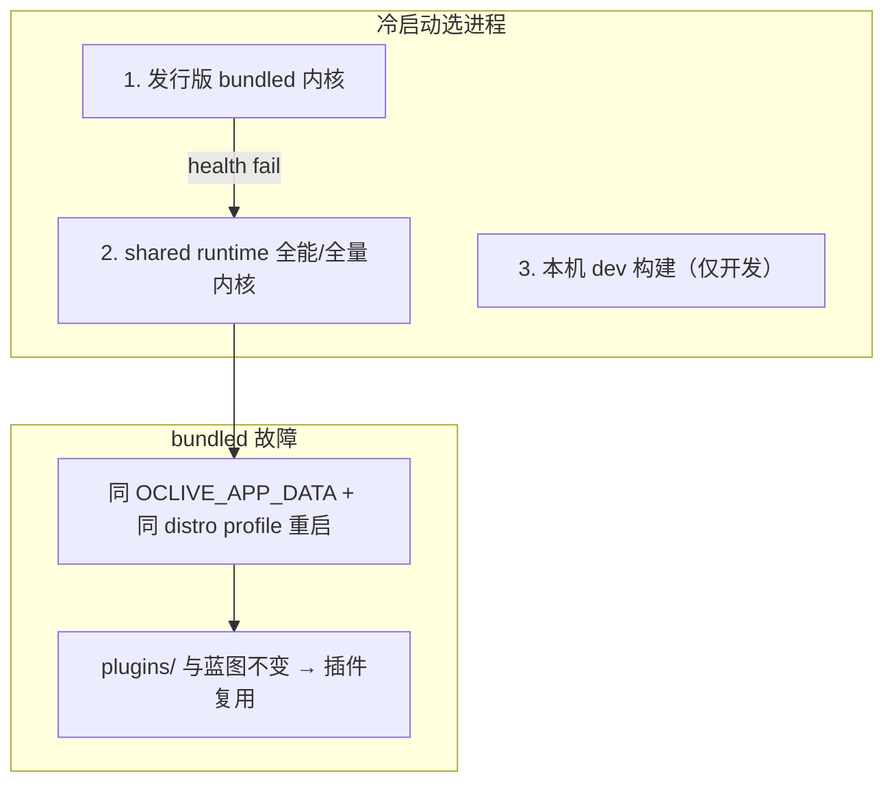
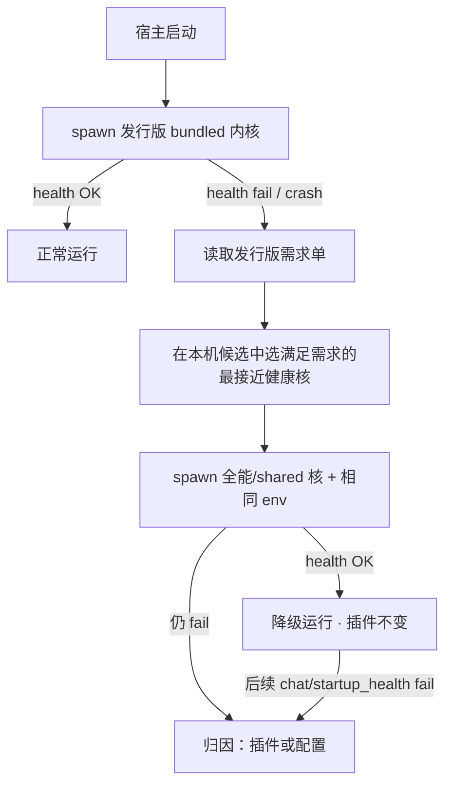

# 内核调度系统 — 范围重划（Rescope · 2026-06-11）

**状态**：架构决策 · **不删代码** · 产品面 **收窄 + 封存扩展**  
**关联**：[DISTRO_DEFAULT_PLUGINS.md](../creator-docs/kernel/DISTRO_DEFAULT_PLUGINS.md) · [DISTRO_KERNEL_LIFECYCLE.md](../creator-docs/kernel/DISTRO_KERNEL_LIFECYCLE.md)

---

## 1. 问题：三层机制被混为一谈

用户体感「调度鸡肋」，常因把下面三件事当成同一套「上下级内核」：

| 层 | 机制 | 调度对象 | 是否仍需要 |
|----|------|----------|------------|
| **A · 进程调度** | `resolve_kernel_action` · promote · attach/replace | **哪个 `oclive-kernel-server` 进程**、是否重启 | **要，但应收窄** |
| **B · 发行版策略** | `HostProfile` · `distro.oclive.toml` · 蓝图 `slot_registry` | **同一进程内**有效六槽 + prompt/memory | **要 — 新主战场** |
| **C · 槽位降级** | remote/directory → builtin · Agent fallback · Theater 前端 Ollama fallback | **单回合**模块失败时的备选实现 | **要 — 可靠性，不是层级** |

**结论**：发行版差异应主要在 **B（插件矩阵）** 解决；**A 不应再承担「为每个发行版裁剪不同内核能力」**；**C 不是上下级，是 fail-open**。

---

## 2. 北极星（2026-06-11 修订 · 发行版内核优先 + 全能兜底）

**优先级反转**（相对「一个全能内核打天下」）：

| 角色 | 内核二进制 | 何时用 |
|------|------------|--------|
| **发行版自带** | 安装包 `resources/bin/oclive-kernel-server` + sidecar manifest | **默认首选** · 可含该发行版测过的 feature_set |
| **全能兜底** | `%LOCALAPPDATA%/OCLive/runtime/` shared 全量构建 | bundled 启动失败 / crash / manifest 不兼容 |
| **开发覆盖** | monorepo dev build（score 89–95） | 仅开发者；**不**作为终端用户默认 |

**插件复用（兜底时）**：目录插件在 `{app_data}/plugins/`；策略在 `distro.oclive.toml` + 角色蓝图。**换兜底内核 ≠ 换插件目录** — 新进程继承相同 `OCLIVE_APP_DATA`、`OCLIVE_DISTRO_PROFILE`、`OCLIVE_ROLES_DIR` 即可。

**新模块问题**：

- **档 1–2**（新 directory 插件 / 正交能力）：装在 app_data，发行版内核与兜底全能核 **共用同一路径**。
- **档 3**（新编排 stage / 新六槽枚举）：需 **内核 semver**；发行版包可带较新 bundled；兜底核 **runtime_api_version ≥ 发行版要求** 时接管，否则 degraded + 提示升级。

**与 B 层关系**：发行版差异仍主要在 **HostProfile + 蓝图**；bundled 与 shared **可以是同一构建产物**（今日 logical seed），差别在 sidecar `feature_set` / 测试矩阵，而非必须两颗裁剪 binary。

---

## 2b. 单进程 vs 多进程（代码库审查结论）

**今日契约：单核进程（`:8420` + 单写者 `app.db`）**

| 证据 | 位置 |
|------|------|
| 固定默认端口 `8420` | `DEFAULT_API_PORT` · `OCLIVE_API_PORT` |
| 单写者 | [OCLIVE_APP_DATA.md](../creator-docs/kernel/OCLIVE_APP_DATA.md) · [CROSS_HOST_MEMORY.md](../creator-docs/role-pack/CROSS_HOST_MEMORY.md) |
| VS Code + 桌面共库 | attach 同一 HTTP 内核 |
| replace 时杀 `:8420` | `kernel_lifecycle/port_ops.rs` |

**同时跑多个发行版（桌面 Theater + VS Code 并排）**：

| 模式 | 现状 | 性能 / 体验 |
|------|------|-------------|
| **单进程 + attach** | profile 兼容则共用 | **最优** · 一份 Rust + 一份 SQLite 写者 |
| **单进程 + replace** | profile 冲突（theater ↔ vscode） | 一次重启 ~数秒 · **无双倍常驻内存** |
| **多进程多端口** | **未实现** · 客户端写死 8420 | 需拆分 app.db 或放弃 L3 共库 · **2× 内存 + 2× 插件子进程** · 不推荐近期做 |

**插件切换 vs 进程切换**：

- **换插件矩阵（同 profile）**：进程内下一回合 `effective_plugin_backends` 重算 · **毫秒级** · 无额外进程。
- **换发行版 profile**：必须 **重启内核加载 HostProfile**（无热切换）· 成本 ≈ 一次 spawn + health poll。
- **多进程并行**：避免 restart，但 **常驻成本 > 偶尔 restart**（典型 kernel-server 数十 MB 级 + 每插件一子进程）。

**裁定**：**保持单进程单端口**；多发行版同时开 → **attach 优先，冲突时 last-writer replace**；**不**做默认多核并行。

**K-SCHED-05（Done · 2026-06）**：`pick_best_for_spawn` — bundled → shared → dev（`OCLIVE_DEVELOPER=1`）；`discover_spawn_kernel_candidates` 仍按 score 收集，spawn 决策走 tier rank。

---

## 3. 对 `resolve_kernel_action` 的裁定

实现：`crates/oclive_kernel_runtime/src/kernel_strategy.rs`  
文档：[DISTRO_KERNEL_LIFECYCLE.md](../creator-docs/kernel/DISTRO_KERNEL_LIFECYCLE.md)

### 3.1 保留（产品仍依赖）

| 行为 | 场景 |
|------|------|
| **Attach** + `profile_compatible` | VS Code / 桌面共用 `:8420`，profile 一致则勿杀进程 |
| **ReplaceAndAttach** + `profile_mismatch` | 从 `vscode` 切到 `theater`（或反向）— **必须重启加载新 HostProfile** |
| **SpawnBest** / **FallbackBundled** | 本机无进程时拉起；仅 bundled 时 degraded 提示 |
| **CLI `kernel ensure --plan-only`** | VS Code / 桌面共享决策 SSOT |

### 3.2 封存 — 不再产品化扩展

| 行为 | 原意 | 裁定 |
|------|------|------|
| **ReplaceAndAttach** + `binary_upgrade` | 本地有更强 manifest 时替换运行中内核 | **Freeze** · 开发者可选 · 默认宿主不主动 replace |
| **promote** score 88 梯队 | dev build → shared runtime | **维护模式** · 文档保留 · 非发行版卖点 |
| **cmp_for_capability** 多档 binary | 嵌入式/裁剪核 | **Deferred** · 与 Monolith 同级 |
| **Profile 热切换** | 单进程换 distro | **不做** · 永远 restart + env |

### 3.3 与专利的关系

[handoff/PATENT_SUBMISSION_PRIORITY.md](./PATENT_SUBMISSION_PRIORITY.md) A 类交底仍覆盖 **profile-aware attach/replace**。**封存的是产品扩展面**，不是删 Rust 模块。

---

## 4. 槽位「降级」— 保留，但改名叙事

| 旧叙事（易误解） | 新叙事 |
|------------------|--------|
| 内核上级/下级 | **同槽多实现，失败换实现** |
| 发行版阉割内核 | **发行版固定矩阵（B 层）** |
| Remote 不如 Builtin | **Builtin 是默认可靠路径；Remote 是实验/增强** |

仍保留的实现（勿动主路径）：

- `FallbackAgentProvider` · directory RPC 失败 → builtin
- `remote_fallback_to_builtin` app_settings
- Theater `useTheaterBeatPatch` 无 Ollama → 预置备选句（**内容降级**，非内核调度）
- `high_risk_grants` 未授权 → noop / 提示（**安全降级**）

**desktop-chat 实验场**：允许 remote/directory **不**自动 fallback（或用户可关 fallback）— 未来 P2 设置项，非本轮。

---

## 5. 已冻结、与调度并列的其它「重型机械」

| 项 | 状态 |
|----|------|
| **dual_core** / blueprint v3 pipeline DSL | 机制预埋 · 默认关 · 见 TECHNICAL_DEBT |
| **Monolith 焊接** | 专利充数 · 不投性能 |
| **per-distro kernel binary** | Deferred · 见 DISTRO_DEFAULT_PLUGINS §6 |
| **expert_routing** | Frozen |

---

## 6. 二次改进路线（可选 RFC · 非阻塞 Theater T1–T4）

若要做代码级「扁平化」，建议 **单 PR 收窄默认行为**，不删类型：

| ID | 改动 | 风险 |
|----|------|------|
| K-SCHED-01 | 桌面/VS Code 默认 `allow_replace_running` 仅对 `profile_mismatch` 为 true；**禁用** `binary_upgrade` 自动 replace | **Done** · env `OCLIVE_ALLOW_BINARY_UPGRADE=1` opt-in |
| K-SCHED-02 | `/health` 文档强调：**发行版能力 = active_profile_summary**，不是 manifest feature_set | **Done** · [DISTRO_KERNEL_LIFECYCLE.md](../creator-docs/kernel/DISTRO_KERNEL_LIFECYCLE.md) §active profile |
| K-SCHED-03 | `apply_host_ceiling` 文档与实现词统一为 **profile_override**（可选 rename，Breaking 走流程） | **Done（文档层）** · Rust 名保留 |
| K-SCHED-04 | 合并 discovery 文档为 3 档：`bundled` / `shared` / `dev` | **Done** · 见下表 |
| K-SCHED-05 | Spawn **发行版 bundled 优先** → shared 全能兜底；dev 仅 `OCLIVE_DEVELOPER=1` | **Done** · `pick_best_for_spawn` |

### Discovery 三档（K-SCHED-04 · SSOT）

| 档 | 来源 | 何时入选 spawn | 备注 |
|----|------|----------------|------|
| **`bundled`** | 安装包 `resources/`、扩展 `bin/`、Tauri bundle | **冷启动首选** | `pick_best_for_spawn` tier rank 1 |
| **`shared`** | `%LOCALAPPDATA%/OCLive/runtime/oclive-kernel-server` | bundled 不可用或 attach 兜底 | tier rank 2 · 全量构建 |
| **`dev`** | monorepo `target/debug`、score 89–95 | 仅 `OCLIVE_DEVELOPER=1` | tier rank 3 · 非终端默认 |

`discover_spawn_kernel_candidates` 仍按 discovery score 收集候选；**spawn 决策**走 `pick_best_for_spawn` 的 tier rank，而非盲目取最高分 dev build。

**不建议**：删除 `resolve_kernel_action` 或去掉 attach — 会破坏 VS Code + 桌面共 `:8420` 与 `app.db`。

---

## 7. 一句话对外

> **一个 `:8420` 进程写 `app.db`；发行版自带内核先试，故障时全能 shared 核兜底并复用 app_data 插件；多发行版并行不默认多进程。**

---

## 8. 兜底阶梯与故障归因（已确认 · 2026-06-11）

### 8.1 单核 + 发行版优先 + 全能兜底

### 8.2 「发行版内核需求单」— 已有，可扩展

**SSOT**：[`distro.oclive.toml`](../examples/distro-profiles/theater.oclive.toml) → 调度子集 [`DistroProfileRequirements`](../crates/oclive_kernel_types/src/models/kernel.rs)（`parse_distro_requirements_file` · [`kernel_distro_profile.rs`](../crates/oclive_kernel_runtime/src/kernel_distro_profile.rs)）。

| 字段 | 含义 |
|------|------|
| `distro_id` | 发行版 id |
| `required_modules` / `forbidden_modules` | agent、complex_emotion 等 |
| `prompt_profile` / `post_process_profile` | concise / minimal 等 |

兜底选核时：**扫描本机健康候选** → `profile_satisfies_caller(active_summary, caller_requirements)` + `KernelBinaryManifest.cmp_for_capability`（选与发行版需求 **最接近** 的全能核，而非盲目最高分 dev build）。

**插件复用**：不拷贝插件。兜底 spawn 沿用同一组 env：

- `OCLIVE_APP_DATA` → `{app_data}/plugins/` 不变  
- `OCLIVE_DISTRO_PROFILE` → 同一 HostProfile / `[plugin_backends]`  
- `OCLIVE_ROLES_DIR` → 同一蓝图 `slot_registry` / `directory_plugins`

即：**换二进制，不换插件装备**。

### 8.3 双层故障归因（产品逻辑）

| 现象 | 归因 |
|------|------|
| bundled 起不来，shared 全能核 + **同一 profile/插件** 正常 | **发行版 bundled 二进制** 问题（损坏/版本/平台） |
| bundled 与 shared **均** startup_health / 首轮对话失败 | **插件或角色配置**（directory 未授权、RPC 挂、蓝图指向缺失插件） |
| shared 成功但某槽 remote/directory 单独失败 | **单槽 fallback**（C 层），非换核 |

用户可见文案方向：「已切换到兼容内核继续运行」vs「插件 xxx 异常，已回退内置实现 / 请检查权限」。

### 8.4 「全能核记录」— 建议不做重资产

用本地历史「拼出真正全能核」**鸡肋**（记录 ≠ 二进制）。若需支持排障，仅保留 **轻量 last event**（可选）：

- 路径：`{app_data}/kernel_fallback_last.json`  
- 字段：`at` · `from_tier: bundled` · `to_tier: shared` · `distro_id` · `bundled_path` · `fallback_path` · `health_error`  

**不**做聚合统计、不据此自动 promote；shared runtime 仍由官方 release / `oclive-cli kernel promote` 维护。

### 8.5 实现 backlog（非阻塞 Theater T1–T4）

| ID | 内容 |
|----|------|
| K-FALLBACK-01 | Spawn 顺序：bundled → shared（K-SCHED-05） |
| K-FALLBACK-02 | 兜底选核：`DistroProfileRequirements` + 最近 capability match |
| K-FALLBACK-03 | `startup_health` 失败后自动走兜底链（今日仅 graded attach fallback） |
| K-FALLBACK-04 | UI：`degraded` + `status_message` 区分「换核」vs「插件异常」 |
| K-FALLBACK-05 | 可选 `kernel_fallback_last.json` |

---

## Related

- [DISTRO_DEFAULT_PLUGINS.md](../creator-docs/kernel/DISTRO_DEFAULT_PLUGINS.md)
- [theater/DEVELOPMENT_ROADMAP.md](./theater/DEVELOPMENT_ROADMAP.md)
- [TECHNICAL_DEBT_INVENTORY.md](./TECHNICAL_DEBT_INVENTORY.md)
