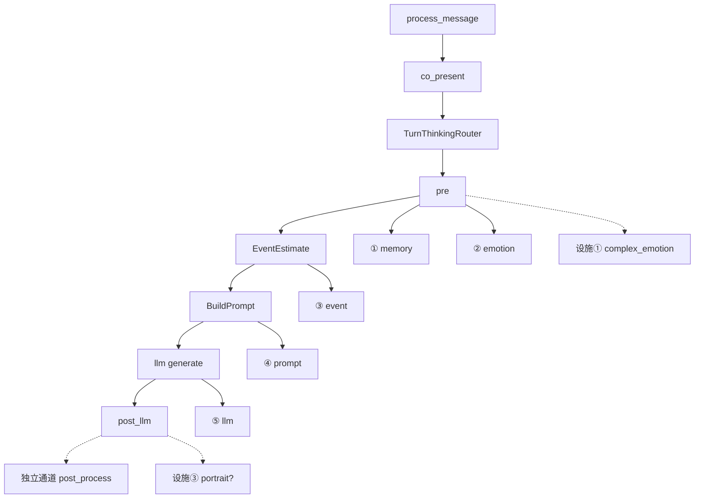

# 模块注册表（Module Registry）

**最后更新**：2026-06-25  
**SSOT 范围**：**模块定义 · 架构划分 · 槽位/设施/独立通道之间的联系 · 在边界内如何改**。  
**非 SSOT**：发版进度 → [`TECHNICAL_DEBT_INVENTORY.md`](./TECHNICAL_DEBT_INVENTORY.md) · 版本快照 → [`PROJECT_STATUS_AND_ALIGNMENT.md`](../creator-docs/getting-started/PROJECT_STATUS_AND_ALIGNMENT.md) · 关键文件路径 → [`BUS_FACTOR_NOTES.md`](./BUS_FACTOR_NOTES.md) · 文档分责 → [`handoff/README.md`](./README.md) §文档分责。

**改本文的条件**：新增/重命名模块或设施、变更六槽合并规则、新增编排行能力（非六槽）、或术语混淆需补对照表。**禁止**在本文堆进度叙事或复制 PLUGIN_V1 全文。

---

## 0. 四条铁律（关系骨架）

| # | 铁律 | 一句话 |
|---|------|--------|
| 1 | **编排** | [`process_message`](../kernel/crates/oclive_kernel_host/src/domain/chat_engine/process_message.rs) → 共在 [`co_present`](../kernel/crates/oclive_kernel_host/src/domain/chat_engine/turn_pipeline/co_present.rs)；蓝图 **`steps[]` 不调度**。 |
| 2 | **六槽** | `slot_registry` → `PluginBackends` → `PluginHost::resolve_for_role`；键 **`memory` · `emotion` · `event` · `prompt` · `llm` · `agent`**。 |
| 3 | **记忆三套存储** | 聊天日志 **`chat_messages`** ≠ **`short_term_memory`** ≠ **`long_term_memory`**；删聊天 **不清** 记忆表。 |
| 4 | **配置四层** | 角色包 → 蓝图 → 发行版 `HostProfile` → 会话 DB；分责 [`ROLE_PACK_BOUNDARY.md`](./ROLE_PACK_BOUNDARY.md)。 |

---

## 1. 术语对照（防「三层」混淆）

| 说法 | 指什么 | 深入 SSOT |
|------|--------|-----------|
| **记忆三套存储** | 聊天日志 · STM · LTM | [`CHAT_STORAGE_ARCHITECTURE.md`](./CHAT_STORAGE_ARCHITECTURE.md) |
| **Prompt 三区块** | 系统 / 角色 / 用户 Tier0 + 页脚 | `prompt_builder/mod.rs` |
| **架构四大类** | 1–6 后端 · 第 N 设施 · 独立通道 · 插件实现 | 本文 §2 |
| **集成三层** | UI/语音 → HTTP → 内核 | `human-docs/team/SCOPE_AND_BOUNDARIES.md` |
| **测试三层** | 协议 / 编写器 / 插件范式 | `creator-docs/testing/OVERVIEW.md` |

---

## 2. 模块四大类（划分）

| 大类 | 占 `plugin_backends` 六键？ | 编号 | 改动的文档 SSOT |
|------|------------------------------|------|-----------------|
| **后端模块（六槽）** | **是** | 第 1–6 模块 | **本文 §3–§8** + [`PLUGIN_V1.md`](../creator-docs/plugin-and-architecture/PLUGIN_V1.md)（DTO/顺序） |
| **设施子模块** | **否** | 第 1–4 设施 | **本文 §9** + 各 RFC |
| **独立通道能力增强** | **否** | 注册表 `id` | **本文 §10** + [`RFC_SIDE_CHANNEL_CAPABILITY_ENHANCEMENTS.md`](../creator-docs/rfc/RFC_SIDE_CHANNEL_CAPABILITY_ENHANCEMENTS.md) |
| **后端模块插件** | 挂在某槽 `backend` | 无独立号 | [`DIRECTORY_PLUGINS.md`](../creator-docs/plugin-and-architecture/DIRECTORY_PLUGINS.md) · [`SLOT_BACKEND_REALITY_MATRIX.md`](./SLOT_BACKEND_REALITY_MATRIX.md) |

**对外叙述**（产品文案、编号脚注）：[`OCLIVE_ARCHITECTURE_OVERVIEW.md`](../creator-docs/getting-started/OCLIVE_ARCHITECTURE_OVERVIEW.md) — **不**在此重复长文。

---

## 3. 六槽解耦机制（共用）

### 3.1 三层解耦

| 层 | 含义 |
|----|------|
| **编译期** | 各槽 `trait` + `PluginHost`；换实现 **不改** `process_message` 顺序 |
| **配置期** | v2 `slot_registry` 多实例 → 折叠 `PluginBackends`（同 `type` **last-wins**，`position` 大者优先） |
| **运行期** | `set_session_slot_override` 叠在有效快照上（**不写盘**） |

### 3.2 有效 backends 解析链

```text
slot_registry（或 legacy plugin_backends）
  → 用户 LLM 设置 / env
  → 发行版 [plugin_backends] 整表替换（若声明）
  → host_flags（skip_agent → agent=none 等）
  → 会话 PluginBackendsOverride
  → startup_health
  → PluginHost::resolve_for_role
```

| 代码 | 路径 |
|------|------|
| 折叠 | `slot_resolver.rs` · `plugin_backends.rs` |
| 合并 | `host_backends.rs` |
| 装配 | `plugin_host.rs` · `backend_registry.rs` |
| 共在调用 | `slot_runner.rs` · `co_present.rs` |

### 3.3 多实例合并

| 槽 | 策略 |
|----|------|
| memory | 去重合并检索 |
| llm | last-wins |
| agent | 工具集合并 |
| 其它 | PLUGIN_V1 · ARCHITECTURE_LAYERING |

**backend 真值矩阵（24 格）**：只维护于 [`SLOT_BACKEND_REALITY_MATRIX.md`](./SLOT_BACKEND_REALITY_MATRIX.md)，本文 **不** 复制该表。

`groups` / `module_relations`：仅 UI 派生边；**禁止** `module_relations` 落盘。

---

## 4. 第 1 模块 · `memory`

| 项 | 内容 |
|----|------|
| **定义** | 为 Prompt 提供 **相关记忆检索**；维护 STM 写入与 LTM 归档策略的 **编排侧** 入口 |
| **`plugin_backends` 键** | `memory` |
| **Trait** | `MemoryRetrieval`（`oclive_kernel_contracts`） |
| **合法 backend** | `builtin` · `remote` · `directory` · `local` · `none` |
| **Builtin** | `BuiltinMemoryRetrieval` + `MemoryEngine`（STM/LTM 衰减、阈值） |
| **主链 hook** | `turn_pipeline/pre.rs` 检索 · `post_llm` 写入 STM/LTM |
| **与聊天存储** | **无关** — `chat_messages` 不进 MemoryEngine；回放见 `replay_memory_extraction` |
| **合并** | 多 memory 实例 → 去重合并 |
| **`none`** | `NoopMemoryRetrieval`；共景路径通常 **禁止** none（见 MODULE_NONE_SEMANTICS） |
| **允许改** | 检索算法、decay、archive 阈值、remote/directory 协议 |
| **禁止** | 用聊天记录表当记忆真源；角色任务改 `slot_registry` |

**记忆三套存储（与第 1 模块配合）**：

| 存储 | 表 / 组件 | 进 Prompt |
|------|-----------|-----------|
| 聊天日志 | `HybridConversationStore` · `chat_*` | **否** |
| 短期 | `short_term_memory` | **是** |
| 长期 | `long_term_memory` | **是** |

---

## 5. 第 2 模块 · `emotion`

| 项 | 内容 |
|----|------|
| **定义** | 分析 **用户句** 情绪，供 Prompt 与事件/好感链路消费 |
| **键** | `emotion` |
| **Trait** | `UserEmotionAnalyzer` |
| **Backend** | `builtin` · `remote` · `directory` · `none` |
| **主链 hook** | `pre.rs` → `EmotionResult` → Prompt · Turn Thinking Auto 路由 |
| **与复杂情感** | **不同模块** — 复杂情感是 **第 1 设施**（消费 emotion 产出） |
| **允许改** | 分析器、remote 协议 |
| **禁止** | 写入 `slot_registry` 的 `complex_emotion` 键冒充六槽 |

---

## 6. 第 3 模块 · `event`

| 项 | 内容 |
|----|------|
| **定义** | 估计本回合 **事件类型** 与 **影响因子**，驱动性格演化与好感 |
| **键** | `event` |
| **Trait** | `EventEstimator` |
| **Backend** | `builtin` · `remote` · `directory` · `none` |
| **Builtin 双路径** | ① **规则** `EventDetector` / `estimate_event_impact_rules_only` ② **LLM** `estimate_event_impact`（`generate_tag`） |
| **LLM 开关** | **`HostProfile.event_impact_llm`**（非六槽）；Fast 轮 Turn Thinking **不调** LLM 路径 |
| **主链 hook** | `co_present` `EventEstimate` stage → `PersonalityEngine::evolve_by_event` |
| **允许改** | 规则表、LLM 提示、remote |
| **禁止** | 把 Turn Thinking 登记为第七槽 |

---

## 7. 第 4 模块 · `prompt`

| 项 | 内容 |
|----|------|
| **定义** | 组装发往 LLM 的 **完整 prompt 字符串**（Tier0 三区块 + 设施段落 + 页脚） |
| **键** | `prompt` |
| **Trait** | `PromptAssembler` → 内置 **`PromptBuilder::build_prompt`** |
| **Backend** | `builtin` · `remote` · `directory` · `none`（共景 **禁止** none） |
| **Tier0 人设真源** | **`core_personality.txt`**（非 `prompts/system.md`） |
| **页脚** | `reply_quality_anchor`（包级 **可替**）+ **`KERNEL_DIALOGUE_GUARDRAILS`**（**不可替**） |
| **主链 hook** | `co_present` `BuildPrompt` · `PromptInput` |
| **Wave D 预留** | Deep **`prompts/deep_capsule.txt`** — [`DEEP_PROMPT_DISTILLATION.md`](./DEEP_PROMPT_DISTILLATION.md) · **Small+Deep 已接线** |
| **允许改** | 段落公式 `sections.rs`、overlay（concise profile） |
| **禁止** | 运行时 LLM 压缩 prompt；用 capsule 替换 guardrails |

---

## 8. 第 5 模块 · `llm`

| 项 | 内容 |
|----|------|
| **定义** | 主对话 **文本生成**（含 stream） |
| **键** | `llm` |
| **Trait** | `LlmClient` |
| **Backend** | `ollama` · `remote` · `directory` · `none`（共景 **禁止** none） |
| **合并** | 多 llm 实例 → **last-wins** |
| **主链 hook** | `co_present` generate / stream |
| **允许改** | Ollama 适配、directory RPC、TTFT 客户端选项 |
| **禁止** | UI 内二次调 LLM 选立绘 |

---

## 9. 第 6 模块 · `agent`

| 项 | 内容 |
|----|------|
| **定义** | ReAct / MCP 工具编排；可 **短路** `process_message` |
| **键** | `agent` |
| **Trait** | `AgentProvider` |
| **Backend** | `builtin` · `remote` · `directory` · `none` |
| **合并** | 多 agent → 工具集 **并集** |
| **发行版** | `host_flags.skip_agent` → 强制 `none` |
| **MCP** | `{app_data}/mcp-servers/*.json` · 须 `network:*` / `process:spawn` 授权 |
| **允许改** | Agent 协议、MCP 客户端、调试 trace |
| **禁止** | 跳过 MCP 授权；把 ASR 写进 agent 槽 |

---

## 10. 第 N 设施子模块（编排行内 · 非六键）

| # | 名称 | 输入 / 输出 | 主链锚点 | 默认 | 改动 SSOT |
|---|------|-------------|----------|------|-----------|
| **1** | 复杂情感 | emotion + 上下文 → `narrative_hint` | `pre.rs` → 下一轮 `PromptInput.previous_complex_emotion_narrative_hint` | on（可 skip） | `complex_emotion.rs` |
| **2** | 专家模型 | 条件 → 专家子流程 | `expert_routing.json` · `dual_core` | **冻结关** | TECHNICAL_DEBT §2 |
| **3** | 立绘 | 封闭 catalog → `visual_state_id` | `post_llm` · 表现导演 LLM | **关** | RFC_PORTRAIT |
| **4** | 视觉表现 | `visual_state_id` → `performance_directive` | 宿主 UI 帧循环 · **无** AI 选图 | **关** | RFC_VISUAL_PRESENTATION |

**禁止**：上述任一写入 `plugin_backends` 六键或蓝图六键别名。

---

## 11. 独立通道能力增强（注册表 · 非六槽）

| `id` | 职责 | 锚点 | 进 `process_message`？ |
|------|------|------|------------------------|
| `user_identity` | 用户是谁 | `user_identities/` · pre | **是**（pre 段落） |
| `reply_post_process` | 回复润色/改写 | `config.json` · post_llm | **是**（post） |
| `theater_director` | 剧场场景生成 | `POST /theater/scene` | **否**（圈外 API） |

RFC：[`RFC_SIDE_CHANNEL_CAPABILITY_ENHANCEMENTS.md`](../creator-docs/rfc/RFC_SIDE_CHANNEL_CAPABILITY_ENHANCEMENTS.md) · Phase2：[`USER_IDENTITY_REPLY_POST_PROCESSOR_PHASE2.md`](./USER_IDENTITY_REPLY_POST_PROCESSOR_PHASE2.md)（**已交付**，勿当待办）。

---

## 12. 编排行策略（非模块号 · 易与六槽混淆）

| 能力 | 归类 | 配置 | 代码 |
|------|------|------|------|
| **Turn Thinking** Fast/Deep/Auto | HostProfile 策略 | `[turn_thinking]` · `distro.oclive.toml` | `turn_thinking.rs` |
| **Turn Thinking 持久化分流** `fast_persistence` | HostProfile · `legacy` \| `strong_only` | `[turn_thinking].fast_persistence` | `turn_thinking.rs` · `co_present` / `post` · RFC [`RFC_TURN_THINKING_PERSISTENCE.md`](../creator-docs/rfc/RFC_TURN_THINKING_PERSISTENCE.md) |
| **Turn Thinking 包级路由** OR/AND · latch · ephemeral | 角色包 `config.json` → `turn_thinking` | 合并 Host OR + pack OR/AND | `turn_thinking.rs` · `035_turn_thinking_runtime.sql` · RFC §8–12 |
| **`ModelTier`** Small/Large | 编排行 · Ollama 模型启发式 | — | `model_tier.rs` |
| **`PersonaSource`** FullCore/DeepCapsule | 编排行 · Deep Tier0 选择 | 角色 `meta.deep_capsule_enabled` + `prompts/deep_capsule.txt` | `model_tier.rs` · `co_present` |
| **`event_impact_llm`** | HostProfile 开关 | `[host_flags]` | `event_impact_ai.rs` |
| **`prompt.profile` concise** | HostProfile overlay | `[prompt]` | `DISTRO_CONCISE_PROMPT_OVERLAY` |
| **PersonalityEngine / 好感** | 无编号设施 | 角色 `evolution` · `role_runtime` | `personality_engine.rs` |
| **PluginHost** | 无编号设施 | — | `plugin_host.rs` |
| **remote_stub / remote_life** | 场景模式分支 | 场景 + `remote_presence` | `process_message` 分支 |

TTFT / Deep capsule：**设计** [`DEEP_PROMPT_DISTILLATION.md`](./DEEP_PROMPT_DISTILLATION.md) · **bench** [`TTFT_BENCHMARK.md`](./TTFT_BENCHMARK.md) — 不在此展开进度。

---

## 13. 一轮 co-present · 模块调用关系



Agent 短路、异地 stub：**并列**于上链，见 `process_message.rs`。

---

## 14. 配置四层（谁可改什么）

| 层 | 典型内容 | 谁改 | AI 任务边界 |
|----|----------|------|-------------|
| 角色包 | `core_personality.txt` · scenes · prompts | 创作者 | **不改** slot_registry |
| 蓝图 | `slot_registry` · `runtime_config` | 管理员 | 须 validation |
| 发行版 | `distro.oclive.toml` → HostProfile | 产品 | **不改**角色人设任务 |
| 会话 | `role_runtime` · slot override | 运行时 | override 不写盘 |

---

## 15. 改动约束速查（与 AI 边界对齐）

| 任务类型 | 可动模块 | 必读 |
|----------|----------|------|
| 只改 mumu 人设 | 角色包 §4–§7 不管 | ROLE_PACK_BOUNDARY · G1 |
| 换 memory 后端 | 第 1 模块 + 蓝图 | PLUGIN_V1 · SLOT_BACKEND matrix |
| 改 Prompt 段落 | 第 4 模块 + 角色锚点 | prompt_builder · G7 `reply` |
| 改发行版延迟 | HostProfile · Turn Thinking | DISTRO_CAPABILITY_PROFILE |
| 新设施子模块 | RFC + 本文 §10 登记 | 禁止 silent 第七槽 |
| 新 handoff 文档 | **关键决策 / RFC 仅** | [`AI_CHANGE_BOUNDARIES.md`](./AI_CHANGE_BOUNDARIES.md) G10–G12 |

---

## 16. 维护

- **只改本文**：模块定义、槽位关系、编排行能力归类、术语对照。
- **不改本文**：版本号、Wave Done 列表、CVE 日期、invoke 条数 — 各走专属 SSOT。
- **新增模块**：先更新 §2–§12，再 **一行链接** 更新 OCLIVE_ARCHITECTURE（对外），**禁止**三处粘贴同一段落。
- **动本文前**：读 [`handoff/README.md`](./README.md) §文档分责 · [`AI_CHANGE_BOUNDARIES.md`](./AI_CHANGE_BOUNDARIES.md) G13–G16。

*2026-06-25 v2：收敛为模块注册表 SSOT；进度迁至 TECHNICAL_DEBT / PROJECT_STATUS。*
