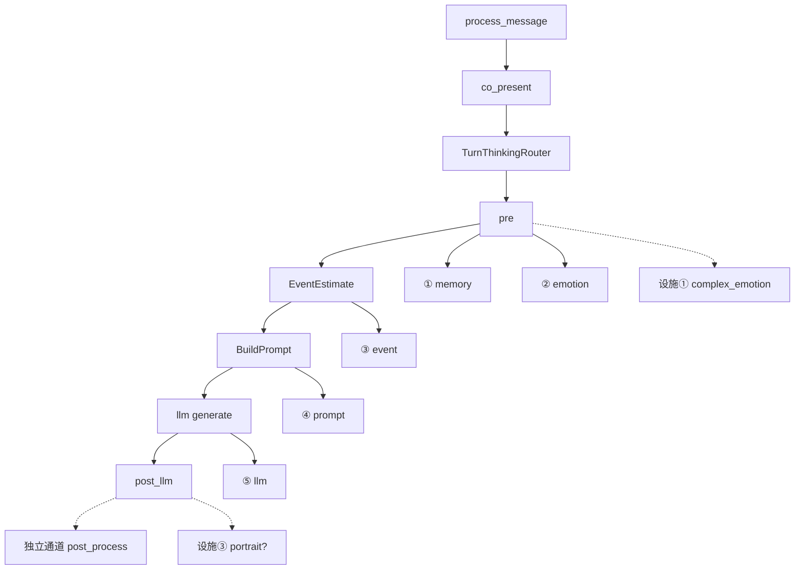

# 模块注册表（Module Registry）

**最后更新**：2026-07-05  
**SSOT 范围**：**模块定义 · 架构划分 · 槽位/设施/独立通道之间的联系 · 在边界内如何改**。  
**非 SSOT**：发版进度 → [`TECHNICAL_DEBT_INVENTORY.md`](./TECHNICAL_DEBT_INVENTORY.md) · 版本快照 → [`PROJECT_STATUS_AND_ALIGNMENT.md`](../creator-docs/getting-started/PROJECT_STATUS_AND_ALIGNMENT.md) · 关键文件路径 → [`BUS_FACTOR_NOTES.md`](./BUS_FACTOR_NOTES.md) · 文档分责 → [`handoff/README.md`](./README.md) §文档分责。

**改本文的条件**：新增/重命名模块或设施、变更六槽合并规则、新增编排行能力（非六槽）、或术语混淆需补对照表。**禁止**在本文堆进度叙事或复制 PLUGIN_V1 全文。

---

## 0. 四条铁律（关系骨架）

| # | 铁律 | 一句话 |
|---|------|--------|
| 1 | **编排** | [`process_message`](../kernel/crates/oclive_kernel_host/src/domain/chat_engine/process_message.rs) → 共在 [`co_present`](../kernel/crates/oclive_kernel_host/src/domain/chat_engine/turn_pipeline/co_present.rs)；蓝图 **`steps[]` 不调度**。 |
| 2 | **六槽** | `slot_registry` → `PluginBackends` → `PluginHost::resolve_for_role`；键 **`memory` · `emotion` · `event` · `prompt` · `llm` · `agent`**。 |
| 3 | **记忆三套存储** | 聊天日志 **`chat_messages`** ≠ **`short_term_memory`** ≠ **`long_term_memory`**；删聊天 **不清** 记忆表。 |
| 4 | **配置四层** | 角色包 → 蓝图 → 发行版 `HostProfile` → 会话 DB；分责 [`ROLE_PACK_BOUNDARY.md`](./ROLE_PACK_BOUNDARY.md)。 |

---

## 1. 术语对照（防「三层」混淆）

| 说法 | 指什么 | 深入 SSOT |
|------|--------|-----------|
| **记忆三套存储** | 聊天日志 · STM · LTM | [`CHAT_STORAGE_ARCHITECTURE.md`](./CHAT_STORAGE_ARCHITECTURE.md) |
| **Prompt 三区块** | 系统 / 角色 / 用户 Tier0 + 页脚 | `prompt_builder/mod.rs` |
| **架构四大类** | 1–6 后端 · 第 N 设施 · 独立通道 · 插件实现 | 本文 §2 |
| **集成三层** | UI/语音 → HTTP → 内核 | `human-docs/team/SCOPE_AND_BOUNDARIES.md` |
| **测试三层** | 协议 / 编写器 / 插件范式 | `creator-docs/testing/OVERVIEW.md` |

---

## 2. 模块四大类（划分）

| 大类 | 占 `plugin_backends` 六键？ | 编号 | 改动的文档 SSOT |
|------|------------------------------|------|-----------------|
| **后端模块（六槽）** | **是** | 第 1–6 模块 | **本文 §3–§8** + [`PLUGIN_V1.md`](../creator-docs/plugin-and-architecture/PLUGIN_V1.md)（DTO/顺序） |
| **设施子模块** | **否** | 第 1–4 设施 | **本文 §9** + 各 RFC |
| **独立通道能力增强** | **否** | 注册表 `id` | **本文 §10** + [`RFC_SIDE_CHANNEL_CAPABILITY_ENHANCEMENTS.md`](../creator-docs/rfc/RFC_SIDE_CHANNEL_CAPABILITY_ENHANCEMENTS.md) |
| **后端模块插件** | 挂在某槽 `backend` | 无独立号 | [`DIRECTORY_PLUGINS.md`](../creator-docs/plugin-and-architecture/DIRECTORY_PLUGINS.md) · [`SLOT_BACKEND_REALITY_MATRIX.md`](./SLOT_BACKEND_REALITY_MATRIX.md) |

**对外叙述**（产品文案、编号脚注）：[`OCLIVE_ARCHITECTURE_OVERVIEW.md`](../creator-docs/getting-started/OCLIVE_ARCHITECTURE_OVERVIEW.md) — **不**在此重复长文。

---

## 3. 六槽解耦机制（共用）

### 3.1 三层解耦

| 层 | 含义 |
|----|------|
| **编译期** | 各槽 `trait` + `PluginHost`；换实现 **不改** `process_message` 顺序 |
| **配置期** | v2 `slot_registry` 多实例 → 折叠 `PluginBackends`（同 `type` **last-wins**，`position` 大者优先） |
| **运行期** | `set_session_slot_override` 叠在有效快照上（**不写盘**） |

### 3.2 有效 backends 解析链

```text
角色包 blueprint
  ├─ legacy `plugin_backends`（manifest/settings 直写六键）
  └─ v2 `slot_registry`（多实例 → 折叠为 `PluginBackends`，同 type last-wins）
       ↓
用户 LLM 设置（DB `app_settings`）/ `OCLIVE_LLM_BACKEND` 等 env
       ↓
发行版 `distro.oclive.toml` `[plugin_backends]` 整表替换（若声明）
       ↓
`host_flags`（`skip_agent` → `agent=none`；`skip_complex_emotion` 等）
       ↓
**内存** `SessionCache` 会话槽 override（`set_session_slot_override` / UI「会话后端」；**不写盘**）
       ↓
`startup_health`（Remote 槽探测；失败可降级并写 `startup_warnings`）
       ↓
`PluginHost::resolve_for_role` → `ResolvedRolePlugins`
```

| 层 | 代码锚点 | 说明 |
|----|----------|------|
| **纯解析 SSOT** | `oclive_kernel_runtime` · `plugin_resolution.rs` | `resolve_session_plugin_backends`（legacy/v2 + env + host ceiling + session override；**无 DB/I/O**） |
| 折叠 v2 | `slot_resolver.rs` · `plugin_backends.rs` | `slot_registry_to_plugin_backends` |
| 发行版/env 合并 | `host_backends.rs` · `effective_llm_model.rs` | HostProfile + env 天花板；host 调 runtime 纯函数 |
| 会话 override | `state/session_cache.rs` · `service/role/slot_session.rs` | **进程内** `PluginBackendsOverride` |
| 每回合快照 | `state/effective_session_config.rs` | `EffectiveSessionConfig`（`process_message` 每轮一次） |
| 诊断输出 | `build_plugin_resolution_debug_info` · `oclive doctor config-resolve` | CLI **默认** runtime 纯路径；`--via-host`（feature `diagnostics-host`）可选全 host bootstrap；**禁止第二套解析** |
| 装配 | `plugin_host.rs` · `backend_registry.rs` | `resolve_for_role` |
| 共在调用 | `slot_runner.rs` · `co_present.rs` | 六槽 + `complex_emotion` 设施 |

### 3.3 多实例合并

| 槽 | 策略 |
|----|------|
| memory | 去重合并检索 |
| llm | last-wins |
| agent | 工具集合并 |
| 其它 | PLUGIN_V1 · ARCHITECTURE_LAYERING |

**backend 真值矩阵（24 格）**：只维护于 [`SLOT_BACKEND_REALITY_MATRIX.md`](./SLOT_BACKEND_REALITY_MATRIX.md)，本文 **不** 复制该表。

`groups` / `module_relations`：仅 UI 派生边；**禁止** `module_relations` 落盘。

---

## 4. 第 1 模块 · `memory`

| 项 | 内容 |
|----|------|
| **定义** | 为 Prompt 提供 **相关记忆检索**；维护 STM 写入与 LTM 归档策略的 **编排侧** 入口 |
| **`plugin_backends` 键** | `memory` |
| **Trait** | `MemoryRetrieval`（`oclive_kernel_contracts`） |
| **合法 backend** | `builtin` · `remote` · `directory` · `local` · `none` |
| **Builtin** | `BuiltinMemoryRetrieval` + `MemoryEngine`（STM/LTM 衰减、阈值） |
| **主链 hook** | `turn_pipeline/pre.rs` 检索 · `post_llm` 写入 STM/LTM |
| **与聊天存储** | **无关** — `chat_messages` 不进 MemoryEngine；回放见 `replay_memory_extraction` |
| **合并** | 多 memory 实例 → 去重合并 |
| **`none`** | `NoopMemoryRetrieval`；共景路径通常 **禁止** none（见 MODULE_NONE_SEMANTICS） |
| **允许改** | 检索算法、decay、archive 阈值、remote/directory 协议 |
| **禁止** | 用聊天记录表当记忆真源；角色任务改 `slot_registry` |

**记忆三套存储（与第 1 模块配合）**：

| 存储 | 表 / 组件 | 进 Prompt |
|------|-----------|-----------|
| 聊天日志 | `HybridConversationStore` · `chat_*` | **否** |
| 短期 | `short_term_memory` | **是** |
| 长期 | `long_term_memory` | **是** |

---

## 5. 第 2 模块 · `emotion`

> **T0 / T1+ 分层与情感·展示分轨（Draft）**：[RFC_MODULE_MVL_AND_AFFECT_ARCHITECTURE.md](../creator-docs/rfc/RFC_MODULE_MVL_AND_AFFECT_ARCHITECTURE.md) — T0 = `analyze`；T2 角色模拟、T3 `display_metrics` 为扩展；好感数值非 Prompt 力学。

| 项 | 内容 |
|----|------|
| **定义** | 分析 **用户句** 情绪（**T0**）；可选角色情绪模拟（**T2**）与展示快照（**T3**） |
| **键** | `emotion` |
| **Trait** | `UserEmotionAnalyzer` |
| **Backend** | `builtin` · `remote` · `directory` · `none` |
| **主链 hook** | `pre.rs` → `EmotionResult` → Prompt · Turn Thinking Auto 路由 |
| **与复杂情感** | **不同模块** — 复杂情感是 **第 1 设施**（消费 emotion 产出） |
| **允许改** | 分析器、remote 协议 |
| **禁止** | 写入 `slot_registry` 的 `complex_emotion` 键冒充六槽 |

---

## 6. 第 3 模块 · `event`

| 项 | 内容 |
|----|------|
| **定义** | 估计本回合 **事件类型** 与 **影响因子**，驱动性格演化与好感 |
| **键** | `event` |
| **Trait** | `EventEstimator` |
| **Backend** | `builtin` · `remote` · `directory` · `none` |
| **Builtin 双路径** | ① **规则** `EventDetector` / `estimate_event_impact_rules_only` ② **LLM** `estimate_event_impact`（`generate_tag`） |
| **LLM 开关** | **`HostProfile.event_impact_llm`**（非六槽）；Fast 轮 Turn Thinking **不调** LLM 路径 |
| **主链 hook** | `co_present` `EventEstimate` stage → `PersonalityEngine::evolve_by_event` |
| **允许改** | 规则表、LLM 提示、remote |
| **禁止** | 把 Turn Thinking 登记为第七槽 |

---

## 7. 第 4 模块 · `prompt`

| 项 | 内容 |
|----|------|
| **定义** | 组装发往 LLM 的 **完整 prompt 字符串**（Tier0 三区块 + 设施段落 + 页脚） |
| **键** | `prompt` |
| **Trait** | `PromptAssembler` → 内置 **`PromptBuilder::build_prompt`** |
| **Backend** | `builtin` · `remote` · `directory` · `none`（共景 **禁止** none） |
| **Tier0 人设真源** | **`core_personality.txt`**（非 `prompts/system.md`） |
| **页脚** | `reply_quality_anchor`（包级 **可替**）+ **`KERNEL_DIALOGUE_GUARDRAILS`**（**不可替**） |
| **主链 hook** | `co_present` `BuildPrompt` · `PromptInput` |
| **Wave D 预留** | Deep **`prompts/deep_capsule.txt`** — [`DEEP_PROMPT_DISTILLATION.md`](./DEEP_PROMPT_DISTILLATION.md) · **Small+Deep 已接线** |
| **允许改** | 段落公式 `sections.rs`、overlay（concise profile） |
| **禁止** | 运行时 LLM 压缩 prompt；用 capsule 替换 guardrails |

---

## 8. 第 5 模块 · `llm`

| 项 | 内容 |
|----|------|
| **定义** | 主对话 **文本生成**（含 stream） |
| **键** | `llm` |
| **Trait** | `LlmClient` |
| **Backend** | `ollama` · `remote` · `directory` · `none`（共景 **禁止** none） |
| **合并** | 多 llm 实例 → **last-wins** |
| **主链 hook** | `co_present` generate / stream |
| **允许改** | Ollama 适配、directory RPC、TTFT 客户端选项 |
| **禁止** | UI 内二次调 LLM 选立绘 |

---

## 9. 第 6 模块 · `agent`

| 项 | 内容 |
|----|------|
| **定义** | ReAct / MCP 工具编排；可 **短路** `process_message` |
| **键** | `agent` |
| **Trait** | `AgentProvider` |
| **Backend** | `builtin` · `remote` · `directory` · `none` |
| **合并** | 多 agent → 工具集 **并集** |
| **发行版** | `host_flags.skip_agent` → 强制 `none` |
| **MCP** | `{app_data}/mcp-servers/*.json` · 须 `network:*` / `process:spawn` 授权 |
| **允许改** | Agent 协议、MCP 客户端、调试 trace |
| **禁止** | 跳过 MCP 授权；把 ASR 写进 agent 槽 |

---

## 10. 第 N 设施子模块（编排行内 · 非六键）

| # | 名称 | 输入 / 输出 | 主链锚点 | 默认 | 改动 SSOT |
|---|------|-------------|----------|------|-----------|
| **1** | 复杂情感 | emotion + 上下文 → `narrative_hint` | `pre.rs` → 下一轮 `PromptInput.previous_complex_emotion_narrative_hint` | on（可 skip） | `complex_emotion.rs` |
| **2** | 专家模型 | 条件 → 专家子流程 | `expert_routing.json` · `dual_core` | **冻结关** | TECHNICAL_DEBT §2 |
| **3** | 立绘 | 封闭 catalog → `visual_state_id` | `post_llm` · 表现导演 LLM | **平台默认关；角色包可 opt in** | RFC_PORTRAIT |
| **4** | 视觉表现 | `visual_state_id` → `performance_directive` | 宿主 UI 帧循环 · **无** AI 选图 | **平台默认关；角色包可 opt in** | RFC_VISUAL_PRESENTATION |

**禁止**：上述任一写入 `plugin_backends` 六键或蓝图六键别名。

---

## 11. 独立通道能力增强（注册表 · 非六槽）

| `id` | 职责 | 锚点 | 进 `process_message`？ |
|------|------|------|------------------------|
| `user_identity` | 用户是谁 | `user_identities/` · pre | **是**（pre 段落） |
| `reply_post_process` | 回复润色/改写 | `config.json` · post_llm | **是**（post） |
| `theater_director` | 剧场场景生成 | `POST /theater/scene` | **否**（圈外 API） |
| **`voice.asr`** | 麦克风 → 文本（ASR，基础）+ 可选情感 TTS（扩展 · 默认关） | 宿主 `chat_toolbar` + **`plugin_rpc_invoke`** → [`VOICE_ASR_SUBMIT_EVENT`](../distros/shared/src/lib/voiceAsrEvents.ts) → `send_message`；`message:sent` / 流式首句 → **`voice.speak`**（须 `tts_expansion_enabled`） | **否** |
| **`voice.director`** | 人设 → **`voice_directive`**（`rules-v1` · `emo_text` · `ref_map`） | 插件 RPC **`voice.build_directive`** | **否** |
| **`voice.synth`** | `reply` + directive → 音频（CosyVoice2 / cloud） | **`voice.speak`** · `voice.probe_tts` · `voice.warm` · 模型 DLC | **否** |

**`voice.asr` 插件 SSOT**：[`distros/chat-pro/plugins/com.oclive.voice.asr/`](../distros/chat-pro/plugins/com.oclive.voice.asr/) · **v0.4** · `provides: ["voice.asr"]` · RPC 见插件 README · 开发烟测 [`examples/voice-loop-minimal/`](../examples/voice-loop-minimal/)（Piper 仅 `--tts-sherpa` dev 路径）。导演 + 发声器已合入同插件，见 [`ARCHITECTURE_DECOUPLING_PANORAMA.md`](../human-docs/team/ARCHITECTURE_DECOUPLING_PANORAMA.md) §6–§7。

RFC：[`RFC_SIDE_CHANNEL_CAPABILITY_ENHANCEMENTS.md`](../creator-docs/rfc/RFC_SIDE_CHANNEL_CAPABILITY_ENHANCEMENTS.md) · Phase2：[`USER_IDENTITY_REPLY_POST_PROCESSOR_PHASE2.md`](./USER_IDENTITY_REPLY_POST_PROCESSOR_PHASE2.md)（**已交付**，勿当待办）。

---

## 12. 编排行策略（非模块号 · 易与六槽混淆）

| 能力 | 归类 | 配置 | 代码 |
|------|------|------|------|
| **Turn Thinking** Fast/Deep/Auto | HostProfile 策略 | `[turn_thinking]` · `distro.oclive.toml` | `turn_thinking.rs` |
| **Turn Thinking 持久化分流** `fast_persistence` | HostProfile · `legacy` \| `strong_only` | `[turn_thinking].fast_persistence` | `turn_thinking.rs` · `co_present` / `post` · RFC [`RFC_TURN_THINKING_PERSISTENCE.md`](../creator-docs/rfc/RFC_TURN_THINKING_PERSISTENCE.md) |
| **Turn Thinking 包级路由** OR/AND · latch · ephemeral | 角色包 `config.json` → `turn_thinking` | 合并 Host OR + pack OR/AND | `turn_thinking.rs` · `035_turn_thinking_runtime.sql` · RFC §8–12 |
| **`ModelTier`** Small/Large | 编排行 · Ollama 模型启发式 | — | `model_tier.rs` |
| **`PersonaSource`** FullCore/DeepCapsule | 编排行 · Deep Tier0 选择 | 角色 `meta.deep_capsule_enabled` + `prompts/deep_capsule.txt` | `model_tier.rs` · `co_present` |
| **`event_impact_llm`** | HostProfile 开关 | `[host_flags]` | `event_impact_ai.rs` |
| **`prompt.profile` concise** | HostProfile overlay | `[prompt]` | `DISTRO_CONCISE_PROMPT_OVERLAY` |
| **PersonalityEngine / 好感（legacy 数值）** | 无编号设施 · **目标废弃** | 角色 `evolution` · `role_runtime` | `personality_engine.rs` · 见 [RFC_MODULE_MVL_AND_AFFECT_ARCHITECTURE.md](../creator-docs/rfc/RFC_MODULE_MVL_AND_AFFECT_ARCHITECTURE.md) §6 |
| **PluginHost** | 无编号设施 | — | `plugin_host.rs` |
| **remote_stub / remote_life** | 场景模式分支 | 场景 + `remote_presence` | `process_message` 分支 |

TTFT / Deep capsule：**设计** [`DEEP_PROMPT_DISTILLATION.md`](./DEEP_PROMPT_DISTILLATION.md) · **bench** [`TTFT_BENCHMARK.md`](./TTFT_BENCHMARK.md) — 不在此展开进度。

---

## 12.5 前端 ↔ 内核契约边界（2026-07-13）

| 主题 | SSOT | 消费方 | 不变式 |
|------|------|--------|--------|
| **错误码** | [`AppError::code`](../kernel/crates/oclive_kernel_types/src/error.rs) + `http_chat_codes` | `distros/shared/src/api/generated/kernelErrorCodes.ts` · [`ERROR_CODES.md`](../creator-docs/getting-started/ERROR_CODES.md) · `scripts/check-error-codes-drift.mjs` | 前端 **禁止** 解析 `message` 文本分支（legacy `[CODE]` 除外）；用 `code` + 可选 `context.kind` |
| **错误 JSON** | [`KernelErrorBody`](../kernel/crates/oclive_kernel_types/src/error.rs) | Tauri `invoke` · HTTP `/chat` · `helpers.ts` | 字段名与形状内核权威；发行版只做 i18n 映射 |
| **热路径 DTO** | [`oclive_kernel_types::models::dto`](../kernel/crates/oclive_kernel_types/src/models/dto.rs) | `distros/shared/src/api/*.ts`（过渡期为手写镜像） | 回复字段为 **`reply`**；六槽键为 `plugin_backends` / `slot_registry.type` |
| **六槽清单** | 内核 resolver + `PluginBackends` | `slotRegistry.ts`（待导出替换硬编码） | 前端不得假设 Chat Pro 为唯一宿主 |
| **invoke 矩阵** | [`INVOKE_HOTPATH_MATRIX.md`](./INVOKE_HOTPATH_MATRIX.md) | Tauri `api/*.rs` ↔ 前端 `invoke` | 命令签名变更须同步矩阵与契约测 |

**第一切片（已落地）**：错误码三方一致门禁（dimension5 **`kernel error codes drift`**）。**后续切片**：DTO `ts-rs`/`typeshare` 试点 · 六槽枚举导出 · invoke 签名 ratchet。

---

## 13. 一轮 co-present · 模块调用关系



Agent 短路、异地 stub：**并列**于上链，见 `process_message.rs`。

---

## 13.1 Chat Pro 壳与互动模式 IA

| 主题 | SSOT / 行为 |
|------|-------------|
| **默认壳** | [`resolveOcliveShell()`](../distros/shared/src/composables/useOcliveShell.ts) fallback **`fluent`**；`VITE_OCLIVE_SHELL=tool` → ToolShell；`theater` 走剧场发行版。 |
| **用户入口** | **Settings → General**（[`SettingsGeneralTab.vue`](../distros/shared/src/components/settings/SettingsGeneralTab.vue)）+ **FluentShell** 输入区上方 [`InteractionModeBar.vue`](../distros/shared/src/components/onboarding/InteractionModeBar.vue)（经 `MAIN_SHELL_KEY.onInteractionModeChange`）。 |
| **键位绑定** | **Settings → General → Advanced** · [`keybindings.ts`](../distros/shared/src/lib/keybindings.ts)（动作目录 SSOT）· [`KeybindingsSettingsSection.vue`](../distros/shared/src/components/hotkey/KeybindingsSettingsSection.vue)；全局 OS 快捷键仍经 `save_hotkey_bindings`；`voice.holdToTalk`（默认 **V**）→ `hostEventBus` → VoiceToolbar。 |
| **发现 / 编程入口** | 日常聊解锁条 [`ImmersiveUnlockBanner`](../distros/shared/src/components/onboarding/ImmersiveUnlockBanner.vue) · 首次剧情引导 [`ImmersiveModeIntro`](../distros/shared/src/components/onboarding/ImmersiveModeIntro.vue) · 插件总线 `com.oclive.mumu.settings-panel:set_interaction_mode`（[`usePluginEvents.ts`](../distros/shared/src/composables/usePluginEvents.ts)）— **非**并列用户 IA。 |

### 13.2 Chat Pro 外观正交轴 `data-skin`

| 轴 | 属性 / 存储 | SSOT |
|----|-------------|------|
| 明暗 | `html[data-theme]` · `oclive-runtime-theme` | [`useOcliveAppearance.ts`](../distros/shared/src/composables/useOcliveAppearance.ts) |
| 壳 | `html[data-shell]` · `VITE_OCLIVE_SHELL` | [`useOcliveShell.ts`](../distros/shared/src/composables/useOcliveShell.ts) · [`chat-pro/index.html`](../distros/chat-pro/index.html) 早启动 IIFE |
| 缩放 | `--oclive-ui-scale` · `oclive-runtime-ui-scale` | `useOcliveAppearance` |
| **皮肤** | `html[data-skin]` · `oclive-runtime-skin`（`default` / `win98`） | [`useEasterEggSkin.ts`](../distros/shared/src/composables/useEasterEggSkin.ts) · [`win98/tokens.css`](../distros/shared/src/styles/win98/tokens.css) + [`win98/primitives.css`](../distros/shared/src/styles/win98/primitives.css) |
| **CSP `connect-src`** | CosyVoice2 侧车默认 `http://127.0.0.1:50000` · `ws://127.0.0.1:50000`（与插件 `local_synth_endpoint` 默认一致） | [`tauri.conf.json`](../distros/desktop-tauri/tauri.conf.json) `security.csp` |

- **范围**：chat-pro **Fluent + Tool**；theater 不纳入。
- **解锁**：Konami 序列 → `oclive-easteregg-unlocked=1` → 自动启用 Win98；设置 → 常规外观区开关（`v-if` 已解锁）。
- **正交**：皮肤只覆盖 CSS 变量与少量 chrome 类；不改 shell 布局或六槽逻辑。`appearance:changed` 事件 payload 可含 `skin`。壳 / 面板 Win98 覆写 **co-locate 于 SFC unscoped `@import`**，避免与 scoped 样式抢同一属性。
- **Authentic chrome（Win98 窗口框）**：[`Win98TitleBar.vue`](../distros/shared/src/components/win98/Win98TitleBar.vue) 挂载于 FluentShell `.app-frame` / ToolShell `.tool-body__main` 首子节点；启用皮肤时 Tauri `setDecorations(false)` 隐藏原生标题栏，合成栏经 `data-tauri-drag-region` + `allowlist.window`（`minimize` / `maximize` / `unmaximize` / `close` / `startDragging` / `setDecorations`）驱动 ─ □ ✕；关闭皮肤或退出即恢复原生装饰与边缘缩放。对话框 / 侧栏 / 气泡等 Win98 覆写见下表（✕ 仍关对话框，非 OS 窗）。

**Win98 样式依赖表**（`distros/shared/src/styles/win98/`；规则均以 `html[data-skin="win98"]` 为前缀，`default` 零泄漏）：

| CSS 文件 | 引入方 | 层级 |
|----------|--------|------|
| `win98/tokens.css` | [`chat-pro/main.ts`](../distros/chat-pro/src/main.ts) | L0 |
| `win98/primitives.css` | `chat-pro/main.ts` | L1 |
| `win98/shell-fluent.css` | [`FluentShell.vue`](../distros/chat-pro/src/shells/fluent/FluentShell.vue) | L2 |
| `win98/shell-tool.css` | [`ToolShell.vue`](../distros/chat-pro/src/shells/tool/ToolShell.vue) | L2 |
| `win98/titlebar.css` | [`Win98TitleBar.vue`](../distros/shared/src/components/win98/Win98TitleBar.vue) | L4 |
| `win98/panel-settings.css` | [`SettingsView.vue`](../distros/chat-pro/src/views/SettingsView.vue) | L3 |
| `win98/panel-market.css` | [`MarketView.vue`](../distros/chat-pro/src/views/MarketView.vue) | L3 |
| `win98/panel-model.css` | [`ModelManagerPanel.vue`](../distros/chat-pro/src/views/ModelManagerPanel.vue) | L3 |
| `win98/panel-plugins.css` | [`SimplePluginManagerPanel.vue`](../distros/chat-pro/src/views/SimplePluginManagerPanel.vue) | L3 |
| `win98/component-side-panel.css` | [`UiSidePanel.vue`](../distros/shared/src/components/ui/UiSidePanel.vue) | L3 |
| `win98/dialogs-shared.css` | [`ShortcutHelp.vue`](../distros/shared/src/components/ShortcutHelp.vue) · [`HotkeyHost.vue`](../distros/shared/src/components/hotkey/HotkeyHost.vue) · [`PluginUiSlotSelectorDialog.vue`](../distros/shared/src/components/PluginUiSlotSelectorDialog.vue) · [`ImmersiveModeIntro.vue`](../distros/shared/src/components/onboarding/ImmersiveModeIntro.vue) · [`TopBarSceneModeDialog.vue`](../distros/shared/src/components/scene/TopBarSceneModeDialog.vue) · [`PresetRolePicker.vue`](../distros/shared/src/components/onboarding/PresetRolePicker.vue) | L3 |
| `win98/component-chat.css` | [`ChatMessage.vue`](../distros/shared/src/components/chat/ChatMessage.vue) | L3 |
| `win98/component-top-bar.css` | [`TopBarMorePanel.vue`](../distros/shared/src/components/TopBarMorePanel.vue) | L3 |
| `win98/component-plugin-toolbar.css` | [`ChatPluginToolbarSlots.vue`](../distros/shared/src/components/ChatPluginToolbarSlots.vue) · [`com.oclive.voice.asr` VoiceToolbar](../distros/chat-pro/plugins/com.oclive.voice.asr/slots/VoiceToolbar.vue) | L3 |
| `win98/component-voice-settings.css` | [`PluginSettingsPanelSlots.vue`](../distros/shared/src/components/PluginSettingsPanelSlots.vue)（`com.oclive.voice.asr` VoiceSettings 插槽） | L3 |

---

## 14. 配置四层（谁可改什么）

| 层 | 典型内容 | 谁改 | AI 任务边界 |
|----|----------|------|-------------|
| 角色包 | `core_personality.txt` · scenes · prompts | 创作者 | **不改** slot_registry |
| 蓝图 | `slot_registry` · `runtime_config` | 管理员 | 须 validation |
| 发行版 | `distro.oclive.toml` → HostProfile | 产品 | **不改**角色人设任务 |
| 会话 | `role_runtime` · slot override | 运行时 | override 不写盘 |

---

## 15. 改动约束速查（与 AI 边界对齐）

| 任务类型 | 可动模块 | 必读 |
|----------|----------|------|
| 只改 mumu 人设 | 角色包 §4–§7 不管 | ROLE_PACK_BOUNDARY · G1 |
| 换 memory 后端 | 第 1 模块 + 蓝图 | PLUGIN_V1 · SLOT_BACKEND matrix |
| 改 Prompt 段落 | 第 4 模块 + 角色锚点 | prompt_builder · G7 `reply` |
| 改发行版延迟 | HostProfile · Turn Thinking | DISTRO_CAPABILITY_PROFILE |
| 新设施子模块 | RFC + 本文 §10 登记 | 禁止 silent 第七槽 |
| 新 handoff 文档 | **关键决策 / RFC 仅** | [`AI_CHANGE_BOUNDARIES.md`](./AI_CHANGE_BOUNDARIES.md) G10–G12 |

---

## 16. 维护

- **只改本文**：模块定义、槽位关系、编排行能力归类、术语对照。
- **不改本文**：版本号、Wave Done 列表、CVE 日期、invoke 条数 — 各走专属 SSOT。
- **新增模块**：先更新 §2–§12，再 **一行链接** 更新 OCLIVE_ARCHITECTURE（对外），**禁止**三处粘贴同一段落。
- **动本文前**：读 [`handoff/README.md`](./README.md) §文档分责 · [`AI_CHANGE_BOUNDARIES.md`](./AI_CHANGE_BOUNDARIES.md) G13–G16。

## 17. 脉络全景（插件清单 · 正交轴 · 核心术语 · 非定义 SSOT）

**模块定义仍只维护于本文 §0–§16**。**六槽 / 独立通道 / 正交 含义** · bundled 插件全表 · 解耦形式 A–I · 调用图 → [`human-docs/team/ARCHITECTURE_DECOUPLING_PANORAMA.md`](../human-docs/team/ARCHITECTURE_DECOUPLING_PANORAMA.md) **§1** 起（2026-07-05 起）。

*2026-06-25 v2：收敛为模块注册表 SSOT；进度迁至 TECHNICAL_DEBT / PROJECT_STATUS。*
