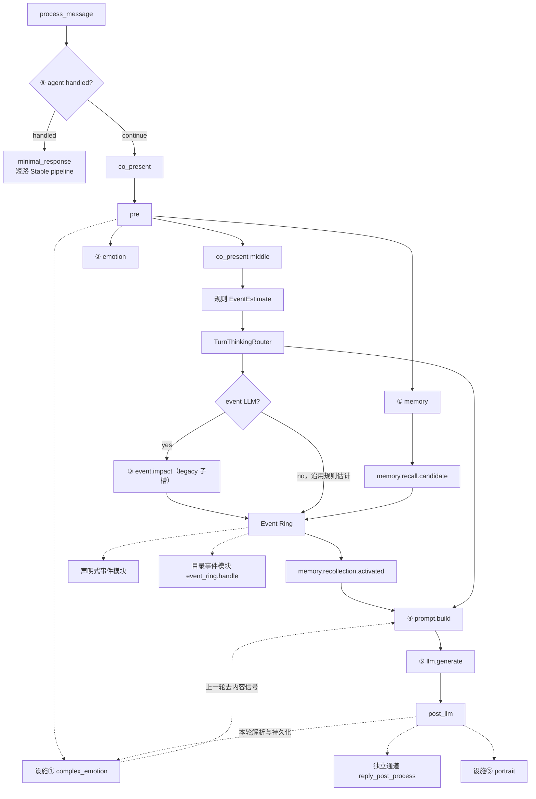

# 模块注册表（Module Registry）

**最后更新**：2026-09-19（仅补阅读效力提示；下方候选版本与历史证据基线未重标）
**SSOT 范围**：**模块定义 · 架构划分 · 槽位/设施/独立通道之间的联系 · Kernel/Host 权责候选及定点源码对照 · 在边界内如何改**。
**非 SSOT**：发版进度 → [`TECHNICAL_DEBT_INVENTORY.md`](./TECHNICAL_DEBT_INVENTORY.md) · 版本快照 → [`PROJECT_CURRENT_STATUS.md`](../creator-docs/getting-started/PROJECT_CURRENT_STATUS.md) · 关键文件路径 → [`BUS_FACTOR_NOTES.md`](./BUS_FACTOR_NOTES.md) · 文档分责 → [`handoff/README.md`](./README.md) §文档分层。

**改本文的条件**：新增/重命名模块或设施、变更六槽合并规则、新增编排行能力（非六槽）、或术语混淆需补对照表。**禁止**在本文堆进度叙事或复制 PLUGIN_V1 全文。

**阅读效力**：§0.4–§0.9 中“未冻结具体 Rust/API”等表述限定该概念／表示稿本身，不否定后续独立 B1 绑定的存在，也不表示整个 API 已作为 Stable 发布。实际绑定、有限参考实现与验收范围另见 [阶段总收口](README.md#six-slot-stage-closure)；实现不会反向将某个 provider、词表、任务词汇或私有协议升级为本文的共同要求。§0.3 行号仍绑定其历史 SHA，不因这条导航更新变为当前全仓证据。

---

## 0. 五条铁律（关系骨架）

**先分清本体与装配**：小 Kernel 的当前职责目标是 **六槽契约、必要公共合法性约束与错误/故障边界**；具体 Host 负责编排、状态应用和资源操作。六槽是 `memory`、`emotion`、legacy `event`、`prompt`、`llm`、`agent` 六类可替换能力，不是六个平级决策内核，也不要求每种具体实现都启用。`process_message` 的唯一性是当前参考 Host 的复用维护边界，不是所有 Host 必须采用的固定流水线。当前共景路径的健康门槛仍是 `prompt + llm`；其余槽位的 `none` / Noop 语义以 [`MODULE_NONE_SEMANTICS.md`](../creator-docs/kernel/MODULE_NONE_SEMANTICS.md) 和真实性矩阵为准。

<a id="kernel-responsibilities"></a>

### 0.1 小 Kernel、合同、实现、Host 与 Adapter 的权责

| 层 | 负责什么 | 不授予什么 |
|----|----------|------------|
| **小 Kernel（职责边界）** | 守住六槽契约、必要公共合法性约束、结果/依赖的基本边界、错误与故障边界 | 不因此等同于已独立编译的 crate；不拥有 Host 具体编排、领域应用或资源授权 |
| **六槽合同** | 规定 `memory` / `emotion` / `event` / `prompt` / `llm` / `agent` 能力端口的输入、结果和错误边界 | 不把槽实现变成平级状态权威，也不规定某个 SQLite、HTTP 或 RichRole 产品格式 |
| **具体槽实现** | 在合同和宿主授权内提供检索、分析、估计、组装、生成或动作结果；可由授权 Adapter 使用网络、存储、工具或 LLM | 不因获得资源访问就取得领域提交权、权限授予权或第二条回合管线；重试不会增加授权 |
| **Host** | 负责准备输入/上下文、绑定六槽、在必要偏序约束内自主调度、管理资源与权限，并应用领域结果；当前参考实现由可信 Rust 服务与 composition root 执行产品状态和资源操作 | 不是 IPC 桥、Docker 或安全沙箱；不能降低公共合法性约束，不能把应用结果或重试变成额外授权；不与 Distro 天然一对一 |
| **Adapter / 传输 / UI** | 把外部输入、能力调用和输出映射到 Host 获准的合同边界；持久化或资源 Adapter 可执行 Host 合法授权的写入/操作 | 不自行决定或批准领域状态更新；传输/UI 不是 Host，也不能绕过 Host 另建编排 |

候选公共语义与当前源码对照见下方 §0.2–§0.3；它们记录适用边界和证据，不冻结新公共 API、固定流水线或物理拆分。

<a id="kernel-semantics-candidate"></a>

### 0.2 最小公共语义候选与使用范围

下列是对话中 2.2.1 收口候选的边界摘要，不是八节正文的逐字替代，也不表示完整 Kernel v0 公共契约已冻结或源码已全面落实：

1. 六槽是能力而非固定阶段；公共条件必须实际成立，但不指定由哪个节点检查、如何记录，也不要求把全量事实传入 Kernel。
2. 内容合格不等于已被实际采用；某用途合法不等于任意用途合法。历史/cache/pending 的使用仍须满足适用契约、当前用途、必要依赖和调用资格，不因其形式而一律允许或禁止；数据复用不等于本轮新执行事实。当前候选将 `Acceptance` 作为具体业务事实合法成立后的派生描述，不要求新增独立原语；来源、动作和用途的对应不能被偷换。
3. 必要依赖与当前资格分别判断；previous legality 不等于 current eligibility。结果或旧执行记录可以作为授权判断的输入，但不能自行产生或扩大领域/外部效果的授权；具体领域授权判断仍归 Host。
4. 同一逻辑 invocation 已合法正常结束或形成有效 cutoff 后，不得再为它启动新的后续能力或成立新增的有效业务推进；此前未成立的迟到结果/片段不能重新打开它。能力完成、局部返回、取消请求、超时、断开或投递通道关闭，不能仅凭名称认定整个 invocation 已结束；实际作用范围、适用契约与调用关系已足以确立结束时即可认定，不额外要求第二信号或统一记录。
5. cutoff 前已合法成立的结果由 Host 后续保存、展示、应用或投递，不自动因 cutoff 失效，也不因此自动成为旧 invocation 的新增有效推进；这些操作仍须满足用途、领域条件与当前授权。cutoff 不保证在途执行停止或领域/外部效果回滚；迟到回执、完成、失败与诊断可以如实说明实际事实，但不能补造此前的 Kernel result。维护副本、脱敏、更正或换新 ID 都不能成为伪造旧执行事实或绕过当前资格的理由；外部效果也不能反向证明 Kernel 结果已经成立。
6. 分开看两组三层：`invocation logical / capability execution / domain effect`，以及 `Kernel 执行结果 / Host 应用结果 / 产品整体结果`。`Kernel 正常结束`只保证同一逻辑 invocation 在该公共契约范围内合法完成，不自动保证 Host 领域应用/持久化/投递成功；Host 可把特定应用设为产品成功条件，但不得把未满足这些条件的失败伪装成产品整体成功；后续领域失败不得反向改写已合法成立的 Kernel 执行事实。该结束与 cutoff 同作用域，不是任意局部执行完成。
7. 能力 failure、`handled=false`、timeout 不证明无 effect，也不各自自动等于整个 invocation 结束；Host 的继续、fallback、短路或结束仍受适用契约、必要依赖和当前调用边界约束。retry 许可、重放安全、效果是否已发生、回执能否恢复分别判断，dedup 不保证全链可重跑。

排除项：完整 `RoleRuntime` / `MemorySystem` / Ring / Stream / SQLite / HTTP、媒体、Authority/Workflow 框架和沙箱等不由本候选规定。契约未要求某机制，不等于禁止实现采用；不要求全局时钟、中央接纳点、统一记录或固定状态机。调查中的未知不被报告为已合法或已违规，这条审查纪律不直接规定运行时如何处理未知。

<a id="kernel-source-map"></a>

### 0.3 源码职责对照（2026-09-11 · `871156b5e211995dc8945c6ea569e62c9c2ff8dd`）

以下是定点源码证据，不是全项目合规证明；读到的 tests 仅作源码证据，未运行。可用 `git show <本节完整 SHA>:<表内仓库相对路径>` 复现对应源码；行号均绑定该基线。`oclive_kernel_host` 仍是完整参考运行时装配，不能只从 crate 名或字段缺失推断已有独立小 Kernel。六槽 trait/DTO 细节仍见 §4–§9。“职责一致”仅表示实际工作可以归入该层，不表示该路径所有公共不变量已验证。

| 边界 | 实际代码事实 | 按目标归属 | 差异与后续 |
|---|---|---|---|
| 六槽 contracts/types | [`kernel/crates/oclive_kernel_contracts/src/lib.rs#L55`](../kernel/crates/oclive_kernel_contracts/src/lib.rs#L55) 起重导出六槽合同及其他外围端口；[`PromptInput`](../kernel/crates/oclive_kernel_types/src/prompt.rs#L13) 直接含 `Role`、关系与好感度字段；[`EventEstimator`](../kernel/crates/oclive_kernel_contracts/src/event_estimator.rs#L54) 的 `estimate` 直接接 `LlmClient`、人格及近期事件等输入。 | 六槽能力契约属于小 Kernel 边界；这些具体签名是现行参考接口，不是最小公共形状的证明。 | **接口仍耦合参考宿主领域数据**：`PromptInput` 尤其不能直接当作新的最小契约；也不能因 crate 名为 contracts 就把其全部导出列入小 Kernel。依赖另一能力本身不等于违规；API 取舍另行讨论。 |
| `OcliveKernel` 完整门面 | [`kernel/crates/oclive_kernel_host/src/role_kernel.rs#L143`](../kernel/crates/oclive_kernel_host/src/role_kernel.rs#L143) `build → AppStateBuilder::production`；[`#L203`](../kernel/crates/oclive_kernel_host/src/role_kernel.rs#L203) health DB；[`#L225`](../kernel/crates/oclive_kernel_host/src/role_kernel.rs#L225) `load_role_impl`；[`#L247`](../kernel/crates/oclive_kernel_host/src/role_kernel.rs#L247) `process_message` 委托。 | Host composition root / 完整门面。 | **一致**：不是独立小 Kernel；完整装配仍在 Host。 |
| Host 依赖与 `AppState` | [`kernel/crates/oclive_kernel_host/Cargo.toml`](../kernel/crates/oclive_kernel_host/Cargo.toml) 直接含 sqlx/reqwest/axum；[`kernel/crates/oclive_kernel_host/src/state/mod.rs#L107`](../kernel/crates/oclive_kernel_host/src/state/mod.rs#L107) 的 `AppState` 含 DB、conversation、memory repository、Ring、plugins、resources。 | Host 运行时装配与资源/持久化。 | **一致（Host职责可识别）**：依赖不表示必须启动 HTTP；不能据此称独立小 Kernel。 |
| preflight / run / execute_turn | [`kernel/crates/oclive_kernel_host/src/domain/chat_engine/process_message.rs#L372`](../kernel/crates/oclive_kernel_host/src/domain/chat_engine/process_message.rs#L372) 做 `ensure_role_runtime`/`ensure_role_loaded`、锁与预取；[`#L468`](../kernel/crates/oclive_kernel_host/src/domain/chat_engine/process_message.rs#L468)–[`#L483`](../kernel/crates/oclive_kernel_host/src/domain/chat_engine/process_message.rs#L483) 将 pending transcripts 放入 `recent_turns`；[`#L513`](../kernel/crates/oclive_kernel_host/src/domain/chat_engine/process_message.rs#L513) 按 staged/origin 选择 Agent、remote 或 co_present。当前 Host 的 `execute_turn` 见 [`kernel/crates/oclive_kernel_host/src/domain/chat_engine/turn_pipeline/mod.rs#L27`](../kernel/crates/oclive_kernel_host/src/domain/chat_engine/turn_pipeline/mod.rs#L27) 与 [`#L48`](../kernel/crates/oclive_kernel_host/src/domain/chat_engine/turn_pipeline/mod.rs#L48)。 | Host 当前参考调度；必要偏序属于候选公共约束。 | **一致（Host职责可识别）**：当前流程不是所有 Host 的硬流水线。 |
| Agent shortcut | [`try_agent_shortcut`](../kernel/crates/oclive_kernel_host/src/domain/chat_engine/process_message.rs#L195) 在 `handled=true` 时先向可选 sink 传 reply，再等待 `build_minimal_response`；`false` 返回 `None`，交给 Host 继续分支。 | Host 分支；Agent 结果与 Host 后处理分开。 | **单一字段不足以判定公共结束**：reply 已送入 sink 也不能证明后续最小响应构造成功；`handled` 不自动等于整个 invocation terminal。 |
| Agent/tool partial effect | [`execute_tool_calls`](../kernel/crates/oclive_kernel_host/src/infrastructure/remote_plugin/agent_http.rs#L77) 调用工具 bridge 并把成功或错误存入工具结果；[`process`](../kernel/crates/oclive_kernel_host/src/infrastructure/remote_plugin/agent_http.rs#L119) 可在此前工具调用后，因下一次 RPC 返回 `handled=false` 且无工具而结束，或遇到错误退出。 | Host/Adapter 的工具执行与结果汇总。 | **控制/错误结果不等于效果清单**：代码允许“先调用工具、后失败或返回 false”；不据此断言某次真实工具必有外部效果，也没有足够证据保证统一补偿、幂等或回执恢复。 |
| staged / pending 复用 | 同一 [`kernel/crates/oclive_kernel_host/src/domain/chat_engine/process_message.rs#L468`](../kernel/crates/oclive_kernel_host/src/domain/chat_engine/process_message.rs#L468)–[`#L483`](../kernel/crates/oclive_kernel_host/src/domain/chat_engine/process_message.rs#L483) 将 pending transcript 复用为近期上下文。 | Host 当前数据复用。 | **证据不足**：这是具体代码事实；能否作为未来 invocation 的合法输入须由适用契约、当前用途和调用资格映射判断，不能仅凭 cache/pending 名称判定。 |
| post / domain effect | [`post_llm.rs#L508`](../kernel/crates/oclive_kernel_host/src/domain/chat_engine/turn_pipeline/post/post_llm.rs#L508) 在 `!ctx.persists_user_state()` 分支组装 `effects_persisted=false`；其余路径含 [`background profile`](../kernel/crates/oclive_kernel_host/src/domain/chat_engine/turn_pipeline/post/post_llm.rs#L579)、[`chat append`](../kernel/crates/oclive_kernel_host/src/domain/chat_engine/turn_pipeline/post/post_llm.rs#L688) 与 [`response assemble`](../kernel/crates/oclive_kernel_host/src/domain/chat_engine/turn_pipeline/post/post_llm.rs#L747)。 | Host 后处理、状态应用与产品响应组装。 | **一致（Host职责可识别）**：当前响应聚合生成/应用信息，不能据此证明独立三层结果 API、统一原子 commit 或产品整体成功；此处不写用户状态也不证明此前 preflight 没有写入。 |
| error boundary | [`kernel/crates/oclive_kernel_host/src/command_error.rs#L99`](../kernel/crates/oclive_kernel_host/src/command_error.rs#L99) 的 `CommandError`/`kernel_error_body` 与 [`kernel/crates/oclive_kernel_host/src/role_kernel.rs#L36`](../kernel/crates/oclive_kernel_host/src/role_kernel.rs#L36) 的 `KernelError` alias；[`kernel/crates/oclive_kernel_host/src/domain/chat_engine/turn_error.rs#L9`](../kernel/crates/oclive_kernel_host/src/domain/chat_engine/turn_error.rs#L9) 的 `TurnError` 保留 `chat_stage`。 | Host/transport 错误载荷与阶段映射。 | **一致**：统一 body 不等于所有语义错误归属已合并。 |
| HTTP/Tauri delivery | [`chat.rs#L287`](../kernel/crates/oclive_kernel_host/src/http_api/chat.rs#L287) spawn 后等待 [`process_message_stream`](../kernel/crates/oclive_kernel_host/src/http_api/chat.rs#L301)，忽略 token/done 的通道发送失败；[`chat_backend.rs#L1`](../distros/desktop-tauri/src/api/chat_backend.rs#L1) 注明生产使用 loopback HTTP 单写者，[`send_message`](../distros/desktop-tauri/src/api/chat_backend.rs#L44) 经 kernel client。 | Transport/Adapter 送达与 Host 调用分层。 | **一致（Adapter职责可识别）**：已读转发路径没有将通道发送失败传播为 cancellation；不泛化为所有断连路径，也不把 done 当客户收到。 |
| minimal role preparation | [`LocalMinimalRoleSnapshot`](../kernel/crates/oclive_validation/src/minimal_role_local_file.rs#L16)、[`load_minimal_role_local_file`](../kernel/crates/oclive_validation/src/minimal_role_local_file.rs#L83) 及注释明确是只读准备；在 Host 的 `service/role/`、`role_kernel.rs`、`domain/chat_engine/process_message.rs` 中检索这两符号及 `MinimalRoleDefinition` 均无命中。 | Adapter 的只读准备；当前角色生命周期仍消费旧 `Role`。 | **所查入口未见接线**：快照不是角色激活；有限范围无命中不证明全仓不存在其他或间接接线。 |

本表标记的“证据不足”不等于当前路径违规；它只表示本切片没有足够证据。`tests` 未运行，不作全量合规、全局“小 Kernel 不存在”或产品成功证明。

权责/成功口径须区分**生成成功**、**领域提交成功**与**外部送达成功**三类结果；这不暗定未来 Core 输出包含 delivery，也不新增“领域提交完成后才准 stream”的要求。`oclive_kernel_host::OcliveKernel` 是当前**完整嵌入运行时门面**，物理上仍装配 SQLite、Event Ring、HTTP 依赖和具体设施；它不能被等同为已经独立编译出来的最小 core。物理拆薄状态只看 [`TECHNICAL_DEBT_INVENTORY.md`](./TECHNICAL_DEBT_INVENTORY.md) 的 `K-CORE-BOUNDARY-01`。

以下五条是**当前参考 Host 的维护纪律**，不追加跨 Host 的领域系统或固定调用链要求：

| # | 铁律 | 一句话 |
|---|------|--------|
| 1 | **编排** | [`process_message`](../kernel/crates/oclive_kernel_host/src/domain/chat_engine/process_message.rs) → 共在 [`co_present`](../kernel/crates/oclive_kernel_host/src/domain/chat_engine/turn_pipeline/co_present.rs)；蓝图 **`steps[]` 不调度**。 |
| 2 | **六槽** | `slot_registry` → `PluginBackends` → `PluginHost::resolve_for_role`；键 **`memory` · `emotion` · `event` · `prompt` · `llm` · `agent`**。其中 legacy `event` 只负责 `event.impact` 估计，结果进入通用 Event Ring。 |
| 3 | **记忆三套存储** | 聊天日志 **`chat_messages`** ≠ **`short_term_memory`** ≠ **`long_term_memory`**；删聊天 **不清** 记忆表。 |
| 4 | **配置四层** | 角色内容层 → 包内蓝图配置层 → 发行版 `HostProfile` → `SessionCache` 会话内存覆盖；分责 [`ROLE_PACK_BOUNDARY.md`](./ROLE_PACK_BOUNDARY.md)。角色运行时状态可另行持久化，但不是槽位配置覆盖。 |
| 5 | **图纸 ≠ 资源执行** | 蓝图只声明能力意图；宿主编译内部 `ExecutionPlan`；Resource Coordinator 根据真实设备和策略发放资源租约。 |

**六槽版本纪律**：v1 的六类端口是稳定分类。新能力通常应先归入某一槽的实现、设施、独立通道或宿主能力；不得把普通扩展顺延命名为“第 7 槽”。若真实场景证明必须改变六槽分类，它是需要迁移、兼容期和 Breaking 说明的核心契约修订，而不是常规插件扩展。

Event Ring 的 wire、注册、权威与主动授权契约只维护于 [`EVENT_RING.md`](../creator-docs/plugin-and-architecture/EVENT_RING.md)；本文只登记它与模块的关系。

`RuntimeEventTrace` 是默认关闭的基础设施观察器：它只在成功 Ring dispatch 后非阻塞记录脱敏事实头，不是六槽、Event 模块、Event 决策模块或 Runtime Event Stream，也不向 Prompt/记忆/主动回合提供输入。完整状态见 [`RFC_RUNTIME_EVENT_STREAM`](../creator-docs/rfc/RFC_RUNTIME_EVENT_STREAM.md) 与 `K-EVENT-STREAM-01`。

`oclive_kernel_types::runtime_event_stream` 目前只是 Stage A.1 纯契约层；A.2.1 以版本化夹具冻结本地持久化设计，A.2.2.1 再以 OneBot v11 规范样本冻结 ACK、不确定投递、撤回非擦除与多宿主否定证据。A.2.2.2-R1/R2 只有独立开发者探针取得的一次真实 QQ 同步成功路径和一次真实提交后超时/显式对账路径；R3 只验证 AES-256-GCM 私有 locator 的跨进程存续，R4 只验证 NapCat 群历史扩展下的一次受控 ACK→locator 窗口恢复，R5 只用 synthetic-only 独立 SQLite 验证同一宿主内的跨进程 owner lease 与 fencing，R6 只冻结私聊或无可信历史能力时的失败关闭裁决。它们都不是 Production Output adapter/store、私聊/通用 OneBot 自动恢复或多宿主协调能力。当前仍没有 Production 存储/读取端口、consumer loop、Output 接线、Replay、Prompt 或回合接线，宿主级密钥恢复与多宿主 owner lease/fencing 也未关闭，不能被列为已运行模块。

**当前参考运行时的稳定宿主入口**：可信 Rust composition root 通过 [`oclive_kernel_host::OcliveKernel`](../kernel/crates/oclive_kernel_host/src/role_kernel.rs) 进入角色加载、回合、Event Ring 与关闭；HTTP/Tauri 仍是薄传输适配。`AppState` 是内部装配根，不是发行版/硬件集成合同；为此参考运行时新增入口须复用同一 `process_message` / `process_proactive_turn`，不得复制 pipeline。这不是要求未来所有 Host 采用它的领域模型与具体调度。

---

<a id="six-slot-base-extension"></a>

### 0.4 六槽 Base / Extension 的已确认设计边界

**依据与效力**：本节整理维护者在当前六槽讨论中已确认的方向（2026-09-14 文档整理），不是由现有 trait 反推的最终 API。Base / Extension 分责、Emotion 的 A 方向、Event 的正交性、Agent 与 Host 的对接责任已经确认；最低结果承诺的后续确认见 [§0.5](#six-slot-confirmed-decisions)。统一模板候选只维护于 [§0.6](#six-slot-contract-candidate)，主控逐槽审阅及整体组合见 [§0.7](#six-slot-consistency-review)–[§0.8](#small-kernel-composition)，接口表达建议见 [§0.9](#six-slot-interface-proposal)。整份公共契约尚未批准，未冻结 Rust/API、错误分类、版本或扩展协商机制。§0.1–§0.2 的权责、必要因果、cutoff 与结果/效果分层继续适用，不在六槽内另立授权或接纳系统。

**Base 是最低共同承诺，不是能力上限。** Kernel 长期维护的是正式 Base Contract 及必要共同约束；满足某槽 Base 的第三方实现即可合法接入该能力，不要求实现完整 ChatPro，也不保证因此满足任意 Host 的全部产品需求。Extension Contract 可由模块、扩展包或 Host 定义与演进，不能反过来成为所有 Base 实现的必修项。某个 Host 可以需要特定扩展，但不得把该产品要求写成 Kernel Base。

**同槽多实现与单个实现的增强能力是两条轴（维护者已确认）。** 每个槽有自己的 Base，不是六槽共用一个万能 Base。一个槽可有多个实现，每个实现兑现该 Base，并可额外支持零个或多个 Extension；Base/Extension 是契约，不规定实例数量、插件包数量或继承结构。Extension 可以由同一模块提供，也可以经适配组合；不能仅凭 A 提供基础结果、B 声称支持某增强，就认定 B 的增强适用于 A 的结果，仍须满足对应契约的输入、来源与用途关系。选择、合并、并行和 fallback 归 Host。

**基础与增强不按“文本／结构化”机械切开（维护者已确认）。** Base 保留表达最低承诺所必需的结构；可选的结构化结果或高级交互属于额外承诺。复杂内部算法不因此成为 Extension，某项能力有结构也不因此必然只能放在 Extension。Agent 的机器可读任务完成声明依 §0.5 留在增强契约，不由其他槽的表示反向强制。

逐槽候选：[Memory](#base-memory) · [Emotion](#base-emotion) · [Event](#base-event) · [Prompt](#base-prompt) · [LLM](#base-llm) · [Agent](#base-agent)。此处不另存一份摘要表，避免与完整模板产生双重定义。

**文本最低互通面不等于所有字段必须是字符串，也不等于六槽必须由 LLM 实现。** 纯语音、图像、渲染、硬件或其他设施可沿外围通道接入；不要求为了参与产品而进入六槽。一个插件包也可以提供多种能力。模块内部采用混合检索、rerank、规划等算法本身不构成新的 Extension Contract；只有对消费者增加额外公共承诺时才需要另约定，不能用 Base/Extension 名称限制内部实现自由。

**Emotion / Event 正交**：Event 消费原始材料及可用上下文，Emotion 输出只是可选来源之一，不是唯一入口；Emotion 缺席不破坏 Event 的基础契约，反之亦然。情绪分析仍是分析材料，不自动变成确定事实；Event 负责事件意义与影响，ChatPro 再决定怎样映射到七类情绪、事件数值、关系或人格。这样的映射可能有损且不唯一，不是简单改字段名，也不由 Kernel 定义。职责分开不禁止实现内部使用相关推理。

**调度自由与实际依赖**：六槽是能力，不是固定六阶段。Host 可按需启用、并行、串行、短路、绑定同槽多实现及选择 merge/fallback；但当前请求确实依赖的输入必须成立。例如本次 Event 明确消费 Emotion 结果时须满足这项依赖；LLM 需要符合请求的已准备输入，但不要求该输入一定由 Prompt 槽产生。缺少某槽不应破坏另一个槽的 Base，不等于任意具体 Host 删除该槽后仍能满足自己的产品条件。同槽合并也不能把冲突分析冒充确定事实，或把失败结果的 fallback 当成可安全重放外部效果。

**Host / Agent 的对接**：Host 选择何时委托、绑定哪套 Agent、采用何种通信方式及如何消费结果；Adapter 负责映射双方支持的契约，不能单方面改写含义。既允许 Agent 请求 Host 执行获准工具，也允许它在获准范围内使用自身工具框架；不要求所有工具调用都绕回 OCLive。任务建议、待执行请求与已经执行的工具事实必须区分，不能由文本建议或结果自动获得授权。

完整 Agent 可以保留自己的模型、规划、工具与内部上下文；主对话模型与 Agent 模型由开发者/部署者选择相同或不同配置，按需启用属于 Host 策略，不强制双模型。OCLive 项目可以提供云端/本地模型适配和原生工具桥接，Agent 也可使用自己的连接方式；这些不是 Kernel 必须接管的资源实现。Hermes 等完整框架是此边界下的接入目标，**不据此宣称已适配或全功能兼容**；仅有文本 Base 不保证暴露其审批、进度、多模态等全部功能。Agent 的任务结果可直接使用，也可交给角色模型组织回复，由 Host 决定。

**空结果、失败与扩展要求**：未启用能力、成功但没有适用结果、执行失败、当前不可用和不支持所请求能力不能不加区分地互换；这不是规定统一 enum。空 Memory 检索不等于从未存在记忆，缺少 Emotion 分析不等于中性，Agent 的未处理/失败不证明此前无效果，任务未达成也不能冒充已完成。Host 可选择合法降级，但不能伪称被省略的分析已经完成。

扩展应区分“可忽略的偏好”与“当前用途必需的承诺”：后者不满足时不能静默用 Base 输出冒充满足。Host 可选择别的实现、结束或按允许的条件降级，不能由扩展失败推导任意重试许可。通用发现/协商边界只保留必要共同规则的讨论空间，**不在此建立注册服务或协商框架**；方法存在、名称相同或默认实现返回成功不证明某项增强行为已经满足。现有蓝图 `extensions`、`SlotExtension` 和插件声明也不自动等于这套新 Base/Extension 分界。

**现行接口阅读限制**：§3.1–§3.3 的装配/合并机制及 §4–§9 的 trait、DTO、backend、hook、产品禁止项描述当前参考 Host，不是已迁移完成的新 Base。特别是七维 `EmotionResult`、数值化 `EventEstimator`、完整 `Role` 的 Prompt 输入与 `AgentOutput.handled` 不能直接充当本节的最小公共形状或通用终态。本文不修改现行 wire、实现行为与兼容承诺；后续迁移须独立对照与验证。

<a id="six-slot-open-decisions"></a>
<a id="six-slot-confirmed-decisions"></a>

### 0.5 六槽公共承诺的已确认决策

**状态：维护者已确认。** 旧锚点 `six-slot-open-decisions` 保留以兼容既有链接，不再表示活跃待决项。确认依据是当前对话中对下列结果、异步调用和线程边界的认可；不以此宣称整份六槽候选或具体 Rust 表达已经获批。

| 决策 | 已确认的口径 | 不推出什么 |
|---|---|---|
| **Memory 返回材料** | 允许选择、重排、忠实转述、归纳和压缩；保留主体、时间、否定及不确定性。没有相关材料时可无结果。 | 有材料依据不等于材料在现实中必真；不把新增猜测冒充已有记忆，不要求所有实现具备摘要能力，也不因此写回长期记忆。此前“额外加工一律另约定”的建议已被本口径替代。 |
| **LLM 正常无文本** | 不统一强制成功生成必须有非空文本；如实区分本次生成的正常完成、失败、取消和超时，不以空字符串或已有部分文本单独判定。 | 无文本不自动表示应保持沉默，不自动满足本次明确的非空要求；是否形成用户可见回复与产品成功由相应契约和 Host 判断。生成完成不自动等于整个 invocation 结束。 |
| **Agent 任务报告** | Base 提供与任务对应的结果，并如实说明完成情况；允许以文本表达，不强制机器可读的任务完成声明，该额外承诺留在 Extension。 | Base 合规不保证 Host 无需理解报告就能自动按任务状态分支；能力调用正常返回、任务目标达成与 invocation 结束不等同。即使有结构化完成声明，它也不自动证明领域提交、外部效果或产品整体成功，更不授予新权限。 |
| **异步调用面** | 新 Base 的公共调用语义允许等待异步能力完成；具体执行器、调度方式和运行时由 Host/Adapter 决定。 | 不推出 Tokio、`async_trait`、特定网络栈、线程模型或旧 Host 必须立即异步化；异步等待也不证明远端已停止或外部效果已回滚。 |
| **线程亲和实现** | 满足槽位能力契约的线程亲和实现可直接满足 Base；Base 不要求实现为 `Send + Sync`，也不要求返回的 Future 为 `Send`。 | 不禁止线程安全实现；不保证任意实现可跨线程移动、共享或并发调用。需要更强调度能力的 Host 自行约定或通过 Adapter/Proxy 适配，不把该要求提升为所有 Base 实现的最低资格。不由本项冻结装箱、宏或 executor。 |
| **已知取消/超时原因** | 实现明确知道本次能力调用因取消或超时未正常完成时，应保留机器可辨的原因，不压缩为普通失败加自由文本。 | 该原因只说明本次调用已知的未正常完成原因；不证明远端物理停止、效果回滚、整个 invocation 结束或任务完成。具体 Rust 表达和最小原因集合尚未冻结。 |

后续按 [统一候选](#six-slot-contract-candidate)、[一致性检查](#six-slot-consistency-review) 与 [接口表达建议](#six-slot-interface-proposal) 审阅，不再重复询问已决项。若发现新的、会改变公共承诺或 Kernel/Host 权责的选择，再交维护者裁决；普通措辞或实现未知不自动变成架构分叉。

<a id="six-slot-contract-candidate"></a>

### 0.6 六槽 Base Contract 统一候选（概念稿 1.2 · 已决语义补充）

**状态：草案，已作主控语义审阅，未冻结公共 API。** 下列七项模板是语义检查表，不是字段清单、调用阶段或 Rust/API 形状。它将 §0.4 的方向和 §0.5 的确认展开为最低承诺候选；不以现行参考接口要求填满所有产品信息。`Base Request` 中的材料、任务、要求可以由调用上下文提供，不据此规定每次请求必须携带某些字段；“完成情况”“无结果”等也不要求统一状态字段或持久记录。1.2 在 1.1 上补入维护者确认的 Agent 表达边界；§0.7 保留语义删除检查，§0.9 另列待审查的接口表达建议。文档稿号不是 Base 协议版本，不把本次整理写成整份契约已批准、独立模型复核或源码已迁移。

#### 0.6.0 共用阅读规则

- **输入、用途与权限分开**：实现消费本次提供的材料及适用契约约定的要求；必要输入或用途约束不能静默省略。“已约定”不等于 Host 单方面提出任意要求就扩大 Base：超出基础承诺的要求须另有双方支持的约定，不能以模块不支持增强为由判定其 Base 不合规。文本里的命令、返回的建议、历史结果或模块名都不自行授予资源/领域权限；具体授权与资源绑定归 Host。预算、目标范围等在适用约定中成立，不借本表新增统一权限框架。
- **失败按事实区分**：执行中未能完成能力、不具备所请求能力、能力当前不可用，以及无适用结果不是可任意替换的说法；它们是原因语义，不在这里冻结错误码或 enum。未实现 Base 不能靠反复返回 unsupported 冒充 Base 合规；不支持可选增强则不等于不符合 Base。各槽不必人为制造所有错误类别。
- **调用边界沿用既有语义**：一次能力正常返回不自动终结整个 invocation，failure/cancel/timeout 的传播和 cutoff 依 §0.2 解释；不能只因没有内容就报告已正常完成，也不能因有部分内容就抹去失败。实际情况未知时不得捏造已完成或已停止的事实，不强制某种表示机制。
- **成功不包含产品全部成功条件**：能力结果、Host 领域应用和产品整体结果分开；结果也不是额外 effect authority。No-op 或空结果的正当性相对于本次用途判断，不能用它掩盖实际未履行的能力承诺；但也不按一批调用中非空结果的数量判断合规，合法的连续空结果不构成违规。
- **版本/兼容与扩展仅列共同原则候选**：双方需能确定所采用的契约含义；接口或插件名称、版本字符串相同不证明行为相容。扩展不能暗改 Base 含义或把偏好偷换成必需条件；不支持当前必需的承诺时不能静默冒充满足。可以通过装配约定、适配或能力发现建立理解，不要求中央注册服务、统一握手或每次请求携带版本；版本编号、演进规则与发现形式后续审查，未在此定稿。

<a id="base-memory"></a>

#### 0.6.1 Memory

| 模板项 | 最低公共语义候选 |
|---|---|
| **Capability** | 找出并提供与当前查询/需求相关、由给定材料支持的记忆内容；不是完整记忆系统。 |
| **Base Request** | 显式提供的候选材料、当前检索需求，以及已约定的材料范围/使用约束；不要求数据库、身份/关系模型或完整 `Role`。 |
| **Base Response** | 返回相关记忆内容；按 §0.5 允许忠实加工，不要求逐字返回或必须摘要。保留材料的主体、时间、否定与不确定性；材料矛盾不能被加工成无依据的确定结论。返回选取内容不自带“已穷尽全部相关材料”的保证，但也不能省略本次契约明确要求的覆盖范围。 |
| **Empty / No-op** | 本次没有相关材料时可正常无结果；只说明在本次范围内没有取得适用内容，不证明现实中没有这段记忆，也不等于根本未调用 Memory。 |
| **Error** | 检索/处理失败不能冒充“没有相关材料”；当前不可用与不支持额外检索要求按实际原因说明，不规定全局错误枚举或自动 fallback。 |
| **Authority Boundary** | 结果不获得 STM/LTM 写回、隐式读取 Host 长期库或领域提交权；Kernel 不因忠实性承诺而承担事实核验、来源数据库或摘要生成。 |
| **Extensions** | 额外检索控制、评分/诊断、逐片段出处追踪、独立推断等可另约定；新增推断不得冒充基础检索内容。混合检索/rerank 可作为实现内部算法，不强制成为扩展。 |

<a id="base-emotion"></a>

#### 0.6.2 Emotion

| 模板项 | 最低公共语义候选 |
|---|---|
| **Capability** | 分析输入材料表达的情绪或情绪倾向，不负责决定领域状态如何变化。 |
| **Base Request** | 待分析的文本材料及本次适用的分析上下文/要求；不要求 Event 结果、角色七类表情、人格数值或某个模型。 |
| **Base Response** | 文本情绪分析，保留必要的不确定性与分析对象，不能把材料中不同主体的情绪随意互换，也不能将提及/引用的情绪自动归给当前说话者；采用已确认的 A 方向，不要求固定分类、维度或数值。 |
| **Empty / No-op** | 没有足够依据形成适用分析时可以无分析结果；不能自动补成“中性”“没有情绪”或已完成另一种情绪判断。 |
| **Error** | 分析执行失败不同于缺少情绪依据；当前不可用或不支持附加分类要求不伪装成有效分析。 |
| **Authority Boundary** | 不决定关系、好感度、角色状态或视觉表现，不证明所分析情绪是现实中的确定事实；ChatPro 的领域映射留在 Host。 |
| **Extensions** | 结构化类别、分数/维度、额外细粒度分析等可另约定；ChatPro 七类映射及角色模拟/展示能力不因此成为所有 Base 实现的义务。 |

<a id="base-event"></a>

#### 0.6.3 Event

| 模板项 | 最低公共语义候选 |
|---|---|
| **Capability** | 分析材料所描述事件及其上下文意义和可能影响；不是事件总线、存储或状态裁决器，不将材料中的描述自动确认为现实中已经发生。 |
| **Base Request** | 原始材料及 Host 提供的可用上下文/分析要求；Emotion、Memory 或既有事件可以贡献材料，但不强制调用这些槽或要求其结果必然存在。 |
| **Base Response** | 事件及其意义/可能影响的文本分析，区分材料中已有描述与分析出的可能后果；保留否定、条件、假设或计划的性质，不能把“如果删除文件”写成“文件已删除”。不强制固定 event type、impact factor 或置信度数值。 |
| **Empty / No-op** | 未识别出适用事件或依据不足时可无分析结果；不能把它偷换为“没有发生任何事件”或“影响确定为零”。 |
| **Error** | 无适用分析不同于执行失败；不能因上游可选 Emotion 缺席就宣称 Base 必然不可用，但本次实际声明依赖的输入仍须满足。 |
| **Authority Boundary** | 分析不授予事件发布、领域写入或执行建议动作的权力；不取得 Event Ring/Stream、关系/人格更新或工具调度的所有权。 |
| **Extensions** | 特定事件分类体系、量化影响、因果结构等额外输出可另约定；接入 Ring/Stream 或 ChatPro 数值映射仍是外围组合，不是 Base 前置要求。 |

<a id="base-prompt"></a>

#### 0.6.4 Prompt

| 模板项 | 最低公共语义候选 |
|---|---|
| **Capability** | 按本次约定，将提供的材料组织成供模型消费的文本输入。 |
| **Base Request** | 待组织的材料与组装要求；不强制 persona、历史记录、Memory/Emotion/Event 的固定齐套，也不要求完整 `Role`、关系、好感或 ChatPro 专有段落。 |
| **Base Response** | 符合已约定用途的模型输入；允许选择、编排或按约定整理内容，但不得丢失明确必需的内容含义、混淆指令与被引用材料的用途，或将材料中的指令升级为额外权限。保留必需含义不等于逐字保留，除非本次约定明确要求原文。 |
| **Empty / No-op** | 没有新增段落不等于没有形成输入，符合请求时原样保留已有输入也是有效组装。是否允许空文本取决于已约定的组装/消费要求，不能把无法完成必需组装包装成成功 No-op；本表不按字符串长度统一裁决。 |
| **Error** | 无法满足必要组装要求或执行失败应如实体现；不支持可选增强不等于基础组装必然失败，也不得用基础文本冒充满足必需增强。 |
| **Authority Boundary** | 不自行读取任意 Host 状态，不获得输入材料所声称的权限；组装成功不证明随后模型生成、领域应用或投递已成功。 |
| **Extensions** | segments、cache/prefix 提示、topic hint、token 预算诊断及额外输出形式可另约定；不把 ChatPro guardrails、Tier0 布局或 profile 结构反向写入 Base。 |

<a id="base-llm"></a>

#### 0.6.5 LLM

| 模板项 | 最低公共语义候选 |
|---|---|
| **Capability** | 根据已经准备好的输入提供文本生成；不要求由 Prompt 槽产生输入，也不限定模型厂商或部署方式。 |
| **Base Request** | 本次生成输入与适用的生成要求；模型/连接/资源绑定可由 Host 或实现装配提供，不强制请求携带统一模型名、完整角色或工具定义。 |
| **Base Response** | 如实提供本次生成的文本及其完成情况；正常完成描述这次生成执行，不单独证明文本已满足当前消费者的全部要求。文本内容不自动成为确定事实、动作授权或角色最终回复，不保证产品需求已经满足。 |
| **Empty / No-op** | 按 §0.5，正常完成可以无文本；不自动表示应沉默，不满足已明确的非空要求，也不等于未发起调用。由 Host 决定用户可见回复及后续合法处理。 |
| **Error** | 失败、取消或超时不能伪装成正常无文本；已有部分文本也不能抹去其后的失败。调用方等待结束不证明 provider 物理停止；不在此冻结统一终态/错误类型。 |
| **Authority Boundary** | 不因生成了“执行某动作”的文字就获得工具或领域权限；生成完成不自动关闭整个 invocation，也不证明提交、投递或外部效果成功。 |
| **Extensions** | streaming、structured output、tool-call 协议、provider options、cache/metrics、多模态等额外承诺可另约定；仅有某方法名或返回一整段的回调不证明满足约定的增量流式行为。 |

<a id="base-agent"></a>

#### 0.6.6 Agent

| 模板项 | 最低公共语义候选 |
|---|---|
| **Capability** | 在获准委托范围内处理任务并提供结果；可内部规划和执行，但不强制 ReAct、MCP、LLM、多步任务或固定工具框架。 |
| **Base Request** | 委托任务及完成该任务所提供的材料/约束；权限和资源由 Host 的合法授权路径提供，任务文本本身不代替授权。不要求完整角色、统一工具表、会话存储或指定模型。 |
| **Base Response** | 与委托相对应的任务结果和如实的完成情况，依 §0.5 允许文本说明，不要求结构化任务完成声明；区分建议/计划、待执行请求与已经发生的执行事实，不以已排队/已计划冒充已完成。结果可以交给角色模型整理，未必直接作为最终回复。 |
| **Empty / No-op** | 本次未承接、无需动作或没有可用结果可以如实说明，但这些含义不互相等同；仅凭“没有动作/结果”不能断定任务成功或失败。如果已满足适用的任务完成条件，无需额外动作也可以完成；不能用 No-op 隐藏执行失败或此前工具效果。 |
| **Error** | 能力执行失败、任务目标未达成、当前不可用及不支持要求分别按事实解释；Err、timeout、未处理或 legacy `handled=false` 均不证明先前无外部效果，不自动授权安全重跑。 |
| **Authority Boundary** | 工具执行方式与 Host/Adapter 分工沿用 §0.4；Agent 不自行扩大委托或资源授权，不因返回结果取得领域提交权，`handled` 不自行成为通用 invocation 终态。 |
| **Extensions** | 机器可读的任务完成声明、进度、审批交互、恢复/长任务、多模态及复杂产物可另约定；完整框架可保留内部模型与工具，不被拆成固定六槽管线。基础接入不保证其全部增强功能可用。 |

<a id="six-slot-consistency-review"></a>

### 0.7 逐槽删除检查、组合反例与尚未定稿部分

以下是对候选文字的主控审阅，**不是本轮运行测试、独立模型复核或现有实现兼容性证明**。假设案例只检验语义能否解释合法路径和排除误报，不引入相应运行时机制。逐槽检查的“删后失去什么”说明为什么保留该能力承诺，不证明必须有独立运行时对象或中央检查器。

| 槽 | 删除检查：再删会失去什么 | 反例与 1.1 审阅结论 |
|---|---|---|
| Memory | 删除材料依据/相关用途，只剩任意文本生成；强制逐字输出则误禁已确认的忠实加工。 | 原始条目选取、忠实摘要均可；矛盾不能变确定结论，有限选取不冒充穷尽检索。保留材料支持，不增加现实真伪核验或写回权。 |
| Emotion | 删除“分析对象的情绪”就不再与一般分析区分；加固定标签则重新带入 ChatPro。 | “他说她很生气”不自动表示当前说话者生气。无依据与中性继续分开；不增加必须调用 Event 的依赖。 |
| Event | 删除事件及其意义/可能影响，只剩通用改写；加领域状态变更则越过分析边界。 | “如果删除文件，工作会中断”不是删除已发生。允许分析所给材料的条件含义，不新设预测器或事件发布权。 |
| Prompt | 删除面向当前消费用途的组织要求，就无法区分组装与任意字符串回传；强制新增段落/逐字复制则误禁直通与合法压缩。 | 按约定压缩且保留必需含义可以合法；丢掉明确要求的否定条件不合法。输入来源不必是其他槽。 |
| LLM | 删除文本生成承诺或实际完成情况，就会混淆生成、缓存材料、空输出和失败；强制非空又违反 §0.5。 | 正常生成完成与输出满足消费者要求分别判断，不能从前者推出后者；不新增独立 Acceptance 阶段。 |
| Agent | 删除任务委托与对应结果，就无法区分任务处理和仅返回无关文本；强制工具或副作用则排除合法的纯计算任务。 | “确保目标已满足”在目标本来满足时可无动作完成；拒绝承接并不等价。保留任务/执行事实，不要求工具效果回执系统。 |

**共同措辞的两处修正**：Host 的附加要求不自动成为 Base 义务；连续合法空结果不因数量被判违规。前者防止以“请求参数”为名扩大稳定面，后者避免把能力承诺偷换成命中率或非空配额。

| 检查案例 | 候选保留的区别 / 边界 |
|---|---|
| 材料说“可能下周搬家”，Memory 转述 | 可忠实整理为“提到可能搬家”，不可变成“确定搬家”；材料有依据不等于现实必真。 |
| 简单 Memory 仅选取已有条目，不具备摘要模型 | 满足对应检索承诺即可，不被迫实现增强能力；也不要求 Kernel 审核摘要或建立出处库。 |
| 没有 Emotion 的 Event；本次 Event 又明确依赖一个 Emotion 结果 | 前者基础能力独立；后者必须满足本次必要依赖。独立不等于可忽略已声明输入。 |
| Host 已有可用模型输入，直接调用 LLM | 不强制经过 Prompt 槽；Prompt 原样组织输入也不因未新增段落而失效。 |
| LLM 正常无文本；明确要求非空；部分输出后失败 | 三者分别判断，不能从“Base 允许无文本”推导当前用途已满足或失败已消失。 |
| Agent 的工具先执行，随后失败/未处理 | 如实保留执行与结果区别，不能由失败/未处理推出无效果或可安全重跑；不新建 Kernel 补偿/幂等系统。 |
| Base-only 模块不支持扩展；某个 Host 当前又必需该扩展 | 不把缺少可选扩展当作 Base 不合规，也不把 Base 合规当作满足该 Host 当前要求。 |
| Host 合并同槽结果，或将情绪文本映射为七类标签 | 合并/映射属于 Host 策略，不能伪造来源、确定性或产品成功，不由 Kernel 规定唯一算法。 |
| cutoff 后到达新结果，或此前已合法成立的结果此后才应用 | 依 §0.2 分开判断，不能以某槽正常返回重新打开旧 invocation，也不因时间先后误禁合法 Host 应用。 |

**候选范围的自审结论**：六槽各自的最低承诺、扩展边界和上述跨槽案例可以一致解释；本次修订没有发现必须改变 Kernel/Host 权责的新分叉。不等于六槽每个条款均已获维护者确认、已证明全局最小或源码全面合规。七项模板只覆盖当前要求的概念候选，不替代可执行的兼容规范。

**尚未定稿，不当作本轮新分叉**：请求/返回与共同错误的表达建议见 §0.9；其 Rust 字段、序列化、trait/API、版本编号、协商实现和 crate 布局仍未冻结。它们影响后续可执行契约与实施准备，不能由“语义审阅未发现冲突”推导已经完成；只有出现改变公共承诺/权责且不能由现有原则裁决的选择，才再提维护者决策。

外围恢复/context 等债务继续看 [技术债台账](TECHNICAL_DEBT_INVENTORY.md)，不在本候选中展开修复。Event Ring / Runtime Event Stream 不进入 Base，不因文档整理恢复暂停的实验或真实外部流量。

<a id="small-kernel-composition"></a>

### 0.8 由六槽组合小 Kernel 公共面的候选

**“组合”是合同内容的汇合，不是预定代码组件或 crate 布局。** 本节只引用已有语义，不再建立第二份规则：

- **有什么能力**：采用 [§0.6 六槽 Base](#six-slot-contract-candidate)；这是六种可独立接入的能力，不是六个必须实例化的模块。
- **怎样的使用才合法**：采用 [§0.2](#kernel-semantics-candidate) 的来源/用途、必要因果、当前资格、调用截止与结果/效果分层；这些约束不因槽位更换、内部算法或传输方式而消失。
- **怎样保持共同理解**：采用 [§0.6.0](#six-slot-contract-candidate) 的真实失败语义及 Base/Extension 约定原则；具体公共表示和演进方式尚待接口设计，不能用名称一致代替兼容证据。

Host-facing 边界由这些合同共同限定：Host 准备所调用能力所需的材料与用途、绑定实现并选择合法调度；能力结果按对应调用和用途供 Host 或后续能力消费。**不要求另造一个包揽全量角色/状态/权限的总请求，也不要求所有输出合成统一聊天回复**。是否提供薄门面或统一表示是后续接口问题，不能反向扩大 Base。

必要偏序只约束实际消费关系：本次消费者必须使用某个上游产物，就要先有满足用途的产物；已有合法输入或复用材料可以满足相应要求，不必重新调用同名生产槽。Host 可以循环调用能力，但后续调用仍须满足各自依赖与当前资格，不能把“槽之间无固定顺序”理解为允许消费尚未成立的未来结果。这里不新增依赖图、阶段枚举、中央接纳点或调度器。

**参考实现的适配边界**：Base 所需材料可由 Host 从 Rich Role、记忆库或领域状态中准备；它们的存储/生命周期不随材料进入 Kernel。旧七维情绪、数值事件、完整 Role Prompt 与 Agent 控制字段到新合同的转换不能假定双向无损：缺少所需语义时须如实指出，不用默认值伪造分析，也不悄悄增加模型调用补齐。具体转换、额外分析与降级归相应 Host/实现，是否改变产品行为需另行说明；Kernel 不维护某个发行版的唯一映射。

**收口目标与验收边界**：六槽 Base、必要共同错误/兼容规则及参考适配边界明确后，还须用 Base-only 实现、受影响适配链和边界案例验证，才可谈这一范围的工程完成；仅本节组合不能宣布小 Kernel 已实现。可选增强、外围设施及各 Host 内部治理不纳入该完成条件，也不因此被禁止发展。

<a id="six-slot-interface-proposal"></a>

### 0.9 六槽接口表达建议（表示稿 0.2 · 已决调用边界补充）

**效力**：这是主控在 §0.4–§0.5 已决范围内提出的逻辑输入/返回建议，不是已批准的 Rust 签名、DTO、wire 或可直接开工的迁移清单。§0.6 保留能力语义唯一正文，本节只讨论如何承载它；旧接口仍按 §4–§9 与 [PLUGIN_V1](../creator-docs/plugin-and-architecture/PLUGIN_V1.md) 阅读，不把本节覆盖到现行协议。“文本序列”“可无文本”等是候选承载形状，不预定统一请求对象、固定字段或新运行时。

#### 0.9.1 逐槽的输入与正常返回

| 槽 | 建议的最小输入表达 | 建议的正常返回表达 | 不由这种形状推出 |
|---|---|---|---|
| Memory | 显式候选材料的文本序列 + 检索需求文本；需要的主体/时间等语境随材料保留，已约定的范围/使用约束可随需求及装配约定说明 | 相关内容的文本序列；空序列可表示本次无适用内容 | 不强制逐条对应原记录、数据库 ID、评分或摘要；合并/加工仍按 §0.5。集合形状或空序列不提供穷尽保证，也不豁免已约定的覆盖范围 |
| Emotion | 待分析文本 + 可缺省的上下文/分析要求 | 可无的情绪分析文本 | 无分析不是中性；不以空值表示调用失败或根本没调用 |
| Event | 待分析材料文本 + 可缺省的上下文/分析要求 | 可无的事件分析文本 | 无分析不是零影响；上下文不是必须齐全的其他槽输出集合 |
| Prompt | 材料文本序列 + 组装要求文本；保留材料与组装要求的用途区别 | 组装后的文本 | 直通也可以有效；不得把参考材料中的命令自动当作组装要求，不要求 Kernel 保证模型不会受提示注入影响 |
| LLM | 已准备的生成输入文本；适用要求可由输入及装配约定承载 | 生成文本，正常返回允许空文本 | 不强制 model 参数、streaming 或任务完成字段；正常返回不证明产品成功，也不能豁免实现本来已承诺的生成要求 |
| Agent | 委托任务文本 + 可缺省的材料/约束上下文；授权和资源由合法装配提供 | 对应任务的文本报告，承载结果与如实的完成说明 | 没有任务产物可以说明原因；空正文、正常返回或 legacy `handled` 均不直接表示任务达成。不要求 Host 解析固定关键词获得完成状态。报告可作证据或后续输入，但文本形状本身不提供机器可核验的外部效果保证 |

同样是文本，不抹平各槽承诺；不建议为省类型把六槽合成一个任意文本进出的通用槽。可选上下文不等于一份暗含 `Role`、身份、权限、六槽状态的通用大包。必需语境可以用文本说明，不把序列形状扩成出处账本或角色数据库模型；如果真实调用必须依赖更强的关联/分类承诺，应明确提出该要求而不是伪造默认值。

本表提出的是一次请求的最终返回最低面，流式增量属于另约定的增强；异步等待与线程亲和接入依 §0.5 的已确认边界，不指定 Tokio、`async_trait`、网络栈、Future 装箱或其他运行时机制。它也不要求旧参考 Host 立即迁移。Rust 表达须区分实现本身的线程属性与返回 Future 的线程属性，不能偷偷增加 `Send`、`Sync` 或静态生命周期要求，也不能把不要求误写成禁止更强实现。

#### 0.9.2 错误与调用结果的表达建议

建议先用“正常返回对应槽的数据／未能正常完成本次能力”的调用结果区别，后者保留如实的原因；不让所有正常结果附带一套通用终态或完成状态。正常空结果由上表的内容形状及调用关系解释，不增加 `not_called` 的伪结果：未调用/未启用由 Host 的装配与调用事实表达。

执行失败、当前不可用、不支持所请求承诺仍按 §0.6.0 区分；本建议尚不选择具体错误载体，不能把“原因文本”当成未来机器分类的字符串解析协议，也不直接继承完整参考 `AppError` 的领域变体。所需机器可辨别的原因应在错误载体候选中逐项说明用途，不能仅因旧类型里已有就成为 Base 必修项。

取消/超时可由执行方或调用方观察：调用方停止等待而没有收到能力返回时，不要求补造一个能力结果；实现明确知道本次调用因取消或超时未正常完成时，应保留机器可辨的原因。仅收到取消请求或调用方不再等待，不能据此改写已经正常完成的调用，也不要求所有实现提供取消协议或精确超时检测。该原因只描述本次调用已知事实，不从它推导远端已停止、效果已回滚、重试安全、任务完成或 invocation 必然结束；调用归属与 cutoff 沿用 §0.2，不新增中央接纳或错误仲裁器。具体错误载体和最小原因集合仍未冻结。

#### 0.9.3 Base / Extension 的兼容表达建议

- Base-only 接入先依据对应槽的契约与装配关系成立；不要求先安装任何 Extension。语言内接口绑定、显式适配、部署约定或发现机制都可提供共同理解，不把某种发现机制作为唯一入口。
- 增强请求要区分偏好与必需条件；缺少必需增强不能静默报告满足。跨实现组合须满足 §0.4 的关联要求，不能把同槽实现列表当成可任意混搭的能力全集。
- 契约兼容与模块自身版本分开判断。兼容演进不能悄悄增加原 Base 实现的必做方法或收紧承诺；不相容改变不能借“新 Extension”之名改写旧 Base。版本编号、协商字段与具体演进规则尚未定稿，不把现有 Agent `protocol_version`、插件版本或文档稿号当成六槽 Base 版本。
- 对当前未选用的增强，不强制 Base 实现维护其数据结构、默认值或效果记录；对选用的增强，也不承诺无条件忽略它的未知字段或行为。

#### 0.9.4 参考接口适配的审查约束

首先验证上述最低承诺是否能由独立 Base-only 实现表达，再决定既有参考实现怎样接入；不能以“让旧接口通过编译”为理由补造领域信息。对每个适配方向分别说明：已有哪些输入、缺少哪些承诺、怎样转换、何处可能有损、是否增加调用/效果以及对应验证。实现内部可保留复杂逻辑，不要求一次重写所有 backend。

旧 `generate_tag`、`build_context`、`search_memories`、`top_topic_hint` 等方法不因当前旧 trait 强制而自动成为新 Base 要求；也不因有限范围未见消费者就直接删除。保留、承接或迁移由精确影响集与兼容审查决定，暂不改现行公共方法并不等于永久保留兼容层。

七维情绪/数值事件与文字判读、完整 `Role` 与显式材料、`handled` 与任务报告、持久化 Memory 与忠实加工内容，都不能只改类型名就宣称完成适配。无法证明满足最低承诺的转换应标明限制；本节不授权额外模型调用、无依据默认值、ChatPro fallback 更改、Host 效果账本或恢复修复。六槽边界不因这些局部限制重新扩大。

---

## 1. 术语对照（防「三层」混淆）

| 说法 | 指什么 | 深入 SSOT |
|------|--------|-----------|
| **记忆三套存储** | 聊天日志 · STM · LTM | [`CHAT_STORAGE_ARCHITECTURE.md`](./CHAT_STORAGE_ARCHITECTURE.md) |
| **Prompt 三区块** | 系统 / 角色 / 用户 Tier0 + 页脚 | `prompt_builder/mod.rs` |
| **架构四大类** | 1–6 后端 · 第 N 设施 · 独立通道 · 插件实现 | 本文 §2 |
| **集成三层** | UI/语音 → HTTP → 内核 | `human-docs/team/SCOPE_AND_BOUNDARIES.md` |
| **测试三层** | 协议 / 编写器 / 插件范式 | `creator-docs/testing/OVERVIEW.md` |

---

## 2. 模块四大类（划分）

| 大类 | 与六槽折叠 `PluginBackends` 的关系 | 编号 | 改动的文档 SSOT |
|------|------------------------------------|------|-----------------|
| **后端模块（六槽）** | 蓝图六种稳定 `slot_registry.type` 折叠为六字段 | 第 1–6 模块 | **本文 §4–§9** + [`PLUGIN_V1.md`](../creator-docs/plugin-and-architecture/PLUGIN_V1.md)（DTO/顺序） |
| **设施子模块** | **不进入六槽折叠**；可有自有蓝图声明（如 `complex_emotion`） | 第 1–4 设施 | **本文 §10** + 各 RFC |
| **独立通道能力增强** | **不进入六槽折叠**；走自有 Resolver / 锚点 | 注册表 `id` | **本文 §11** + [`RFC_SIDE_CHANNEL_CAPABILITY_ENHANCEMENTS.md`](../creator-docs/rfc/RFC_SIDE_CHANNEL_CAPABILITY_ENHANCEMENTS.md) |
| **后端模块插件** | 实现某槽的 `backend`，沿用该槽字段 | 无独立号 | [`DIRECTORY_PLUGINS.md`](../creator-docs/plugin-and-architecture/DIRECTORY_PLUGINS.md) · [`SLOT_BACKEND_REALITY_MATRIX.md`](./SLOT_BACKEND_REALITY_MATRIX.md) |

**对外叙述**（产品文案、编号脚注）：[`OCLIVE_ARCHITECTURE_OVERVIEW.md`](../creator-docs/getting-started/OCLIVE_ARCHITECTURE_OVERVIEW.md) — **不**在此重复长文。

**蓝图 `extensions` 不是第五类模块**：它是跨上述分类的声明/装配外壳。扩展声明的 Capability 必须解析为已有六槽实现、设施、独立通道或宿主 UI/硬件消费者；仅出现一个未知 JSON 节点不构成新模块。目标契约见 [`RFC_BLUEPRINT_EXTENSION_AND_RESOURCE_COORDINATION.md`](../creator-docs/rfc/RFC_BLUEPRINT_EXTENSION_AND_RESOURCE_COORDINATION.md)。

---

## 3. 六槽解耦机制（共用）

六槽合同的目标边界是稳定能力结果、调用边界和错误语义；目标上不规定特定的 SQLite、HTTP、RichRole 或其他产品载体。具体实现可以经授权 Adapter 使用网络、存储、工具或 LLM；这属于能力实现的资源访问，不改变 Host 的领域应用责任。重试仍须满足当前资格；先前授权不自动证明当前仍有效。当前公开的 `oclive_kernel_types::PromptInput` 仍有 `role: &Role` 耦合，这是已知的参考运行时实现事实，不在本文替 Kernel v0 API 作决定。

### 3.1 三层解耦

**最小角色的共享消费者**：[`MinimalRolePromptConsumer`](../kernel/crates/oclive_kernel_runtime/src/domain/minimal_role_consumer.rs) 负责准备最小角色的人设/材料片段，并消费 Host 显式选择的 `PromptBase`；定义与接入范围见 [ROLE_PACK_BOUNDARY §0.10](ROLE_PACK_BOUNDARY.md#010-共享消费者复用准备并选择-prompt)。它保留当前材料及要求，直接交还所选实现的结果/错误，不接管调度、资源授权、状态应用或其它槽位。Host 仍经原六槽契约调用能力；该消费者不是所有槽位的强制入口、固定六阶段或新的 Kernel 核心职责。扩展继续由对应开发者/Host 按原契约承接，不能经此基础材料准备自动兑现。

| 层 | 含义 |
|----|------|
| **编译期** | 各槽 `trait` + `PluginHost`；换实现 **不改** `process_message` 顺序 |
| **配置期** | 当前参考宿主 v2/v3/v4 蓝图的 `slot_registry` 多实例 → 折叠 `PluginBackends`（同 `type` **last-wins**，`position` 大者优先）；该格式族的新 Stable 样例使用 v4，这条装配链不属于内核最小角色 contract |
| **运行期** | `set_session_slot_override` 叠在有效快照上（**不写盘**） |

### 3.2 有效 backends 解析链

```text
角色包运行配置快照
  ├─ legacy v1：`manifest.json` + `settings.json.plugin_backends`
  └─ v2/v3/v4：`pipeline.ocblueprint.slot_registry`
       （多实例 → 有效注册表 → 六种稳定 type 折叠为 `PluginBackends`；同 type last-wins）
       ↓
用户 LLM 设置（DB `app_settings`）/ `OCLIVE_LLM_BACKEND` 等 env
       ↓
发行版 `distro.oclive.toml` `[plugin_backends]` 整表替换（若声明）
       ↓
`host_flags`（`skip_agent` → `agent=none`；`skip_complex_emotion` 等）
       ↓
**内存** `SessionCache` 会话槽 override（`set_session_slot_override` / UI「会话后端」；**不写盘**）
       ↓
`startup_health`（Remote 槽探测；失败可降级并写 `startup_warnings`）
       ↓
`PluginHost::resolve_for_role` → `ResolvedRolePlugins`
```

| 层 | 代码锚点 | 说明 |
|----|----------|------|
| **纯解析 SSOT** | `oclive_kernel_runtime` · `plugin_resolution.rs` | `resolve_session_plugin_backends`（legacy/v2 + env + host ceiling + session override；**无 DB/I/O**） |
| 折叠 v2 | `slot_resolver.rs` · `plugin_backends.rs` | `slot_registry_to_plugin_backends` |
| 发行版/env 合并 | `host_backends.rs` · `effective_llm_model.rs` | HostProfile + env 天花板；host 调 runtime 纯函数 |
| 会话 override | `state/session_cache.rs` · `service/role/slot_session.rs` | **进程内** `PluginBackendsOverride` |
| 每回合快照 | `state/effective_session_config.rs` | `EffectiveSessionConfig`（`process_message` 每轮一次） |
| 诊断输出 | `build_plugin_resolution_debug_info` · `oclive doctor config-resolve` | CLI **默认** runtime 纯路径；`--via-host`（feature `diagnostics-host`）可选全 host bootstrap；**禁止第二套解析** |
| 装配 | `plugin_host.rs` · `backend_registry.rs` | `resolve_for_role` |
| 共在调用 | `slot_runner.rs` · `co_present.rs` | 六槽 + `complex_emotion` 设施 |

### 3.3 多实例合并

| 槽 | 策略 |
|----|------|
| memory | 去重合并检索 |
| llm | 非流式读取最后一个 LLM 实例的 `policy`：`ensemble` = 串行 last-wins、`fastest` = 首个成功、`fallback` = 按序首个成功；流式当前统一串行 last-wins |
| agent | 当前只执行折叠后的单一 Agent；多实例/`plugins[]` 仅收集诊断 ID，工具并集尚未实现（`K-AGENT-MERGE-01`） |
| emotion / event / prompt / complex_emotion | 串行 last-wins；memory 与 LLM 例外见上 |

**backend 真值矩阵（24 格）**：只维护于 [`SLOT_BACKEND_REALITY_MATRIX.md`](./SLOT_BACKEND_REALITY_MATRIX.md)，本文 **不** 复制该表。

`groups` / `module_relations`：仅 UI 派生边；**禁止** `module_relations` 落盘。

---

## 4. 第 1 模块 · `memory`

| 项 | 内容 |
|----|------|
| **定义** | `MemoryRetrieval` 为 Prompt 提供 **相关记忆检索**；STM 写入与 LTM 归档由当前 Host 编排/持久化负责，不属于该 trait 的写权限 |
| **`plugin_backends` 键** | `memory` |
| **Trait** | `MemoryRetrieval`（`oclive_kernel_contracts`） |
| **合法 backend** | `builtin` · `remote` · `directory` · `local` · `none` |
| **Builtin** | `BuiltinMemoryRetrieval` + `MemoryEngine`（STM/LTM 衰减、阈值） |
| **主链 hook** | 槽位在 `turn_pipeline/pre.rs` 检索；当前 Host 在 `post_llm` 编排/持久化 STM/LTM 写入 |
| **Event Ring 接入** | 本轮已检索且与当前用户句相关的最高候选由 `builtin.memory_recollection` 提交 `kernel.memory.recall.candidate`（事件只携带记忆 ID、置信度与相关度，不复制正文）；`builtin.event_decision` 按注册基础权重与证据决定是否发出 `kernel.memory.recollection.activated`。只有已激活回忆进入专门的长文本回复上下文，默认 `weave`，且 TTL 固定为当前一轮；没有候选或未采纳时沿用原记忆 Prompt 行为 |
| **与聊天存储** | **无关** — `chat_messages` 不进 MemoryEngine；回放见 `replay_memory_extraction` |
| **合并** | 多 memory 实例 → 去重合并 |
| **可移植边界** | `.ocmemory` 只携带 `memory_seed` + LTM；STM 是可重建缓存，临时局面状态不属于 memory/persona 迁移 |
| **`none`** | `NoopMemoryRetrieval`；共景路径允许，不检索长期记忆并返回空列表（见 MODULE_NONE_SEMANTICS） |
| **允许改** | 检索算法、decay、archive 阈值、remote/directory 协议 |
| **禁止** | 用聊天记录表当记忆真源；角色任务改 `slot_registry` |

**职责 / 不授予**：本模块负责检索、排序和形成记忆上下文；它不是整个 `MemorySystem`，不因此获得 STM/LTM 写权限，也不取得领域状态提交权。

**记忆三套存储（与第 1 模块配合）**：

| 存储 | 表 / 组件 | 进 Prompt |
|------|-----------|-----------|
| 聊天日志 | `HybridConversationStore` · `chat_*` | **否** |
| 短期 | `short_term_memory` | **是** |
| 长期 | `long_term_memory` | **是** |

---

## 5. 第 2 模块 · `emotion`

> **T0 / T1+ 分层与情感·展示分轨（Draft）**：[RFC_MODULE_MVL_AND_AFFECT_ARCHITECTURE.md](../creator-docs/rfc/RFC_MODULE_MVL_AND_AFFECT_ARCHITECTURE.md) — T0 = `analyze`；T2 角色模拟、T3 `display_metrics` 为扩展；好感数值非 Prompt 力学。

| 项 | 内容 |
|----|------|
| **定义** | 分析 **用户句** 情绪（**T0**）；可选角色情绪模拟（**T2**）与展示快照（**T3**） |
| **键** | `emotion` |
| **Trait** | `UserEmotionAnalyzer` |
| **Backend** | `builtin` · `remote` · `directory` · `none` |
| **主链 hook** | `pre.rs` → `EmotionResult` → Prompt · Turn Thinking Auto 路由 |
| **与复杂情感** | **不同模块** — 复杂情感是 **第 1 设施**；本槽的用户情绪只是其降级证据之一，本轮角色回复情绪以有效主 LLM `[EMO]` 为权威 |
| **允许改** | 分析器、remote 协议 |
| **禁止** | 把 `slot_registry` 中的 `complex_emotion` 设施实例冒充稳定六槽，或写入 `plugin_backends` 六键 |

**职责 / 不授予**：本模块负责分析用户输入情绪；该结果不是全部角色状态的权威，也不因此取得关系、好感或其他领域状态的提交权。

---

## 6. 第 3 模块 · `event`

| 项 | 内容 |
|----|------|
| **定义** | legacy `event.impact` 能力：估计本回合 **事件类型** 与 **影响因子**；当前参考 Host 可将结果接入 Event Ring，但 Ring 不是该能力的硬依赖 |
| **键** | `event` |
| **Trait** | `EventEstimator` |
| **Backend** | `builtin` · `remote` · `directory` · `none` |
| **Builtin 双路径** | ① **规则** `EventDetector` / `estimate_event_impact_rules_only` ② **LLM** `estimate_event_impact`（`generate_tag`） |
| **LLM 开关** | **`HostProfile.event_impact_llm`**（非六槽）；Fast 轮 Turn Thinking **不调** LLM 路径 |
| **主链 hook** | `co_present` `EventEstimate` stage → `EventRing` 兼容桥 → `PersonalityEngine::evolve_by_event`；无注册事件模块时估计结果逐字段不变 |
| **允许改** | 规则表、LLM 提示、remote |
| **禁止** | 把 Turn Thinking 登记为第七槽 |

**职责 / 不授予**：本模块负责估计事件类型与影响因子；当前 Host 可将估计结果接入 Event Ring。它不是 Event Ring，也不是 Runtime Event Stream，不自行写入好感或关系状态。

---

## 7. 第 4 模块 · `prompt`

| 项 | 内容 |
|----|------|
| **定义** | 组装发往 LLM 的 **完整 prompt 字符串**（Tier0 三区块 + 设施段落 + 页脚） |
| **键** | `prompt` |
| **Trait** | `PromptAssembler` → 内置 **`PromptBuilder::build_prompt`** |
| **Backend** | `builtin` · `remote` · `directory` · `none`（共景 **禁止** none） |
| **Tier0 人设真源** | **`core_personality.txt`**（非 `prompts/system.md`） |
| **页脚** | `reply_quality_anchor`（包级 **可替**）+ **`KERNEL_DIALOGUE_GUARDRAILS`**（**不可替**） |
| **主链 hook** | `co_present` `BuildPrompt` · `PromptInput` |
| **Wave D persona capsule** | **`prompts/deep_capsule.txt`**（兼容文件名）— [`DEEP_PROMPT_DISTILLATION.md`](./DEEP_PROMPT_DISTILLATION.md) · **Small 模型 Fast/Deep 已接线** |
| **允许改** | 段落公式 `sections.rs`、overlay（concise profile） |
| **禁止** | 运行时 LLM 压缩 prompt；用 capsule 替换 guardrails |

**职责 / 不授予**：本模块负责组装已由宿主准入的上下文；它不获得任意状态读取权，也不拥有身份或授权的所有权。

---

## 8. 第 5 模块 · `llm`

| 项 | 内容 |
|----|------|
| **定义** | 主对话 **文本生成**（含 stream） |
| **键** | `llm` |
| **Trait** | `LlmClient` |
| **Backend** | `ollama` · `remote` · `directory` · `none`（共景 **禁止** none） |
| **发行版 builtin 实现** | `[llm_runtime].mode=performance`：`llama-server/GGUF → Ollama`；不新增角色包 backend 枚举 |
| **合并** | 多 llm 非流式按最后一个 LLM 实例的 `policy` 选择 `ensemble`（串行 last-wins，默认）/ `fastest` / `fallback`；流式当前统一串行 last-wins |
| **主链 hook** | `co_present` generate / stream |
| **性能闭环** | `performance_llm.rs` 管理 runtime pack/进程/熔断；`openai_compatible_llm.rs` 解析 SSE；GGUF 路径与 Ollama fallback model 分开保存 |
| **流式回退规则** | 首 token 前失败可回退 Ollama；已产生 token 后必须返回错误，不得重跑造成重复文本/语音 |
| **允许改** | Ollama 适配、llama-server builtin 适配、directory RPC、TTFT 客户端选项 |
| **禁止** | UI 内二次调 LLM 选立绘 |

**职责 / 不授予**：本模块负责生成主对话文本及其流；生成结果不等于领域状态提交，也不为自身或其他实现授予权限。

---

## 9. 第 6 模块 · `agent`

| 项 | 内容 |
|----|------|
| **定义** | ReAct / MCP 工具编排；可 **短路** `process_message` |
| **键** | `agent` |
| **Trait** | `AgentProvider` |
| **Backend** | `builtin` · `remote` · `directory` · `none` |
| **合并** | 当前折叠后只执行单一 Agent；`merged_agent_directory_plugin_ids` 仅供诊断，`wrap_agent_if_merged` 为 no-op。多 Agent 工具并集见 `K-AGENT-MERGE-01` |
| **发行版** | `host_flags.skip_agent` → 强制 `none` |
| **MCP** | `{app_data}/mcp-servers/*.json` · 须 `network:*` / `process:spawn` 授权 |
| **允许改** | Agent 协议、MCP 客户端、调试 trace |
| **禁止** | 跳过 MCP 授权；把 ASR 写进 agent 槽 |

**职责 / 不授予**：本模块负责在已授权范围内执行工具调用和多步任务；当前实现可在本回合内执行工具，仍复用既有回合入口，不构成 proposal-only 规则或第二条 pipeline。

---

## 10. 第 N 设施子模块（编排行内 · 非六键）

| # | 名称 | 输入 / 输出 | 主链锚点 | 默认 | 改动 SSOT |
|---|------|-------------|----------|------|-----------|
| **1** | 复杂情感 | 上一轮 hint + 用户情绪/上下文降级证据 + 主 LLM `[EMO]` → 本轮回复情绪与下一轮 `narrative_hint` | `pre.rs` 读旧 hint → `run_middle.rs` 只给 Prompt 去内容连续性信号 / Fast 强度 → `post_llm.rs` 解析并剥离 marker、插件兜底、持久化 | **省略 / `none` = hint 读写关；`builtin` = hint 读写 + Fast 强度；`remote` / `directory` = 再加 post 降级 provider**（发行版仍可 skip） | `NARRATIVE_HINT_CONTRACT.md` · `complex_emotion.rs` · `post/post_llm.rs` · `complex_emotion_store.rs` |
| **2** | 专家模型 | 条件 → 专家子流程；`slot.lora.apply` 选择预声明的 directory LLM adapter | `expert_routing.json` · `dual_core` · `post::run_main_llm*` | **可选启用；默认关** | TECHNICAL_DEBT §2 |
| **3** | 立绘 | 封闭 catalog → `visual_state_id` | `post_llm` · 表现导演 LLM | **平台默认关；角色包可 opt in** | RFC_PORTRAIT |
| **4** | 视觉表现 | `visual_state_id` → `performance_directive` | 宿主 UI 帧循环 · **无** AI 选图 | **平台默认关；角色包可 opt in** | RFC_VISUAL_PRESENTATION |

**禁止**：上述任一写入 `plugin_backends` 六键或蓝图六键别名。

---

## 11. 独立通道能力增强（注册表 · 非六槽）

| `id` | 职责 | 锚点 | 进 `process_message`？ |
|------|------|------|------------------------|
| `event_ring` | 通用内核单次 dispatch 外环与信封/路由权威：模块通过 `EventModuleDeclaration` 只声明订阅、允许发射事件与优先级，并只提交 `EventDraft`；可信注册调用通过独立 `EventModuleRegistryPolicy` 分配基础影响权重与 `fail_fast` / `isolate` 故障边界，模块不能自报权重或故障策略。Ring 签发来源/权重/顺序/因果链后按 `(priority, module_id)` 路由；隔离型模块的处理错误或非法输出会被原子拒绝并隔离，诊断只记录状态和失败次数。主动输入链为来源绑定 emitter 提交 `kernel.proactive.turn.proposed`，`builtin.proactive_turn_decision` 按注册权重、置信度与紧迫度生成带因果链的 `kernel.proactive.turn.authorized`；宿主只为该权威事件签发一次性 `ProactiveTurnPermit`，Ring dispatch 返回后由 `process_proactive_turn` 消耗 Permit 并以独立 `TurnInput::ExternalObservation` 进入 origin-aware 共景 Prompt，`user_message` 保持为空且不写用户聊天状态。目录插件以独立 `eventRing` manifest 建议 + `event_ring.handle` RPC 接入：宿主限制精确安全订阅、插件自有发射命名空间、权重上限与超时，并在首次扫描/重扫时同步；当前目录插件不能读写 proactive 内核事件，也拿不到主动 emitter/Permit，且不复用前端 `bridge.events`。`EventRingDiagnostics` 不包含 payload、metadata 值或 stream key。每个 `AppState` 独立、内存有界、无数据库写者，权重不控制执行顺序；该“权威”不包含提案采纳或角色状态提交 | `oclive_kernel_types::EventDraft` / `EventEnvelope` / `EventModuleRegistryPolicy` / `ProactiveTurnProposal` / `EventRingDiagnostics` · `oclive_kernel_contracts::EventEmitter` / `EventModule` / `EventModuleRegistrar` · `domain/event_ring/` · `domain/chat_engine::process_proactive_turn` · `infrastructure/directory_plugins/event_ring.rs` | **分路径**：legacy `event.impact` 与 memory recollection 在 `process_message`；主动链经 Ring dispatch 后走受 Permit 限制的 `process_proactive_turn`；目录模块只随获准 Ring dispatch 被调用。后两者不构成第二套 `process_message` |
| `user_identity` | 用户是谁 | `user_identities/` · pre | **是**（pre 段落） |
| `reply_post_process` | 回复润色/改写 | `config.json` · `post_llm.rs` 内 semantic/state 消费后、聊天写入前 | **是**（post） |
| `reply_mode` | 回复分段与展示节奏 | `config.json` · display 阶段（`reply_post_process` 之后、聊天写入前） | **是**（post） |
| `theater_director` | 剧场场景生成 | `POST /theater/scene` | **否**（圈外 API） |
| **`voice.asr`** | 麦克风 → 文本（ASR，基础）+ 可选情感 TTS（扩展 · 默认关） | 宿主 `chat_toolbar` + **`plugin_rpc_invoke`** → [`VOICE_ASR_SUBMIT_EVENT`](../distros/shared/src/lib/voiceAsrEvents.ts) → `send_message`；`message:sent` / 流式首句 → **`voice.speak`**（须 `tts_expansion_enabled`） | **否** |
| **`voice.director`** | 人设 → **`voice_directive`**（`rules-v1` · `emo_text` · `ref_map`） | 插件 RPC **`voice.build_directive`** | **否** |
| **`voice.synth`** | `reply` + directive → 音频（CosyVoice2 / cloud） | **`voice.speak`** · `voice.probe_tts` · `voice.warm` · 模型 DLC | **否** |

**`voice.asr` 插件 SSOT**：[`distros/chat-pro/plugins/com.oclive.voice.asr/`](../distros/chat-pro/plugins/com.oclive.voice.asr/) · **v0.5** · `provides: ["voice.asr"]` · RPC 见插件 README · 开发烟测 [`examples/voice-loop-minimal/`](../examples/voice-loop-minimal/)（Piper 仅 `--tts-sherpa` dev 路径）。导演 + 发声器已合入同插件，见 [`ARCHITECTURE_DECOUPLING_PANORAMA.md`](../human-docs/team/ARCHITECTURE_DECOUPLING_PANORAMA.md) §6–§7。

RFC：[`RFC_SIDE_CHANNEL_CAPABILITY_ENHANCEMENTS.md`](../creator-docs/rfc/RFC_SIDE_CHANNEL_CAPABILITY_ENHANCEMENTS.md) · 现行行为以源码与本注册表为准；Phase 2 过程记录已归档。

---

## 12. 编排行策略（非模块号 · 易与六槽混淆）

| 能力 | 归类 | 配置 | 代码 |
|------|------|------|------|
| **Turn Thinking** Fast/Deep/Auto | HostProfile 策略 | `[turn_thinking]` · `distro.oclive.toml` | `turn_thinking.rs` |
| **Turn Thinking 持久化分流** `fast_persistence` | HostProfile · `legacy` \| `strong_only` | `[turn_thinking].fast_persistence` | `turn_thinking.rs` · `co_present` / `post` · RFC [`RFC_TURN_THINKING_PERSISTENCE.md`](../creator-docs/rfc/RFC_TURN_THINKING_PERSISTENCE.md) |
| **Turn Thinking 包级路由** OR/AND · latch · ephemeral | 角色包 `config.json` → `turn_thinking` | 合并 Host OR + pack OR/AND | `turn_thinking.rs` · `035_turn_thinking_runtime.sql` · RFC §8–12 |
| **叙事连续性微状态机** | 场景内编排行状态（不属于人格档案或第七槽） | `scenes/{scene_id}/scene.json` → `continuity`；旧包缺省关闭 | `narrative_continuity.rs` · `036_narrative_continuity.sql` · `co_present` 动态 `extra_sections` → `post` 最终可见回复显式标记迁移 |
| **`ModelTier`** Small/Large | 编排行 · Ollama 模型启发式 | — | `model_tier.rs` |
| **`PersonaSource`** FullCore/PersonaCapsule | 编排行 · Small 模型 Tier0 选择 | 角色 `meta.deep_capsule_enabled` + `prompts/deep_capsule.txt` | `model_tier.rs` · `co_present` |
| **`event_impact_llm`** | HostProfile 开关 | `[host_flags]` | `event_impact_ai.rs` |
| **`prompt.profile` concise** | HostProfile overlay | `[prompt]` | `DISTRO_CONCISE_PROMPT_OVERLAY` |
| **PersonalityEngine / 好感（legacy 数值）** | 无编号设施 · **目标废弃** | 角色 `evolution` · `role_runtime` | `personality_engine.rs` · 见 [RFC_MODULE_MVL_AND_AFFECT_ARCHITECTURE.md](../creator-docs/rfc/RFC_MODULE_MVL_AND_AFFECT_ARCHITECTURE.md) §6 |
| **PluginHost** | 无编号设施 | — | `plugin_host.rs` |
| **remote_stub / remote_life** | 场景模式分支 | 场景 + `remote_presence` | `process_message` 分支 |

TTFT / Deep capsule：**设计** [`DEEP_PROMPT_DISTILLATION.md`](./DEEP_PROMPT_DISTILLATION.md) · **bench** [`TTFT_BENCHMARK.md`](./TTFT_BENCHMARK.md) — 不在此展开进度。

---

## 12.1 蓝图扩展、执行计划与资源协调

| 概念 | 职责 | 禁止 |
|------|------|------|
| 蓝图扩展外壳 | `capability`、可选 `provider`、`required`、外置 `config_ref` | 携带卸载进程、固定显存或任意脚本命令 |
| Capability Provider | 实现业务能力并声明权限/兼容性 | 仅有配置、没有生产者或消费者便宣称交付 |
| `ExecutionPlan` | 合并蓝图、`HostProfile`、用户设置、能力注册表与设备状态；进程内使用 | 落盘进角色包或允许第三方直接写 |
| Resource Coordinator | 集中预算、租约、优先级、压力和降级决策 | 传输 token/PCM/渲染帧或包含各模块业务逻辑 |
| Resource Adapter | LLM、语音、渲染等领域的探测与 start/suspend/unload/degrade 执行 | 自行绕过中央租约偷偷预热 |

```text
Blueprint + HostProfile + user/session + Capability Registry
                          ↓
                     Plan Compiler
                          ↓
                     ExecutionPlan
                          ↓
                 Resource Coordinator
                    ↓       ↓       ↓
               LLM adapter Voice adapter Render adapter
```

资源协调是**无编号控制面设施**，不是第七后端模块、不是独立通道注册表项，也不是 [`resolve_kernel_action`](./KERNEL_SCHEDULER_RESCOPE.md) 的进程 attach/replace 调度。新扩展首先实现 Capability Provider；只有占用共享 GPU/内存/受管进程时才增加 Resource Adapter。完整字段、缺失语义和实施顺序只维护于 [蓝图扩展与资源协调 RFC](../creator-docs/rfc/RFC_BLUEPRINT_EXTENSION_AND_RESOURCE_COORDINATION.md)。

**当前实现边界（2026-08-01）**：宿主已能从 v4 `extensions`、有效六槽、`HostProfile`、目录插件 manifest、插件启停状态、依赖与高危授权编译**只读、进程内** `ExecutionPlan`；计划不会启动 Provider，也不会写回角色包。只有宿主登记了真实消费者的 capability 才可进入 ready，插件单独声明任意 `provides` 不构成可执行能力。首个登记项为 Chat Pro 的 `voice.asr`；其它发行版会对同一声明给出 `capability_consumer_unavailable`。

Resource Coordinator 已落地 NVIDIA 多设备、系统 RAM 与 CPU snapshot，原子 admission/lease/priority/pressure，以及带超时、取消清理和老化防饥饿的公平准入队列。宿主 Resource Adapter Registry 登记 managed llama-server、observe-only Ollama、performance 活动观察器和官方 bundled CosyVoice2 的控制权、运行档位、驻留能力与真实生命周期动作；资源诊断 v5 同时返回注册来源、队列和租约状态。`HostProfile` 的 `require` / `residency` / `coexist` / `exclusive` / `yield_then_run` / `fallback` 仍先经注册表静态校验，再由实时租约、GPU/RAM/CPU 容量和真实控制器编译只读 `candidate_plan`；查看诊断不会执行。Performance llama 的 `gpu_full`、`gpu_balanced`、`cpu_compatibility` 三档会改变实际 `--n-gpu-layers` 并在准入拒绝后逐档回退。自动抢占只选择优先级更低、明确声明可逆动作且拥有精确 requester → target → operation 授权的 managed 适配器；失败逆序回滚，工作完成后逆序恢复，observe-only 外部进程不会被假装卸载。第三方扩展可经所有者命名空间约束的进程内 `ResourceAdapterRegistrar` 登记 adapter facts 与单写者控制器，但目录插件 manifest 尚无资源声明/自动注册字段，登记也不会自动取得跨适配器控制权。通用契约已加入 `render` / `compute` / `hybrid` 资源域并覆盖渲染适配器容量与抢占恢复测试；Chat Pro 当前仍由 `Live2DStageAdapter` 明确回退 PNG，没有 bundled Live2D runtime，不能宣称 Live2D 已接管资源。bundled CosyVoice 仍采用“请求卸载 → 侧车确认 → 撤销租约”，未确认时保留状态；Performance LLM 暂停仍通过统一请求门排空在途 primary/fallback。桌面保持 thin shell，真实生命周期操作由内核单写者执行；纯计划编译/CLI 不碰硬件，保留 `not_evaluated`。本里程碑远端主 CI 与严格审计已在 PR #147 对应实现上通过；尚未落地的是外部批量计划 API、目录 manifest 资源声明、实际 bundled Live2D runtime、不可控外部进程完整故障矩阵与长时间真实进程/硬件 soak，状态见 `K-RESOURCE-COORD-01`。

实现锚点：[`execution_plan.rs`](../kernel/crates/oclive_kernel_host/src/domain/execution_plan.rs)（能力纯编译）· [`resource_plan.rs`](../kernel/crates/oclive_kernel_host/src/domain/resource_plan.rs)（资源候选计划纯编译）· [`capability_registry.rs`](../kernel/crates/oclive_kernel_host/src/infrastructure/capability_registry.rs)（能力适配）· [`resource_adapter_registry.rs`](../kernel/crates/oclive_kernel_host/src/domain/resource_adapter_registry.rs) / [`resource_coordinator/mod.rs`](../kernel/crates/oclive_kernel_host/src/domain/resource_coordinator/mod.rs)（资源目录、控制授权与批量执行基础）· [`resource_coordination.rs`](../kernel/crates/oclive_kernel_contracts/src/resource_coordination.rs)（快照/单写者控制器端口）· [`performance_request_gate.rs`](../kernel/crates/oclive_kernel_host/src/infrastructure/performance_request_gate.rs)（Performance LLM 请求准入/排空/恢复竞态）· [`service/resource_coordination.rs`](../kernel/crates/oclive_kernel_host/src/service/resource_coordination.rs)（Voice 准入/抢占/确认恢复）· [`service/execution_plan.rs`](../kernel/crates/oclive_kernel_host/src/service/execution_plan.rs)（激活门禁/只读查询）· [`models/execution_plan.rs`](../kernel/crates/oclive_kernel_types/src/models/execution_plan.rs) / [`models/resource_coordination.rs`](../kernel/crates/oclive_kernel_types/src/models/resource_coordination.rs)（公共诊断 DTO）。

---

## 12.5 前端 ↔ 内核契约边界（2026-07-13）

| 主题 | SSOT | 消费方 | 不变式 |
|------|------|--------|--------|
| **错误码** | [`AppError::code`](../kernel/crates/oclive_kernel_types/src/error.rs) + `http_chat_codes` | `distros/shared/src/api/generated/kernelErrorCodes.ts` · [`ERROR_CODES.md`](../creator-docs/getting-started/ERROR_CODES.md) · `scripts/check-error-codes-drift.mjs` | 前端 **禁止** 解析 `message` 文本分支（legacy `[CODE]` 除外）；用 `code` + 可选 `context.kind` |
| **错误 JSON** | [`KernelErrorBody`](../kernel/crates/oclive_kernel_types/src/error.rs) | Tauri `invoke` · HTTP `/chat` · `helpers.ts` | 字段名与形状内核权威；发行版只做 i18n 映射 |
| **热路径 DTO** | [`oclive_kernel_types::models::dto`](../kernel/crates/oclive_kernel_types/src/models/dto/mod.rs) | `distros/shared/src/api/*.ts`（过渡期为手写镜像） | 回复字段为 **`reply`**；六槽键为 `plugin_backends` / `slot_registry.type` |
| **六槽清单** | 内核 resolver + `PluginBackends` | `slotRegistry.ts`（待导出替换硬编码） | 前端不得假设 Chat Pro 为唯一宿主 |
| **invoke 矩阵** | [`INVOKE_HOTPATH_MATRIX.md`](./INVOKE_HOTPATH_MATRIX.md) | Tauri `api/*.rs` ↔ 前端 `invoke` | 命令签名变更须同步矩阵与契约测 |

**第一切片（已落地）**：错误码三方一致门禁（dimension5 **`kernel error codes drift`**）。**后续切片**：DTO `ts-rs`/`typeshare` 试点 · 六槽枚举导出 · invoke 签名 ratchet。

---

## 12.6 跨模块能力闭环与兼容边界

模块能力以**完整消费链**为单位演进，不能把 Chat Pro、共享前端、桌面宿主、内核和官方插件当作互不相关的版本孤岛。AI 改动纪律见 [`AI_CHANGE_BOUNDARIES.md`](./AI_CHANGE_BOUNDARIES.md) G17；跨产物版本规则见 [`COMPATIBILITY.md`](../creator-docs/COMPATIBILITY.md)。

| 层 | 兼容职责 | 不变式 |
|----|----------|--------|
| 角色包 / 编写器 | 产出 schema、可选能力与资源 | 旧包缺新键可加载或明确拒载；编写器新增导出须核对宿主 loader/validation |
| 内核 types/runtime/host | 定义 DTO、能力语义、编排与持久化 | 新字段优先可选/有默认；`api_version`/schema/Breaking 变更显式迁移 |
| Desktop Tauri | 命令封装、ACL、插件 Bridge、资源协议 | snake_case ↔ camelCase、invoke 注册、Bridge 分发与权限白名单同步 |
| `distros/shared` | API 镜像、store/composable、通用插槽与状态归属 | 不假设 Chat Pro 是唯一消费者；异步结果须绑定 role/scene/generation |
| Chat Pro / Theater | 壳、页面挂载、发行版策略 | 明确能力适用发行版；Chat Pro 的 Fluent/Tool 不得只更新一壳 |
| 目录插件 | manifest、Vue 入口、iframe 回退、RPC/事件声明 | `entry` 与 `vueComponent` 均可解析；Bridge/RPC 声明与宿主实现对齐；失败可降级且可诊断 |
| Chat Pro staged beat | `types::dto` → `domain/adult_stage.rs` → `db/adult_stage.rs` → HTTP/Tauri → `adultBeatQueue.ts` | stage 只生成并持久化结构化文本，不得触发正式 turn 的聊天/记忆/关系/事件/人格写入；commit 按 generation+sequence 有序且幂等，cancel 删除未提交拍；其他发行版无需实现此 Chat Pro 扩展 |

**仓内结构门禁**：`npm run check:module-compat` 对拍内核/前端 10 个嵌入插槽、官方插件 manifest、Vue/iframe 资源、RPC timeout 声明与插件索引版本。它证明结构兼容，**不替代**行为集成测或跨版本能力协商。

---

## 12.7 CI 影响元数据与脚手架边界

领域感知 CI 是**开发控制面设施**，不是运行时模块、第七槽、蓝图步骤或 Resource Coordinator。它复用模块边界来选择验证，但不改变生产编排。详细契约与阶段计划只维护于 [`SOMEDAY_TOOLCHAIN_CI.md`](../creator-docs/roadmap/SOMEDAY_TOOLCHAIN_CI.md)。

| 元数据 | 谁拥有 | 语义边界 |
|--------|--------|----------|
| 路径绑定 | 主仓中央影响图 | 只把 changed path 定位到直接模块；未知路径 fail-safe 全量 |
| `runtime_requires` | 模块描述 | 运行所需逻辑能力/服务；不是物理资源预算 |
| `resource_claims` | 模块描述，运行时 schema 另有 SSOT | 声明 GPU/RAM/CPU/渲染等需求；CI 不据此直接调度生产资源 |
| `declared_affects` | 模块维护者 | 可增加潜在下游；不能覆盖中央强制影响边 |
| `validation_profiles` | 模块描述引用，主仓验证目录定义 | 只引用受信坐标；模块不得携带命令、runner、secret 或工作流编排 |
| `extensions` | 命名空间所有者 | required 未支持时失败并全量回退；optional 保留并告警 |

最终受影响集合为直接模块经“中央强制边 ∪ 合法声明边”计算的确定性闭包；中央高风险规则可强制附加 profile 或全量。规划结果只描述“为何选中”，实际门禁强度、命令和执行环境由主仓验证目录与工作流决定。

脚手架只负责生成/校验标准结构、展示可选项并调用既有解析器预检；它不生成主仓编排权，不执行任意第三方脚本，也不维护第二套影响算法。Scaffold Package 的项目/用户/官方发现、来源锁定、命令命名空间和兼容边界见 [`RFC_SCAFFOLD_PACKAGE_V1.md`](../creator-docs/rfc/RFC_SCAFFOLD_PACKAGE_V1.md)；该契约不得反向取得 CI 控制权。

---

## 13. 一轮 co-present · 模块调用关系


```mermaid
flowchart TB
  PM["process_message"]
  AG{"⑥ agent handled?"}
  MIN["minimal_response<br/>短路 Stable pipeline"]
  CO["co_present"]
  PRE["pre"]
  MID["co_present middle"]
  RULE["规则 EventEstimate"]
  TT["TurnThinkingRouter"]
  USE{"event LLM?"}
  ER["Event Ring"]
  RC["memory.recall.candidate"]
  RA["memory.recollection.activated"]
  PST["post_llm"]

  PM --> AG
  AG -->|handled| MIN
  AG -->|continue| CO --> PRE --> MID

  PRE --> M1["① memory"] & M2["② emotion"]
  MID --> RULE --> TT
  TT --> USE
  USE -->|yes| M3["③ event.impact（legacy 子槽）"] --> ER
  USE -->|no，沿用规则估计| ER
  M1 --> RC --> ER --> RA --> M4
  ER -.-> EM["声明式事件模块"]
  ER -.-> DP["目录事件模块 event_ring.handle"]
  TT --> M4["④ prompt.build"]
  M4 --> M5["⑤ llm.generate"] --> PST
  PRE -.-> F1["设施① complex_emotion"]
  F1 -.上一轮去内容信号.-> M4
  PST -.本轮解析与持久化.-> F1
  PST -.-> SC["独立通道 reply_post_process"]
  PST -.-> F3["设施③ portrait"]
```

图中的箭头表示当前参考 Host 的普通用户 co-present 数据依赖，不表示六槽按编号机械串行或所有 Host 的公共硬偏序；它是当前参考 Host 的运行关系图。Agent 短路在 `pre` 之前；异地 stub / RemoteLife 是并列分支，见 `process_message.rs`。

---

## 13.1 Chat Pro 壳与互动模式 IA

| 主题 | SSOT / 行为 |
|------|-------------|
| **默认壳** | [`resolveOcliveShell()`](../distros/shared/src/composables/useOcliveShell.ts) fallback **`fluent`**；`VITE_OCLIVE_SHELL=tool` → ToolShell；`theater` 走剧场发行版。 |
| **用户入口** | **Settings → General**（[`SettingsGeneralTab.vue`](../distros/shared/src/components/settings/SettingsGeneralTab.vue)）+ **FluentShell** 输入区上方 [`InteractionModeBar.vue`](../distros/shared/src/components/onboarding/InteractionModeBar.vue)（经 `MAIN_SHELL_KEY.onInteractionModeChange`）。 |
| **键位绑定** | **Settings → General → Advanced** · [`keybindings.ts`](../distros/shared/src/lib/keybindings.ts)（动作目录 SSOT）· [`KeybindingsSettingsSection.vue`](../distros/shared/src/components/hotkey/KeybindingsSettingsSection.vue)；全局 OS 快捷键仍经 `save_hotkey_bindings`；`voice.holdToTalk`（默认 **V**）→ `hostEventBus` → VoiceToolbar。 |
| **发现 / 编程入口** | 日常聊解锁条 [`ImmersiveUnlockBanner`](../distros/shared/src/components/onboarding/ImmersiveUnlockBanner.vue) · 首次剧情引导 [`ImmersiveModeIntro`](../distros/shared/src/components/onboarding/ImmersiveModeIntro.vue) · 插件总线 `com.oclive.mumu.settings-panel:set_interaction_mode`（[`usePluginEvents.ts`](../distros/shared/src/composables/usePluginEvents.ts)）— **非**并列用户 IA。 |

### 13.2 Chat Pro 外观正交轴 `data-skin`

| 轴 | 属性 / 存储 | SSOT |
|----|-------------|------|
| 明暗 | `html[data-theme]` · `oclive-runtime-theme` | [`useOcliveAppearance.ts`](../distros/shared/src/composables/useOcliveAppearance.ts) |
| 壳 | `html[data-shell]` · `VITE_OCLIVE_SHELL` | [`useOcliveShell.ts`](../distros/shared/src/composables/useOcliveShell.ts) · [`chat-pro/index.html`](../distros/chat-pro/index.html) 早启动 IIFE |
| 缩放 | `--oclive-ui-scale` · `oclive-runtime-ui-scale` | `useOcliveAppearance` |
| **皮肤** | `html[data-skin]` · `oclive-runtime-skin`（`default` / `win98`） | [`useEasterEggSkin.ts`](../distros/shared/src/composables/useEasterEggSkin.ts) · [`win98/tokens.css`](../distros/shared/src/styles/win98/tokens.css) + [`win98/primitives.css`](../distros/shared/src/styles/win98/primitives.css) |
| **CSP `connect-src`** | CosyVoice2 侧车默认 `http://127.0.0.1:50000` · `ws://127.0.0.1:50000`（与插件 `local_synth_endpoint` 默认一致） | [`tauri.conf.json`](../distros/desktop-tauri/tauri.conf.json) `security.csp` |

- **范围**：chat-pro **Fluent + Tool**；theater 不纳入。
- **解锁**：Konami 序列 → `oclive-easteregg-unlocked=1` → 自动启用 Win98；设置 → 常规外观区开关（`v-if` 已解锁）。
- **正交**：皮肤只覆盖 CSS 变量与少量 chrome 类；不改 shell 布局或六槽逻辑。`appearance:changed` 事件 payload 可含 `skin`。壳 / 面板 Win98 覆写 **co-locate 于 SFC unscoped `@import`**，避免与 scoped 样式抢同一属性。
- **Authentic chrome（Win98 窗口框）**：[`Win98TitleBar.vue`](../distros/shared/src/components/win98/Win98TitleBar.vue) 挂载于 FluentShell `.app-frame` / ToolShell `.tool-body__main` 首子节点；启用皮肤时 Tauri `setDecorations(false)` 隐藏原生标题栏，合成栏经 `data-tauri-drag-region` + `allowlist.window`（`minimize` / `maximize` / `unmaximize` / `close` / `startDragging` / `setDecorations`）驱动 ─ □ ✕；关闭皮肤或退出即恢复原生装饰与边缘缩放。对话框 / 侧栏 / 气泡等 Win98 覆写见下表（✕ 仍关对话框，非 OS 窗）。

**Win98 样式依赖表**（`distros/shared/src/styles/win98/`；规则均以 `html[data-skin="win98"]` 为前缀，`default` 零泄漏）：

| CSS 文件 | 引入方 | 层级 |
|----------|--------|------|
| `win98/tokens.css` | [`chat-pro/main.ts`](../distros/chat-pro/src/main.ts) | L0 |
| `win98/primitives.css` | `chat-pro/main.ts` | L1 |
| `win98/shell-fluent.css` | [`FluentShell.vue`](../distros/chat-pro/src/shells/fluent/FluentShell.vue) | L2 |
| `win98/shell-tool.css` | [`ToolShell.vue`](../distros/chat-pro/src/shells/tool/ToolShell.vue) | L2 |
| `win98/titlebar.css` | [`Win98TitleBar.vue`](../distros/shared/src/components/win98/Win98TitleBar.vue) | L4 |
| `win98/panel-settings.css` | [`SettingsView.vue`](../distros/chat-pro/src/views/SettingsView.vue) | L3 |
| `win98/panel-market.css` | [`MarketView.vue`](../distros/chat-pro/src/views/MarketView.vue) | L3 |
| `win98/panel-model.css` | [`ModelManagerPanel.vue`](../distros/chat-pro/src/views/ModelManagerPanel.vue) | L3 |
| `win98/panel-plugins.css` | [`SimplePluginManagerPanel.vue`](../distros/chat-pro/src/views/SimplePluginManagerPanel.vue) | L3 |
| `win98/component-side-panel.css` | [`UiSidePanel.vue`](../distros/shared/src/components/ui/UiSidePanel.vue) | L3 |
| `win98/dialogs-shared.css` | [`ShortcutHelp.vue`](../distros/shared/src/components/ShortcutHelp.vue) · [`HotkeyHost.vue`](../distros/shared/src/components/hotkey/HotkeyHost.vue) · [`PluginUiSlotSelectorDialog.vue`](../distros/shared/src/components/PluginUiSlotSelectorDialog.vue) · [`ImmersiveModeIntro.vue`](../distros/shared/src/components/onboarding/ImmersiveModeIntro.vue) · [`TopBarSceneModeDialog.vue`](../distros/shared/src/components/scene/TopBarSceneModeDialog.vue) · [`PresetRolePicker.vue`](../distros/shared/src/components/onboarding/PresetRolePicker.vue) | L3 |
| `win98/component-chat.css` | [`ChatMessage.vue`](../distros/shared/src/components/chat/ChatMessage.vue) | L3 |
| `win98/component-top-bar.css` | [`TopBarMorePanel.vue`](../distros/shared/src/components/TopBarMorePanel.vue) | L3 |
| `win98/component-plugin-toolbar.css` | [`ChatPluginToolbarSlots.vue`](../distros/shared/src/components/ChatPluginToolbarSlots.vue) · [`com.oclive.voice.asr` VoiceToolbar](../distros/chat-pro/plugins/com.oclive.voice.asr/slots/VoiceToolbar.vue) | L3 |
| `win98/component-voice-settings.css` | [`PluginSettingsPanelSlots.vue`](../distros/shared/src/components/PluginSettingsPanelSlots.vue)（`com.oclive.voice.asr` VoiceSettings 插槽） | L3 |

---

## 14. 配置四层（谁可改什么）

| 层 | 典型内容 | 谁改 | AI 任务边界 |
|----|----------|------|-------------|
| 角色内容层 | `core_personality.txt` · scenes · prompts | 创作者 | **不改** slot_registry |
| 包内蓝图配置层 | `slot_registry` · `runtime_config` · 目标 `extensions` 外壳 | 管理员 / 集成方 | 须 validation；扩展载荷由对应作者维护 |
| 发行版 | `distro.oclive.toml` → HostProfile | 产品 | **不改**角色人设任务 |
| 会话配置覆盖 | `SessionCache` · slot override | 运行时 | **只在进程内存，不写包、不进 SQLite** |

`role_runtime`、关系、记忆等角色状态有各自的持久化契约，不属于上表的槽位配置覆盖层；不要因为它们共享 `session_id` 就把两者合并成“会话 DB 配置”。

---

## 15. 改动约束速查（与 AI 边界对齐）

| 任务类型 | 可动模块 | 必读 |
|----------|----------|------|
| 只改 mumu 人设 | 角色包 §4–§7 不管 | ROLE_PACK_BOUNDARY · G1 |
| 换 memory 后端 | 第 1 模块 + 蓝图 | PLUGIN_V1 · SLOT_BACKEND matrix |
| 改 Prompt 段落 | 第 4 模块 + 角色锚点 | prompt_builder · G7 `reply` |
| 改发行版延迟 | HostProfile · Turn Thinking | DISTRO_CAPABILITY_PROFILE |
| 新设施子模块 | RFC + 本文 §10 登记 | 禁止 silent 第七槽 |
| 新蓝图扩展 / GPU 能力 | RFC + 本文 §12.1 + 完整 G17 链 | 蓝图只声明；资源敏感项必须接统一协调 |
| 新 handoff 文档 | **关键决策 / RFC 仅** | [`AI_CHANGE_BOUNDARIES.md`](./AI_CHANGE_BOUNDARIES.md) G10–G12 |
| 改 Chat Pro / 插件 / 角色能力 | §12.5–§12.6 全链核对 | G17 · `npm run check:module-compat` · 行为集成测 |

---

## 16. 维护

- **只改本文**：模块定义、槽位关系、编排行能力归类、术语对照。
- **不改本文**：版本号、Wave Done 列表、CVE 日期、invoke 条数 — 各走专属 SSOT。
- **新增模块**：先更新 §2–§12，再 **一行链接** 更新 OCLIVE_ARCHITECTURE（对外），**禁止**三处粘贴同一段落。
- **动本文前**：读 [`handoff/README.md`](./README.md) §文档分责 · [`AI_CHANGE_BOUNDARIES.md`](./AI_CHANGE_BOUNDARIES.md) G13–G16。

## 17. 脉络全景（插件清单 · 正交轴 · 核心术语 · 非定义 SSOT）

**模块定义仍只维护于本文 §0–§16**。**六槽 / 独立通道 / 正交 含义** · bundled 插件全表 · 解耦形式 A–I · 调用图 → [`human-docs/team/ARCHITECTURE_DECOUPLING_PANORAMA.md`](../human-docs/team/ARCHITECTURE_DECOUPLING_PANORAMA.md) **§1** 起（2026-07-05 起）。

*2026-06-25 v2：收敛为模块注册表 SSOT；进度迁至 TECHNICAL_DEBT / PROJECT_STATUS。*
