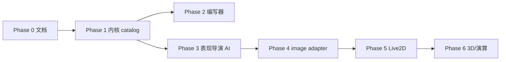

# 立绘 + 视觉表现 · 分阶段实施计划

**状态**：2026-06-12 更新 — **Phase 1–4 主仓已交付**；编写器 Sprint A–D 已落地；Live2D Cubism **defer**（见 `LIVE2D_CUBISM_DEFER.md`）  
**SSOT**： [RFC_PORTRAIT_FACILITY.md](../creator-docs/rfc/RFC_PORTRAIT_FACILITY.md) · [RFC_VISUAL_PRESENTATION_FACILITY.md](../creator-docs/rfc/RFC_VISUAL_PRESENTATION_FACILITY.md)  
**编写器**： [pack-editor/PACK_EDITOR_ROADMAP.md](pack-editor/PACK_EDITOR_ROADMAP.md)

---

## 原则

1. **第 3 设施（立绘）**：catalog + **表现导演 AI**（唯一选状态 LLM）+ legacy 7 tag 回退  
2. **第 4 设施（视觉表现）**：**无 AI**；`visual_state_id` → `performance_directive` → 渲染 adapter  
3. **简单创作**：7 图入门；**高级**：簇 / 多图 / 舞台资源  
4. **Additive**：旧包无 `portrait_catalog` 行为不变  

---

## Phase 0 — 文档与契约（本批）

| 项 | 产出 |
|----|------|
| RFC 两篇 | `creator-docs/rfc/RFC_PORTRAIT_*` · `RFC_VISUAL_*` |
| 架构登记 | `OCLIVE_ARCHITECTURE_OVERVIEW` 第 3/4 设施 |
| 命名 | `NAMING_CONVENTIONS` §1.2 |
| 角色包 | `ROLE_PACK_SPEC` §9.9 / §9.10（草案键） |
| 编写器路线图 | `PACK_EDITOR_ROADMAP` 重写 Phase A–D |
| 人类包 | 术语表 + 资料地图轻量链接（**不写 RFC 全文**） |

**验收**：索引可链到 RFC；AGENTS.md 与架构总述编号一致。

---

## Phase 1 — 内核基础（立绘 · 无 AI 变更）

**目标**：读 catalog、DTO、`visual_state_id`  plumbing、规则回退。

| 任务 | 落点 |
|------|------|
| `RolePackConfigFile` 扩展 | `oclive_kernel_types` · `portrait_catalog` serde |
| 加载 | `RoleStorage::load_role` / host profile |
| `resolve_visual_state` stub | `oclive_kernel_host` 新模块 `portrait_facility/` |
| 规则回退 | `bot_emotion` / `portrait_emotion` → catalog `tags` 首条 |
| DTO | `SendMessageResponse.visual_state_id` optional |
| 前端 | `CharacterInfo`：有 id 则 catalog path，否则 legacy |
| 校验 | `oclive_validation` 创作者 profile：`id` 唯一、path 安全 |
| 测试 | 单测 + 1 条 `distros/desktop-tauri/tests/` 回退链 |

**不做的**：表现导演 LLM、Live2D、编写器 UI。

**验收**：无 catalog 的 mumu/旧包 OOCP 无 diff；手工包带 catalog 可解析 id。

---

## Phase 2 — 编写器（简单 7 槽 + 高级 catalog）

**仓**：`oclive-pack-editor`

| 任务 | 说明 |
|------|------|
| `SimpleEmotionSlots.vue` | 7 固定槽；隐藏 append/clear |
| `PortraitCatalogEditor.vue` | 高级：多条目、desc、cluster |
| 导出 | `config.json` 写入 `portrait_catalog` |
| 检查 | 简单：缺 7 槽警告；高级：id 重复硬错误 |
| 草稿 | 仍不存图片二进制（v1） |

**验收**：简单导出 zip → 主仓 Phase 1 可加载；高级多簇 desc 进 JSON。

---

## Phase 3 — 表现导演 AI（合并 pick_portrait_emotion）

| 任务 | 说明 |
|------|------|
| `PortraitDirector` | 替换/合并 `pick_portrait_emotion` LLM 路径 |
| Prompt | 封闭 id 列表 + `narrative_hint` + 回合摘要 |
| CoPresent | 规则路径 + 可选 env 开 LLM |
| 复杂情感 | 集成测：hint 变化 → 不同 `visual_state_id` |
| 废弃策略 | `portrait_emotion_engine` 保留 7 tag 输出作 legacy |

**验收**：`narrative_hint_prompt_roundtrip` 同级新测；Mock LLM 可选 id。

---

## Phase 4 — 视觉表现 v1（image adapter only）

| 任务 | 说明 |
|------|------|
| `visual_presentation` config | serde + 默认 off |
| `materialize_directive` | `kind=image` → path only |
| 前端 | directive 优先，fallback PNG |
| distro | `distro.oclive.toml` `[visual_presentation] mode=off\|image_only` 草案 |

**验收**：enabled=false 零字段；enabled+image 与 Phase 3 id 一致。

---

## Phase 5 — Live2D（AI Theater）

| 任务 | 说明 |
|------|------|
| adapter | 桌面 Theater shell · Cubism 或占位 |
| catalog `kind=live2d` | expression/motion 映射表 |
| 编写器 | 高级：绑定 model3.json |
| distro | `theater.oclive.toml` → `stage_full` |

**验收**：Theater profile 下同一 id 驱动 Live2D；VS Code 不编译 adapter。

---

## Phase 6 — 3D / procedural / directory（远期）

| 任务 | 说明 |
|------|------|
| `rig3d` / `procedural` adapter | WebGL / 参数驱动 |
| directory `visual_presentation.materialize` | 插件契约 |
| `context: inner` | 内向视觉 UI 模式（可选） |

**验收**：RFC §7 内向场景一条 E2E 烟测。

---

## 依赖关系

Phase 2 与 Phase 3 可并行（mock catalog JSON）。

---

## 风险与待决（见 Plan 模式问题清单）

| ID | 问题 | 建议默认 |
|----|------|----------|
| Q1 | catalog 放 `config.json` 还是独立 JSON？ | v1 嵌 `config.json`；>32 条迁独立文件 |
| Q2 | `visual_state_id` 命名是否改 `portrait_asset_id`？ | 保持 `visual_state_id`（与 visual 设施一致） |
| Q3 | CoPresent 是否默认开表现导演 LLM？ | 默认关，规则映射；env 可开 |
| Q4 | Phase 5 Live2D 是否进 default-members CI？ | 否；Theater job 可选 |
| Q5 | Breaking 登记 | 仅 additive DTO；走 [BREAKING_CHANGE_PROCESS](BREAKING_CHANGE_PROCESS.md) 若改 `portrait_emotion` 语义 |

---

## 发版建议

| 版本 | 范围 |
|------|------|
| v0.4.0 | Phase 1–2（catalog + 编写器 7 槽） |
| v0.4.x | Phase 3 表现导演 |
| v0.5.0 | Phase 4–5 Theater Live2D |

CHANGELOG 与 SemVer 以实际合并 PR 为准。
