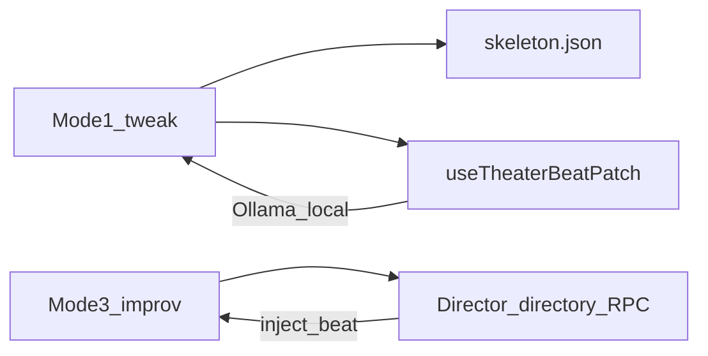

# RFC — AI Theater 导演 Directory 插件

**状态**：Draft · Phase 4  
**日期**：2026-06-12  
**相关**：[`THEATER_MODES.md`](./THEATER_MODES.md) · [`DISTRO_DEFAULT_PLUGINS.md`](../creator-docs/kernel/DISTRO_DEFAULT_PLUGINS.md) · [`DIRECTORY_PLUGINS.md`](../creator-docs/plugin-and-architecture/DIRECTORY_PLUGINS.md)

---

## 1. 问题与目标

AI Theater 发行版（`distro_id=theater`）需要 **Mode 3 自由演绎** 与高级场景规则，但：

- **不得**新增六槽键或 `slot_registry` 条目；
- **不得**修改 Stable `process_message` 编排 stage；
- 与 Chat Pro（open ceiling）和 VS Code Flash（locked builtin）在插件矩阵上 **可区分**。

**导演插件** = Theater 专用 **directory 子进程 + 正交 JSON-RPC**，服务 Mode 3 / 高级入口；**Mode 1 微调** 仍走前端 Ollama 热路径（[`useTheaterBeatPatch.ts`](../src/theater/useTheaterBeatPatch.ts)）。

---

## 2. 边界对比

| 维度 | Chat Pro | VS Code Flash | AI Theater |
|------|----------|---------------|------------|
| 六槽 | 角色蓝图 + directory 开放 | profile 整表替换为 locked builtin | profile 轻量矩阵（memory/event/agent=none） |
| 导演能力 | 无专用 RPC | 无 | **`theater.director.*`**（本 RFC） |
| Mode 1 台词 | 内核 LLM 共景 | 同左 | **前端 skeleton + Ollama patch**（不经六槽） |
| 安装 | `{app_data}/plugins/` | 同左 | **默认不 bundled**；用户手动安装或市场链 |

---

## 3. RPC 面（`theater.director.*`）

**不经** `slot_registry`、**不经** `plugin_backends` 新键。宿主经 **`directory_plugin_invoke`** 或 Theater 壳专用薄封装调用（未来 PR）；Phase 4 仅示例插件实现 stub。

| 方法 | 用途 | Mode |
|------|------|------|
| `theater.director.ping` | 健康检查 | 全部 |
| `theater.director.validate_rules` | 校验大纲/会话是否符合场景规则 | 2 / 3 |
| `theater.director.inject_beat` | 向进行中会话注入 beat 摘要 | 3 |
| `theater.director.switch_scene` | 切换场景 id（须已注册于 `public/theater/scenes.json`） | 3 |

**请求/响应**：JSON-RPC 2.0，协议头 `x-oclive-remote-protocol: oclive-remote-jsonrpc-v1`（与现有 directory 侧车一致）。

**失败语义**：

- 插件未安装 / 未授权 spawn → Theater 壳 **降级 skeleton**（Mode 1 不受影响）；
- RPC 超时 → 可见轻量 toast + 继续播放预置 beats。

---

## 4. 权限与安装

| 能力 | 权限键 | 说明 |
|------|--------|------|
| 子进程 spawn | `process:spawn` | manifest `permissions` 声明；首次启用须用户 grant |
| 出站 HTTP（若 remote 辅助） | `network:*` | 可选；默认 stub 仅 localhost |

**安装路径**（与 [directory-plugin-minimal](../examples/directory-plugin-minimal/README.md) 相同）：

- `{app_data}/plugins/com.oclive.theater.director/`
- 或开发者 `extra_plugin_roots`

**默认不 bundled**；Theater 安装包仅含 `theater-breakfast-*` 角色子集，不含导演插件。

---

## 5. 与现有前端的关系

- **Mode 1**：`TheaterModeTweak` + `useTheaterPlayback` + `useTheaterBeatPatch` — **不依赖**导演插件。
- **Mode 3**：`useTheaterDirector` — Phase 4 可 **可选** 接 `theater.director.inject_beat`；未安装时纯前端轮替逻辑不变（见 [`theater.modes.test.ts`](../src/theater/theater.modes.test.ts)）。

---

## 6. 非目标（Phase 4）

- 新 `process_message` stage 或 Experimental `dual_core` 解冻；
- 赌场 DLC、第二场景 bundled；
- 导演插件占用 memory/emotion/agent 等六槽；
- Pro/Flash 默认安装导演插件。

---

## 7. 验收

- [x] 本 RFC 文档
- [x] 示例 [`examples/directory-plugin-theater-director/`](../examples/directory-plugin-theater-director/) manifest + RPC stub
- [ ] Theater 壳「安装导演插件」市场链（可选 follow-up）
- [ ] `theater` profile 下六槽 smoke **不变**（`npm run test:distro:smoke`）

---

## 8. Related

- [`PRODUCT_FREEZE_THEATER_V0.md`](./PRODUCT_FREEZE_THEATER_V0.md)
- [`THEATER_PHASE4_READINESS.md`](./THEATER_PHASE4_READINESS.md)
- [`RFC_USER_IDENTITY_AND_REPLY_POST_PROCESSOR.md`](../creator-docs/rfc/RFC_USER_IDENTITY_AND_REPLY_POST_PROCESSOR.md)（正交能力先例）
