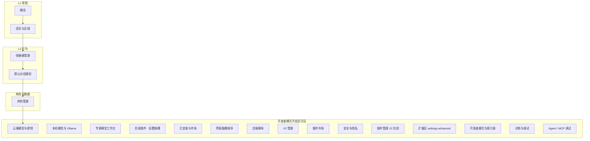

# 设置中心结构（拆分后）

沉浸模式下，右栏顶部有 **开发者模式** 总闸；关闭时侧栏不展示下列「门控」项。

## 侧栏树（逻辑分组）

纯聊模式仍受 `filterSettingsNavRows` 约束（与既有 IA 一致）。

## 右栏主面板映射

| 侧栏 id | 主组件 / 说明 |
|---------|----------------|
| `generalOverview` | 概览 + 全局恢复默认 |
| `generalLanguage` | 语言选择 |
| `shortcutsManage` | `ShortcutsManagerPanel`（内置表 + launcher 槽 + `HotkeySettingsSection`） |
| `generalDefaultModel` | `ModelSelectorSettings`（模型中心 + 跳转本机页） |
| `dataRoles` | `RoleManagerSettings`（列表/搜索/导入导出/删除） |
| 门控项 | 各 `SettingsTierSection` + 插件嵌入 / 深链按钮（见 `SETTINGS_DEVELOPER_GATED_NAV_IDS`） |

## 相关源文件

- `src/lib/settingsNavKeys.ts` — `SETTINGS_NAV`、`SETTINGS_NAV_ROWS`、`SETTINGS_DEVELOPER_GATED_NAV_IDS`
- `src/views/SettingsView.vue` — 侧栏过滤、顶部开发者闸、`systemDeveloper` 仅索引源
- `src/components/settings/RoleManagerSettings.vue`
- `src/components/settings/ModelSelectorSettings.vue`
- `src/components/settings/ShortcutsManagerPanel.vue`
- `src/components/HotkeySettingsSection.vue` — 重复快捷键提示
