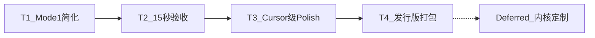

# AI 剧场发行版 — 后续开发计划（Mode 1 优先）

**状态**：活跃 · **更新**：2026-06-12（T1–T4 实现入库；陌生人实机待填）  
**发行版**：`distro_id=theater` · [`examples/distro-profiles/theater.oclive.toml`](../examples/distro-profiles/theater.oclive.toml)  
**三模式 SSOT**：[`THEATER_MODES.md`](./THEATER_MODES.md)

---

## 0. 北极星（对标 Cursor 级首屏）

每个官方发行版都应满足同一套 **15 秒惊喜** 标准（从原 60 秒清单升级）：

| 维度 | Cursor 级含义 | AI 剧场 Mode 1 落地 |
|------|---------------|---------------------|
| **零配置** | 打开就能用，不见 API Key / 六槽 / 插件面板 | 无设置页；Ollama 不可用时仍完整播放 + 可见降级 |
| **即时内容** | 首屏 <1s 有「在发生的事」 | skeleton 加载后 **自动播放** 第一条台词（已实现） |
| **单一主路径** | 默认只做一件事，高级能力不挡路 | **默认仅 Mode 1**；大纲/自由演绎收到「高级」 |
| **可感反差** | 15s 内让用户觉得「这不一样」 | 双角色反差 + **一次戳点** 有可见反馈 |
| ** polish** | 动效、排版、文案短、无 debug 噪音 | 无 `StartupWarningsBanner`；芯片 ≤3+1 高级 |

**验收 SSOT**：[`THEATER_15S_ACCEPTANCE.md`](./THEATER_15S_ACCEPTANCE.md)（Wave T2 新建）

**Explicit Deferred（2026-06-12 确认 · Pro/Flash smoke 通过后再开）**：

| 项 | 解冻条件 |
|----|----------|
| **Phase 4 导演插件 + T1–T4 + roles 子集** | **Chat Pro + VS Code Flash smoke 通过** — 见 [`THREE_DISTRO_KERNEL_CLOSURE.md`](./THREE_DISTRO_KERNEL_CLOSURE.md) §3 smoke 表 · [`THEATER_PHASE4_READINESS.md`](./THEATER_PHASE4_READINESS.md) |
| 发行版 **内核二进制定制**（promote / sidecar / 专用 `kernel_manifest`） | T4 完成 **且** 15s 陌生人测试 ≥60% 后再开 RFC |
| **赌场 / 目录插件 DLC** | Mode 1 惊喜成立 + 第二场场景需求明确 |
| `process_message` 新 stage · **`dual_core` 解冻** | 与 theater 发行版正交；见 `TECHNICAL_DEBT_INVENTORY` |
| **VS Code 渗透漏斗** | parked 至 F5 反馈（姊妹仓 `oclive-vscode`） |

---

## 1. 现状与缺口（Mode 1）

**已有（Wave 1–3 已入库）**：

- 三模式代码 + 16 条单测绿
- `useTheaterPlayback` skeleton 到达即 `startPlayback`
- poke patch + Ollama 探测 + 全屏 loading 遮罩
- `public/theater/breakfast/skeleton.json` + `scenes.json`

**T1–T4 已收口（2026-06-12）**：

| Wave | 状态 |
|------|------|
| T1 Mode 1 极简 UI + 内容 fallback | Done |
| T2 15s 验收 + perf mark + 单测 | Done |
| T3 Cursor polish（淡入 / 芯片 loading / prefetch / copy） | Done |
| T4 打包 smoke + 陌生人表模板 | Done（**5 人实机结果待填**） |

---

## 2. 分 Wave 交付

### Wave T1 · Mode 1 极简（最高优先级）

**目标**：打开 App = 只看一场戏 + 三个戳点，无其它决策。

| ID | 任务 | 触点 |
|----|------|------|
| T1-UI-01 | **默认隐藏** Mode 2/3 Tab；「高级模式 ▾」展开后再选 | `TheaterShell.vue` |
| T1-UI-02 | theater 壳 **不渲染** `StartupWarningsBanner` | `TheaterShell.vue` |
| T1-UI-03 | **「改性格」移入高级菜单**；主 footer 仅 3 poke | `TheaterModeTweak.vue` |
| T1-UI-04 | 压缩 header：单行产品名 + 场景标签内嵌 stage | `TheaterShell.vue` + i18n |
| T1-UX-05 | Ollama 不可达：**不**在 footer 常驻；戳点后再提示「未改写，继续播放」 | `TheaterModeTweak.vue` |
| T1-CONTENT-06 | 收紧 breakfast **前 3 beats** 文案/间隔，保证 15s 内完成「反差建立」 | `public/theater/breakfast/skeleton.json` |
| T1-FALLBACK-07 | 无 Ollama 时 poke 仍切换 **预置备选句**（非仅 toast） | `useTheaterBeatPatch.ts` + skeleton `patch_hints` |

**出口**：陌生人 **0 文档** 打开 → 15s 内看到双角色 + 点一次芯片有变化。

**不动**：内核、`process_message`、distro profile 六槽上限。

---

### Wave T2 · 15 秒验收体系

| ID | 任务 | 触点 |
|----|------|------|
| T2-DOC-01 | 新建 [`THEATER_15S_ACCEPTANCE.md`](./THEATER_15S_ACCEPTANCE.md) | handoff |
| T2-DOC-02 | [`THEATER_V0_ACCEPTANCE.md`](./THEATER_V0_ACCEPTANCE.md) 顶部链到 15s 为主、60s 为完整版 | handoff |
| T2-PERF-01 | 首屏 mark：`theater-first-line`（skeleton → 第一条 visible beat） | `useTheaterPlayback.ts` |
| T2-PERF-02 | 预算写入 [`PERFORMANCE.md`](../creator-docs/getting-started/PERFORMANCE.md) §7 扩展 | creator-docs |
| T2-TEST-01 | 单测：skeleton 前 3 beat 累计 `delay_ms` ≤ 12s（留 3s 给首屏） | `theater.acceptance.test.ts` |
| T2-TEST-02 | 可选：Playwright `dev:theater` 首屏截图烟测（CI Ubuntu frontend 复用链） | `e2e/` 或 vitest browser |

**15 秒人工清单（草案）**：

| 秒数 | 预期 |
|------|------|
| 0–2 | 首屏出现场景 + **第一条台词**（零 LLM） |
| 2–10 | 至少 **2 条** 不同角色台词，反差可感 |
| 10–15 | 点击 **任意 1 个** poke → 有台词变化 **或** 明确降级仍继续 |
| 全程 | 不见模式 Tab / 设置 / API Key / 内核告警 |

---

### Wave T3 · Cursor 级 Polish（Mode 1 only）

| ID | 任务 | 说明 |
|----|------|------|
| T3-MOTION-01 | 台词 **逐条淡入**（`prefers-reduced-motion` 尊重） | CSS / Vue transition |
| T3-MOTION-02 | poke 时 **芯片内联 spinner**，弱化全屏遮罩 | `TheaterModeTweak.vue` |
| T3-A11Y-01 | 戳点 toolbar 焦点环；patch overlay `aria-busy` | a11y |
| T3-COPY-01 | i18n 副标题改为 **一句** 行动指引（「点下面改剧情」） | `app.zh.ts` / `app.en.ts` |
| T3-PERF-01 | `scenes.json` + skeleton **并行 prefetch**（`<link rel="preload">` 或壳内 Promise.all） | `sceneRegistry.ts` |

**出口**：内部自评「像 Cursor 打开就能用」，而非「像开发者 demo」。

---

### Wave T4 · 发行版打包（不含内核定制）

| ID | 任务 | 说明 |
|----|------|------|
| T4-PKG-01 | Tauri **`OCLIVE_SHELL=theater`** 安装包 smoke（Windows 优先） | `tauri.conf.json` / CI 可选 job |
| T4-PKG-02 | `npm run dev:theater` 写进 [`CONTRIBUTING.md`](../CONTRIBUTING.md) + human-docs | 文档 |
| T4-PKG-03 | bundled `theater.oclive.toml` 与示例 profile **字段对齐**检查 | 已有 K-PROFILE-04 |
| T4-TEST-01 | 陌生人测试表 [`THEATER_STRANGER_TEST_ROUND1.md`](./THEATER_STRANGER_TEST_ROUND1.md) 改用 **15s 通过标准** | handoff |

**Explicit Deferred — 发行版内核裁剪**：

- **不**做 per-distro **裁剪** binary（各发行版可带不同 bundled 全量核 + sidecar，但非必选）
- spawn：**bundled 首选 → shared 兜底**（同 app_data / profile / 插件复用）— 见 [KERNEL_SCHEDULER_RESCOPE.md](../handoff/KERNEL_SCHEDULER_RESCOPE.md)
- 各发行版差异走 **插件矩阵** — 见 [DISTRO_DEFAULT_PLUGINS.md](../creator-docs/kernel/DISTRO_DEFAULT_PLUGINS.md)

→ 触发条件：**T4 完成 + 15s 陌生人测试 ≥60% 惊喜** 后再评估内核 RFC。

---

## 3. Mode 2 / Mode 3 在本计划中的位置

| 模式 | 策略 |
|------|------|
| **Mode 1 微调** | **唯一 hero**；Wave T1–T4 全部服务于此 |
| **Mode 2 大纲** | 代码保留；UI **仅高级入口**；无陌生人测试要求 |
| **Mode 3 自由演绎** | 同上；待 Mode 1 惊喜成立后再做 polish / 性能 |

不在 T1–T4 排期：大纲编辑器 UX、improv `send_message` 增强、第二场场景。

---

## 4. 与其它发行版的对齐（模板化）

本计划产出的 **`THEATER_15S_ACCEPTANCE.md` + 15s 清单结构** 将作为 **官方发行版验收模板**：

| 发行版 | 15s 惊喜定义（后续） |
|--------|---------------------|
| **theater** | 双 OC 互动 + 戳点（本计划） |
| **desktop-chat** | 单角色一句有性格回复（Deferred） |
| **vscode** | 侧边栏一句 + 渗透不挡聊天（parked） |

各发行版 **共用**「零配置 / 即时内容 / 单一主路径」四维度，**不共用**具体 UI 场景。

---

## 5. 建议执行顺序（给协作者）

1. **T1-UI-01 ~ T1-UX-05**（1 PR，纯前端，风险低）
2. **T1-CONTENT-06 + T1-FALLBACK-07**（内容 + patch 降级，1 PR）
3. **T2 验收文档 + perf mark + 单测**（1 PR）
4. **T3 polish**（可拆 2 个小 PR）
5. **T4 打包与陌生人测试**（需你本地 Windows 安装包验证）

---

## 6. 关联文档

- 三模式架构：[`THEATER_MODES.md`](./THEATER_MODES.md)
- 产品冻结：[`PRODUCT_FREEZE_THEATER_V0.md`](./PRODUCT_FREEZE_THEATER_V0.md)
- 性能预算：[`PERFORMANCE.md`](../creator-docs/getting-started/PERFORMANCE.md) §7
- 定位（灵魂界 Cursor）：[`RECURRING_OPTIMIZATION_PLAYBOOK.md`](./RECURRING_OPTIMIZATION_PLAYBOOK.md) §★
- DLC / 赌场：Deferred，见 [`THEATER_MODES.md`](./THEATER_MODES.md) §Deferred
