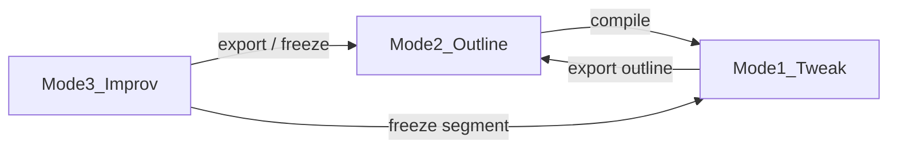

# AI Theater — 三模式 SSOT

**发行版**：`distro_id=theater` · profile [`examples/distro-profiles/theater.oclive.toml`](../examples/distro-profiles/theater.oclive.toml)

**产品冻结**：Wave 1–3 **不改** `process_message` 编排；剧场逻辑在 `src/theater/` + `src/shells/theater/`。

---

## 三模式定义

| 模式 | ID | Wave | 说明 |
|------|-----|------|------|
| **微调** | `tweak` | 1 | 预置 skeleton + poke 芯片；本地 Ollama 仅 patch 命中 beats |
| **大纲** | `outline` | 2 | 用户写大纲 → 编译为 `TheaterSkeleton` → 微调模式播放 |
| **自由演绎** | `improv` | 3 | 场景 + 双角色 + 用户插话；回合 `user → A → B → …` |



---

## 数据模型（`src/theater/types.ts`）

- `TheaterSkeleton` — 可播放骨架（beats + variables + impact_map）
- `TheaterOutline` — 可编辑大纲（beats 为 summary，speaker 含 `user`）
- `TheaterSession` — Mode 3 会话 transcript

场景索引：`public/theater/scenes.json`  
骨架路径 SSOT：`/theater/{sceneId}/skeleton.json`

---

## 模块职责

| 模块 | 职责 |
|------|------|
| `sceneRegistry.ts` | 加载场景索引与 skeleton |
| `useTheaterPlayback.ts` | 三模式共用 beat 播放 |
| `useTheaterBeatPatch.ts` | Mode 1 poke patch（Ollama） |
| `useTheaterOutlineCompiler.ts` | outline ↔ skeleton 编译/导出 |
| `useTheaterDirector.ts` | Mode 3 回合队列与下一说话人 |
| `useTheaterImprovLine.ts` | OC 台词：Ollama 优先，Tauri 下可选 `send_message` |

---

## 启动

```powershell
# 前端壳（推荐本地开发）
npm run dev:theater

# 或手动
$env:VITE_OCLIVE_SHELL = "theater"
npm run dev

# Tauri + 发行版 profile
$env:OCLIVE_DISTRO_PROFILE = "examples/distro-profiles/theater.oclive.toml"
$env:VITE_OCLIVE_SHELL = "theater"
npm run tauri:dev
```

`GET /health` 应返回 `distro_id: theater`（spawn 时注入 `OCLIVE_DISTRO_ID` + `OCLIVE_DISTRO_PROFILE`）。

---

## 验收

- Wave 0/1：[THEATER_V0_ACCEPTANCE.md](./THEATER_V0_ACCEPTANCE.md)
- 单测：`npm run test:unit -- src/theater/`

---

## Deferred

- 赌场 / 目录插件导演 RPC
- 六槽强约束组合
- VS Code 渗透（parked 至 F5 反馈）
- `dual_core` / 新编排 stage
