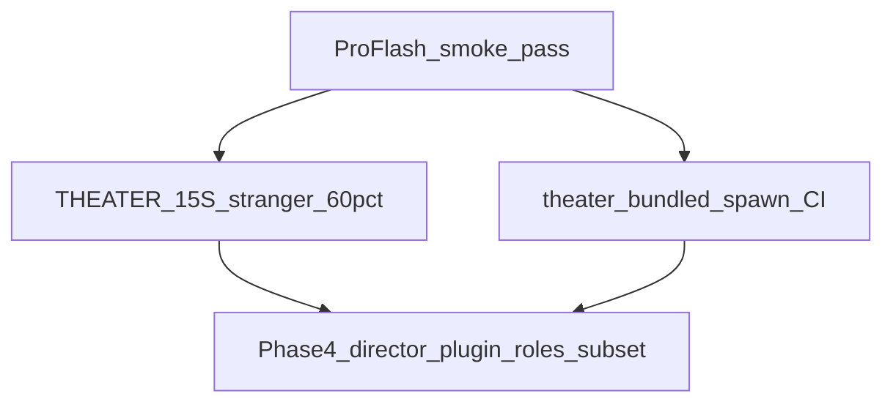

# Theater Phase 4 就绪清单

**状态**：Phase 4 Wave P4-1/P4-2 工程完成 · **更新**：2026-06-12  
**前提**：三发行版内核阶段结项 — 见 [`THREE_DISTRO_KERNEL_CLOSURE.md`](./THREE_DISTRO_KERNEL_CLOSURE.md)

---

## 门槛总览

| 门槛 | 状态 | 负责 |
|------|------|------|
| Pro/Flash smoke（R1） | **pass** · 2026-06-12 | 工程 |
| [`THEATER_15S_ACCEPTANCE.md`](./THEATER_15S_ACCEPTANCE.md) 5 人 ≥60% | **工程代理 pass 100%** · **真人 pending**（[`THEATER_STRANGER_FACILITATOR.md`](./THEATER_STRANGER_FACILITATOR.md) 就绪） | 产品/人工 |
| theater profile spawn 烟测 | **pass** · `e2e-distro-kernel --scenario theater` + CI | 工程 |
| 导演插件 RFC / 六槽边界 | **done** · [`RFC_THEATER_DIRECTOR_PLUGIN.md`](./RFC_THEATER_DIRECTOR_PLUGIN.md) | Phase 4 |
| 导演插件前端接线（Mode 3 可选） | **done** · [`src/theater/theaterDirectorClient.ts`](../src/theater/theaterDirectorClient.ts) | Phase 4 C-pass |
| Tauri theater roles 子集 + 安装包路径 | **done** · `npm run tauri:build:theater` | Phase 4 |

**与 [`PRODUCT_FREEZE_THEATER_V0.md`](./PRODUCT_FREEZE_THEATER_V0.md) 对齐**：内核编排仍冻结；Phase 4 允许 **theater 发行版打包 / 插件 / UI**，不是新 `process_message` stage。

---

## Phase 4 交付物（2026-06-12）

| 资产 | 路径 |
|------|------|
| Theater distro profile | [`examples/distro-profiles/theater.oclive.toml`](../examples/distro-profiles/theater.oclive.toml) · Tauri 镜像 [`src-tauri/resources/distro-profiles/theater.oclive.toml`](../src-tauri/resources/distro-profiles/theater.oclive.toml) |
| Theater shell | `VITE_OCLIVE_SHELL=theater` · [`scripts/theater-tauri-smoke.mjs`](../scripts/theater-tauri-smoke.mjs) |
| Roles 子集（Release） | `theater-breakfast-a` / `theater-breakfast-b` · [`scripts/filter-theater-roles.mjs`](../scripts/filter-theater-roles.mjs) → `src-tauri/resources/roles/` |
| Theater Tauri 配置 | [`src-tauri/tauri.theater.conf.json`](../src-tauri/tauri.theater.conf.json) · `npm run tauri:build:theater` |
| Bundled shell env | `OCLIVE_TAURI_SHELL=theater` → compile-time `OCLIVE_BUNDLED_SHELL` → runtime `OCLIVE_SHELL=theater` |
| 15s 工程代理 | [`scripts/theater-stranger-proxy.mjs`](../scripts/theater-stranger-proxy.mjs) · [`THEATER_STRANGER_TEST_ROUND1.md`](./THEATER_STRANGER_TEST_ROUND1.md) |
| 导演插件 RFC | [`RFC_THEATER_DIRECTOR_PLUGIN.md`](./RFC_THEATER_DIRECTOR_PLUGIN.md) |
| 导演插件示例 | [`examples/directory-plugin-theater-director/`](../examples/directory-plugin-theater-director/) |
| Distro e2e | [`scripts/e2e-distro-kernel.mjs`](../scripts/e2e-distro-kernel.mjs) `--scenario theater` |
| 聚合 smoke | `npm run test:distro:smoke` |

---

## Checklist

- [x] 工程代理填 [`THEATER_STRANGER_TEST_ROUND1.md`](./THEATER_STRANGER_TEST_ROUND1.md)（100% @15s 结构校验）
- [ ] **真人** 5 人陌生人 ≥60%（产品门槛 · [`THEATER_STRANGER_FACILITATOR.md`](./THEATER_STRANGER_FACILITATOR.md)）
- [x] 导演插件 RFC（不占新六槽键）
- [x] 导演 directory 插件最小骨架
- [x] 导演插件前端接线（Mode 3 `theaterDirectorClient` + improv 降级链）
- [x] CI `frontend` 跑 `test:theater:smoke`
- [x] Tauri theater 安装包路径 + roles 仅 `theater-breakfast-*`
- [x] bundled theater spawn 纳入发行版 CI matrix（`test:distro:smoke`）

---

## 下一决策点

1. **真人陌生人** Windows 实机填表（[`THEATER_STRANGER_FACILITATOR.md`](./THEATER_STRANGER_FACILITATOR.md)）→ 若 <60% 触发 P4-3（见 [`THEATER_P43_STATUS.md`](./THEATER_P43_STATUS.md)）
2. 是否解冻 **per-distro 内核 sidecar RFC**（T4 包 + 真人 ≥60% 后再评估）
3. 是否复制 15s 模板到 **Chat Pro desktop** 陌生人验收
4. VS Code 渗透 F5 反馈后 Flash VSIX

---

## Related

- [`THEATER_DISTRO_ROADMAP.md`](./THEATER_DISTRO_ROADMAP.md)
- [`THREE_DISTRO_KERNEL_CLOSURE.md`](./THREE_DISTRO_KERNEL_CLOSURE.md)
