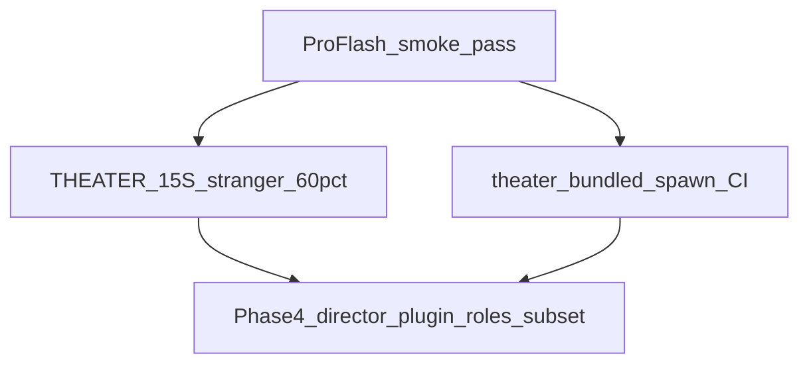

# Theater Phase 4 就绪清单

**状态**：基础预埋 · **更新**：2026-06-12  
**前提**：三发行版内核阶段结项 — 见 [`THREE_DISTRO_KERNEL_CLOSURE.md`](./THREE_DISTRO_KERNEL_CLOSURE.md)

---

## 门槛总览

| 门槛 | 状态 | 负责 |
|------|------|------|
| Pro/Flash smoke（R1） | **pass** · 2026-06-12 | 工程 |
| [`THEATER_15S_ACCEPTANCE.md`](./THEATER_15S_ACCEPTANCE.md) 5 人 ≥60% | **pending**（T4 模板已有） | 产品/人工 |
| theater profile spawn 烟测 | **pass** · `e2e-distro-kernel --scenario theater` + CI | 工程 |
| 导演插件 RFC / 六槽边界 | **Deferred** 占位 | Phase 4 首 PR |

**与 [`PRODUCT_FREEZE_THEATER_V0.md`](./PRODUCT_FREEZE_THEATER_V0.md) 对齐**：内核编排仍冻结；Phase 4 允许 **theater 发行版打包 / 插件 / UI**，不是新 `process_message` stage。

---

## 已有资产（打包路径 · 无 roles 子集实现）

| 资产 | 路径 |
|------|------|
| Theater distro profile | [`examples/distro-profiles/theater.oclive.toml`](../examples/distro-profiles/theater.oclive.toml) · Tauri 镜像 [`src-tauri/resources/distro-profiles/theater.oclive.toml`](../src-tauri/resources/distro-profiles/theater.oclive.toml) |
| Theater shell | `OCLIVE_SHELL=theater` · `VITE_OCLIVE_SHELL=theater` · [`scripts/theater-tauri-smoke.mjs`](../scripts/theater-tauri-smoke.mjs) |
| Distro e2e | [`scripts/e2e-distro-kernel.mjs`](../scripts/e2e-distro-kernel.mjs) `--scenario theater` |
| 聚合 smoke | `npm run test:distro:smoke` |

---

## Phase 4 首 epic checklist（本阶段不实现）

- [ ] 填完 [`THEATER_STRANGER_TEST_ROUND1.md`](./THEATER_STRANGER_TEST_ROUND1.md)（≥60% @15s）
- [ ] 导演插件 RFC 草稿（不占新六槽键）
- [ ] Tauri `OCLIVE_SHELL=theater` 安装包 + roles 仅 `theater-breakfast-*`
- [ ] bundled theater spawn 纳入发行版 CI matrix（可选，与 Pro 同 job 即可）

---

## Phase 4 开工时第一 PR 建议

1. 陌生人测试实机填表
2. 导演插件 RFC + directory 范式骨架
3. roles 子集 + Tauri theater 安装包验收

---

## Related

- [`THEATER_DISTRO_ROADMAP.md`](./THEATER_DISTRO_ROADMAP.md)
- [`THREE_DISTRO_KERNEL_CLOSURE.md`](./THREE_DISTRO_KERNEL_CLOSURE.md)
