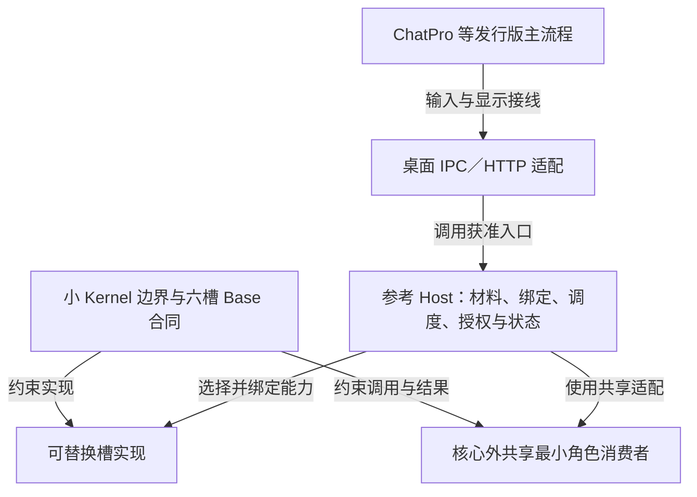

# OCLive 基线全景审查与后续三条路线（2026-10-09）

**性质**：维护者要求的有界项目审查快照及路线建议，不是第二份架构、债务或发布状态 SSOT。权责查[模块注册表](../../MODULE_MAP_AND_HANDOFF.md#kernel-responsibilities)，债务状态查[主台账](../../TECHNICAL_DEBT_INVENTORY.md)，后续实施按[已有清理出口](../README.md#有界清理与恢复开发出口)。
**受检基线**：`2ef5af051aea57fb76e6cd4d05e3a3468a8b0e63`；本报告由 controller 自查，`independent=false`。
**方法**：结合[巡检手册](../../RECURRING_OPTIMIZATION_PLAYBOOK.md)、[AI 边界](../../AI_CHANGE_BOUNDARIES.md)、[核实协议](../../AI_VERIFICATION_PROTOCOL.md#doc-code-support-audit)和仓库流水线，覆盖六个维度的有限样本。本轮是全景专题审查，未逐项完成全档实机/性能清单，不给全档等级。

## 1. 先给整体判断

项目已具有可继续开发的工程基线，六槽独立 Base、核心外共享消费者、参考 Host 和 ChatPro 的有限接入已经能分层辨认、测试和维护。当前更有价值的工作是选择一个真实使用目标，沿已有边界补它实际缺失的能力或体验；不需要先完成整个台账，也不需要重写所有接口或将每个 Host 统一成固定六阶段。

项目的主要限制仍应分开看：小 Kernel 的逻辑边界已经明确，物理上却仍与更完整的参考工具箱共存；Host 和产品有真实接入案例，但没有覆盖所有发布、设备、音频和崩溃情况；文档体系的分责已建立，活跃入口仍保留较多历史和局部过期状态。工程绿灯不能证明模型语义质量，文档漂移也不能自动推导代码缺失。

### 已确认的基线

正式 [ci.yml run 37877817104](https://github.com/linkaiheng2233-cyber/oclivenewnew/actions/runs/37877817104)，attempt 1，精确绑定受检 SHA，实际 **17/17 success**，含唯一成功 ci-gate。main、tracking、实际远端一致且均干净。观察器的 API EOF native 1 单独保留，正式终态取自同 run/jobs API；未重跑工作流。

- 直接本地 `npm run check:ci-local` 在 `fd19e48920dc3bb390e010898056716e7998d2a9` 上退出 0，用时 1664.58636 秒，环境恢复、源码与 HEAD 未漂移。Dimension 5 为 **31 checks**，Host lib **637 passed**，runtime lib **273 passed**。
- 最终 `2ef5af05` 比该本地全量版本只增加四份纯文档同步；已核代码与依赖图不变，并运行八项适用文档检查。**不声称本地全量直接跑在最终 SHA**。
- 本批具体维护：K-EMO-06 按维护者决定 Deferred；有限兼容规则已采纳；清理出口按真实开发阻碍确定；上游 concurrently 9.2.5 已固定 shell-quote 1.12.0，撤销对应临时 override，其余四项保留。生产 npm audit 为 0，完整开发图仍为四项 low，K-SUPPLY-12 保持 Partial。
- 本地原始验收件在工作树 ignored 目录 `.cursor/plans/debt-compat-20261009-r0/`；GitHub CI 是可远端取得的正式结果。本报告与 Git 中的测试不能替代未随 Git 转移的历史 DB、日志和 live 原件。

### 结构和规模印象

本轮只读 `cargo metadata --no-deps --format-version 1 --locked --offline` 与 `project-scale.mjs`：workspace **14** 个成员，kernel＋desktop-tauri **821** 个 Rust 文件，shared＋ChatPro＋Theater **399** 个 Vue/TS 文件，Host **40** 份 SQL 迁移。文件数包含测试，不是小 Kernel 的代码量，也不用于证明质量。

这是权责图，不是固定执行时序。`kernel/` 目录内有参考 Host；`OcliveKernel` 完整门面不等于已经独立抽出的最小 core。目录名和 crate 名不能代替边界判断。

## 2. 六个维度的审查结果

| 维度 | 当前观察与证据 | 对下一步的影响 |
|---|---|---|
| 架构 | metadata 显示 contracts 依赖 types，runtime 依赖 contracts/types/validation，Host 装配 runtime、SQLite 和 HTTP；server 不依赖 Tauri。Base 调用面不携带 AppState、SQL 或完整 Role。参考主链与外围适配可辨认 | 现有结构可继续增量开发；K-CORE-BOUNDARY-01 的物理拆薄仍不宜默认扩成全仓迁移 |
| 性能 | SessionCache 已有 cap/TTL，migration 033 有 role/created_at 索引；当前传输已是 Rust 鉴权流＋同身份恢复。TTFT/TTFC 页面保留历史样本，未测本轮真实推理、查询计划、冷启动分布或长时资源压力 | 不给当前性能评级；只有目标是某个硬件/延迟体验时，才做对应小矩阵。K-VOICE-09 等未测范围保留 |
| 设计 | 组合 registry 仍由窄端口组成；共享最小消费者采用 Host 选择的 Base，调用独立、无隐式重试与权限迁移；旧丰富端口与增量 Base 并存 | 不为“统一所有旧接口”重构。遇到实际新消费者或明确重复实现再处理，不因只有一个实现删除 DI 端口 |
| 技术债 | 当前队列没有现成自动施工项，台账仍有 Partial、OPEN、Deferred 和冻结范围。签名、Full 韧性、多 Agent、双核与高级情绪记忆等已有边界 | 没有 runnable 不代表全部完成；无具体目标时不重开旧债。把真正阻挡所选开发路径的残余项列为下一批 |
| 文档 | 人类、创作者、AI、公开契约和状态已分层；链接/镜像/编码等检查已通过。发现黄金路径的最小角色现状一句与当前代码不一致 | 结构门禁有效，但不能代替语义核对；先修准确的一句，不扩成全部文档翻修 |
| 条理与边界 | G1–G17、状态判读、证据等级、调查预算和 CI 节奏都有正式入口。手册仍有默认不运行 doctest的覆盖表述、历史勾选和评分模板等维护问题 | 手册需要有限清晰化；这些问题不推翻当前工程基线，不需要为其重跑业务 live |

所有观察只在上述样本范围成立。性能和真实设备未评分；没有沿用旧 A−，也没有据此评全仓所有实现合规。

## 3. 文档声明与代码支撑：八项有限样本

先按核实协议冻结八项，默认 D1；同身份/取消及语音边界进入 D2，每项最多两处关联面。未开 D3，未启动产品、模型、TTS 或监听器。入选 **8**、已查 **8**、未能分类的 `Unknown` **0**；全仓未入选声明总数没有枚举，**不报告覆盖百分比**。排除真实生产模型质量、全部硬件、所有崩溃窗口、第三方生态及未来冻结扩展。

| 样本 | 责任、实现与直接证据 | 判定和停止线 |
|---|---|---|
| 小 Kernel 与参考 Host 分责 | [MODULE_MAP §0.1](../../MODULE_MAP_AND_HANDOFF.md#kernel-responsibilities)、Cargo metadata；[完整门面](../../../kernel/crates/oclive_kernel_host/src/role_kernel.rs)实际委托 Host | Supported，限权责可辨认；不是独立小 core 或全仓合规证明，STOP |
| 六个独立 Base | [slot_base.rs](../../../kernel/crates/oclive_kernel_contracts/src/slot_base.rs) 单方法/local future；[Base-only fixture](../../../kernel/crates/oclive_kernel_contracts/tests/base_only_fixture.rs) 在本地完整集成链被运行 | Supported，限现有签名/借用/独立调用；不推出跨线程、外部取消或重试安全，STOP |
| 最小角色的共享六槽消费 | [共享消费者](../../../kernel/crates/oclive_kernel_runtime/src/domain/minimal_role_consumer.rs)、[可替换六槽回归](../../../kernel/crates/oclive_kernel_runtime/tests/minimal_role_six_slots.rs)、[角色边界](../../ROLE_PACK_BOUNDARY.md#014-六槽可替换的最小角色消费) | Supported，限所选实现和用途；每次只调绑定能力，不要求一个聊天回合全部调用，STOP |
| 桌面鉴权流与同身份恢复 | [前端 Channel 入口](../../../distros/shared/src/api/chat.ts)、[store 恢复](../../../distros/shared/src/stores/chatStoreSend.ts)、[Rust HTTP 桥](../../../distros/desktop-tauri/src/kernel_attach/chat.rs)、[收据](../../../kernel/crates/oclive_kernel_host/src/domain/chat_engine/request_receipt.rs)；bridge 集成测试进入完整本地链，旧 live 范围见[接入检查单](../../CHATPRO_HOST_KERNEL_INTEGRATION_GATE.md) | Supported，限现有路径；取消客户端不等于服务端取消，未知/冲突不能重认领。历史 live 不冒充本轮新运行，STOP |
| 普通聊天只播最终权威文本 | store onToken 不外发语音；[真实事件总线集成用例](../../../distros/shared/src/integration/voiceBusIntegration.test.ts)核暂态零播报与最终一次全文 | 事件边界有支撑；**Evidence gap：本轮没有真实音频/TTS**。只保留对应验收缺口，不把替身结论外推，STOP |
| 有限兼容审阅规则 | [已采纳规则](../../../creator-docs/COMPATIBILITY.md#six-slot-minimal-compatibility-draft)；现行 types/traits/逻辑校验作为清单锚点，维护者已批准规则 | Supported，限治理生效；不是 Stable 1.0 发布或任意未来变更已兼容，STOP |
| CI 的计划、验证、汇总 | [ci.yml](../../../.github/workflows/ci.yml) push main/master，草稿使用不同 gate，汇总核实际 needs；正式基线 CI 绑定受检 SHA | Supported，限当前执行规则；Kernel/Host CI 进一步分层仍归 K-CI-IMPACT-01，当前不重设计，STOP |
| 依赖缓解与发布者信任分开 | 根 lock 采用上游安全链；[供应链指南](../../../creator-docs/security/SUPPLY_CHAIN.md)明确签名未默认落实；[打包侧车](../../../distros/desktop-tauri/src/api/plugin_pack.rs)记录 SHA-256 | Supported，限当前陈述；SHA-256 不证明发布者，签名信任根仍按既定暂缓管理，STOP |

**一个具体语义漂移**：[创作者黄金路径](../../../creator-docs/getting-started/CREATOR_GOLDEN_PATH.md)及英文镜像还写“实际加载与 CLI 接入仍待完成”；[pack_cmd.rs](../../../kernel/crates/oclive-cli/src/pack_cmd.rs)已有 `validate-minimal-local`，其[CLI 回归](../../../kernel/crates/oclive-cli/tests/minimal_role_local_cli.rs)核本地准备、缺资产与越界拒绝，[ROLE_PACK_BOUNDARY §0.5](../../ROLE_PACK_BOUNDARY.md#05-第四代码切片调用方指定文件的本地加载准备)也记录其有限范围。这是 **Semantic drift**，不是缺少实现。最小包生成器、媒体解码与丰富生命周期仍未因此完成，不能反向改成“所有最小包功能齐全”。

## 4. 文档体系：分工已清楚，接手入口还可以更短

Git 跟踪 Markdown **652** 份：handoff 232、creator-docs 108、creator-docs-en 103、human-docs 45、human-docs-en 38，其余在根、代码、模板等位置。这是文件量，不是有效/无效文档比例；本轮没有通读全部文件。

值得保留的是一事一主文、英文镜像、人类学习阶梯和 AI 按任务导航。新开发者应从 human-docs 入场，创作者走黄金路径，AI 从 AGENTS 和相关 SSOT 入场；不必先读所有工程历史。

维护负担主要在活跃入口：本轮 handoff README **121386 B / 486 行**，MODULE_MAP **106919 B / 820 行**，债务总表 **125239 B / 337 行**。尤其部分行装有大量历史验收，行数会低估阅读负担。README 顶部虽然有当前止点，但后面仍有较长 B1/B2 历史。适合在实际触及该入口时，将连续历史逐字保全并保留原锚点跳转，当前职责只链接；不适合一次扫描后批量重排整个文档树。

本轮不新增事实 SSOT、不改债务状态、不自动把旧报告变成当前 truth。上述黄金路径漂移可归现有文档/最小角色维护范围，不另造一个平行“最小角色项目”。

## 5. 多轮巡检手册的质量审核

**总体评价**：流程骨架可用，已经包含基线、状态判读、证据分级、只读支撑调查和停止规则；无需重写。问题主要是执行者仍可能把历史勾选、命令覆盖和产品目标误读为当前事实，应做有限修订。

| 位置 | 具体问题 | 建议修订与验证 |
|---|---|---|
| §2 与核实协议的 doctest 提醒 | CI 普通 `cargo test --workspace` 并不测试所有 crate 的文档：runtime、Host、桌面 manifest 写 `doctest=false`。**显式 `--doc` 是另一回事**，本轮 runtime `--doc -- --list` 已列出 14 个示例 | 在说明中区分默认省略、显式选择与实际通过。继续保留 G8，不关闭配置、不降低测试。若下一片改公共面，运行对应实际文档验证；本轮仅列清单，不声称这 14 项通过 |
| 维度一的冻结项 checklist | 将 dual、v3 蓝图和 expert_routing 一并写成“feature-gated 默认不编译”容易把 v3 兼容校验也误认为无代码 | 限定“实验执行链”默认关闭；[blueprint_v3.rs](../../../kernel/crates/oclive_validation/src/blueprint_v3.rs)的校验与 Host dual_core 调度分开写。不是解冻 |
| 维度六/七的 `[x]` | 姊妹仓和 CI 清单带已有勾选，复用手册时可能把历史核验带入新一轮 | 改成每轮核对项或明确“历史条件，需核本轮范围”；没有新姊妹仓核验时写未复核，不自动访问姊妹仓 |
| §7 评分表 | 手册范围有维度七，但评分模板未列它；评分还有“无新债”措辞，容易把观察数量当工程质量 | 补维度七及未评分选项；没有当前性能/实机证据不拼出全档等级，不将未测定义为质量差 |
| §2 必跑与现行证据复用规则 | “每轮必跑”容易触发刚完成同范围门禁后的重复全量 | 指向核实协议的范围复用条件，明确准确 SHA/代码/依赖/环境/原件相符可复用；条件变化才运行受影响项。不能用旧 SHA 代替新 SHA 正式 CI |
| 愿景前置区 / §9 | 一段具体剧场 demo 被写成所有非阻断投入的默认取舍依据，容易盖过维护者当前选定的内核接入或其他发行版目标 | 将具体 demo 保留为示例，优先链接当次维护者目标；硬门禁、安全、已确认公共义务仍优先。不要把每项基础维护都扩成剧场业务 |

两项自查纠正已经纳入判断：expert_routing **确实**在 Host `dual_core` feature 下，不把它误报成默认执行；runtime 的显式 `--doc` **确实能选中示例**，不把 manifest 的默认排除误报成强制完全禁用。先对照具体语义，再下结论。

## 6. 三条后续路线：分别解决什么

### 路线一：Kernel／六槽与模块接入

**目标**：让新模块或新 Host 能使用已有稳定职责和有限公共面，解决具体接入阻碍。当前可以从独立 Base、共享最小角色消费者及已有外部 Host 案例开工，不用把参考 Host 的 SQLite、Ring、角色全字段搬进小 Kernel。

**收益例子**：开发者换一个 Memory 实现，只要它履行本次材料检索用途，就能供同一最小角色消费者使用；无需改人设格式或强制添加七维情绪、关系默认值。Event/Agent 仍由调用方按需求选择，不在普通聊天中增加隐含调用。

**具体下一片**：当确定一个真实新模块/Host 时，列出它使用的 Base 请求、返回、失败和资源绑定；复用现有最小消费者给出一个可编译、可运行的调用案例，只补该接入确实缺的适配。若已有合同足够，停在消费者；若出现可复现的表达障碍，再带旧/新使用例提出公共契约变更。

**不默认推进**：小 core 全面物理迁移、旧 rich 接口全部撤销、Full 韧性、多 Agent、Production Stream、高级情绪记忆、统一远程 wire 或任意第三方自动成功。

**前提和停止线**：具体消费者或模块用途可定位；新公共强制义务、权限与调度权须维护者确认。没有实际接入阻碍时，保持现有里程碑，不继续为证明最小性做全仓调查。优先级取决于你是否准备接新模块/发行版。

### 路线二：Host／发行版主流程与可体验结果

**目标**：让某个具体发行版在既有 Kernel 契约下完成用户可理解的功能或体验。ChatPro 已足够作为有限接入案例，但“案例成立”和“全部发布准备完成”应继续分开。

**收益例子**：当前最小角色的基础主流程可以使用当前会话材料和输入线索，扩展明确不可用；丰富角色同身份恢复避免再发一遍造成重复。真实声音是否自然、模型回答是否符合角色、重启后最小会话是否保留，则是各自的产品需求和验收。

**具体下一片**：先选一个发行版和一个用户动作，例如“开发者转换的最小定义进入 ChatPro，连续几轮基本文本交互，切换绑定后不串记忆，扩展不可用能理解”。优先复用当前主流程测试，再仅针对真实模型/人工体验缺口做少量有预算样本。若要求持久历史、恢复或 Agent 任务，分别明确身份、工具、授权与结果消费后再实施，不把它们默认为六槽 Base 必须提供。

**未验证边界**：本轮未重新评估 S01 历史语义 FAIL、真实 TTS/音频、平台实机、全部崩溃窗口或独立浏览器形态。浏览器不能直接复用桌面 Rust 保管令牌的传输，不能以页面 fetch 替身宣布浏览器发行版可用。取消只断客户端传输，Host 仍可能落库。

**前提和停止线**：需决定实际发行目标及这次用户可见完成条件。若要公开插件市场的发布者信任、改变鉴权模式、跨平台语音范围或新的持久身份，应先确认。所选动作达到有限条件即停止，不升级为全部 Host 合规。

### 路线三：已有具体缺陷与维护债

**目标**：解除实际构建、调试、文档、安全或维护阻碍，支持前两条线。它是持续的小批次，不是重新启动台账清零工程。

**可以自主进入的近期小片**：黄金路径中英文当前状态修正；手册上述覆盖/冻结/勾选/模板说明收束；实际触及的入口历史凝缩；上游升级时撤销已无必要的兼容补丁，并对工作流与 CLI 模板配对维护。基础逻辑出现真实回归时，以原问题的定向回归修复。

**收益例子**：“CLI 尚未接入”的一句过期文字会让新开发者放弃已有入口；修正它比多跑一轮全量 CI 更直接。上游安全链已经可用时去掉一个 override，可以少维护一条特殊依赖规则，而无需迁移整个工具链。

**暂不排为普通维护**：签名信任根、TLS/安全语义、双核解冻、Full 韧性或多 Agent。这些是既有架构/产品决定，不能借小批次名义实施。开发图 low 项仍有范围和可达性要求，不只为“零”字升级全部父依赖。

**前提和停止线**：问题、受阻动作、owner、有限完成条件均明确即施工；局部回归与相关门禁足够便收口。同主题片合成一个里程碑，不逐 helper 全量 CI。收益下降、上游条件缺失或需要新语义时，列明后继续其它已明确项。

### 推荐顺序与需要维护者选择的内容

1. 先把本报告指出的少量文档执行歧义收成一个有限维护批次；不改 Kernel/Host 行为，也不重新实跑历史场景。
2. 然后确定一个真实开发目标。若准备让别人写模块，主线选路线一；若希望看到可体验结果，主线选路线二。路线三只清除该主线实际碰到的阻碍。
3. CI 责任分层保留为 K-CI-IMPACT-01 后续：Kernel 契约、Host 适配和发行组合可按已有实施机制逐片区分。当前不取消 required gate，也不借巡检全面重设计工作流。

此刻没有阻断这份审查的架构问题。后续需你确认的是 **下一具体模块/发行版用户动作及范围**，而不是重新批准已采纳的 Base、共享消费者和现有冻结决定。

## 7. 本轮边界和交接

- 本轮没有新增产品实现、改债务状态、解冻实验能力或运行真实模型/语音；没有打开生产或历史场景 DB，没有清理缓存或用户数据。
- 本轮规模/metadata 与源码读取为只读；额外 runtime doctest `--list` 只用于核清选择行为，会编译依赖及列出示例，**没有执行文档示例**。Cargo 缓存副作用如实保留。
- 只读搜索中的不存在路径、Windows 通配路径语法和 `rg` 无命中均已按实际路径校正；这些是调查命令问题，不冒充产品失败或全部门禁无 stderr。普通搜索未命中不能证明实现缺失。
- 当前发现均先在本报告分类；没有凭观察新建债 ID、P0/P1 或重开历史 Done。代码无法兑现的现行承诺应纳入既有债务收敛，但目标/Deferred/实机缺口与真正实现缺口分别处理。
- 原始资料：ignored `project-review-20261009-r0/` 的准备 metadata/规模/文件身份；维护批次 closeout、CI run/jobs 原文以及 doctest 选择清单。跨机器不依赖这些 ignored 文件即可阅读本报告和定位 Git 中的实现；要独立复核原始 live 证据仍须另取原件。

本报告的完成条件是：能够解释项目现状、指出有限且真实的维护点、帮助选择下一工作线。已达到这一条件，停止扩大审查，不以找不到更多问题为结束标准。

## 8. 本轮已完成的有限文档修正

第 3、5 节描述受检基线的发现；本报告随后的纯文档片已修正黄金路径中英文当前状态、手册与核实协议的 doctest 覆盖说明、每轮勾选、六维评分模板、证据复用和当前目标选择。具体理由、七路径计划和事件在 [ROUND-02-PLAN](../ROUND-02-PLAN.md#基线全景审查与手册有限收束2026-10-09) 与 [DCL-75](../DEBT_CHANGELOG.md#dcl-20261009-75--基线全景审查与文档执行口径收束)。没有新实现或债务状态变化。

适用门禁和实际文档提交身份在交付回执记录；本报告不自指提交 SHA，不为追加绿灯重建提交。已验代码基线与文档提交分别交接，文档提交不冒充正式 CI 已验。未来线路仍须选定一个真实模块/发行版用户动作；本轮没有阻断性架构问题。
