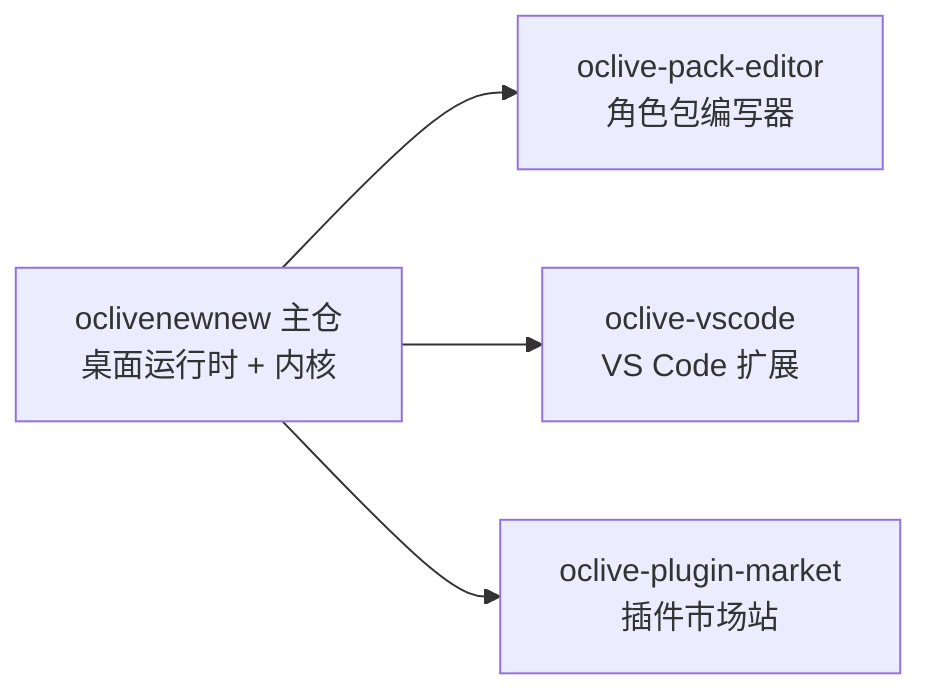

# 00 · 愿景与定位

> **读者**：任何要贡献代码的工程师（先建立「这是什么」心智模型）。  
> **读完能做什么**：用一句话说明 OCLive 定位；区分角色包 vs 蓝图 vs 六槽。  
> **耗时**：约 15 分钟。  
> **下一篇**：[01 简架构](01_ARCHITECTURE_SIMPLE.md) 或已熟悉概念则 [02 三十分钟跑通](02_THIRTY_MINUTE_START.md)。

---

## 一句话

**OCLive（A.I.Live）** 是开源、本地优先的 **AI 角色组装平台**：用 **六槽可替换模块** + **角色包独立分发** + **契约校验**，让开发者在约 30 分钟内组装并发行自己的角色内核。

工程仓库代号 **oclive**；技术栈 **Tauri + Vue 3 + Rust**。

---

## 是什么 / 不是什么

| 是 | 不是 |
|----|------|
| **组装—契约—分发层**（模块可替换、可打包、可校验） | 又一个「定死的垂直角色记忆引擎」 |
| **契约型薄核** + `PluginHost` 六槽 | 以蓝图 `steps[]` 作首轮调度 DSL 的主路径 |
| **角色包**（身份、人格、`prompts/`）与 **蓝图**（`slot_registry`、后端路由）分责 | 把创作者字段写进六槽或 `runtime_config` 混为一谈 |
| 默认 **`roles/mumu` 等为官方示例**，展示平台能力 | 内置角色即产品上限 |

深度叙事：[handoff/OCLIVE_POSITIONING_DIFFERENTIATION.md](../handoff/OCLIVE_POSITIONING_DIFFERENTIATION.md) · [creator-docs/roadmap/VISION_OPEN_LAB.md](../creator-docs/roadmap/VISION_OPEN_LAB.md)

---

## 六槽（第 1–6 模块）

| 槽键 | 职责 |
|------|------|
| `memory` | 记忆检索 |
| `emotion` | 用户情感分析 |
| `event` | 事件检测 |
| `prompt` | Prompt 组装 |
| `llm` | 大模型调用 |
| `agent` | Agent / 工具 |

v2 配置在蓝图 **`slot_registry`**；legacy 在 **`settings.json` → `plugin_backends`**。后端种类：`builtin` / `remote` / `directory` / `none`。

**不占六槽**的设施子模块（如复杂情感 `narrative_hint`、专家路由）在编排行内注入，见架构总览。

---

## 角色包 vs 蓝图

| 层 | 谁改 | 典型内容 |
|----|------|----------|
| **角色包** | 初级创作者 | `manifest.json`、`prompts/`、`core_personality.txt`、`reply_quality_anchor` |
| **蓝图** | 管理员 / 高级配置 | 同目录 `pipeline.ocblueprint` 内 `slot_registry`、`groups`、`runtime_config` |

边界 SSOT：[handoff/ROLE_PACK_BOUNDARY.md](../handoff/ROLE_PACK_BOUNDARY.md)

---

## 生态（姊妹仓）

本 **human-docs** 仅覆盖 **主仓**；姊妹仓各有 `AGENTS.md`，链回主仓文档索引。

---

## 验收

- [ ] 能说出：OCLive 卖的是「可组装、可分发」，不是单一角色引擎
- [ ] 能区分：`roles/mumu` 是示例；六槽在蓝图 `slot_registry`

---

## 深度链接

- [OCLIVE_ARCHITECTURE_OVERVIEW](../creator-docs/getting-started/OCLIVE_ARCHITECTURE_OVERVIEW.md)
- [ROLE_PACK_SPEC](../creator-docs/role-pack/ROLE_PACK_SPEC.md)
- [crates/README](../crates/README.md)
