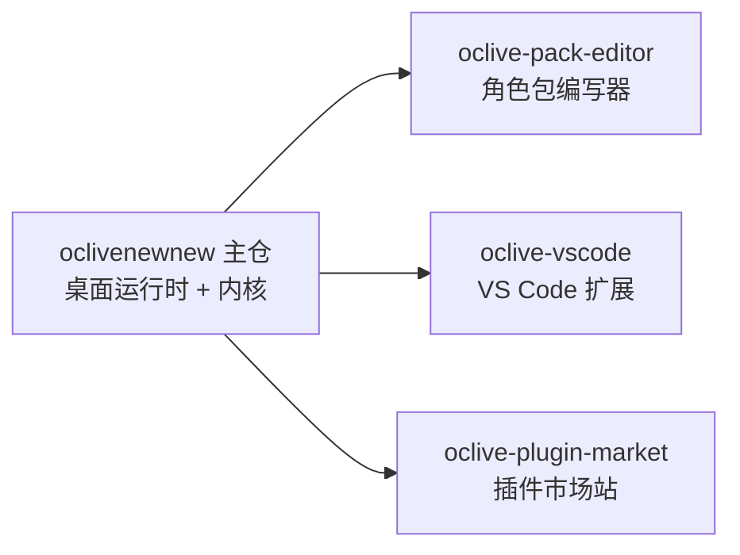

# 00 · 愿景与定位

> **读者**：任何要贡献代码的工程师（先建立「这是什么」心智模型）。  
> **读完能做什么**：用一句话说明 OCLive 定位；区分角色包 vs 蓝图 vs 六槽。  
> **耗时**：约 15 分钟。  
> **下一篇**：[01 简架构](01_ARCHITECTURE_SIMPLE.md) 或已熟悉概念则 [02 三十分钟跑通](02_THIRTY_MINUTE_START.md)。

---

## 一句话

**OCLive（A.I.Live）** 是开源、本地优先的 **AI 角色工具内核**。先记住：Kernel 定义六槽契约与必要合法性边界，发行版 Host 决定怎么组合、调度和应用结果。六槽是能力，不是六个固定阶段；角色、记忆系统、事件外环与持久化是外围装配。完整权责见 [MODULE_MAP](../handoff/MODULE_MAP_AND_HANDOFF.md#kernel-responsibilities)，当前代码仍包含完整参考运行时，尚未物理拆出小 Kernel。

工程仓库代号 **oclive**；技术栈 **Tauri + Vue 3 + Rust**。

---

## 是什么 / 不是什么

| 是 | 不是 |
|----|------|
| **工具内核**（六槽契约与必要合法性边界） | 接管 Host 的固定调度、领域提交或产品成功条件 |
| **可选参考运行时与创作工具链**（可替换、可打包、可校验） | 必须接受整套默认模块的集中式平台 |
| `PluginHost` 六槽与稳定契约 | 以蓝图 `steps[]` 作首轮调度 DSL 的主路径 |
| **角色包**（身份、人格、`prompts/`）与 **蓝图**（`slot_registry`、后端路由）分责 | 把创作者字段写进六槽或 `runtime_config` 混为一谈 |
| 默认 **`distros/chat-pro/roles/mumu` 等为官方示例**，展示参考装配 | 内置角色即产品上限 |

深度叙事：[handoff/OCLIVE_POSITIONING_DIFFERENTIATION.md](../handoff/OCLIVE_POSITIONING_DIFFERENTIATION.md) · [creator-docs/roadmap/VISION_OPEN_LAB.md](../creator-docs/roadmap/VISION_OPEN_LAB.md)

---

## 六槽（第 1–6 模块）

| 槽键 | 职责 |
|------|------|
| `memory` | 记忆检索 |
| `emotion` | 用户情感分析 |
| `event` | 对话事件影响估计；不是 Event Ring / Runtime Event Stream |
| `prompt` | Prompt 组装 |
| `llm` | 大模型调用 |
| `agent` | Agent / 工具 |

以下配置和运行策略描述**当前参考 Host**，不是跨 Host 必选机制：v2 配置在蓝图 **`slot_registry`**；legacy 在 **`settings.json` → `plugin_backends`**。后端种类：`builtin` / `remote` / `directory` / `none`。

**不占六槽**的设施子模块（如复杂情感 `narrative_hint`、专家路由）通过 Rust 固定锚点提供候选或辅助结果，不能因此取得主编排与状态提交权；复杂情感的本轮结果在回复后解析，只以去内容余韵信号影响下一轮 Prompt。见架构总览。

六槽是六类能力入口，不是六个都必须工作的平级“大脑”。当前共景健康路径至少需要 `prompt + llm`；其余槽位按各自 `none` / Noop 契约变薄。默认实现为了本地小模型使用较多显式辅助，强模型装配可以更克制。记住：**事实显式化，判断候选化，表达模型化。**

---

## 角色包 vs 蓝图

最小角色是 persona + 视觉资产引用；关系、好感度、蓝图与槽位注册不是必填。下表是**现有 richer 参考格式**的创作分工，不是最小 contract 的文件清单；本地加载准备也不代表最小角色生命周期已接线。

| 层 | 谁改 | 典型内容 |
|----|------|----------|
| **角色包** | 初级创作者 | `manifest.json`、`prompts/`、`core_personality.txt`、`reply_quality_anchor` |
| **蓝图** | 管理员 / 高级配置 | 同目录 `pipeline.ocblueprint` 内 `slot_registry`、`groups`、`runtime_config` |

边界 SSOT：[handoff/ROLE_PACK_BOUNDARY.md](../handoff/ROLE_PACK_BOUNDARY.md)

---

## 生态（姊妹仓）

```mermaid
flowchart LR
  main[oclivenewnew 主仓\n桌面运行时 + 内核]
  editor[oclive-pack-editor\n角色包编写器]
  vscode[oclive-vscode\nVS Code 扩展]
  market[oclive-plugin-market\n插件市场站]
  main --> editor
  main --> vscode
  main --> market
```

本 **human-docs** 仅覆盖 **主仓**；姊妹仓各有 `AGENTS.md`，链回主仓文档索引。

---

## 验收

- [ ] 能说出：OCLive 的本体是“工具内核 + 六个稳定端口”；组装与分发是围绕它的工具能力
- [ ] 能区分：`mumu` 是参考角色；`slot_registry` 是参考 Host 配置，不是六槽能力契约或最小角色的同义词

---

## 深度链接

- [OCLIVE_ARCHITECTURE_OVERVIEW](../creator-docs/getting-started/OCLIVE_ARCHITECTURE_OVERVIEW.md)
- [ROLE_PACK_SPEC](../creator-docs/role-pack/ROLE_PACK_SPEC.md)
- [kernel/crates/README](../kernel/crates/README.md)
