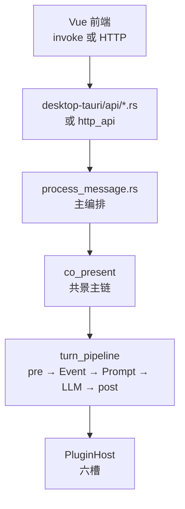
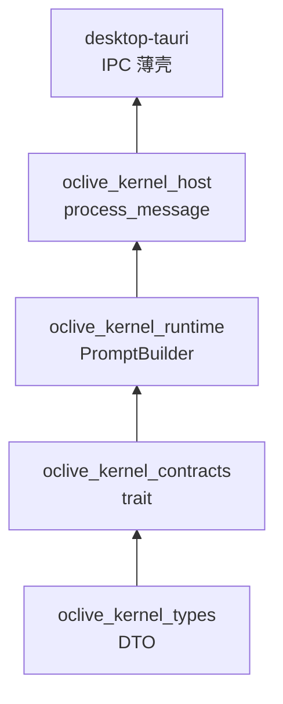

# 01 · 简架构

> **最后更新**：2026-06-26  
> **读者**：已跑通主仓、要理解「一条消息怎么走」的工程师。  
> **读完能做什么**：画出 UI → `process_message` → 六槽 主路径；说清 **记忆三套存储** 与 **六槽/设施/独立通道** 的区别。  
> **耗时**：约 **45 分钟**（含下面扩展节）。  
> **下一篇**：[03 术语表](03_GLOSSARY.md) · 逐槽细节 → [MODULE_MAP §4–§12](../handoff/MODULE_MAP_AND_HANDOFF.md)。

---

## 一轮对话（主路径）



**实现文件**：[`process_message.rs`](../kernel/crates/oclive_kernel_host/src/domain/chat_engine/process_message.rs)（经 `chat_engine/mod.rs` re-export）。

**分支（先知道有这三条）**

| 分支 | 何时 |
|------|------|
| **Agent 短路** | `agent` 槽处理完本回合，可能不再走 LLM 闲聊 |
| **异地 / remote_life** | 用户与角色不在同场景 |
| **共景 co_present** | 默认 Chat Pro 主路径（本文以下默认此路径） |

**概念六段**（文件头）：分析情绪 → 检测事件 → 演化性格 → 构建 Prompt → 调用 LLM → 持久化。顺序由 **Rust 代码** 保证；蓝图 **`steps[]` 不参与首轮调度**。

---

## turn_pipeline（共景内）

| 阶段 | 文件 | 做什么 |
|------|------|--------|
| **TurnThinking** | `turn_thinking.rs` | Auto/Fast/Deep（发行版可配；**不是**第七槽） |
| **pre** | `turn_pipeline/pre.rs` | 情绪、记忆检索、复杂情感、用户身份 |
| **middle** | `co_present.rs` | 事件估计、Prompt 输入、好感预览 |
| **LLM** | `slot_runner` + `llm` 槽 | 生成 `reply` |
| **post** | `turn_pipeline/post.rs` · `persistence.rs` | 写记忆、**聊天日志**、立绘、后处理 |

入口：[`turn_pipeline/mod.rs`](../kernel/crates/oclive_kernel_host/src/domain/chat_engine/turn_pipeline/mod.rs) 的 `execute_turn`。

### Turn Thinking（Fast / Deep · 编排行）

**不是第七槽**；由 `turn_thinking.rs` + `co_present` 内 `TurnThinkingRouter` 决定本回合档位。

| 层 | 谁配 | 作用 |
|----|------|------|
| **Wave E · 持久化** | 发行版 `distro.oclive.toml` → `[turn_thinking] fast_persistence` | `strong_only` 时 Fast 闲聊不写 LTM / 好感 / 性格演化；**Quarrel 等强事件仍写** |
| **Wave F · 路由** | 角色包 `config.json` → `turn_thinking` | OR/AND 规则、Deep latch（争吵→和解）、`ephemeral_archive` 局面摘要（TTL） |

**纪律**：聊天 turns **每轮仍写** UI 日志；Fast **不压缩**用户原句；**无**玩家 Fast/Deep 开关。人类开工包 → [modules/orchestration/turn-thinking.md](modules/orchestration/turn-thinking.md) · 深读：[RFC_TURN_THINKING_PERSISTENCE](../creator-docs/rfc/RFC_TURN_THINKING_PERSISTENCE.md) · [MODULE_MAP §12](../handoff/MODULE_MAP_AND_HANDOFF.md)。

---

## 记忆：三套存储（最易混 · 必背）

很多人说的「记忆有三层」，在本项目里指 **三套 SQLite/存储职责**，**不是** Prompt 的「系统/角色/用户」三层。

| 存储 | 表 / 组件 | 干什么 | 会进 Prompt 吗 |
|------|-----------|--------|----------------|
| **① 聊天日志** | `chat_sessions` / `chat_messages`（HybridConversationStore） | UI 聊天记录、导出、**记忆回放**数据源 | **否** |
| **② 短期记忆 STM** | `short_term_memory` | 近几轮缓冲 | **是**（memory 槽检索） |
| **③ 长期记忆 LTM** | `long_term_memory` | AI 归档、mention 衰减 | **是**（memory 槽检索） |

**三条纪律**

1. **删聊天记录 ≠ 清空 AI 记忆表**  
2. **MemoryEngine 不读** `{app_data}/chats/` 当真源  
3. 「记忆回放」是从 ① **合并写入** ③，不覆盖已有 LTM 全文  

深读：[CHAT_STORAGE_ARCHITECTURE](../handoff/CHAT_STORAGE_ARCHITECTURE.md) · 模块注册表：[MODULE_MAP §4](../handoff/MODULE_MAP_AND_HANDOFF.md#4-第-1-模块--memory)

---

## 六槽（第 1–6 后端模块）

| # | 键 | 职责（人话） |
|---|-----|--------------|
| 1 | `memory` | 检索 ②③ 注入 Prompt |
| 2 | `emotion` | 分析用户句情绪 |
| 3 | `event` | 本回合事件类型 / 影响（可规则或 LLM） |
| 4 | `prompt` | 组装完整 prompt 字符串 |
| 5 | `llm` | 调用模型生成 **reply** |
| 6 | `agent` | 工具 / MCP；可短路主链 |

- **解析链**：蓝图 `slot_registry` → `PluginHost::resolve_for_role`  
- **多实例**：同 type 折叠为运行时 `PluginBackends`（memory 去重合并 · llm last-wins）  
- **backend 真值表**（24 格）：[`SLOT_BACKEND_REALITY_MATRIX`](../handoff/SLOT_BACKEND_REALITY_MATRIX.md)  

**逐槽定义、trait、禁止项** → [MODULE_MAP §4–§9](../handoff/MODULE_MAP_AND_HANDOFF.md)。

---

## 不是六槽，但常一起问

| 类别 | 例子 | 占 `plugin_backends` 吗 |
|------|------|-------------------------|
| **第 N 设施子模块** | 复杂情感 hint、专家路由、立绘、视觉舞台 | **否**（编排行内） |
| **独立通道** | 用户身份、回复后处理、剧场 Scene Director API | **否** |
| **编排行策略** | Turn Thinking、发行版 `HostProfile` | **否** |

一张总表：[MODULE_MAP §2](../handoff/MODULE_MAP_AND_HANDOFF.md#2-模块四大类划分)。

---

## 配置谁说了算（四层）

```text
角色包内容（人设、场景）
  → 蓝图 slot_registry（六槽、引擎策略）
    → 发行版 distro.oclive.toml（HostProfile）
      → 会话 DB 覆盖（临时）
```

创作者 **只改** 角色包；**不要** 在「改 mumu 文案」任务里动 `slot_registry`。见 [ROLE_PACK_BOUNDARY](../handoff/ROLE_PACK_BOUNDARY.md)。

---

## Crate 五层（依赖方向）



口诀：**Types 形状 · Contracts 接口 · Runtime 公式 · Host 流程 · Tauri 入口。**

---

## 验收

- [ ] 能指出 `process_message.rs` 与 `co_present` 的关系  
- [ ] 能区分 **聊天日志 / STM / LTM** 三者  
- [ ] 能列出六槽名称，并说出「复杂情感 **不是** 第七槽」  
- [ ] 知道主编排 **不读** 蓝图 `steps[]` 当 DSL  

---

## 深度链接

- [MODULE_MAP_AND_HANDOFF](../handoff/MODULE_MAP_AND_HANDOFF.md) — **模块注册表**  
- [RFC_TURN_THINKING_PERSISTENCE](../creator-docs/rfc/RFC_TURN_THINKING_PERSISTENCE.md) — Fast/Deep · 持久化 · 包级路由  
- [OCLIVE_ARCHITECTURE_OVERVIEW](../creator-docs/getting-started/OCLIVE_ARCHITECTURE_OVERVIEW.md) — 对外叙述  
- [BUS_FACTOR_NOTES §1](../handoff/BUS_FACTOR_NOTES.md#1-内核编排process_message)
